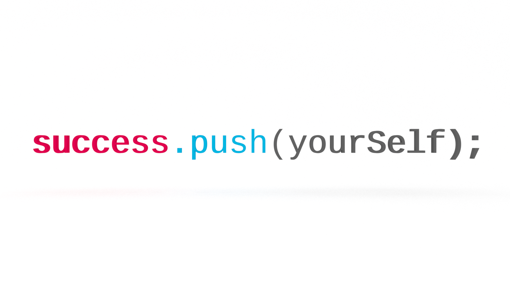
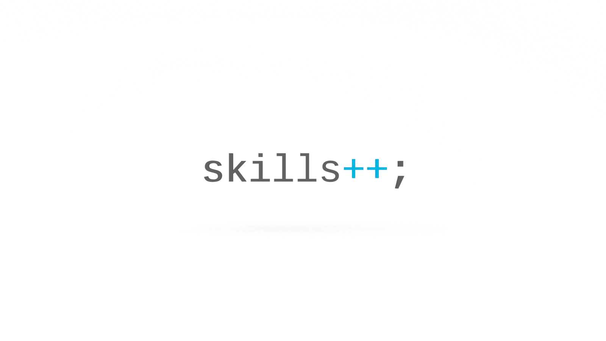
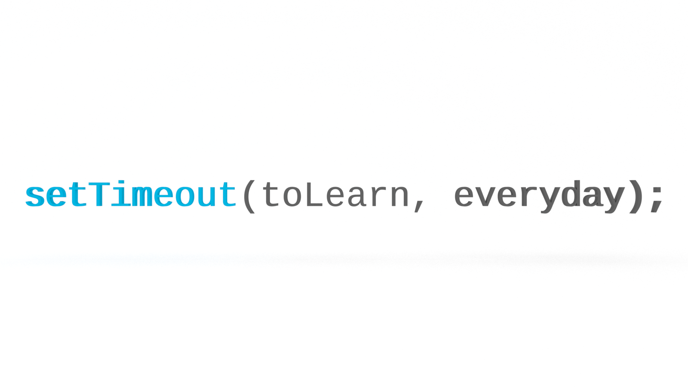
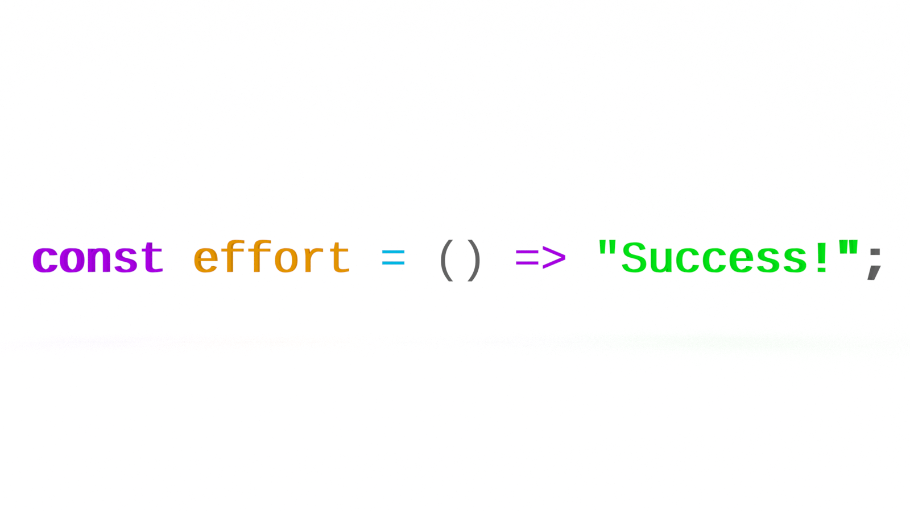

I teach a coding bootcamp at a prominent university. After graduating six cohorts and more than 100 individuals in full stack web development and data visualization, I’ve observed a few things that set successful students apart. Here is my advice for coding bootcamp students.

_Disclaimer & disclosure: These views are my own and do not necessarily reflect those of my employer._

## Add
To your resume you will be adding the hard skills of your tech stack, but more importantly, you will be adding the soft skills of teamwork and translation. These are the tools of your new trade. Keep them sharp.

### ...To Your Skill Set
Do algorithms.

Every day.

You’re like, “What’s the real world application of checking whether or not a string is a palindrome?”

Algorithms provide a bounded environment in which to exercise (and acquire) programming chops. Unlike projects, which may take days or weeks, algorithms, in the best case, take only a few minutes, in the worst, a few hours.

A marathon runner doesn't show up on race day and expect to win. There were countless ‘pointless’ hours on treadmills and tracks in preparation for the event. When applying for jobs, most of my students are given coding challenges. These challenges are basically algorithms or data structures disguised as story problems. If you can see through the noise, you can quickly implement an elegant solution.

Practice makes practice.

### ...To Your Portfolio
Start your own projects.

Don’t wait until you feel ready. When you finally do feel ready, it will be too late.

My most successful students started their own side projects and explored technology and concepts that we didn't have time to cover in class. They got obsessed.

Let the bug bite you.

This is how you build a portfolio that will set you apart from all other coding bootcamp students. You want to show off more than hangman or a to-do list.

### ...To Your Network
It doesn't take savvy students long to realize that what they are really paying for is not the codebase, but their colleagues.

This is where I see a lot of stronger students fail. They generally arrive with some programming background and are frustrated with their peers who are beginners. They choose to work alone, depriving themselves of the most important assets and lessons a bootcamp provides: the people.

This is the beginning of your professional network.

Make friends.

Build community.

Learn how to work on a team.

Better yet, learn how to lead a team.

## Commit
Many of my best students were those who struggled with the basics in the beginning. What set them apart was commitment. The bootcamp was do or die. They were going to succeed no matter what. The students who most often fail are those who arrive with an ‘academic’ mindset, approaching the bootcamp like a college course, concerned only with the grade and doing the bare minimum to earn it. Yes, the certificate is important, but more important is knowledge acquisition. You are not just committing to a bootcamp for _x_ number of months. You are committing to a new life for _y_ number of years.

### ...To The Time Required
It’s hard enough to survive the day-to-day, especially if you have a family and a job, but it’s imperative that you find a way to carve out large blocks of time everyday to do deep work in the zone. Adapt your schedule to your flow. Establish a routine and stick to it.

It’s only a few months. Put your old life on hold so you can start a new one.

Don’t let your bad habits kill your dreams.

You made a sacrifice.

Make it count.

### ...To Do The Work
Do the work.

More importantly, do your own work.

Don’t cheat.

Yes, it’s tempting to clone that repo, disguise the code a bit, and submit it as your own.

You’re only hurting yourself.

A certificate and a glossy portfolio might get your foot in the door for an interview, but what are you going to do when they ask you technical questions?

I promise you the answer is not `CTRL+C/CTRL+V`.

When searching for a solution and you find it in the docs or on Stack, don’t copy/paste it. Type it out. Do your best to understand what is happening under the hood. You can get by simply using examples, but you will benefit in the long run by taking the time to understand why it works.

[RTFM](https://en.wikipedia.org/wiki/RTFM).

It’s fantastic.

### ...To a Growth Mindset
Programming is problem-solving.

It’s not hard.

It’s not magic.

It _is_ challenging.

Embrace the challenge.

It’s the challenge that will sustain you in your career.

Fall in love with problem-solving.

Use these [heuristics to cultivate a problem-solving mindset](http://jarednielsen.com/teach-adults-code/):
1. Define the Problem
2. Devise a Plan
3. Execute the Plan
4. Examine the Solution

(If your instructor isn't using a similar approach with you on day one, drop out immediately. He or she is wasting your time and money.)

Remember that everyone learns at different rates for different things. Don’t compare yourself to your peers, only to your personal progress. Bootcamp is a means, not an end. You are now a lifelong learner.

## Push
My most successful students begin with the end in mind and are continually building their portfolios, fine-tuning their resumes, and applying for jobs before they feel ready. Even so, leaving the nest and returning to the real world will feel scary.

### ...To Master
You will feel like an impostor.

You may feel like an impostor for a long time.

The dirty secret of software development? We’re all impostors. And we’re okay with that.

It’s impossible to gain mastery over everything. The field is too broad and the pace of change too rapid.

The most valuable skill you can acquire is the ability to solve problems.

To beat impostor syndrome, pick one topic and do a deep dive into it. Then build a project using, or write an article about, that topic. Then move on to the next thing. Each time you repeat this process, you are putting another stake in the ground and expanding your territory.

The day will come when you realize that mastery is confidence in your ability to quickly teach yourself the skills required to solve any given problem.

It’s important to engage professionals outside the context of bootcamp. Go to meetups and hackathons, talk to people.

You will realize you know more than you think you know.

### ...Past
The life you were living prior to coding bootcamp is the key to your future.

The skills you carry from your previous career, coupled with your newly acquired technical chops, make you invaluable and highly desirable to a particular employer.

You fill a very specific niche.

Build bridges between worlds.

### ...Yourself
Like writing a function, it’s up to you to determine the output of your experience.

Push yourself.

But not too hard.

Just hard enough.

Don't forget to care for yourself.  

Sleep. Eat well. Exercise. Take breaks.

That last point is extremely important.

You are still a person in the world.

Tend to your relationships.

They are more important than any code you will write during the coding bootcamp.

(The added bonus to taking breaks is that insights into tricky problems will present themselves out of the blue. But don’t let your friends and family know that’s the truth of the matter 😜)

## Final Piece of Advice for Coding Bootcamp Students
Ask yourself if a life in code is right for you. The majority of my students successfully make career transitions. Unfortunately, there are those who realize too late that they made the wrong decision. A coding bootcamp is costly in both time and money, so do your homework. Be sure that you understand the difference between UX/UI, full stack web development, and data visualization (or whatever the topic). Do preliminary research into the language(s) you will be learning and the career paths it will afford you. Is this what you really want to do? You don’t have to learn to code to be successful. But you still need to `add`, `commit` and `push` to get where you want to be.

Good luck!
