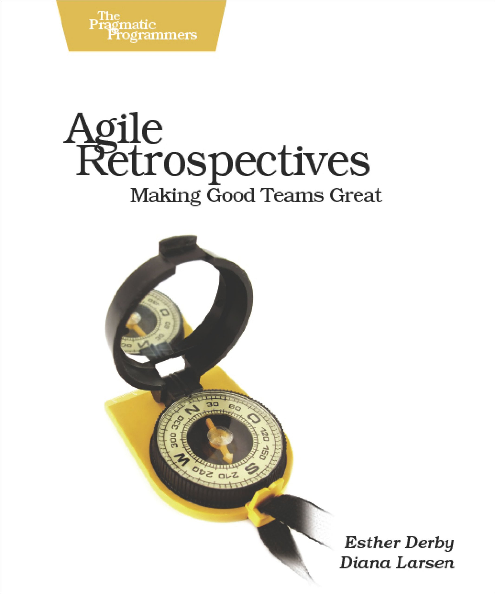

Other than agile _itself_, perhaps the most important aspect of agile software development is the retrospective. This is where the iteration becomes recursive and folds the process back on itself. The problem that the retrospective seeks to solve is how to solve problems. [_Agile Retrospectives_ by Esther Derby and Diana Larsen](https://amzn.to/388Ocny) is widely viewed as the handbook on how to lead an agile retrospective. Below are notes and quotes from the book. Let’s get meta!

_Note: Amazon links are affiliate._

## Notes and Quotes from _Agile Retrospectives: Making Good Teams Great_ by Esther Derby and Diana Larsen

> When we say _retrospective_, here’s what we have in mind: a special meeting where the team gathers after completing an increment of work to inspect and adapt their methods and teamwork. Retrospectives enable whole-team learning, act as catalysts for change, and generate action. Retrospectives go beyond checklist project audits or perfunctory project closeouts. And, in contrast to traditional postmortems or project reviews, retrospectives focus not only on the development process, but on the team and team issues. And team issues are as challenging as technical issues--if not more so. 

> During retrospectives, teams discover real solutions that they can implement without waiting for management’s permission. Since experiments and changes are chosen, not imposed from above, people are more invested in their success.

The structure of a retro:
* Set the stage
* Gather data
* Generate insights
* Decide what to do
* Close the retrospective

> The learning belongs to the team, and team members: not the coach, not the team lead, and not you as the retrospective leader. The team needs to own them. 

The authors claim their tried-and-true structure will help the team do the following: 
* Understand different points of view
* Follow a natural order of thinking
* Take a comprehensive view of the team’s current methods and practices
* Allow the discussion to go where it needs to go, rather than predetermining the outcome.
* Leave the retrospective with concrete action and experiements for the next iteration

Lastly, and perhaps most importantly, “...perform a retrospective on the retrospective. Look at what went well and what you could do differently in the next retrospective. ‘Inspect and adapt’ applies to retrospectives, too.”

### Set the Stage

#### Shaping the Goal

> A useful goal helps answer the question, what will achieve value for the time invested?
* Find ways to improve our practices
* Discover what we were doing well
* Understand reasons behind missed targets
* Find ways to improve our responsiveness to customers
* Rebuild damaged relationships

#### Determining Duration
* Base the length of the retrospective on four factors:
* Length of the iteration
* Complexity (of the technology, relationships with external departments, organization of the team)
* Size of the team
* Level of conflict or controversy

> Shortcutting time means cheating results.

#### Selecting Activities

> Activities are time-boxed processes that help the team move through the phases of the retrospective. 

Activities: 
* Encourage equal participation
* Focus the conversation
* Encourage new perspectives

The bulk of [_Agile Retrospectives_](https://amzn.to/388Ocny) is filled with activities suitable for any team and duration. 

### Leading Retrospectives

> Retrospective leaders focus on the process and structure of the retrospective. They attend to the needs and dynamics of the group and help the group reach a goal. Retrospective leaders remain neutral in discussion, even when they have strong opinions. 

> As the retrospective leader, you have two tasks during an activity: be available to answer questions about the activity, and monitor the room.

Here’s a simple, four-step method to debrief almost any activity: 

1. “What did you see and hear?”, followed by “What surprised you? Where were you challenged?”
2. “What insight do you have about this?”
3. “What does this tell you about our product?”
4. “What’s one thing you might do differently?”

### Managing You

> The key to managing group dynamics is not technique but in understanding and managing your own emotional state and responses. If you aren’t managing your own state, no technique or strategy will help. When emotions are high, your team needs someone to stay outside the turmoil. That someone is you, the retrospective leader.

## _Agile Retrospectives_ by Esther Derby and Diana Larsen

Agile retrospectives are an important problem-solving tool that help you identify which problems need to be solved. If you're a technical manager or leader, I recommend reading [_Agile Retrospectives_ by Esther Derby and Diana Larsen](https://amzn.to/388Ocny).

