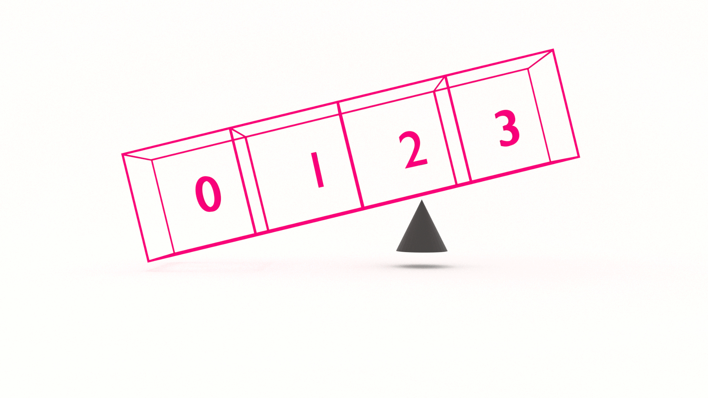

If you want to learn how to code, you need to learn algorithms. Learning algorithms improves your problem solving skills by revealing design patterns in programming. In this tutorial, you will learn how to code the array partition algorithm in JavaScript _and_ Python.


---


Give yourself an A. Grab your copy of [A is for Algorithms](https://gum.co/algorithms)

---


## Retrieval Practice

Retrieval practice is the surest way to solidify any new learning. Attempt to answer the following questions before proceeding:

* TODO 

* TODO

* TODO 


### TODO #1

TODO


### TODO #2

TODO


### TODO #3

TODO


## Let's Get Meta

Ask yourself the following questions and keep them back of mind as you proceed:

* Why do I need to know this?

* What problem(s) does array partitioning  solve? 

* TODO


## How to Code the Array Partition Algorithm 

[Programming is problem solving](https://jarednielsen.com/programming-problem-solving/). There are four steps we need to take to solve any programming problem: 

1. Understand the problem

2. Make a plan

3. Execute the plan

4. Evaluate the plan


### Understand the Problem

To understand our problem, we first need to define it. Let’s reframe the problem as acceptance criteria:

```md
GIVEN an unsorted array
WHEN I specify a pivot value and call the partition function
THEN the array is partitioned along the pivot, with lower values to its left and higher values to the right 
```

That’s our general outline. We know our input conditions, an unsorted array, and our output requirements, an array with lower values on the left and high values on the right, and our goal is to partition on a pivot value.

Let’s make a plan!


### Make a Plan

Let’s revisit our computational thinking heuristics as they will aid and guide is in making a plan. They are: 

* Decomposition

* Pattern recognition

* Abstraction

* Algorithm design

The first step is decomposition, or breaking our problem down into smaller problems. What's the smallest problem we can solve? 

An array with two elements:
```
[1, 2]
```

Easy! 

It's already done. 

What if the array was reversed? 
```
[2, 1]
```

Where have we seen this or something like it before? 

Swap! 

Because we are pragmatic programmers, we're going to repurpose our swap algorithm and copy/pasta it right here: 
```
FUNCTION swap(arr, left, right)
    SET temp TO THE VALUE STORED IN arr[left]
    SET arr[left] TO THE VALUE STORED IN arr[right]
    SET arr[right] TO THE VALUE STORED IN temp

    RETURN arr
```

TODO left, right

If we pass our two element array to our `swap` function, the output will be:
```
[1, 2]
```

But! We didn't partition on a pivot. Let's add another element to our array: 
```
[3, 2, 1]
```

Let's use 2 as our `pivot`. 

TODO
```
FUNCTION partition(arr, pivot)
    SET left TO 0
    SET right TO THE LENGTH OF arr - 1


    IF left IS LESS THAN OR EQUAL TO right
        swap(arr, left, right)
```


```
FUNCTION partition(arr, pivot)
    SET left TO 0
    SET right TO THE LENGTH OF arr - 1

    WHILE left IS LESS THAN OR EQUAL TO right
        WHILE arr[left] IS LESS THAN pivot
            INCREMENT left BY 1
        WHILE arr[right] IS GREATER THAN pivot
            DECREMENT right BY 1

        IF left IS LESS THAN OR EQUAL TO right
            swap(arr, left, right)
            INCREMENT left BY 1
            DECREMENT right BY 1

    RETURN arr
```


While `left` is less than or equal to `right`, we compare our pivots against the values stored in array at `left` or `right`. 

While the value stored in `arr[left]` is less than `pivot`, 

We iterate forward by checking if all of the elements on the _left_ side of the array are less than `pivot` 

If and when we encounter a value in `arr[left]` that is not less than `pivot`, our condition is no longer `true` and we exit the `while` loop.

We then enter the next `while` loop where we iterate backward by checking if all of the elements on the _right_ side of the array are greater than `pivot`. 

If and when we encounter a value in `arr[right]` that is not greater than `pivot`, our condition is no longer `true` and we exit the `while` loop.

Our final condition checks that `left` and `right` are not the same. If that evaluates as `true`, we swap the values stored in `arr[left]` and `arr[right]`. 


        


### Execute the Plan

Now it's simply a matter of translating our pseudocode into the syntax of our programming language. 

#### How to Code the Array Partition Algorithm in JavaScript

Let's start with JavaScript...

```js
const swap = (arr, left, right) => {
    let temp = arr[left];
    arr[left] = arr[right];
    arr[right] = temp;

    return arr;
}

const partition = (arr, pivot) => {
    let left = 0;
    let right = arr.length-1;

    while (left <= right) {
        while (arr[left] < pivot) {
            left++;
        }
        while (arr[right] > pivot) {
            right--;
        }

        if (left <= right) {
            swap(arr, left, right);
            left++;
            right--;
        }
    }
    return arr;
}
```


#### How to Code the Array Partition Algorithm in Python

Now let's see it in Python...

```py
TODO
```

### Evaluate the Plan

Can we do better? 

TODO


#### What is the Big O Of Array Partition?

If you want to learn how to calculate time and space complexity, pick up your copy of [The Little Book of Big O](https://gum.co/big-o)


## Reflection

Remember those _meta_ questions we asked at the outset? Let’s make it stick and answer them now!

* Why do I need to know this?

* What problem(s) does array partitioning solve? 

* TODO


### Why Do I Need to Know This? 

TODO


### What Problem(s) Does Array Partitioning Solve? 

TODO


### TODO

TODO


## A is for Algorithms


Give yourself an A. Grab your copy of [A is for Algorithms](https://gum.co/algorithms)


