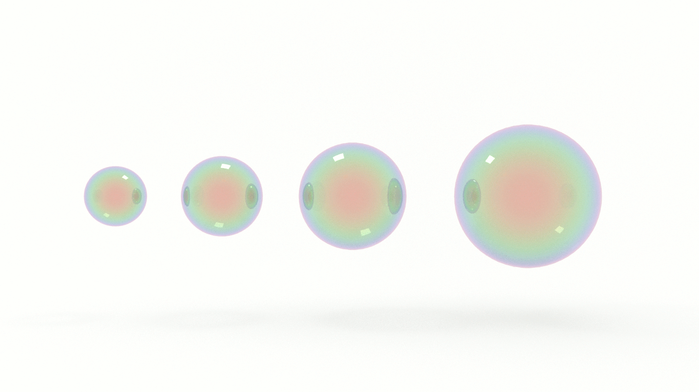

If you want to think like a programmer, you need to learn algorithms. Learning algorithms improves your problem solving skills by revealing common patterns in software development. In this tutorial, you will learn how to code the bubble sort algorithm in JavaScript. 

---


Give yourself an A. Pick up a copy of [A is for Algorithms](https://gum.co/algorithms)

---


## Retrieval Practice

* What is programming?

* What is an algorithm? 

* What is computational thinking? 


### What is Programming?

Programming is the act and art of writing instructions to be executed by a machine. These instructions must follow a predetermined, formalized, set of rules. These rules determine what we can write and how we can use those whats. A programming language is, fundamentally, a combination of logic and syntax, or a set of instructions for writing instructions. So meta!


### What is an Algorithm? 

An algorithm is a set of clearly defined rules or instructions to be executed by a computer in order to solve a specific problem.


### What is Computational Thinking? 

Computational thinking is an approach to problem solving where we frame our solution in terms that a computer could also execute. Computational thinking consists of the following stages:

* Decomposition: Breaking a complex problem into smaller, easier to solvecomponents

* Pattern recognition: Developing a generalized solution to apply to multipleproblems

* Abstraction: Hiding or ignoring the details of a problem in order to simplifyit and make it easier to solve

* Algorithms: Composing step-by-step instructions to solve a problem


## Let's Get Meta

* Why is it called 'Bubble Sort'?

* What Problem(s) Does Bubble Sort Solve? 

* What is the Big O of Bubble Sort?


## How to Code the Bubble Sort Algorithm in JavaScript

Let's revisit our problem solving heuristic: 

1. Understand the problem

2. Make a plan

3. Execute the plan

4. Evaluate the plan


### Understand the Problem

To understand our problem, we first need to define it. Let's reframe the problem as acceptance criteria:

> GIVEN an array of unsorted numbers

> WHEN we compare the values of two adjacent numbers and find them out of non-descending order

> THEN we exchange their positions in the array 

That's our general outline. We know our input conditions (an unsorted array) and our output requirements (a sorted array), and our goal is to organize the elements in the array in ascending, or non-descending, order.

Let's make a plan!


### Make a Plan

Let's revisit our computational thinking heuristics as they will aid and guide is in making a plan: 

* Decomposition

* Pattern recognition

* Abstraction

* Algorithm

If we are writing a sorting algorithm, we need to start with something to sort. Let’s declare an array of ‘unsorted’ integers:

```md
[10, 1, 9, 2, 8, 3, 7, 4, 6, 5]
```

When we are decomposing a problem, we want to break it into the types of problems that need to be solved. We also want to break it into the smallest problems that can be solved. 


What's the smallest problem we can solve? 

Two numbers. We can shift the first two off our array... 

```md
[10, 1]
```
... and swap them:
```md
[1, 10]
```

What about the next smallest problem? If we read between the lines of our acceptance criteria, we will see that we need to check a condition repeatedly, or iterate. Let's translate this to pseudocode: 

```md
FOR each element in an unsorted array

    IF the value of the element is greater than the next element

        SWAP the elements

RETURN the sorted array
```

Will this work? Let's think it through. If we test this with our smallest problem, `[10, 1]`, there's no problem. It works! Let's "run" this program with our full array and map it out in a table...

| Iteration | Array                             |
| ---       | ---                               |
| 1         | [10, 1, 9, 2, 8, 3, 7, 4, 6, 5]   |
| 2         | [1, 10, 9, 2, 8, 3, 7, 4, 6, 5]   |
| 3         | [1, 9, 10, 2, 8, 3, 7, 4, 6, 5]   |
| 4         | [1, 9, 2, 10, 8, 3, 7, 4, 6, 5]   |
| 5         | [1, 9, 2, 8, 10, 3, 7, 4, 6, 5]   |
| 6         | [1, 9, 2, 8, 3, 10, 7, 4, 6, 5]   |
| 7         | [1, 9, 2, 8, 3, 7, 10, 4, 6, 5]   |
| 8         | [1, 9, 2, 8, 3, 7, 4, 10, 6, 5]   |
| 9         | [1, 9, 2, 8, 3, 7, 4, 6, 10, 5]   |
| 10        | [1, 9, 2, 8, 3, 7, 4, 6, 5, 10]   |


What's the pattern we see? 

Our largest value, 10, is swapped with each iteration, but everything else remains the same.

What's the problem? 

Our algorithm is only comparing and swapping two adjacent values, not all of the values in the array.

What's the solution? 

More loops! 

Now that we moved the largest value to the end of the array, we need to start at the beginning again and find the second largest value and move it to the penultimate position. Rinse and repeat. So for each iteration we need a nested iteration. 

Here's our updated pseudocode:

```md
FOR each element in an array

    FOR each unsorted element 

        IF the value of the element is greater than the next element

            SWAP the elements

RETURN the sorted array
```

Will this work? Yes... But! Can we do better? This is the crux of the algorithm, so let's think it through...

If _n_ is the length of our array, does the nested loop need to iterate over _n_? 

No. Why? 

With each iteration we are sorting one value so the elements that remain to be sorted are _n - 1_. 

If the starting value of _n_ is 10 and we sort the largest value, 10, in the first iteration, how many elements remain to be sorted? 

9

If the starting value of our next iteration, _n - 1_, is 9 and we sort the next largest value, also 9, how many elements remain to be sorted? 

8

What is another way of specifying the value of 8? 

If _n_ is equal to 10, then _n - 2_  is equal to 8. 

What about 7? 

_n - 3_

See the pattern? 

From patterns we can form abstractions.

How do we form abstractions? 

Variables! 

We can use the counter variable in our `for` loop to subtract from _n_. 

Let's map it to a table:

| i     | n - i |
| ---   | ---   |
| 1     | 9     |
| 2     | 8     |
| 3     | 7     |
| 4     | 6     |
| 5     | 5     |
| 6     | 4     |
| 7     | 3     |
| 8     | 2     |
| 9     | 1     |
| 10    | 0     |


And let's map that to our pseudocode:

```md
FOR each element, _i_, in an array, _n_

    FOR each unsorted element, _j_, in an array, _n - i_ 

        IF the value of _j_ is greater than _j + 1_

            SWAP the elements

RETURN the sorted array
```

Now that we've got a plan, let's execute it!

### Execute the Plan

First, we initialize our array: 
```js
const unsorted = [10, 1, 9, 2, 8, 3, 7, 4, 6, 5];
```

Next, let’s declare our Bubble Sort function:

```js
const bubbleSort = (arr) => {
    return arr;
};
```

Now we simply translate our pseudode line-by-line: 
```js
const bubbleSort = (arr) => {
    for (let i = 0; i < arr.length; i++) {
  
        for (let j = 0; j < arr.length - i; j++) {

            if (arr[j] > arr[j + 1]) {
                let temp = arr[j];
                arr[j] = arr[j + 1];
                arr[j + 1] = temp;
            }

        }

    }

    return arr;
}
```

Running `bubbleSort(unsorted)` returns:  
```sh
[
   1,  2,  3,
   4,  5,  6,
   7,  8,  9,
  10
]
```

Bubbles, sorted! 


### Evaluate the Plan

Other than using a different sort algorithm, there a few optimizations we can make to our Bubble Sort function. 

Let's start with this line:
```js
    for (let i = 0; i < arr.length; i++) {
```

Do we need to initialize our counter variable with 0? 

No. Why? 

Because our nested loop is initialized with 0, which is where the magic is happening. We are guaranteed that the first two values will be compared, so we can initialize our outer loop with 1. 

```js
const bubbleSort = (arr) => {
    for (let i = 1; i < arr.length; i++) {
  
        for (let j = 0; j < arr.length - i; j++) {

            if (arr[j] > arr[j + 1]) {
                let temp = arr[j];
                arr[j] = arr[j + 1];
                arr[j + 1] = temp;
            }

        }

    }

    return arr;
}
```

We're not done with this line:
```js
    for (let i = 0; i < arr.length; i++) {
```

What else can we do? Do we need to iterate over the entire length of the array? 

No. Why? 

Because, as above, our nested loop is comparing the current value and the value _next_ to it, so we can extend our generalization, _n - 1_, to the outer loop as well. 

```js
const bubbleSort = (arr) => {
    for (let i = 1; i < arr.length - 1; i++) {
  
        for (let j = 0; j < arr.length - i; j++) {

            if (arr[j] > arr[j + 1]) {
                let temp = arr[j];
                arr[j] = arr[j + 1];
                arr[j + 1] = temp;
            }

        }

    }

    return arr;
}
```

What if the array passed to `bubbleSort` was already sorted? Or mostly sorted? We wouldn't need to perform all of our iterations. How would we exit? We can declare a `swapped` variable and with each iteration check whether or not any elements in the array were swapped. If no elements were swapped, then the array is sorted and we can return.

```js
const unsorted = [10, 1, 9, 2, 8, 3, 7, 4, 6, 5];

const bubbleSort = arr => {

    let swapped = false
  
    for (let i = 1; i < arr.length - 1; i++) {
        swapped = false;
  
        for (let j = 0; j < arr.length - i; j++) {
            if (arr[j] > arr[j + 1]) {
                let temp = arr[j];
                arr[j] = arr[j + 1];
                arr[j + 1] = temp;
            
                swapped = true;
            }
        }
    
        if (!swapped) {
            return arr;
        }
    }

    return arr;
}
```

What if the array passed to `bubbleSort` was empty? How would we catch that? We could simply check whether or not the length of the array was true or false and return accordingly. 

```js
const bubbleSort = arr => {
    if (!arr.length) {
        return arr;
    }

    let swapped = false
  
    for (let i = 1; i < arr.length - 1; i++) {
        swapped = false;
  
        for (let j = 0; j < arr.length - i; j++) {
            if (arr[j] > arr[j + 1]) {
                let temp = arr[j];
                arr[j] = arr[j + 1];
                arr[j + 1] = temp;
            
                swapped = true;
            }
        }
    
        if (!swapped) {
            return arr;
        }
    }

    return arr;
}
```

One last optimization, if we wanted, we could get fancy with our swap and use array destructuring: 
```js
[a[j], a[j + 1]] = [a[j + 1], a[j]];
```


## Reflection

* Why is it called 'Bubble Sort'?

* What Problem(s) Does Bubble Sort Solve? 

* What is the Big O of Bubble Sort?


### Why Is It Called 'Bubble Sort'?

Bubble Sort is a comparison or exchange algorithm. It gets its name because larger elements in the array _bubble_ their way up to the top. 


### What Problem(s) Does Bubble Sort Solve?

Well... it might be more a matter of what problems does bubble sort create. As we will see next, it's performance is not great. That said, it is suitable for small arrays or arrays that are mostly sorted.


### What is the Big O of Bubble Sort? 

Due to the nested iteration, the worst-case scenario time complexity for Bubble Sort is O(n^2).


## How to Code the Bubble Sort Algorithm in JavaScript

Bubble Sort is an algorithm that you need to know, but you don't necessarily want to implement (except if asked in an interview!). Learning it helps you recognize common patterns in algorithm design and understand why other sorting algorithms, such as quick and merge, are preferrable. In the next tutorial, we'll learn how to code Selection Sort. Stay tuned!


