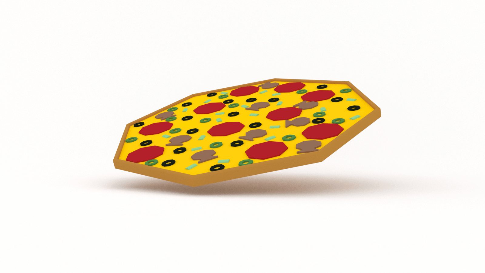

If you want to learn how to code, you need to learn algorithms. Learning algorithms improves your problem solving skills by revealing design patterns in programming. In this tutorial, you will learn how to generate combinations in JavaScript _and_ Python.


---


Give yourself an A. Grab your copy of [A is for Algorithms](https://gum.co/algorithms)

---


## Retrieval Practice

Retrieval practice is the surest way to solidify any new learning. Attempt to answer the following questions before proceeding:

* What is recursion?  

* What is a factorial? 

* What is a combination? 


### What is Recursion? 

In computer science, recursion occurs when a function calls itself within its declaration.

We use recursion to solve a large problem by breaking it down into smaller instances of the same problem. Recursion consists of two things: 

* a base case

* a recursive case

We use the recursive case to break the problem down into smaller instances.

We use the base case to stop when there are no more problems to be solved.


### What is a Factorial? 

A factorial is the product of all positive integers less than or equal to n.

We write that as n!.

For example, 5!:
```
5 * 4 * 3 * 2 * 1 = 120
```

### What is a Combination? 

According to ye olde Wikipedia: 
> In mathematics, a combination is a selection of items from a set that has distinct members, such that the order of selection does not matter

Here's the formula for combinations: 
```
n! / (n - k)! * k!
```

...where `n` is the length of the set of values, and `k` is the number of values in each combination of `n`.  


## Let's Get Meta!

Ask yourself the following questions and keep them back of mind as you proceed:

* Why do I need to know this?

* What problem(s) does the combinations algorithm solve? 

* If you could be a tree, what kind of tree would you be? 


## How to Code the Combinations Algorithm 

[Programming is problem solving](https://jarednielsen.com/programming-problem-solving/). There are four steps we need to take to solve any programming problem: 

1. Understand the problem

2. Make a plan

3. Execute the plan

4. Evaluate the plan


### Understand the Problem

To understand our problem, we first need to define it. Let’s reframe the problem as acceptance criteria:

```md
GIVEN a sequence of integers from 1 to `n`
WHEN I specify the size of each set of combinations, `k`
THEN I am returned all possible combinations of the values from 1 to `n` in sets of size `k` without repetition
```

That’s our general outline. We know our input conditions, an array, and our output requirements, an array of combinations, and our goal is to calculate the number of `k` combinations in `n` without repetition.

Let’s make a plan!


### Make a Plan

Let’s revisit our computational thinking heuristics as they will aid and guide is in making a plan. They are: 

* Decomposition

* Pattern recognition

* Abstraction

* Algorithm design

The first step is decomposition, or breaking our problem down into smaller problems. What's the smallest problem we can solve? 

If the length of `n` is equal to 1, then the only combination is:
```
[1]
```

What about `k`? 

If `n` is equal to 2, and `k` is equal to 1, then our combinations are:
```
[1], [2]
```

If `n` is equal to 2, and `k` is equal to 2, then our only combination is:
```
[1, 2]
```

If `n` is equal to 3, and `k` is equal to 2, it starts to get interesting. Our combinations are:
```
[1, 2], [1, 3], [2, 3]
```

Do you see a pattern emerging? 

Let's do one more...

If `n` is equal to 4, and `k` is equal to 1, our combinations are: 
```
[1], [2], [3], [4]
```

If `n` is equal to 4, and `k` is equal to 2, our combinations are: 
```
[1, 2], [1, 3], [1, 4], [2, 3], [2, 4], [3, 4]
```

If `n` is equal to 4, and `k` is equal to 3, our combinations are: 
```
[1, 2, 3], [1, 2, 4], [1, 3, 4], [2, 3, 4]
```

For good measure, if `n` is equal to 4, and `k` is equal to 4:
```
[1, 2, 3, 4]
```

We can see that we will need to iterate to generate our combinations, and that those loops will need to be nested, but just how many loops do we need to nest? 

It depends! 

We won't be able to hard-code in the nested loops. In the examples above, the number of iterations required to calculate the combinations ranges from 1 to 4. And we're only working with small values.  

What's the solution? 

Recursion! 

As we recalled above, recursion consists of two things:

* base case

* recursive case

What's our base case? 

```
k == 1
```

If `k` is equal to 1, then we simply return `n`. 

Let's pseudocode that: 
```
FUNCTION combinations(n, k)
  SET combos TO AN EMPTY ARRAY

  IF k IS EQUAL TO 1
    RETURN n
```

If we pass our `combinations` function an array, `n`, containing five ordinal values, it will return just that: 
```
[1, 2, 3, 4, 5]
```

What's the next problem we can solve? 

Combinations with a length of 2! 

If `n` is equal to `[1, 2, 3, 4, 5]` and `k` is equal to 2, then our goal is to return an array with the following combinations:
```sh
[ [ 1, 2 ],
  [ 1, 3 ],
  [ 1, 4 ],
  [ 1, 5 ],
  [ 2, 3 ],
  [ 2, 4 ],
  [ 2, 5 ],
  [ 3, 4 ],
  [ 3, 5 ],
  [ 4, 5 ] ]
```
Do we see a pattern?

There are four combinations beginning with 1...

...and three combinations beginning with 2...

...and two combinations beginning with 3...

...and only one combination beginning with 4.

What does this tell us?

With each iteration over `n`, we decrement the next iteration by 1. In the first iteration, we are creating all of the combinations that begin with 1. In the second iteration, we are creating all of the combinations that begin with 2, in the third iteration, 3's, and finally 4. 

Regardless of `k`, we're going to need _at least_ two iterations. The first iteration will _set_ the initial value of the combinations. The second iteration will iterate over the remaining values to create the combinations. 

Let's illustrate this...

In our first iteration over `n`, we set the initial value of our `combo` arrays to 1. 
```
[1]
```

Let's call this our `head`. 

In a nested loop, we then iterate over the remaining elements in `n`, which are `[2, 3, 4, 5]`. Let's call this our `tail.` We concatenate each of the values in our `head` to create `combo` arrays. 
```
[1, 2]
[1, 3]
[1, 4]
[1, 5]
```

We then return to the outer loop and move to the next value in `n`, which is 2. Our new `head` looks like this: 
```
[2]
```

Again, we iterate over the remaining elements, or `tail`, concatenating each of these values to create `combo` arrays. 

We decrement our iterations by _slicing_ off the first element in `n`, and creating a new array, `head`. 

Let's pseudocode this...
```
FUNCTION combinations(n, k)
  SET combos TO AN EMPTY ARRAY

  SET head
  SET tail

  IF k IS EQUAL TO 1
    RETURN n

  FOR EVERY VALUE i IN n
    SET head EQUAL TO THE FIRST SLICE OF n

    SET tail EQUAL TO THE REMAINDER OF n

    FOR EVERY VALUE j IN tail

      SET combo EQUAL TO head CONCATENATED WITH THE VALUE STORED IN tail[j]

      PUSH combo TO combos

  RETURN combos
```

What's the next smallest problem we can solve? 

Combinations with a length of 3! 

If `n` is equal to `[1, 2, 3, 4, 5]` and `k` is equal to 3, then our goal is to return an array with the following combinations:

```sh
[ [ 1, 2, 3 ],
  [ 1, 2, 4 ],
  [ 1, 2, 5 ],
  [ 1, 3, 4 ],
  [ 1, 3, 5 ],
  [ 1, 4, 5 ],
  [ 2, 3, 4 ],
  [ 2, 3, 5 ],
  [ 2, 4, 5 ],
  [ 3, 4, 5 ] ]
```

Will the approach we outlined above work? 

Nope. We _could_ add another nested loop. But what do we do when `k` is equal to 4? Add another nested loop? 

Do we need more loops? 

Yes, but not the iterative variety. 

We need to get abstract annd make the leap to recursion. 

But where? 

In the `return` statement? 

If we recursively call `combinations` in the `return`, we would only use one nested loop. 

We know we need _at least_ one nested loop. 

What if we called `combinations` within the first loop, but before the second loop? 

This would allow us to use as many nested loops as necessary to create all of the combinations. 

How are we catching the return value of `combinations`? 

With every recursive call of `combinations`, we will create a new `head` from the next element in the array. We'll continue to make calls to `combinations` until the base case is met, where `n` is equal to 1. 

What if we set the value of `tail` to the recursive calls of the `combinations`? 

Let's pseudocode this...
```
FUNCTION combinations(n, k)
  SET combos TO AN EMPTY ARRAY

  SET head
  SET tail

  IF k IS EQUAL TO 1
    RETURN n

  FOR EVERY VALUE i IN n
    SET head EQUAL TO THE FIRST SLICE OF n

    SET tail EQUAL TO THE RETURN VALUE OF combinations(THE REMAINDER OF n, k - 1) 

    FOR EVERY VALUE j IN tail

      SET combo EQUAL TO head CONCATENATED WITH THE VALUE STORED IN tail[j]

      PUSH combo TO combos

  RETURN combos
```


### Execute the Plan

Now it's simply a matter of translating our pseudocode into the syntax of our programming language. 


#### How to Code the Combinations Algorithm in JavaScript

Let's start with JavaScript...
```js
const combinations = (n, k) => {
  const combos = [];
  
  let head, tail;
  
  if (k === 1) {
    return n;
  }

  for (let i = 0; i < n.length; i++) {
      head = n.slice(i, i + 1);

      tail = combinations(n.slice(i + 1), k - 1);

      for (let j = 0; j < tail.length; j++) {
        let combo = head.concat(tail[j]);
        combos.push(combo);
      }
  }

  return combos; 
}
```

#### How to Code the Combinations Algorithm in Python

Now let's see it in Python...
```py

def combinations(n, k):
    combos = []

    if (k == 1):
        return n 

    for i in range(len(n)): 
        head = n[i:i+1]

        tail = combinations(n[i+1:],k-1)

        for j in range(len(tail)):
            print("tail[j]", tail[j])
            if (type(tail[j]) == int):
                combo = head + [tail[j]]
            else:
                combo = head + tail[j]
            combos.append(combo)
    
    return combos
```

FYI, there's a combinations method built-in to Python. You need to import the `itertools` module to use it.
```py
import itertools
```
It's use looks like this:
```py
result = itertools.combinations(n, k)
```

Under the hood, it's implementation looks like this: 
```py
def combinations(iterable, r):
    # combinations('ABCD', 2) --> AB AC AD BC BD CD
    # combinations(range(4), 3) --> 012 013 023 123
    pool = tuple(iterable)
    n = len(pool)
    if r > n:
        return
    indices = list(range(r))
    yield tuple(pool[i] for i in indices)
    while True:
        for i in reversed(range(r)):
            if indices[i] != i + n - r:
                break
        else:
            return
        indices[i] += 1
        for j in range(i+1, r):
            indices[j] = indices[j-1] + 1
        yield tuple(pool[i] for i in indices)
```

The more you know!


### Evaluate the Plan

Can we do better? 

Yes! 

There are a few optimizations we can make to our algorithm. We can make the algorithm more efficient by only iterating over `n.length - k + 1`. In JavaScript, that would look like: 
```js
  for (let i = 0; i < n.length - k + 1; i++) {
```

This reduces the number of iterations required to generate the combinations, but does not change the output of the algorithm. 

We can make our algorithm more "idiomatic", or, at the very least, idiot proof, by refactoring our conditional to return `combos` rather than `n`. But this will require us to "manually" copy the values stored in `n` to `combos`, which is not necessarily efficient. 
```js
  if (k === 1) {
    for (let i = 0; i < n.length; i++) {
      combos.push([n[i]]);
    }
    return combos;
  }
```

We could also get ES6-y, and map the return. 
```js
    return n.map(i => [i]);
```

We can also introduce more conditionals above the first to catch edge cases. 
```js
  if (k > n.length || k < 1) { 
    return []; 
  }
  
  if (k === n.length) { 
    return [ n ]; 
  }
```


#### What is the Big O Of Combinations?

If you want to learn how to calculate time and space complexity, pick up your copy of [The Little Book of Big O](https://gum.co/big-o)


## Reflection

Remember those _meta_ questions we asked at the outset? Let’s make it stick and answer them now!

* Why do I need to know this?

* What problem(s) does the combinations algorithm solve? 

* If you could be a tree, what kind of tree would you be? 


### Why Do I Need to Know This? 

Understanding combinations will help you order better pizzas. 

It will also help you identify when a problem might require a factorial solution, such as the [knapsack problem](https://en.wikipedia.org/wiki/Knapsack_problem), in which case you would want to use dynamic programming or a heuristic algorithm. 


### What Problem(s) Does the Combinations Algorithm Solve? 

Other than generating combinations, it creates more problems than it solves with its time and space complexity! 


### If You Could Be a Tree, What Kind of Tree Would You Be? 

I asked this at the outset to prime your thinking about trees. The combinations algorithm functions similarly to tree traversal. 


## A is for Algorithms


Give yourself an A. Grab your copy of [A is for Algorithms](https://gum.co/algorithms)


