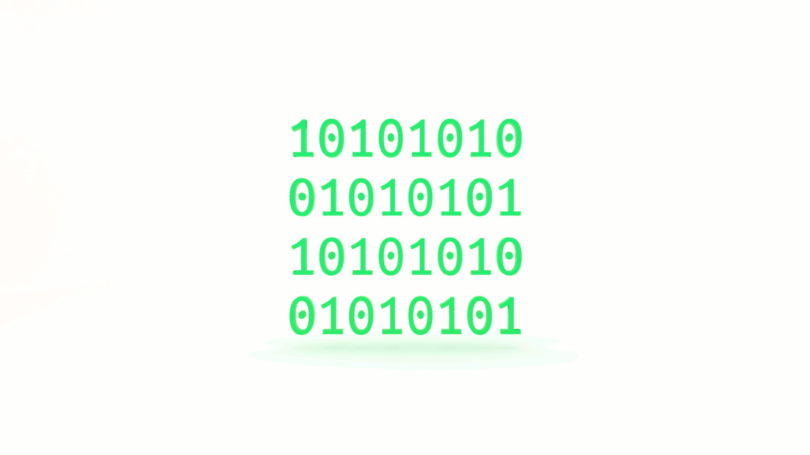

If you want to learn how to code, you need to learn algorithms. Learning algorithms improves your problem solving skills by revealing design patterns in programming. In this tutorial, you will learn how to code a decimal to binary conversion algorithm in JavaScript. 

---


Give yourself an A. Grab your copy of [A is for Algorithms](https://gum.co/algorithms)

---


## Retrieval Practice

* What's a decimal?

* What's binary?

* What is the modulo operator?


### What's a Base?

A base is the number of different digits used to count in a numerical system. We count in base 10 most likely due to us evolving ten fingers. When we count in base 10, we use ten distinct _whole_ numbers.  


### What's Binary?

Binary is base 2. We have two different digits to count with, `0` and `1`. (Or `true` and `false`). 

Counting from 1 to 10 with our hands is easy. Our fingers are like switches and we flip them. 

(Starting with the index or thumb! Sheesh!)

What do we do when we go beyond 10? 

We flip those switches the other way! 

We not only extend or retract our fingers to count to ten, if we are counting to a value greater than ten, we also track the number of times we count by 10. 

```
0 
1
2
3
4
5
6
7
8
9
```

What happens when we reach 9? 

We _overflow_ into another digit on the left and reset the digit on the right, giving us `10`. We then increment the right-most digit as we count up:
```
10
11
12
13
14
15
16
17
18
19
```

What happens when we reach 19? 

We increment the value of the digit on the left by `1`. 

This may seem rudimentary, but bear with me.

What happens when we reach 99? 

We need to _overflow_ again and add another digit, giving us `100`.

If we knew at the outset that we wanted to count beyond `100`, we could start with three digits and proceed like this:
```
000
001
002
...
009
010
011
...
099
100
101
```
etc.

What if we are limited to two fingers, or switches? 

We're going to need a lot more digits!


### What is the Modulo Operator?

In programming, the [modulo operation](https://en.wikipedia.org/wiki/Modulo_operation) returns the remainder of a division operation.


## Let's Get Meta

Ask yourself the following questions and keep them back of mind as you proceed: 

* Why do I need to learn decimal to binary conversion? 

* What is the [Big O](https://gum.co/big-o) of decimal to binary conversion? 

* What if you had been born with six fingers on each hand? 


## How to Code a Decimal to Binary Algorithm in JavaScript 

[Programming is problem solving](https://jarednielsen.com/programming-problem-solving/). There are four steps we need to take to solve any programming problem: 

1. Understand the problem

2. Make a plan

3. Execute the plan

4. Evaluate the plan


### Understand the Problem

To understand our problem, we first need to define it. Let’s reframe the problem as acceptance criteria:

```md 
GIVEN a decimal
WHEN I pass it to a function for conversion
THEN the function returns the binary equivalent
```

That’s our general outline. We know our input conditions (a decimal) and our output requirements (a binary equivalent), and our goal is to perform the conversion of the decimal to binary.

Let’s make a plan!


### Make a Plan

Let’s revisit our computational thinking heuristics as they will aid and guide is in making a plan. They are: 

* Decomposition

* Pattern recognition

* Abstraction

* Algorithm

When we are decomposing a problem, we break the problem down into smaller problems that are easier to solve.

What's the smallest problem we can solve? 

`1`

In base 10, what is `1`? 

It is one of ten possible values, or, `1 / 10`. 

In base 2, what is `1`? 

It is one of _two_ possible values. 

What mathematical operation do we use to break problems down? 

Division. 

If we're using division to convert to binary, what is our divisor? 

`2`

What do we know about [division](https://en.wikipedia.org/wiki/Division_(mathematics)? 

The division operation divides one number, the dividend, by another number, the divisor, and returns a quotient and a remainder. So we're on the same page with terminology, let's look at an example...
```md
3 / 2 = 1
```

`3` is the dividend, `2` is the divisor, and `1` is the quotient. What about the remainder? We use the modulo operator. 
```md
3 % 2 = 1
```

Here, again, `3` is the dividend, `2` is the divisor, but the result of the modulo operation, the remainder, is `1`. 

Let's start simple and convert `0` to binary. What is the quotient of the following: 
```
0 / 2
```

🙄

It's `0`.

So it's safe to say that the binary equivalent of the decimal `0` is also `0`. 

If we start to build a table, it looks like this so far:

| Decimal   | Binary  |
| ---       | ---     |
| 0         | 0       |

Because we are only working with two values, `0` and `1`, we can surmise that the decimal `1` converted to binary is also `1`. 

| Decimal   | Binary  |
| ---       | ---     |
| 0         | 0       |
| 1         | 1       |

But don't take my word for it! Let's prove it. 

What is `1 / 2`? 

`0.5`

Can we work with this? 

It's not a whole number. 

Our goal is to represent decimal values using _only_ `1`s and `0`s. How do we accomplish this goal?

Use the remainder! 

What is `1 % 2`? 

`1`

Let's map out the first five modulo operations J4F:

| Modulo    | Remainder  |
| ---       | ---       |
| 0 % 2     | 0         |
| 1 % 2     | 1         |
| 2 % 2     | 0         |
| 3 % 2     | 1         |
| 4 % 2     | 0         |

See a pattern? When we perform the modulo operation using `2`, the value returned will be either a `1` or a `0`. 

Now we need an approach to represent numbers greater than or equal to `2`. 

What happens when we divide `2` by `2`? 
```
2 / 2
```

The quotient is `1`.

And what about modulo? 
```
2 % 2
```

The remainder is `0`. If we concatenate the quotient and the remainder, we get `10`, the binary equivalent of `2`. 

| Decimal   | Binary  |
| ---       | ---     |
| 0         | 0       |
| 1         | 1       |
| 2         | 10      |


Are you starting to see the pattern? 

We're building our binary strings with the remainder, and not the quotient, of our division operation. We continue to perform the division operation _while_ our number is greater than 0. 

What about 3? 
```
3 % 2 = 1
3 / 2 = 1.5
```

What do we do here? This isn't a binary value:
```md
"1.5" + "1" = "1.51"
```

We need to round down, or _floor_ it. 🏎️

| Decimal   | Binary  |
| ---       | ---     |
| 0         | 0       |
| 1         | 1       |
| 2         | 10      |
| 3         | 11      |

Let's pseudocode our approach so far:
```md
INPUT decimal

SET binary string EQUAL TO decimal MODULO 2
SET quotient EQUAL TO THE FLOOR OF decimal DIVIDED BY 2
PREPEND binary string WTIH quotient

OUTPUT binary string
```

What about `4`? 

You guessed it, we need to add another digit. Without calculating it, what is the binary equivalent of `4`? Do you see a pattern emerging? 

| Decimal   | Binary  |
| ---       | ---     |
| 0         | 0       |
| 1         | 1       |
| 2         | 10      |
| 3         | 11      |
| 4         | 100     |

What about `5`? Let's build a string! We're now working with three digits, so let's create three placeholders:
```md
_ _ _
```

What's the remainder of 5 divided by 2? 
```
5 % 2 = 1
```

We _prepend_ `1` to our string: 
```
_ _ 1
```

Following the pseudocode we outlined above, we need to:
```md
SET quotient EQUAL TO THE FLOOR OF decimal DIVIDED BY 2
```

But the result of that process is not a `1` or a `0`: 
```md
5 / 2 = 2
```

Where have we seen something this or somthing like it before? 🤔

`2`! 

The binary equivalent of `2` is `10`. How did we get that? 
```md
2 % 2 = 0
```

So we prepend our string with `0`: 
```md
_ 0 1
```

And divide 2 by 2:
```md
2 / 2 = 1
```

And prepend our string with `1`:
```
1 0 1
```

| Decimal   | Binary  |
| ---       | ---     |
| 0         | 0       |
| 1         | 1       |
| 2         | 10      |
| 3         | 11      |
| 4         | 100     |
| 5         | 101     |


Let's update our pseudocode:
```md
INPUT decimal

SET binary string TO EMPTY STRING

WHILE decimal IS GREATER THAN 0
    PREPEND THE RESULT OF decimal MODULO 2 TO binary string
    REASSIGN decimal THE FLOOR VALUE OF decimal DIVIDED BY 2

OUTPUT binary string
```


### Execute the Plan

Now it's simply a matter of translating our pseudocode to JavaScript: 

```js
const decimalToBinary = (num) => {

    let result = '';
  
    while (num > 0){ 
      result += num % 2; 
      num = Math.floor(num / 2); 
    }
    
    return result.split('').reverse().join('');
}
```

Note that, rather than _prepending_ each remainder, we instead concatenate the `result` string and use a combination of string and array methods to _split_ the string into array items, reverse the order of the array, and then _re_join the items in a string. 


### Evaluate the Plan

The `split()` method converts the string to an array, so we could just start with an array instead and use `unshift()` rather than `reverse()` (J4F): 
```js
const decimalToBinary = (num) => {

  let result = [];

  while (num > 0){ 
    result.unshift(num % 2); 
    num = Math.floor(num / 2); 
  }
  
  return result.join('');
}
```

Or we could just cheat and use the built-in `toString()` method and pass it `2` as an argument, meaning we want to convert our string to binary: 
```js
const decimalToBinary = num => num.toString(2);
```

But what fun is that? 


## Reflection

* Why do I need to know this? 

* What is the Big O of Decimal to Binary Conversion?

* What if you had been born with six fingers on each hand? 


### Why You Need to Know This

It's 1's and 0's all the way down. In your computer, at least. We're not living in the Matrix. Yet. 


### What is the Big O of Decimal to Binary? 

O(n/2)

Our algorithm iterates while `n` is greater than 0, but we divide `n` by 2 with each iteration.

If you're new to Big O, pick up a copy of [The Little Book of Big O](https://gum.co/big-o).


### What If You Had Been Born with Six Fingers on Each Hand? 

Then you would have [twelve toes](https://www.youtube.com/watch?v=pqGyUvZP0Zg), or so the theory goes. And you would need a system for counting beyond 10. 


## How to Code the Decimal to Hexadecimal Algorithm in JavaScript

In this tutorial you learned how to code the decimal to binary algorithm. What if we wanted to convert to another base? Find out how in the next tutorial, [How to Code the Decimal to Hexadecimal Algorithm in JavaScript](#)


