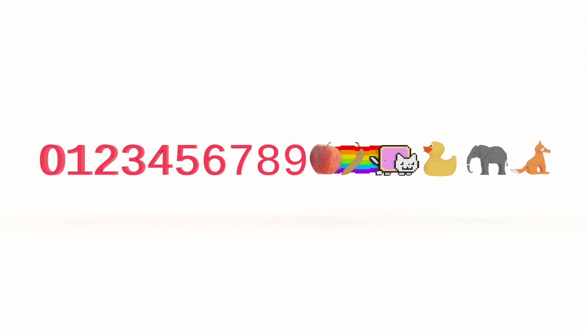

If you want to learn how to code, you need to learn algorithms. Learning algorithms improves your problem solving skills by revealing design patterns in programming. In this tutorial, you will learn how to convert numbers from decimal to hexadecimal in JavaScript _and_ Python. 


---


Give yourself an A. Grab your copy of [A is for Algorithms](https://gum.co/algorithms)

---


## Retrieval Practice

* What's a base?

* How do you convert a decimal to binary?

* What is "hexa"?


### What's a Base?

A base is the number of different digits used to count in a numerical system. We count in base 10 most likely due to us evolving ten fingers. When we count in base 10, we use ten distinct _whole_ numbers.  


### How to Convert a Decimal to Binary

To understand how to convert a decimal to base, it's useful to first understand how to convert a decimal to binary. Binary is base 2. We have two different digits to count with, `0` and `1`. (Or `true` and `false`). 

To calculate a binary value, we need to divide the decimal by `2` until the quotient is zero. We store the remainder of each division operation and use that to create a string representing the base. 

If you want to go deeper, check out [Learn How to Code the Decimal to Binary Algorithm in JavaScript and Python](https://jarednielsen.com/algorithm-decimal-binary/)


### What is "Hexa"?

According to [Dictionary.com](https://www.dictionary.com/browse/hexa-), "hexa" is: 
> a combining form meaning “six,” used in the formation of compound words

For example, a hexagon is a polygon with six sides.


## Let's Get Meta 🧠

Ask yourself the following questions and keep them back of mind as you proceed: 

* How do we count using a base greater than 10? 

* What problem(s) does converting a decimal to hexadecimal solve? 

* What is the Big O of decimal to hexadecimal conversion? 


## How to Code a Decimal To Hexadecimal Algorithm  

[Programming is problem solving](https://jarednielsen.com/programming-problem-solving/). There are four steps we need to take to solve any programming problem: 

1. Understand the problem

2. Make a plan

3. Execute the plan

4. Evaluate the plan


### Understand the Problem

To understand our problem, we first need to define it. Let’s reframe the problem as acceptance criteria:
```md
GIVEN a decimal
WHEN I pass it to a function
THEN the function returns the hexadecimal equivalent
```

That’s our general outline. We know our input conditions (a decimal) and our output requirements (a hexadecimal equivalent value), and our goal is to perform the conversion of the decimal to hexadecimal.

Let’s make a plan!


### Make a Plan

Let’s revisit our computational thinking heuristics as they will aid and guide is in making a plan. They are: 

* Decomposition

* Pattern recognition

* Abstraction

* Algorithm

If converting a decimal to binary is simply a process of repeatedly dividing the decimal by `2` and using the remainder to build a string, how do you think we convert a decimal to _any_ base? 

We divide the decimal by the base!

Let's break that question down into smaller questions.

What is a number? 

It's a symbol representing a value. 

What is `1`? 

A symbol representing the value _one_.

What is 'one'? 

A symbol representing the value `1`. (And round and round we go...)

What is `10`? 

In the decimal, or base-10, numeral system, it's a value represented by _two_ symbols. Because it's two symbols, we can't use it in base-16. What's the solution? More symbols!

Hexadecimal, or base-16, uses the first six characters of the Roman alphabet to represent the values of 10 through 15. 

| Decimal   | Hexadecimal   |
| ---       | ---           |
| 10        | A             |
| 11        | B             |
| 12        | C             |
| 13        | D             |
| 14        | E             |
| 15        | F             |

If we wanted to create our own base, say, _Emojidecimal_, we could use whatever symbols we want: 

| Decimal   | Hexadecimal   |
| ---       | ---           |
| 10        | 🍎            |
| 11        | 🍌             |
| 12        | 🐈             |
| 13        | 🐕             |
| 14        | 🐘             |
| 15        | 🦊             |

The symbol doesn't matter, as long as we all agree on the value that it represents. Do you think Emojidecimal will gain traction? 🤔

Let's convert `2047` to hexadecimal. The first step is to get the remainder of our dividend and divisor.

```
2047 % 16 = 15
```

Our remainder is `15`, but we are no longer using base-10, so we can't add this value to our hexadecimal string. If we use the table we created above, we can see that `15` maps to `F`, so we start building our hexadecimal string with it, giving us:
```
F
```

The next step is to divide: 
```
2047 / 16 = 127
```

Our quotient is `127`, so we repeat the operations above:
```
127 % 16 = 15
```

Our remainder is again `15`, so we add `F` to our hexadecimal string, giving us:
```
FF
```

We then divide `127 / 16`. Our quotient is `7`, so we calculate the remainder and divide `7` by `16`:
```
7 % 16 = 7
7 / 16 < 0
```

Our remainder is `7`, so we add it to our hexadecimal string, giving us: 
```
7FF
```

```md
INPUT NUM

SET digits TO "0123456789ABCDEF"

SET result TO AN EMPTY STRING

WHILE num IS GREATER THAN 0
  GET VALUE OF num MOD 16
  PREPEND result WITH CORRESPONDING VALUE IN digits
  REASSIGN num THE FLOOR VALUE OF decimal DIVIDED BY 2

OUTPUT result
```


### Execute the Plan

Now it's simply a matter of translating our pseudocode into syntax. Let's start with JavaScript.


#### How to Code Decimal to Hexadecimal Conversion in JavaScript

Rather than _prepending_ each remainder, we instead concatenate the `result` string and use a combination of string and array methods to _split_ the string into array items, _reverse_ the order of the array, and then _join_ the items in a string. 

```js 
const decimalToHex = (num) => {

  const digits = '0123456789ABCDEF';

  let result = '';
  
  while (num > 0) {
    result += digits[num % 16];
    num = Math.floor(num / 16);
  }

  return result.split('').reverse().join('');
}
```


#### How to Code Decimal to Hexadecimal Conversion in Python

```py
def decimal_hexadecimal(num):
    digits = '0123456789ABCDEF'

    result = ''

    while num > 0:
        result += digits[num % 16]
        num = num // 16

    return ''.join(reversed(result))

```


### Evaluate the Plan

Let's take another look at our JavaScript above. We could modify that function to accept _any_ base, not just 16. 

```js 
const decimalToBase = (num, base) => {

  const digits = '0123456789ABCDEF';

  let result = '';
  
  while (num > 0) {
    result += digits[num % base];
    num = Math.floor(num / base);
  }

  return result.split('').reverse().join('');
}
```


The `split()` method converts the string to an array, so we could just start with an array instead and use `unshift()` rather than `reverse()` (J4F): 

```js
const decimalToBase = (num, base) => {

  const digits = '0123456789ABCDEF';

  let result = [];
  
  while (num > 0) {
    result.unshift(digits[num % base]);
    num = Math.floor(num / base);
  }

  return result.join('');
}
```


Or we could just cheat and use the built-in `toString()` method and pass it `2` as an argument, meaning we want to convert our string to binary: 
```js
const decimalToBase = (num, base) => num.toString(base);
```

We could make the same optimizations in our Python function, or we could use built-in `hex()` method.

But what fun is that? 


## Reflection

* How do we count using a base greater than 10? 

* What problem(s) does converting a decimal to hexadecimal solve? 

* What is the Big O of decimal to hexadecimal conversion? 


### How Do We Count Using a Base Greater Than 10?

In the decimal, or base-10, numeral system, `10` is a value represented by _two_ symbols. Because it's two symbols, we can't use it in base-16. What's the solution? More symbols!

Hexadecimal, or base-16, uses the first six characters of the Roman alphabet to represent the values of 10 through 15. 

| Decimal   | Hexadecimal   |
| ---       | ---           |
| 10        | A             |
| 11        | B             |
| 12        | C             |
| 13        | D             |
| 14        | E             |
| 15        | F             |

If we wanted to create our own base, say, _Emojidecimal_, we could use whatever symbols we want: 

| Decimal   | Hexadecimal   |
| ---       | ---           |
| 10        | 🍎            |
| 11        | 🍌             |
| 12        | 🐈             |
| 13        | 🐕             |
| 14        | 🐘             |
| 15        | 🦊             |

The symbol doesn't matter, as long as we all agree on the value that it represents. 


### What Problem(s) Does Converting a Decimal to Hexadecimal Solve?

Hexadecimal values are used in computer science for a number (pun intended) of reasons. You are likely familiar with hexadecimal in HTML color codes, such as `#FFFFFF`, which is the hexadecimal representatoion of white, or a value of 255 for each component of RGB. Hexadecimal values are human-readable representations of binary because 16 is a power of 2. 


### What is the Big O of Decimal to Hexadecimal Conversion? 

O(n/m), where `n` is the input and `m` is the divisor, in this case `16`. 

If you want to learn more, pick up your copy of [The Little Book of Big O](https://gum.co/big-o)


## A is for Algorithms


Give yourself an A. Grab your copy of [A is for Algorithms](https://gum.co/algorithms)


