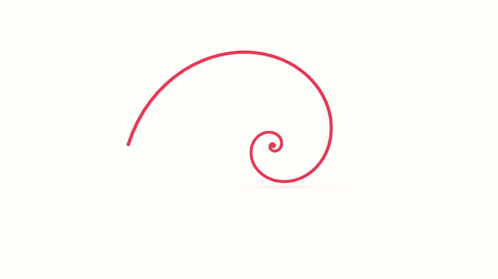

If you want to learn how to code, you need to learn algorithms. Learning algorithms improves your problem solving skills by revealing design patterns in programming. In this tutorial, you will learn how to code the _nth_ value in the Fibonnacci in JavaScript _and_ Python.


---


Give yourself an A. Grab your copy of [A is for Algorithms](https://gum.co/algorithms)

---


## Retrieval Practice

Retrieval practice is the surest way to solidify any new learning. Attempt to answer the following questions before proceeding:

* What is a Fibonacci sequence? 

* How does the swap algorith work? 

* How does iteration work? 


### What is a Fibonacci Sequence?

You're not expected to know this, so if Fibonacci is new to you, here's a quick introduction, and if it's old hat, a quick refresher. 

Fibonacci is a sequence of numbers where each number is the sum of the preceding two.

It starts like this…
```
0 1 1 2 3 5 8 13 21 34 55 89 144…
```

We can map it out in a table, like so: 

| Preceding numbers | Sum   |
| ---               | ---   |
| 0 + 1             | 1     |
| 1 + 1             | 2     |
| 1 + 2             | 3     |
| 2 + 3             | 5     |
| 3 + 5             | 8     |
| 5 + 8             | 13     |
| 8 + 13             | 21    |
| 13 + 21             | 34    |
| 21 + 34             | 55    |
| 34 + 55             | 89    |
| 55 + 89             | 144    |


And so on...

### How Does The Swap Algorithm Work? 
TODO


### How Does Iteration Work? 

According to Ye Olde Wikipedia:

> Iteration is the repetition of a process in order to generate a (possibly unbounded) sequence of outcomes. Each repetition of the process is a single iteration, and the outcome of each iteration is then the starting point of the next iteration.

We use `for` and `while` loops to iterate.


## Let's Get Meta

Ask yourself the following questions and keep them back of mind as you proceed:

* Why do I need to know this?

* What problem(s) does TODO solve? 

* TODO


## How to Code the Fibonacci Algorithm 

[Programming is problem solving](https://jarednielsen.com/programming-problem-solving/). There are four steps we need to take to solve any programming problem: 

1. Understand the problem

2. Make a plan

3. Execute the plan

4. Evaluate the plan


### Understand the Problem

To understand our problem, we first need to define it. Let’s reframe the problem as acceptance criteria:

```md
GIVEN a postiive integer, n
WHEN I pass it to the the Fibonacci function
THEN I am returned the nth number in the Fibonacci sequence
```

That’s our general outline. We know our input conditions, a postive integer, _n_, and our output requirements, the _nth_ number in the Fibonacci sequence.

Let’s make a plan!


### Make a Plan

Let’s revisit our computational thinking heuristics as they will aid and guide is in making a plan. They are: 

* Decomposition

* Pattern recognition

* Abstraction

* Algorithm design

The first step is decomposition, or breaking our problem down into smaller problems. What's the smallest problem we can solve? 

1

If we pass 1 to our `fibonacci` function, we want it to return the first number in the sequence, which is 0.

Let's pseudocode this:
```
INPUT n

IF n IS EQUAL TO 1
    RETURN 0
```

What's the next smallest problem? 

2

If we pass 2 to our `fibonacci` function, we want it to return the first number in the sequence, which is 1.

Let's update our pseudocode:
```
INPUT n

IF n IS EQUAL TO 1
    RETURN 0

IF n IS EQUAL TO 2
    RETURN 1
```

What's the next smallest problem? 

3

Right about now we would want to start looking for a pattern, but we're in luck! We don't need to look for a pattern because we already know it! 

To calculate the next value in the Fibonacci sequence, we take the first value, 0, and add the second value, 1, to return the third value, which, in this case, is also 1. 

If we look at our Fibonacci sequence again, we can see that the third value is also 1. 
```
0 1 1 2 3 5 8 13 21 34 55 89 144…
```

It's time to get abstract. If calculating the next number in the Fibonacci sequence requires us to add the two preceding numbers, then we need a way to reference those numbers. Let's call them `x` and `y`. 

Where does our loop start? 

We can't iteratively calculate the first two values because there aren't two values preceding them. 

Let's iterate on this. On our first iteration, `x` is 0 and `y` is 1. 
```
x y 
0 1 1 2 3 5 8 13 21 34 55 89 144…
```

The sum of `x` and `y` is 1. 

On our next iteration, we want the sum of `x` and `y` to equal 2. To return that value, we need `x` to equal 1 and `y` to equal 1. If we visualize that...
```
  x y 
0 1 1 2 3 5 8 13 21 34 55 89 144…
```

And on the next iteration, we want the sum of `x` and `y` to equal 3. To retun that value, we need `x` to equal 1 and `y` to equal 2. If we visualize that...
```
    x y
0 1 1 2 3 5 8 13 21 34 55 89 144…
```

I sense a pattern emerging. With each iteration, we need to assign `x` the next value in the sequence, which is _also_ the value stored in `y`. And we need to assign `y` the next value in the sequence, which is _also_ the value of the previous iteration. 

Where have we see this or something like it before? 

Swap! 

Let's pseudocode this...
```
INPUT n

IF n IS EQUAL TO 1
    RETURN 0

IF n IS EQUAL TO 2

SET x TO 0
SET y TO 1
SET sum TO 0

FOR EACH VALUE, i, BETWEEN 0 AND n
    SET sum TO x + y
    SET x TO y
    SET y TO sum

RETURN sum
```

There's one last problem we need to solve. If we initialize our `for` loop with 0, it won't return the value we expect. 

How do we solve this problem? 

We start counting at 2. 

Here's our final pseudocode: 
```
INPUT n

IF n IS EQUAL TO 1
    RETURN 0

IF n IS EQUAL TO 2

SET x TO 0
SET y TO 1
SET sum TO 0

FOR EACH VALUE, i, BETWEEN 2 AND n
    SET sum TO x + y
    SET x TO y
    SET y TO sum

RETURN sum
```

Let's review. We pass our function a postiive integer, `n`. We initialize our variables, assigning `x` a value of 0, `y` a value of 1, and `temp` a value of 0. We then enter our `while` loop. While `n` is greater than or equal to 0, we assign the value of `x` to `temp` and reassign `x` the value of `x + y`. This generates the next number in our Fibonacci squence. We then reassign `y` the value stored in `temp` and subtract 1 from `n`. When the condition of our `while` loop is no longer met, we return `y`. 


### Execute the Plan

Now it's simply a matter of translating our pseudocode into the syntax of our programming language. 


#### How to Code the Fibonacci Algorithm in JavaScript

Let's start with JavaScript...
```js
const fibonacci = (n) => {
  
  if (n == 1) {
    return 0;
  }
  
  if (n == 2) {
    return 1;
  }
  
  let x = 0;
  let y = 1; 
  let sum;
  
  for (let i = 2; i < n; i++) {
    sum = x + y;
    x = y;
    y = sum;
  }
  
  return sum;
}
```


#### How to Code the Fibonacci Algorithm in Python

Now let's see it in Python...
```py
def fibonacci(n): 
    if (n == 1):
        return 0
    if (n == 2):
        return 1
    
    x = 0
    y = 1
    sum = 0

    for i in range(2, n, 1):
        sum = x + y
        x = y
        y = sum
    
    return sum
```

### Evaluate the Plan

Can we do better? 

Maybe. We'll look at a recursive implementation of Fibonacci later in this series.


#### What is the Big O Of Fibonacci?

If you want to learn how to calculate time and space complexity, pick up your copy of [The Little Book of Big O](https://gum.co/big-o)


## Reflection

Remember those _meta_ questions we asked at the outset? Let’s make it stick and answer them now!

* Why do I need to know this?

* What problem(s) does  solve? 

* TODO


### Why Do I Need to Know This? 

TODO


### What Problem(s) Does Fibonacci Solve? 

TODO


### TODO

TODO


## A is for Algorithms


Give yourself an A. Grab your copy of [A is for Algorithms](https://gum.co/algorithms)


