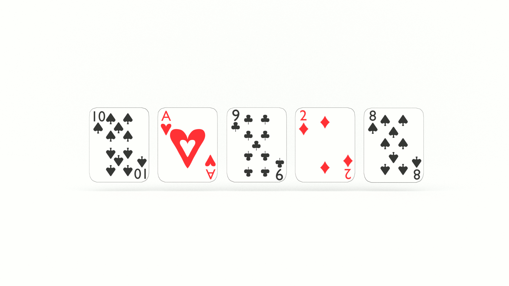
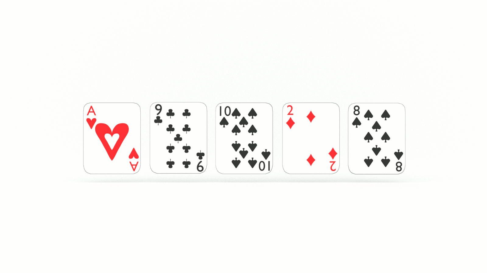
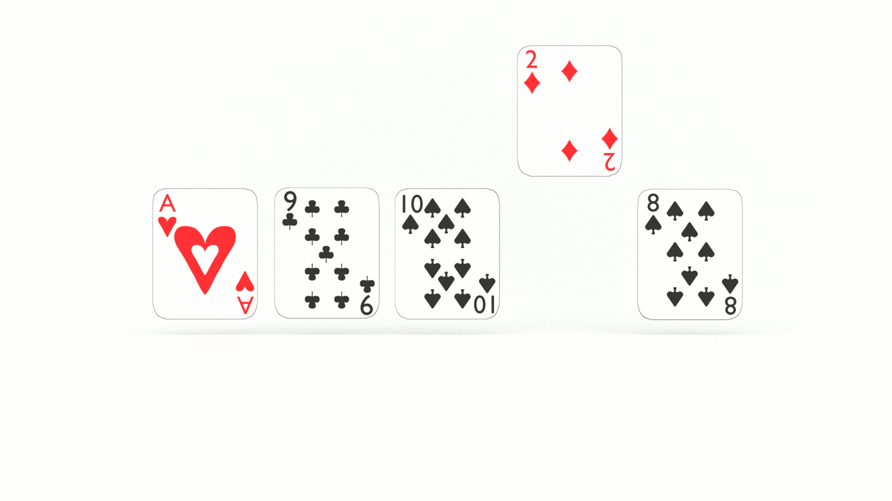
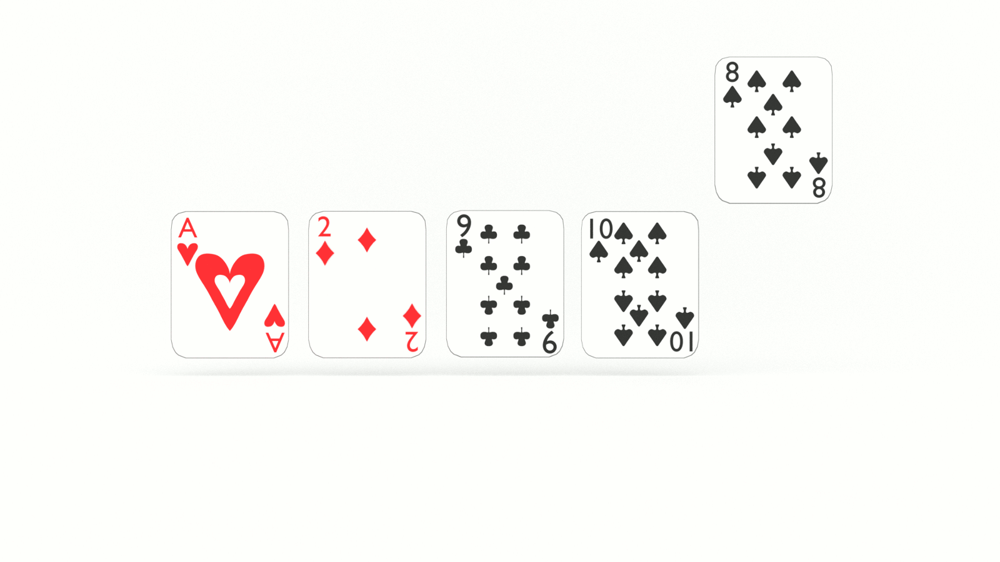
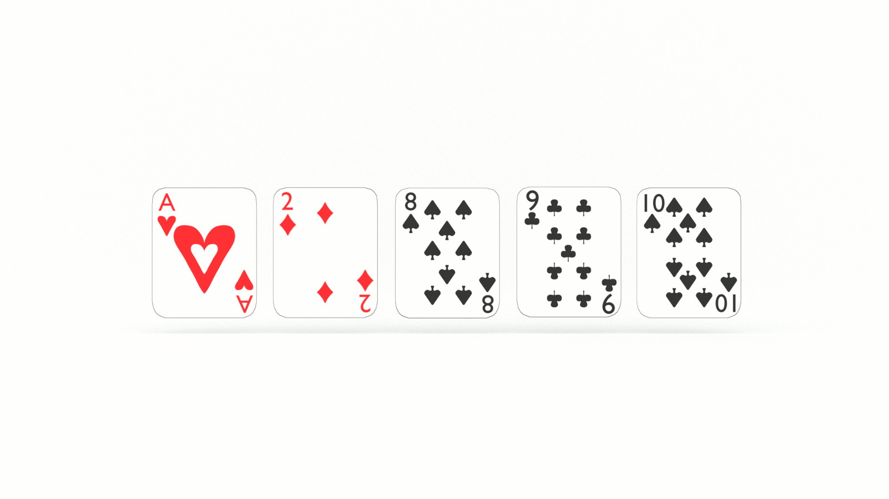

If you want to think like a programmer, you need to learn algorithms. Learning algorithms improves your problem solving skills by revealing common patterns in software development. In this tutorial, you will learn how to code the insertion sort algorithm in JavaScript. 

---

Give yourself an A. Grab your copy of [A is for Algorithms](https://gum.co/algorithms)

---


## Retrieval Practice

* What is programming? 

* What is an algorithm?

* What is computational thinking? 


### What is Programming? 

Programming is the act and art of writing instructions to be executed by a machine. These instructions must follow a predetermined, formalized, set of rules. These rules determine what we can write and how we can use those whats. A programming language is, fundamentally, a combination of logic and syntax, or a set of instructions for writing instructions. So meta!


### What is an Algorithm?

An algorithm is a set of clearly defined rules or instructions to be executed by a computer in order to solve a specific problem.


### What is Computational Thinking?

Computational thinking is an approach to problem solving where we frame our solution in terms that a computer could also execute. Computational thinking consists of the following stages: 

* **Decomposition**: Breaking a complex problem into smaller, easier to solve components

* **Pattern recognition**: Developing a generalized solution to apply to multiple problems

* **Abstraction**: Hiding or ignoring the details of a problem in order to simplify it and make it easier to solve

* **Algorithms**: Composing step-by-step instructions to solve a problem


## Let's Get Meta

* Why is it called 'Insertion Sort'?

* What Problem(s) Does Insertion Sort Solve? 

* What is the Big O of Insertion Sort?


## How to Implement the Insertion Sort Algorithm in JavaScript 

If we are writing a sorting algorithm, we need to start with something to sort. Let's declare an array of 'unsorted' integers:

```js
const unsorted = [10, 1, 9, 2, 8, 3, 7, 4, 6, 5];
```

Next, let's declare our `insertionSort` function:

```js 
const insertionSort = (arr) => {
    return arr;
};
```

Now what?

In order to understand our problem, we need to break it down. 

Let's first define it and reframe the problem as acceptance criteria:

> GIVEN an array of unsorted numbers
>
> WHEN we check the value of each number and find one out of sequence
>
> THEN we insert that number in its ordinal location in the array 

Where have we seen this or something like it before? 

Let's use an analogy!

Imagine you were holding a deck of cards and you wanted to put the cards in order. Usig the first half of our `unsorted` array as an example gives us the following hand:

```
10, 1, 9, 2, 8
```


Moving left to right, you would look at the value of the first card and compare it to the value of the second card. In this instance, our first card is `10` and our second card is `1`. `10` is greater than `1`, so we _swap_ their positions. Now our hand looks like this: 

```
1, 10, 9, 2, 8
```


Again, moving left to right, we compare the values of our next two cards and see that `10` is greater than `9`, so we take `9` out of our hand _temporarily_ and _insert_ it between `1` and `10`. Now our hand looks like this: 

```
1, 9, 10, 2, 8
```





And again, moving left to right, our next two cards are `10` and `2`. `10` is greater than `2`, but, now, `9` is _also_ greater than `2`, so we _temporarily_ remove `2` from our hand and then _insert_ `2` between `1` and `9`. Now our hands looks like this: 

```
1, 2, 9, 10, 8
```




Lastly, we _temporarily_ remove `8` from our hand and compare it to the other cards. `10` is greater than `8`, and `9` is greater than `8`, but `2` is not. So we _insert_ `8` between `2` and `9`. Our sorted hand looks like this: 

```
1, 2, 8, 9, 10
```



So... how do we translate this to JavaScript? 

With our analogy in hand (get it), let's break down, or _decompose_ the problem. 

What if our array only contained two values?

```js
const test = [10, 1];
```

We can see that we need to compare our two values, and if the first value is greater than the second value, we need to swap them. 

Our immediate inclination might be something like this:

```js 
const insertionSort = (arr) => {

    if (arr[0] > arr[1]) {
        arr[1] = arr[0];
        arr[0] = arr[1];
    }

    return arr;
};
```

But this won't work. Why? 

The result will be the following:

```
[10, 10]
```

We could create a new array and return that, _or_, if we think back to our playing cards analogy, we can _temporarily_ remove a value from the array and then _insert_ it into the array. 

```js 
const insertionSort = (arr) => {

    if (arr[0] > arr[1]) {
        arr[1] = arr[0];
        arr[0] = arr[1];
    }

    return arr;
};
```

But which value do we _temporarily_ remove? `0` or `1`? 

Let's revisit our playing cards analogy again: if we are proceeding left to right through our hand, or array, do we pull the first card or the second? 

```js
const unsorted = [10, 1, 9, 2, 8, 3, 7, 4, 6, 5];
```

If we are using the first half of our array, our inclination is likely to _temporarily_ remove the first card as it is greater. But what if we are working with the latter half of the array, where the first value is _less than_ the next? 

```
3, 7, 4, 6, 5
```

If we _temporarily_ remove the first card, `3`, we would check its value against the next card, `7`, see that `3` is less than  `7`, and simply put it back in its original location. 

We could also start with `7`, check its value against the previous card, see that `7` is greater than `3`, and return it to its location in our hand. 

Do you see the pattern? So what about `10` and `1`?

We _could_ temporarily remove `10` and check it against the next value, but as we saw above, we could accomplish the same end by starting with the second card, or value, in this case `1`. 

Long story short, to _temporarily_ remove a value from our array, we simply declare a variable `temp` and assign it the value stored in `arr[1]`:
```js 
const insertionSort = (arr) => {
    let temp = arr[1];

    if (arr[0] > temp) {
        arr[1] = arr[0];
        arr[0] = temp;
    }

    return arr;
};
```

Now that we _recognize the pattern_, how do we _abstract_, or model, this? 

What do I mean by that? 

As soon as we declared `temp`, we entered the realm of abstraction. `arr[1]` and `arr[2]` both refer to specific values in our array. But `temp` can refer to _any_ value we assign to it. In our conditional statement, we are still making specific reference to `arr[0]`.

What is `arr[0]` in relation to `arr[1]`?

It's the _previous_ index in our array, so let's declare a new variable, `prev` and assign it a value of 0.

And what is `temp` in relation to `prev`?

`prev + 1`

When we refactor our `insertionSort` function, we only need to make reference to specific value in array, `arr[1]`. The rest are abstractions. 
```js 
const insertionSort = (arr) => {
    let temp = arr[1];
    let prev = 0;

    if (arr[prev] > temp) {
        arr[1] = arr[prev];
        arr[prev] = temp;
    }

    return arr;
};
```

Now it's time for the last stage of computational thinking: let's get algorithmic!

Our current solution is great for two values, but how do we sort an array of multiple values? 

_For_ each value in the array, we need to check it against the previous values and insert it in ordinal sequence...

Let's refactor our function with iteration. Rather than `i`, let's use a descriptive iterator variable, `curr`, short for _current_, to help us _see_ what's happening. 

What value do we assign to `curr`?

We might be inclined, by force of habit and inertia, to initialize our iterator variable with 0, but let's recall our card analogy above. We don't need to start with the first card in our hand when starting with the second card achieves the same end and is more efficient. So... let's initialize our `for` loop with 1. 

We also need to update our reference to `arr[1]` with a `arr[curr]`: 

```js 
const insertionSort = (arr) => {
    for (let curr = 1; curr < arr.length; curr++) {
        let temp = arr[curr];
        let prev = 0;

        if (arr[prev] > temp) {
            arr[curr] = arr[prev];
            arr[prev] = temp;
        }
    }
    return arr;
};
```

What happens when we run our `insertionSort` function? 
```sh
[  1, 10,  9, 2,  8,  3, 7,  4,  6, 5 ]
```

Our first two numbers swapped, but nothing else. Why? 

We need to _algorithmically_ determine the value of `prev`. In our conditional statement, we are only comparing each number against the value stored in `arr[0]`, which, after the first iteration is `1`. 

If `prev` is the value _previous_ to `curr`, how can we determine it without hard coding a value? 

```js
let prev = curr - 1;
```

Our algorithm now looks like this: 
```js
const insertionSort = (arr) => {
    for (let curr = 1; curr < arr.length; curr++) {
        let temp = arr[curr];
        let prev = curr - 1;

        if (arr[prev] > temp) {
            arr[curr] = arr[prev];
            arr[prev] = temp;
        }
    }
    return arr;
};
```

If we run it, the result is the following: 
```sh
[ 1,  9,  2,  8,  3,  7,  4,  6,  5, 10 ]
```

What is going on here? 

We're only checking values forward, not back, so for each iteration, `arr[prev]` is 10, and we swap all of the values with it until we reach the end of the array. 

That's cool if our goal is _just_ to sort the largest value. 

Let's visualize this...

Here's our `unsorted` array:
```md
10, 1, 9, 2, 8, 3, 7, 4, 6, 5
```

In the first iteration, the values stored in our variables are the following: 

| `curr`    | `arr[curr]` && `temp`    | `prev` | `arr[prev]`    |
| ---       | ---                      | ---    | ---            |
| 1         | 1                        | 0      | 10             |

And our `insertionSort` function returns the following:
```md
[ 1,  9,  10,  2,  8,  3,  7,  4,  6,  5 ]
```

In the second iteration, the values stored in our variables are the following: 

| `curr`    | `arr[curr]` && `temp`    | `prev` | `arr[prev]`    |
| ---       | ---                      | ---    | ---            |
| 2         | 9                        | 1     |  10            |

And our `insertionSort` function returns the following:
```
[ 1,  9,  2,  10,  8,  3,  7,  4,  6,  5 ]
```

In the third iteration, the values stored in our variables are the following: 

| `curr`    | `arr[curr]` && `temp`    | `prev` | `arr[prev]`    |
| ---       | ---                      | ---    | ---            |
| 3         | 2                        |  2     |     10         |

And our `insertionSort` function returns the following:
```
[ 1,  9,  2,  8, 10,  3,  7,  4,  6,  5 ]
```


In the fourth iteration, the values stored in our variables are the following: 

| `curr`    | `arr[curr]` && `temp`    | `prev` | `arr[prev]`    |
| ---       | ---                      | ---    | ---            |
| 4         | 8                        |  3     |    10          |

And our `insertionSort` function returns the following:
```
[ 1,  9,  2,  8,  3, 10, 7,  4,  6, 5 ]
```

In the fifth iteration, the values stored in our variables are the following: 

| `curr`    | `arr[curr]` && `temp`    | `prev` | `arr[prev]`    |
| ---       | ---                      | ---    | ---            |
| 5         | 3                        |  4     |    10          |

And our `insertionSort` function returns the following:
```
[ 1,  9,  2, 8,  3,  7, 10,  4,  6, 5 ]
```

In the sixth iteration, the values stored in our variables are the following: 

| `curr`    | `arr[curr]` && `temp`    | `prev` | `arr[prev]`    |
| ---       | ---                      | ---    | ---            |
| 6         | 7                        | 5      |      10        |

And our `insertionSort` function returns the following:
```
[ 1,  9,  2, 8,  3,  7, 4, 10,  6, 5 ]
```

In the seventh iteration, the values stored in our variables are the following: 

| `curr`    | `arr[curr]` && `temp`    | `prev` | `arr[prev]`    |
| ---       | ---                      | ---    | ---            |
| 7          | 4                        |  6     |    10          |

And our `insertionSort` function returns the following:
```
[ 1,  9,  2, 8,  3,  7, 4,  6, 10, 5 ]
```

In the eighth iteration, the values stored in our variables are the following: 

| `curr`    | `arr[curr]` && `temp`    | `prev` | `arr[prev]`    |
| ---       | ---                      | ---    | ---            |
| 8         | 6                        |  7     |    10          |

And our `insertionSort` function returns the following:
```
[ 1,  9,  2, 8,  3,  7, 4,  6,  5, 10 ]
```

In the ninth and final iteration, the values stored in our variables are the following: 

| `curr`    | `arr[curr]` && `temp`    | `prev` | `arr[prev]`    |
| ---       | ---                      | ---    | ---            |
| 9         | 5                        |  8     |    10          |

And our `insertionSort` function returns the following:
```
[ 1,  9,  2, 8,  3,  7, 4,  6,  5, 10 ]
```

Do you see the pattern? 

What's the solution?

With every iteration _forward_, we need to word backwards and sort the preceding numbers as well. 

What control flow statement easily allows us to count down? 

`while`

Which of the values listed in our tables above do we want to use as our condition? 

`prev`

Why?

Because _abstraction_! 

With each iteration of our `while` loop, we want to check the value stored in the _previous_  array index. And with each iteraton of our `for` loop, we reassign the value of `prev` to `curr - 1`.

Let's refactor our function with a `while` loop:

```js
const insertionSort = (arr) => {
    for (let curr = 1; curr < arr.length; curr++) {
        let temp = arr[curr];
        let prev = curr - 1;

        while(prev >=0) {
            if (arr[prev] > temp) {
                arr[curr] = arr[prev];
                arr[prev] = temp;
            }
            prev = prev - 1;
        }
    }
    return arr;
};
```

NOTE: `prev = prev - 1;` is _outside_ the `if` statement. If we placed it inside, we would get caught in an endless loop as there are definitely iterations where `arr[prev]` will be less than `temp`. 

Running `insertionSort` now returns: 
```
[ 1, 2, 2, 3, 3, 4, 4, 5, 5, 6 ]
```

Well... it's sorted. But also _shorted_. What's going on?

When we decrement `prev` with each iteration of our `while` loop, it is no longer _coupled_ with `curr`. What is `curr`, abstractly? 

`prev + 1`

Let's update that in our function...


```js 
const insertionSort = (arr) => {
    for (let curr = 1; curr < arr.length; curr++) {
        let temp = arr[curr];
        let prev = curr - 1;    
 
        while(prev >= 0) {
            if (arr[prev] > temp) {
                arr[prev + 1] = arr[prev];
                arr[prev] = temp;
            }
            prev = prev - 1;
        }
    }
    return arr;
};
```

Now when we run our `insertionSort` function, it returns: 
```sh
[
   1,  2,  3,
   4,  5,  6,
   7,  8,  9,
  10
]
```

## Reflection

* Why is it called 'Insertion Sort'?

* What Problem(s) Does Insertion Sort Solve? 

* What is the Big O of Insertion Sort? 


### Why is it Called 'Insertion Sort'?

Insertion Sort gets its name from the approach to sorting where a numerical value is _inserted_ into an array in ordinal sequence. 


### What Problem(s) Does Insertion Sort Solve?

Insertion Sort is useful, and ideal, when the data to be sorted is small or nearly sorted. 


## What is the Big O of Insertion Sort?

What is the Big O of Insertion Sort? Because we are working with nested iteration, it's O(n^2). 


## Learn Insertion Sort Algorithm in JavaScript

If you want to think like a programmer, you need to learn algorithms. Learning algorithms improves your problem solving skills by revealing common patterns in software development. In this tutorial, you will learn the insertion sort algorithm in JavaScript. 
