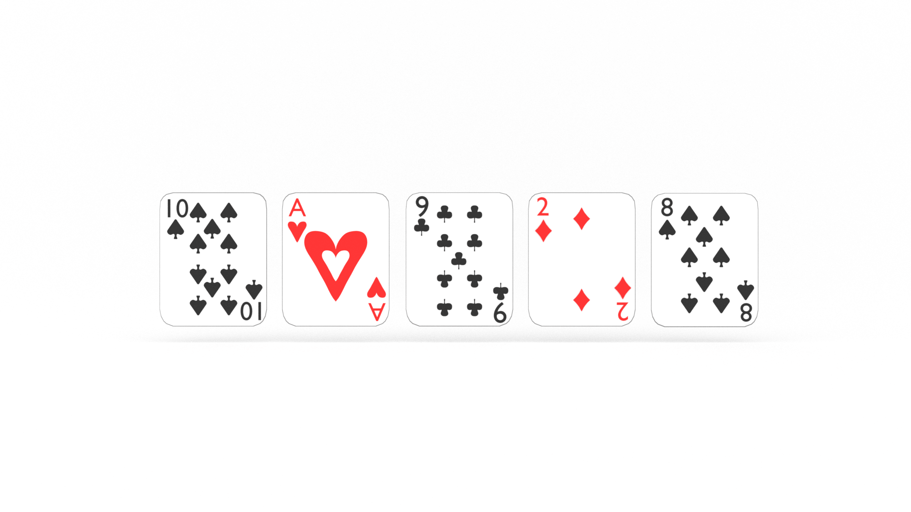

TODO INTRODUCTION

---

Ready to level up? Grab your copies of [The Little Book of Big O](https://gum.co/big-o) and [The Seven Data Structures of Highly Effective Developers](https://gum.co/data-structures).

---


## Retrieval Practice

* TODO

* TODO

* TODO 


### TODO BULLET #1

TODO 


### TODO BULLET #2

TODO


### TODO BULLET #3

TODO


## Let's Get Meta

* What Problem(s) Does Insertion Sort Solve? 

* Why is it called 'Insertion Sort'? 

* What is computational thinking?


## How to Implement Insertion Sort Algorithm in JavaScript 

If we are writing a sorting algorithm, we need to start with something to sort. Let's declare an array of 'unsorted' integers:

```js
const unsorted = [10, 1, 9, 2, 8, 3, 7, 4, 6, 5];
```

TODO 

Next, let's declare our `insertionSort` function:

```js 
const insertionSort = (arr) => {
    return arr;
};
```

TODO

Now what?

In [How to Solve It](TODO), George Polya outlines four steps of problem solving: 

1. Understand the problem.

2. Make a plan.

3. Execute the plan. 

4. Evaluate the result.


TODO four steps to computational thinking 

1. Decomposition

2. Pattern recognition 

3. Abstraction 

4. Algorithms 


In order to break our problem down, we need to understand it. 

Let's first define it and reframe the problem as acceptance criteria:

> GIVEN an array of unsorted numbers
> WHEN we check the value of each number and find one out of sequence
> THEN we insert that number in its ordinal location in the array 

Where have we seen this or something like it before? 

Let's use an analogy!

TODO card graphics

Imagine you were holding a deck of cards and you wanted to put the cards in order. Let's use the first half of our `unsorted` array as an example:

```
10, 1, 9, 2, 8
```

TODO

Moving left to right, you would look at the value of the first card and compare it to the value of the second card. In this instance, our first card is `10` and our second card is `1`. `10` is greater than `1`, so we _swap_ their positions. Now our hand looks like this: 

```
1, 10, 9, 2, 8
```


Again, moving left to right, we compare the values of our next two cards and see that `10` is greater than `9`, so we take `9` out of our hand _temporarily_ and _insert_ it between `1` and `10`. Now our hand looks like this: 

```
1, 9, 10, 2, 8
```

And again, moving left to right, our next two cards are `10` and `2`. `10` is greater than `2`, but, now, `9` is _also_ greater than `2`, so we _insert_ `2` between `1` and `9`. Now our hands looks like this: 

```
1, 2, 9, 10, 8
```

Lastly, we _temporarily_ remove `8` from our hand and compare it to the other cards. `10` is greater than `8`, and `9` is greater than `8`, but `2` is not. So we _insert_ `8` between `2` and `9`. Our sorted hand looks like this: 

```
1, 2, 8, 9, 10
```

TODO decompose


So... how do we translate this to JavaScript? 

Let's break it down, or decompose the problem, into smaller pieces. What if our array only contained two values?

```js
const test = [10, 1];
```

We can see that we need to compare our two values, and if the first value is greater than the second value, we need to swap them. 

Our immediate inclination might be something like this:

```js 
const insertionSort = (arr) => {

    if (arr[0] > arr[1]) {
        arr[1] = arr[0];
        arr[0] = arr[1];
    }

    return arr;
};
```

But this won't work. Why? 

The result will be the following:

```
[10, 10]
```

We could create a new array and return that, _or_, if we think back to our playing cards analogy, we can _temporarily_ remove a value from the array and then _insert_ it into the array. 

```js 
const insertionSort = (arr) => {

    if (arr[0] > arr[1]) {
        arr[1] = arr[0];
        arr[0] = arr[1];
    }

    return arr;
};
```

But which value do we _temporarily_ remove? `0` or `1`? 

Let's revisit our playing cards analogy again: if we are proceeding left to right through our hand, or array, do we pull the first card or the second? 

```js
const unsorted = [10, 1, 9, 2, 8, 3, 7, 4, 6, 5];
```

If we are using the first half of our array, our inclination is likely to _temporarily_ remove the first card as it is greater. But what if we are working with the latter half of the array, where the first value is _less than_ the next? 

```
3, 7, 4, 6, 5
```

If we _temporarily_ remove the first card, `3`, we would check its value against the next card, `7`, see that `3` is less than  `7`, and simply put it back in its original location. 

We could also start with `7`, check its value against the previous card, see that `7` is greater than `3`, and return it to our hand. 

Do you see the pattern? So what about `10` and `1`?

We _could_ temporarily remove `10` and check it against the next value, but as we saw above, we could accomplish the same end by starting with the second card, or value, in this case `1`. 

Long story short:
```js 
const insertionSort = (arr) => {
    let temp = arr[1];

    if (arr[0] > temp) {
        arr[1] = arr[0];
        arr[0] = temp;
    }

    return arr;
};
```

TODO
Now that we see the pattern, how do we _abstract_, or _model_, this? 

What do I mean by that? 

As soon as we declared `temp`, we entered the realm of abstraction. `arr[1]` and `arr[2]` both refer to specific values in our array. But `temp` can refer to _any_ value we assign to it. In our conditional statement, we are still making specific reference to `arr[0]`. How do we _model_ this value? 


TODO


```js 
const insertionSort = (arr) => {
    let temp = arr[1];
    let prev = 0;

    if (arr[prev] > temp) {
        arr[prev + 1] = arr[prev];
        arr[prev] = temp;
    }

    return arr;
};
```

TODO
Now what? 

It's time to get algorithmic. 

This solution is great for two values, but how do we sort an array of multiple values? 

_For_ each value in the array, we need to check it against the previous values and insert it in ordinal sequence...

Let's refactor our function with iteration. Rather than `i`, let's use a descriptive iterator variable, `curr`, short for _current_, to help us _see_ what's happening. 

What value do we initialize `curr` with? 
TODO something about abstraction and algorithmic of `arr[curr]`
TODO changing 
            arr[prev + 1] = arr[prev];
            arr[curr] = arr[prev];


```js 
const insertionSort = (arr) => {
    for (let curr = 1; curr < arr.length; curr++) {
        let temp = arr[curr];
        let prev = 0;

        if (arr[prev] > temp) {
            arr[curr] = arr[prev];
            arr[prev] = temp;
        }
    }
    return arr;
};
```

What happens when we run this? 
```sh
[
  1, 10,  9,
  2,  8,  3,
  7,  4,  6,
  5
]
```

Our first two numbers swapped, but nothing else. Why? 

We need to _algorithmically_ determine the value of `prev`. In our conditional statement, we are only comparing each number against the value stored in `arr[0]`, which, after the first iteration is `1`. 

If `prev` is the value _previous_ to `curr`, how can we determine it without hard coding a value? 

```js
let prev = curr - 1;
```

Our algorithm now looks like this: 
```js
const insertionSort = (arr) => {
    for (let curr = 1; curr < arr.length; curr++) {
        let temp = arr[curr];
        let prev = curr - 1;

        if (arr[prev] > temp) {
            arr[curr] = arr[prev];
            arr[prev] = temp;
        }
    }
    return arr;
};
```

If we run it, the result is the following: 
```sh
[
   1,  9,  2,
   8,  3,  7,
   4,  6,  5,
  10
]
```

What is going on here? 

TODO explanation: we're only checking values forward, not back, so for each iteration, `arr[prev]` is 10, and we swap all of the values with it until we reach the end of the array. 

That's cool if our goal is _just_ to sort the largest value. 

TODO

Let's visualize this...

Here's our `unsorted` array:
```md
10, 1, 9, 2, 8, 3, 7, 4, 6, 5
```

In the first iteration, the values stored in our variables are the following: 

| `curr`    | `arr[curr]` && `temp`    | `prev` | `arr[prev]`    |
| ---       | ---                      | ---    | ---            |
| 1         | 1                        | 0      | 10             |

And our `insertionSort` function returns the following:
```md
[ 1,  9, 10, 2,  8,  3, 7,  4,  6, 5 ]
```

In the second iteration, the values stored in our variables are the following: 

| `curr`    | `arr[curr]` && `temp`    | `prev` | `arr[prev]`    |
| ---       | ---                      | ---    | ---            |
| 2         | 9                        | 1     |  10            |

And our `insertionSort` function returns the following:
```
[ 1,  9,  2, 10,  8,  3, 7,  4,  6, 5 ]
```

In the third iteration, the values stored in our variables are the following: 

| `curr`    | `arr[curr]` && `temp`    | `prev` | `arr[prev]`    |
| ---       | ---                      | ---    | ---            |
| 3         | 2                        |  2     |     10         |

And our `insertionSort` function returns the following:
```
[ 1,  9,  2, 8, 10,  3, 7,  4,  6, 5 ]
```


In the fourth iteration, the values stored in our variables are the following: 

| `curr`    | `arr[curr]` && `temp`    | `prev` | `arr[prev]`    |
| ---       | ---                      | ---    | ---            |
| 4         | 8                        |  3     |    10          |

And our `insertionSort` function returns the following:
```
[
  1,  9,  2,
  8,  3, 10,
  7,  4,  6,
  5
]
```
In the fifth iteration, the values stored in our variables are the following: 

| `curr`    | `arr[curr]` && `temp`    | `prev` | `arr[prev]`    |
| ---       | ---                      | ---    | ---            |
| 5         | 3                        |  4     |    10          |

And our `insertionSort` function returns the following:
```
[
   1,  9,  2,
   8,  3,  7,
  10,  4,  6,
   5
]
```
In the sixth iteration, the values stored in our variables are the following: 

| `curr`    | `arr[curr]` && `temp`    | `prev` | `arr[prev]`    |
| ---       | ---                      | ---    | ---            |
| 6         | 7                        | 5      |      10        |

And our `insertionSort` function returns the following:
```
[
  1,  9,  2,
  8,  3,  7,
  4, 10,  6,
  5
]
```
In the seventh iteration, the values stored in our variables are the following: 

| `curr`    | `arr[curr]` && `temp`    | `prev` | `arr[prev]`    |
| ---       | ---                      | ---    | ---            |
| 7          | 4                        |  6     |    10          |

And our `insertionSort` function returns the following:
```
[
  1,  9,  2,
  8,  3,  7,
  4,  6, 10,
  5
]
```
In the eighth iteration, the values stored in our variables are the following: 

| `curr`    | `arr[curr]` && `temp`    | `prev` | `arr[prev]`    |
| ---       | ---                      | ---    | ---            |
| 8         | 6                        |  7     |    10          |

And our `insertionSort` function returns the following:
```
[
   1,  9,  2,
   8,  3,  7,
   4,  6,  5,
  10
]
```
In the ninth and final iteration, the values stored in our variables are the following: 

| `curr`    | `arr[curr]` && `temp`    | `prev` | `arr[prev]`    |
| ---       | ---                      | ---    | ---            |
| 9         | 5                        |  8     |    10          |

And our `insertionSort` function returns the following:
```
[
   1,  9,  2,
   8,  3,  7,
   4,  6,  5,
  10
]
```

Do you see the pattern? 

What's the solution?
TODO
With every iteration _forward_, we need to go back and sort the preceding numbers as well. What control flow statement easily allows us to count down? 

`while`

Which of the values listed in our tables above do we want to use as our condition? 

TODO

`prev`

Let's refactor our function with a `while` loop:

```js
const insertionSort = (arr) => {
    for (let curr = 1; curr < arr.length; curr++) {
        let temp = arr[curr];
        let prev = curr - 1;

        while(prev >=0 && arr[prev] > temp) {
            arr[curr] = arr[prev];
            arr[prev] = temp;
        }
    }
    return arr;
};
```
TODO
But! We need a way to count down. 

```js
const insertionSort = (arr) => {
    for (let curr = 1; curr < arr.length; curr++) {
        let temp = arr[curr];
        let prev = curr - 1;    

        while(prev >=0 && arr[prev] > temp) {
            arr[curr] = arr[prev];
            arr[prev] = temp;
        }

        while(prev >=0) {
            if (arr[prev] > temp) {
                arr[curr] = arr[prev];
                arr[prev] = temp;
                prev = prev - 1;
            }
        }
    }
    return arr;
};
```

There are still two problems with this function. 

When we decrement `prev` with each iteration of our `while` loop, it is no longer _coupled_ with `curr`. What is `curr`, abstractly? 

`prev + 1`

Let's update that in our function...

```js
const insertionSort = (arr) => {
    for (let curr = 1; curr < arr.length; curr++) {
        let temp = arr[curr];
        let prev = curr - 1;

        while(prev >=0) {
            if (arr[prev] > temp) {
                arr[prev + 1] = arr[prev];
                arr[prev] = temp;
                prev = prev - 1;
            }
        }
    }
    return arr;
};
```

TODO
There's still one more thing we need to fix. If we run this function, we will enter and endless loop. Why? 

`arr[prev] = temp;`


With each iteration of our `while` loop, we are assigning the value of `temp` to `arr[prev]`. 


```js
const insertionSort = (arr) => {
    for (let curr = 1; curr < arr.length; curr++) {
        let temp = arr[curr];
        let prev = curr - 1;

        while(prev >=0) {
            if (arr[prev] > temp) {
                arr[prev + 1] = arr[prev];
                prev = prev - 1;
            }
        }
    }
    return arr;
};
```

But if we run this now, our function returns the following: 
```
[ 10, 10, 10, 10, 10, 10, 10, 10, 10, 10 ]
```

We need a way to 

```js
const insertionSort = (arr) => {
    for (let curr = 1; curr < arr.length; curr++) {
        let temp = arr[curr];
        let prev = curr - 1;

        while(prev >=0) {
            if (arr[prev] > temp) {
                arr[prev + 1] = arr[prev];
                prev = prev - 1;
            }
        }
        arr[prev + 1] = temp;
    }
    return arr;
};
```


```js 
const unsorted = [10, 1, 9, 2, 8, 3, 7, 4, 6, 5];

const insertionSort = (arr) => {

    for (let curr = 1; curr < arr.length; curr++) {
        let temp = arr[curr];
        let prev = curr - 1;
        
        while (prev >= 0 && arr[prev] > temp) {
            arr[prev + 1] = arr[prev];
            prev = prev - 1;
        }
        arr[prev + 1] = temp;
    }
    return arr;
};

let sorted = insertionSort(unsorted);
```

TODO


## Big O & Insertion Sort Algorithm

TODO 


## Reflection

* What Problem(s) Does Insertion Solve? 

* 

* What is computational thinking?


### What Problem(s) Does Insertion Sort Solve?

TODO 


### TODO BULLET #2

TODO


### What is computational thinking?

TODO


## Learn Insertion Sort Algorithm in JavaScript

TODO RECAP FOR SEO