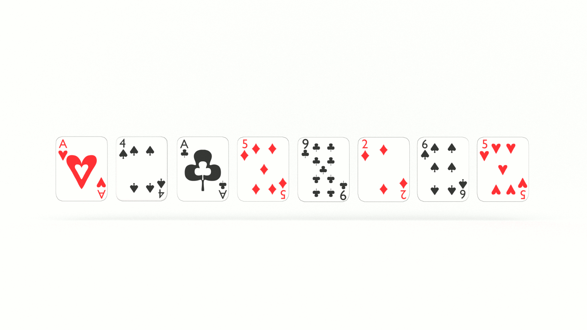

If you want to learn how to code, you need to learn algorithms. Learning algorithms improves your problem solving skills by revealing design patterns in programming. In this tutorial, you will learn how to code the TODO in JavaScript _and_ Python.


---


Give yourself an A. Grab your copy of [A is for Algorithms](https://gum.co/algorithms)

---


## Retrieval Practice

Retrieval practice is the surest way to solidify any new learning. Attempt to answer the following questions before proceeding:

* What is a longest increasing subsequence?

* How does the select algorithm work? 

* TODO 


### What Is A Longest Increasing Subsequence? 

TODO 
This might not be so much retrieval as it is new information, but we need a common (pun intended) starting point. According to Ye Olde Wikipedia, the goal of the [longest increasing subsequence](https://en.wikipedia.org/wiki/Longest_increasing_subsequence) algorithm is to: 

> find a subsequence of a given sequence in which the subsequence's elements are in sorted order, lowest to highest, and in which the subsequence is as long as possible.


### How Does The Select Algorithm Work? 

TODO


### TODO #3

TODO


## Let's Get Meta

Ask yourself the following questions and keep them back of mind as you proceed:

* Why do I need to know this?

* What problem(s) does TODO solve? 

* TODO


## How to Code the TODO Algorithm 

[Programming is problem solving](https://jarednielsen.com/programming-problem-solving/). There are four steps we need to take to solve any programming problem: 

1. Understand the problem

2. Make a plan

3. Execute the plan

4. Evaluate the plan


### Understand the Problem

To understand our problem, we first need to define it. Let’s reframe the problem as acceptance criteria:

```md
GIVEN a sequence of numbers 
WHEN TODO
THEN I am returned the length of the longest increasing subsequence of numbers 
```

Let's use the first 16 digits following the decimal in Pi for an example. 
```
3.1415926535897932
```

TODO 
```
1 4 1 5 9 2 6 5 3 5 8 9 7 9 3 2 
```

Let's manually create the longest increasing subsequence. The first value is obviously 1.
```
1 4 1 5 9 2 6 5 3 5 8 9 7 9 3 2 
X
```

The second value is 2. 
```
1 4 1 5 9 2 6 5 3 5 8 9 7 9 3 2 
X         X
```

The third value is 3. 
```
1 4 1 5 9 2 6 5 3 5 8 9 7 9 3 2 
X         X     X
```

The fourth value is 5. 
```
1 4 1 5 9 2 6 5 3 5 8 9 7 9 3 2 
X         X     X X
```

The fifth value is 7. 
```
1 4 1 5 9 2 6 5 3 5 8 9 7 9 3 2 
X         X     X X     X
```

The sixth value is 9. 
```
1 4 1 5 9 2 6 5 3 5 8 9 7 9 3 2 
X         X     X X     X X
```

The length of the longest increasing subsequence of the first 16 digits of Pi is 6. 

That’s our general outline. We know our input conditions, an unsorted array of postiive integers, and our output requirements, an value greater than or equal to 1, and our goal is to find the longest increasing subsequence of values in the array.


Let’s make a plan!


### Make a Plan

Let’s revisit our computational thinking heuristics as they will aid and guide is in making a plan. They are: 

* Decomposition

* Pattern recognition

* Abstraction

* Algorithm design

The first step is decomposition, or breaking our problem down into smaller problems. Continuing with the first 16 Pi decimals, what's the smallest problem we can solve? 
```
1
```

What's the longest subsequence? 

Also 1. 

What's the next smallest? 
```
1 4
```

And what's the longest subsequence? 

2

How did we calculate that?

We can see that there are two values and the last value is greater than the first, so the LIS is equal to 2. In other words, we made a comparison and tallied up the increasing values. 

So what's the next smallest problem? 
```
1 4 1
```

Ah! Now it gets interesting. 

But the longest subsequence is still 2. 

How do we solve this problem? 

Again, we start a tally of increasing values. We know that the LIS is at least 1. We then compare 4 to 1, and, because 4 is greater than 1, we add 1 to our LIS tally. We compare the next value 1 to 4, and, because 1 is less than 4, we do not add 1 to our LIS tally. 

Where have we seen this or something like it before? 

The selection algorithm! 

TODO 


What's the next smallest problem? 
```
1 4 1 5
```

Just when we thought we found the LIS we add a larger value! 

How do we solve this problem? 

We need to compare the current LIS, which is 3, with the previous LIS, which is 2. 

This is starting to get complicated. We need a way to keep track of all these values. What if we keep a tally? There are a two approaches we can take to creating our tally:

1. Generate a new array of `n` length assigning each element a value of 1. On each iteration, reassign the corresponding value with the _tally_. 

2. Initialize an array with only one element assigned a value of 1. On each iteration, add a new element containing the corresponding value of the _tally_. 

Let's take the second approach. We can implement it without needing to use any constructors or an additional loop to generate the array.  

If we start sketching out our pseudocode: 
```
INPUT n

SET result TO 1
SET tally TO [1]

WORK SOME MAGIC! 

RETURN result
```

Now we need to work some magic. 

We know we're going to need to iterate, and, if we need to calculate a result for every value in the array, we're going to need nested iteration. 

Let's visualize this. Here's our array of four elements and our `tally`.
```
tally = [1]

array = [1, 4, 1, 5]
```

Following convention, we'll use the variables `i` and `j` for our outer and inner loops, respectively. 


Let's initialize `i` with a value of 1 and `j` with a value of 0. 
```
tally = [1]

            i
array = [1, 4, 1, 5]
         j
```
Why? 

If we initialize `i` with 0, there's nowhere for `j` to go. We only need to iterate _up to_ `i`. If we iterate beyond `i` in our nested loop, we won't get an accurate result. 

In each iteration, we compare the value indexed by `i` and the value indexed by `j`. In this iteration, we see that 1 is less than 4. We take the value of our previous LIS, add 1, and update our `tally`. The LIS is now 2.

TODO In the next iteration. 
```
tally = [1, 2]

               i
array = [1, 4, 1, 5]
         j
```

TODO 
```
tally = [1, 2]

               i
array = [1, 4, 1, 5]
            j
```

We compare the value indexed by `i` and the value indexed by `j` and see that 4 is not less than 1, meaning our subsequence did not increase, so our LIS is unchanged. We still update our `tally` with this value and start the next iteration of the outer loop. 
```
tally = [1, 2, 2]

                  i
array = [1, 4, 1, 5]
         j
```

Our nested loop iterates, making the same comparisons as above...
```
tally = [1, 2, 2]

                  i
array = [1, 4, 1, 5]
            j
```

...until we reach the condition where the value indexed by `j` is less than the value indexed by `i`, meaning our subsequence is increasing. We update the value in `tally` and exit our loops.  
```
tally = [1, 2, 2, 3]

                  i
array = [1, 4, 1, 5]
               j
```

Let's update our pseudocode:
```
INPUT n

SET result TO 1
SET tally TO [1]

FOR EACH VALUE, i, BETWEEN 1 AND THE LENGTH OF n
    SET tally[i] TO 1
    FOR EACH VALUE, j, BETWEEN 0 AND i
        SET lis TO THE VALUE STORED IN tally[j] PLUS 1

        IF THE VALUE STORED IN n[j] IS LESS THAN THE VALUE STORED IN n[i] AND lis IS GREATER THAN THE VALUE STORED IN tally[i]
            SET tally[i] TO THE VALUE STORED IN lis
            IF lis IS GREATER THAN result
                SET result TO THE VALUE STORED IN lis

RETURN result 
```

Let's walk through this. We pass our LIS function an unsorted array, `n`. 

We first initialzie a `result` variable and give it a value of 1 because we know that the result of our LIS calculation will be _at least_ one. 

We next initialize an array, `tally`, with one element assigned a value of 1. We do this for two reasons: 

1. We know that the longest increasing subsequence is _at least_ 1. It can't be 0.

2. We need to keep a record of which iteration contained the longest increasing subsquence. 

We initialize our outer `for` loop, beginning the iteration at 1 and iterating up to the length of `n`. We start iterating at 1 because we use `i` as the condition in the nested `for` loop. If we started at 0, the nested loop would not execute its first iteration. 

With each iteration of our outer loop, we add another element to our `tally` array with a value of 1.

We then initialize our nested `for` loop, beginning the iteration at 0. As above, note that we are iterating up to `i`. We are only iterating up to `i` to count the subsequence. 

Within the nested loop, we initialize a `lis` variable.

If the value of `n[j]`is less than `n[i]` _and_ the value of `lis` is greater than the value stored in `lengths[i]`, we set `lengths[i]` to lis. This is how we store our count and increase it with each iteration. 

Before we exit this condition our loops, we check if `lis` is greater than `result`. If so, we need to update `result` with the value stored in `lis`. Finally, when our iterations are complete, we return `result`. 


Let's just use the first 8 values, `[1 4 1 5 9 2 6 5]`. The length of the longest increasing subsequence is 4. 

Table time! 
| i     | j     | lis   | lengths                       | result    | 
| ---   | ---   | ---       | ---                           | ---       |
| 1     | 0     | 2         | [ 1, 2, 1, 1, 1, 1, 1, 1 ]    | 2         |
| 2     | 0     | 2         | [ 1, 2, 1, 1, 1, 1, 1, 1 ]    | 2         |
| 2     | 1     | 3         | [ 1, 2, 1, 1, 1, 1, 1, 1 ]    | 2         |
| 3     | 0     | 2         | [1, 2, 1, 2, 1, 1, 1, 1]      | 2         |
| 3     | 1     | 3         | [1, 2, 1, 3, 1, 1, 1, 1]      | 3         |
| 3     | 2     | 2         | [1, 2, 1, 3, 1, 1, 1, 1]      | 3         |
| 4     | 0     | 2         | [1, 2, 1, 3, 2, 1, 1, 1]      | 3         |
| 4     | 1     | 3         | [1, 2, 1, 3, 3, 1, 1, 1]      | 3         |
| 4     | 2     | 2         | [1, 2, 1, 3, 3, 1, 1, 1]      | 3         |
| 4     | 3     | 4         | [1, 2, 1, 3, 4, 1, 1, 1]      | 4         |

And so on... 


### Execute the Plan

Now it's simply a matter of translating our pseudocode into the syntax of our programming language. 


#### How to Code the TODO Algorithm in JavaScript

Let's start with JavaScript...
```js
const longestIncreasingSubsequence = (n) => {
    let result = 1;
    const tally = [1];
    
    for (let i = 1; i < n.length; i++) {
        tally[i] = 1;
        for (let j = 0; j < i; j++) {
            let lis = tally[j] + 1;
            
            if (n[j] < n[i] && lis > tally[i]) {
                tally[i] = lis
                if (lis > result) {
                    result = lis;
                }
            }
        }
    }
    return result; 
}
```

#### How to Code the TODO Algorithm in Python

Now let's see it in Python...
```py
def longest_increasing_subsequence(n):
    result = 1
    tally = [1]
    
    for i in range(1, len(n)):
        tally += [1]
        for j in range(i):
            lis = tally[j] + 1

            if (n[j] < n[i] and lis > tally[i]):
                tally[i] = lis

                if lis > result:
                    result = lis
                    
    return result
```

### Evaluate the Plan

Can we do better? 

TODO


#### What is the Big O Of TODO?

If you want to learn how to calculate time and space complexity, pick up your copy of [The Little Book of Big O](https://gum.co/big-o)


## Reflection

Remember those _meta_ questions we asked at the outset? Let’s make it stick and answer them now!

* Why do I need to know this?

* What problem(s) does TODO solve? 

* TODO


### Why Do I Need to Know This? 

This is the kernel of the Longest Common Subsequence algorithm, which is a classic computer science problem. This is also the kernel of diffing utilities and version control, such as Git. 


### What Problem(s) Does TODO Solve? 

TODO


### TODO

TODO


## A is for Algorithms


Give yourself an A. Grab your copy of [A is for Algorithms](https://gum.co/algorithms)


