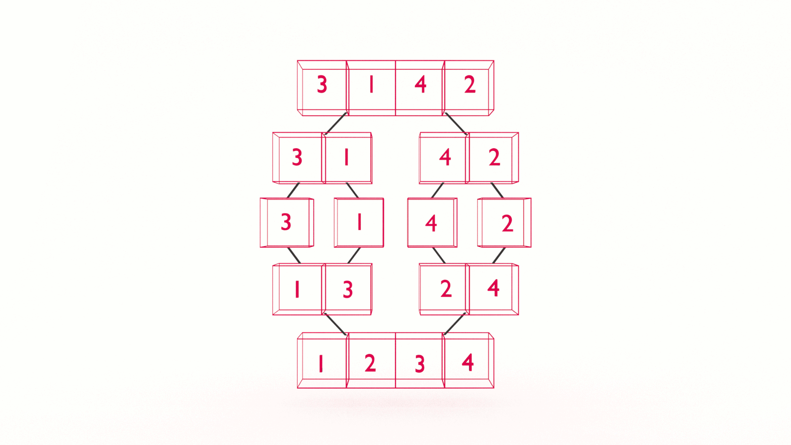

If you want to learn how to code, you need to learn algorithms. Learning algorithms improves your problem solving skills by revealing design patterns in programming. In this tutorial, you will learn how to code the merge sort algorithm in JavaScript _and_ Python. 

---


Give yourself an A. Grab your copy of [A is for Algorithms](https://gum.co/algorithms)

---


## Retrieval Practice

Retrieval practice is the surest way to solidify any new learning. Attempt to answer the following questions before proceeding:

* What is recursion? 

* What is divide & conquer? 

* How do we merge two arrays? 


### What is Recursion? 

In computer science, recursion occurs when a function calls itself within its declaration.

We use recursion to solve a large problem by breaking it down into smaller instances of the same problem. Recursion consists of two things:

* a base case

* a recursive case

We use the recursive case to break the problem down into smaller instances.

We use the base case to stop when there are no more problems to be solved.

### What is Divide & Conquer? 

As we saw in [binary search](https://jarednielsen.com/algorithm-binary-search/), [divide & conquer](https://en.wikipedia.org/wiki/Divide-and-conquer_algorithm) is an algorithm design paradigm that recursively breaks a problem down into smaller problems and recombines the solutions to the smaller problems. 


### How Do We Merge Two Arrays? 

As we say in the [merge two arrays algorithm](TODO), we use a series of conditionals to compare the first value in each array and _shift_ the lowest value off to a new array. 


## Let's Get Meta

Ask yourself the following questions and keep them back of mind as you proceed:

* Why is it called "Merge Sort"?

* What Problem(s) Does Merge Sort Solve? 

* What is DRY? 


## How to Code the Merge Sort Algorithm in JavaScript 

[Programming is problem solving](https://jarednielsen.com/programming-problem-solving/). There are four steps we need to take to solve any programming problem: 

1. Understand the problem

2. Make a plan

3. Execute the plan

4. Evaluate the plan


### Understand the Problem

Why do we need _another_ sorting algorithm? What's the problem with the Bubble, Insertion, and Selection sorting algorithms? Why is their performance so slow? They each use nested iteration. If our goal is to improve the performance of our sorting algorithm, it follows that we need to do less iteration. But how do we do _that_? 

To understand our problem, we first need to define it. Let’s reframe the problem as acceptance criteria, but this time let's up the ante:

> GIVEN an array of unsorted numbers
> WHEN my algorithm sorts the numbers
> THEN the performance is faster than quadratic time complexity

That’s our general outline. We know our input conditions (an unsorted array) and our output requirements (a sorted array), and our goal is to organize the elements in the array in ascending, or non-descending, order with an order better than O(n^2).

Let’s make a plan!


### Make a Plan

Let’s revisit our computational thinking heuristics as they will aid and guide is in making a plan. They are: 

* Decomposition

* Pattern recognition

* Abstraction

* Algorithm

If we are writing a sorting algorithm, we need to start with something to sort. Let’s declare an array of ‘unsorted’ integers:

```md
[10, 1, 9, 2, 8, 3, 7, 4, 6, 5]
```

When we are decomposing a problem, we want to break it into the types of problems that need to be solved. We also want to break it into the smallest problems that can be solved.

What’s the smallest problem we can solve?

Two numbers. We can shift the first two off our array…

[10, 1]

… and swap them:

[1, 10]

What is _actually_ happening when we swap values in an array? 

We need to slice the values into their own arrays, then concatenate the two arrays in sequential order. 

Using our smallest problem as an example, `[10, 1]`, we would break it into the following: 
```
[10], [1]
```

Then do some conditional checkeroos and concatenate the two arrays back into one:
```
[1] +  [10] = [1, 10]
```

Where have we seen this or something like it before? 

Divide and conquer! 

As we recalled above, in divide and conquer algorithms, we choose a _pivot_, and continuously divide the problem in two until we find a solution. 

If you recall, our `pivot` is the length of the array divided by two. So, for our smallest problem where the length of our array is 2, our `pivot` will be 1. 

Let's start pseudocoding this: 
```
IF THE LENGTH OF arr IS LESS THAN OR EQUAL TO 1
    RETURN arr

SET pivot TO THE LENGTH OF arr DIVIDED BY 2
```

Once we set our `pivot`, we can divide the array in two. 
```
IF THE LENGTH OF arr IS LESS THAN OR EQUAL TO 1
    RETURN arr

SET pivot TO THE LENGTH OF arr DIVIDED BY 2

SET left TO THE ELEMENTS PRECEDING pivot
SET right TO THE ELEMENTS SUCCEEDING pivot
```

Now what? 

Now we need to run those conditional checkerinos and merge the two arrays. 

Where have we see this or something like it before? 

Merging two arrays! 

Because we are pragmatic programmers, we are simply going to "import" that algorithm into this one. We'll do that by wrapping the pseudocode in a "FUNCTION": 
```
FUNCTION merge(left, right)

    SET result TO AN EMPTY ARRAY

    WHILE THERE ARE ELEMENTS IN left OR right

        IF THERE ARE ELEMENTS IN BOTH ARRAYS
            IF THE FIRST VALUE IN left IS LESS THAN THE FIRST VALUE IN right
                SHIFT THE FIRST VALUE OUT OF left AND PUSH IT INTO result
            ELSE
                SHIFT THE FIRST VALUE OUT OF right AND PUSH IT INTO result
        ELSE IF THERE ARE ONLY ELEMENTS IN left
            SHIFT THE FIRST VALUE OUT OF left AND PUSH IT INTO result
        ELSE 
            SHIFT THE FIRST VALUE OUT OF right AND PUSH IT INTO result

    RETURN result
```

Now we can simply call our `merge` function in our merge sort algorithm. 
```
IF THE LENGTH OF arr IS LESS THAN OR EQUAL TO 1
    RETURN arr

SET pivot TO THE LENGTH OF arr DIVIDED BY 2

SET left TO THE ELEMENTS PRECEDING pivot
SET right TO THE ELEMENTS SUCCEEDING pivot

RETURN merge(left, right)
```

Will this work? 

Yes, but only if our array contains two elements. 

What happens if we double our problem?
```
[10, 1, 9, 2]
```

If we follow the logic or our algorithm, we'll divide the array in two:
```
left = [10, 1]
right = [9, 2]
```

We'll then call our `merge` function like so:
```
merge(left, right)
```

Within our `merge` function, we will see that the first value in `right` is less than the first value in `left`, so we'll push that to `result`:
```
[9]
```

Uh oh! We're already in trouble! 

In the next iteration we'll see that the first (and only) value in `right` is 2, which is less than the first value in `left`, 10, so we'll push 2 to `result`:
```
[9, 2]
```

If we follow the logic, we'll end up with a "sorted" array that looks like this:
```
[9, 2, 10, 1]
```

Not sorted, but definitely swapped! 

What's the solution? 

Our `merge sort` algorithm was beautiful when we were only working with two values. 

How do we continually break a problem down into smaller, yet simliar, problems?

Recursion! 

We can make recursive calls to `merge sort` to continually divide our problem in half until we reach our base case, at which point we'll return. And conquer!  

Let's update our pseudocode: 
```
FUNCTION merge sort
    IF THE LENGTH OF arr IS LESS THAN OR EQUAL TO 1
        RETURN arr

    SET pivot TO THE LENGTH OF arr DIVIDED BY 2

    SET left TO THE ELEMENTS PRECEDING pivot
    SET right TO THE ELEMENTS SUCCEEDING pivot

    RETURN merge(merge sort(left), merge sort(right))
```


### Execute the Plan

Now it’s simply a matter of translating our pseudocode into the syntax of our programming language.

#### How to Code the Merge Sort Algorithm in JavaScript
Let’s start with JavaScript…

```js
const merge = (left, right) => {
  
    let result = [];
  
    while(left.length || right.length) {

        if(left.length && right.length) {
            if(left[0] < right[0]) {
                result.push(left.shift())
            } else {
                result.push(right.shift())
            }
        } else if(left.length) {
            result.push(left.shift())
        } else {
            result.push(right.shift())
        }
    }
    return result;
};

const mergeSort = (arr) =>{
    if(arr.length <= 1) {
        return arr;
    }

    const pivot = arr.length / 2 ;
    const left = arr.slice(0, pivot);
    const right = arr.slice(pivot, arr.length);

  return merge(mergeSort(left), mergeSort(right));
};
```

#### How to Code the Merge Sort Algorithm in Python
Now let’s see it in Python…
```py
def merge(left, right):
    result = []

    while (len(left) or len(right)):
        if (len(left) and len(right)):
            if (left[0] < right[0]):
                result.append(left.pop(0))
            else:
                result.append(right.pop(0))
        elif (len(left)):
            result.append(left.pop(0))
        else:
            result.append(right.pop(0))
    return result

def merge_sort(list):
    if (len(list) <= 1):
        return list
    
    pivot = len(list) // 2
    left = list[0:pivot]
    right = list[pivot:]

    return merge(merge_sort(left),merge_sort(right))
```

### Evaluate the Plan

Can we do better? 

It depends! 

This is a standard implementation of merge sort, but there are _still_ more sort algorithms to learn.

We'll look at quick sort in the next tutorial.


#### What is the Big O Of Merge Sort Sequence?

The order of our `mergeSort` algorithm is O(n log n), or _log linear_. You can learn more in my article on the topic: [Big O Log Linear Time Complexity](https://jarednielsen.com/big-o-log-linear-time-complexity/). 

If you want to learn how to calculate time and space complexity, pick up your copy of The Little Book of Big O


## Reflection

Remember those meta questions we asked at the outset? Let’s make it stick and answer them now!

* Why do I need to know this? 

* What Problem(s) Does Merge Sort Solve? 

* What is DRY? 


### Why Do I Need To Know This? 

Merge sort is one of the "standards". You'll probably never write it on your own, but it's good to know when you're at a cocktail party and the topic of sorting algorithms comes up. 


### What Problem(s) Does Merge Sort Solve?

Merge Sort is efficient, especially compared to the previous sorting algorithms we learned: Bubble, Insertion, and Selection.


### What is DRY? 

Dry is my sense of humor. DRY is the programming principle of "Don't Repeat Yourself". In this tutorial we repurposed the Merge Two Arrays algorithm from a previous tutorial. 


## A is for Algorithms

Give yourself an A. Grab your copy of [A is for Algorithms](https://gum.co/algorithms)


