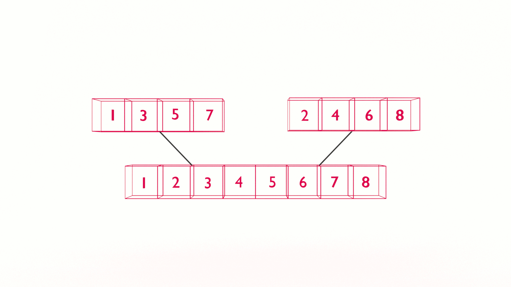

If you want to learn how to code, you need to learn algorithms. Learning algorithms improves your problem solving skills by revealing design patterns in programming. In this tutorial, you will learn how to code the Merge Two Arrays algorithm in JavaScript _and_ Python.


---


Give yourself an A. Grab your copy of [A is for Algorithms](https://gum.co/algorithms)

---


## Retrieval Practice

Retrieval practice is the surest way to solidify any new learning. Attempt to answer the following questions before proceeding:

* How do we add elements to an array? 

* How do we remove elements from an array? 

* What are logical operators?


### How Do We Add Elements To An Array?

To add elements to an array, we _push_ or _append_ those elements. 


### How Do We Remove Elements From An Array?

To remove elements from an array, we _shift_  or _slice_ elements out and off. 


### What Are Logical Operators?

The logical operators are `AND`, `OR`, and `NOT`. Depending on how you use them, they either return a Boolean value (true / false) or one of the two values being compared.  


## Let's Get Meta

Ask yourself the following questions and keep them back of mind as you proceed:

* Why do I need to know this?

* What problem(s) does merge two arrays solve? 

* Where have we seen this or something like it before? 


## How to Code the Merge Two Arrays Algorithm 

[Programming is problem solving](https://jarednielsen.com/programming-problem-solving/). There are four steps we need to take to solve any programming problem: 

1. Understand the problem

2. Make a plan

3. Execute the plan

4. Evaluate the plan


### Understand the Problem

To understand our problem, we first need to define it. Let’s reframe the problem as acceptance criteria:

```md
GIVEN two sorted arrays
WHEN I pass the two arrays to a `merge` function
THEN I am returned one array containing the values of the original two in sequential order
```

That’s our general outline. We know our input conditions, two sorted arrays, and our output requirements, one array, and our goal is to merge the two original arrays in sequential order.

Let’s make a plan!


### Make a Plan

Let’s revisit our computational thinking heuristics as they will aid and guide is in making a plan. They are: 

* Decomposition

* Pattern recognition

* Abstraction

* Algorithm design

The first step is decomposition, or breaking our problem down into smaller problems. What's the smallest problem we can solve? 
```
[1], [2]
```

Let's call these two arrays `left` and `right`. 

We're going to need to build a new array, so let's call it `result`. 

Here's our pseudocode so far:
```
INPUT left, right

SET result TO AN EMPTY ARRAY 
```

If the value stored in `left` is less than the value stored in `right`, we simply shift the value in `left` into our `result` array. Let's pseudocode that...
```
INPUT left, right

SET result TO AN EMPTY ARRAY 

IF THE FIRST ELEMENT IN left IS LESS THAN THE FIRST ELEMENT IN right
    SHIFT THE FIRST ELEMENT OFF left AND PUSH IT INTO right
```

We can use our `ELSE` to check the opposite, where the first element in `right` is less than `left`:
```
INPUT left, right

SET result TO AN EMPTY ARRAY 

IF THE FIRST ELEMENT IN left IS LESS THAN THE FIRST ELEMENT IN right
    SHIFT THE FIRST ELEMENT OFF left AND PUSH IT INTO right
ELSE 
    SHIFT THE FIRST ELEMENT OFF right AND PUSH IT INTO left

RETURN result
```

Will this work? If we step through it, we only shift the first value out of `left`. We need to iterate, but what approach to iteration do we take? 

Because we don't know the size of our two arrays in advance and we are "counting down" until both arrays are empty, let's use a `while` loop. 

While _what_? 

While there are still values to evaluate in `left` _or_ `right`. 
```
INPUT left, right

SET result TO AN EMPTY ARRAY 

WHILE THERE ARE VALUES IN left OR right
    IF THE FIRST ELEMENT IN left IS LESS THAN THE FIRST ELEMENT IN right
        SHIFT THE FIRST ELEMENT OFF left AND PUSH IT INTO right
    ELSE 
        SHIFT THE FIRST ELEMENT OFF right AND PUSH IT INTO left

RETURN result
```

Let's step through it...

On our first iteration, `left` is 1 and `right` is 2. The result of the evaluation in our conditional is that `left` is less than `right`, so we shift 1 off `left` into `result`.  

On the second iteration, `left` is empty and `right` is still 2. The result of the evaluation in our conditional is... what? 

Well... it depends. If your language is JavaScript, then yes, `right`, will evaluate as less than an empty array. But if your language is Python, you are going to get an error. 

Why? 

Types.

JavaScript is weakly typed, meaning we can be sloppy with our operators. 

But Python is strongly typed, so type matters and we can't compare a numerical value to an empty error and get the results we expect.

So... what's the solution? 

We know we need to compare the values in both arrays. But we now know we only need to compare the values in both arrays _when_ there are values to compare. 

Where have we seen this or something like it before? 

Conditionals! 

And? 

Operators! 

Let's use the logical operator `AND` and only compare both arrays if thec ondition evaluates as true. If we add this to our pseudocode...

```
INPUT left, right

SET result TO AN EMPTY ARRAY 

WHILE THERE ARE VALUES IN left OR right

    IF THERE ARE ELEMENTS IN left AND right
        IF THE FIRST ELEMENT IN left IS LESS THAN THE FIRST ELEMENT IN right
            SHIFT THE FIRST ELEMENT OFF left AND PUSH IT INTO right
        ELSE 
            SHIFT THE FIRST ELEMENT OFF right AND PUSH IT INTO left

RETURN result
```

What do we do when the `AND` operator does not evluate as true? If it's not true, we check if there are any values in `left`. Otherwise, we check if there are any values in `right`. In both cases, we push the value to `result`. 

Here's our complete pseudocode: 
```
INPUT left, right

SET result TO AN EMPTY ARRAY

WHILE THERE ARE ELEMENTS IN left OR right
    IF THERE ARE ELEMENTS IN left AND right
        IF THE FIRST ELEMENT IN left IS LESS THAN THE FIRST ELEMENT IN right
            SHIFT THE FIRST ELEMENT OFF left AND PUSH IT INTO right
        ELSE 
            SHIFT THE FIRST ELEMENT OFF right AND PUSH IT INTO left
    ELSE IF
        SHIFT THE FIRST ELEMENT OFF left AND PUSH IT INTO right
    ELSE
        SHIFT THE FIRST ELEMENT OFF right AND PUSH IT INTO left

RETURN result
```


### Execute the Plan

Now it's simply a matter of translating our pseudocode into the syntax of our programming language. 


#### How to Code the Merge Two Arrays Algorithm in JavaScript

Let's start with JavaScript...
```js
const merge = (left, right) => {
    
    let result = [];
    
    while(left.length || right.length) {
        
        if(left.length && right.length) {
            if(left[0] < right[0]) {
                result.push(left.shift())
            } else {
                result.push(right.shift())
            }
        } else if(left.length) {
            result.push(left.shift())
        } else {
            result.push(right.shift())
        }
    }
    return result;
};
```


#### How to Code the Merge Two Arrays Algorithm in Python

Now let's see it in Python...
```py
def merge(left, right):
    result = []

    while (len(left) or len(right)):
        if (len(left) and len(right)):
            if (left[0] < right[0]):
                result.append(left.pop(0))
            else:
                result.append(right.pop(0))
        elif (len(left)):
            result.append(left.pop(0))
        else:
            result.append(right.pop(0))
    return result
```

### Evaluate the Plan

Can we do better? 

We could get fancy with our conditionals and operators, but we wouldn't get a performance boost in doing so, just bonus points. 


#### What is the Big O Of Merge Two Arrays?

If you want to learn how to calculate time and space complexity, pick up your copy of [The Little Book of Big O](https://gum.co/big-o)


## Reflection

Remember those _meta_ questions we asked at the outset? Let’s make it stick and answer them now!

* Why do I need to know this?

* What problem(s) does merge two arrays solve? 

* Where have we seen this or something like it before? 


### Why Do I Need to Know This? 

In addition to being a classic interview question, merging two arrays is the kernel of merge sort. 


### What Problem(s) Does Merge Two Arrays Solve? 

Just that! Merging two arrays! 


### Where Have We Seen This Or Something Like It Before? 

FizzBuzz! The logic and control flow of this algorithm are very similar to those we used in FizzBuzz. Practice makes practice! 


## A is for Algorithms


Give yourself an A. Grab your copy of [A is for Algorithms](https://gum.co/algorithms)


