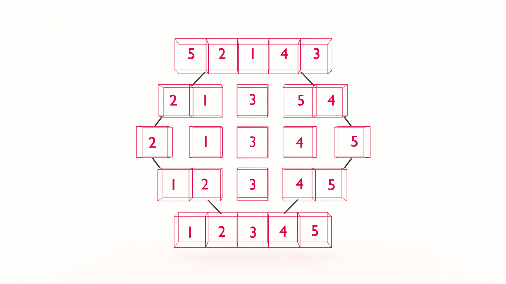

If you want to learn how to code, you need to learn algorithms. Learning algorithms improves your problem solving skills by revealing design patterns in programming. In this tutorial, you will learn how to code the quick sort in JavaScript _and_ Python.


---


Give yourself an A. Grab your copy of [A is for Algorithms](https://gum.co/algorithms)

---


## Retrieval Practice

Retrieval practice is the surest way to solidify any new learning. Attempt to answer the following questions before proceeding:

* How does the swap algorithm work? 

* How does the array partition algorithm work? 

* How does binary search work? 


### How Does The Swap Algorithm Work? 

The swap algorithm uses a temporary variable to store the value of one of the two variables to be swapped. The variables are then reassigned accordingly. 


### How Does The Array Partition Algorithm Work? 

The array partition algorithm selects a pivot and iteratively compares the other values in the array to the pivot. It then swaps values accordingly so that values lower than the pivot are moved to the left of the pivot and values greater than the pivot are moved to the right of the pivot. 


### How Does Binary Search Work? 

Binary search repeatedly divides a sorted array in half until it finds the index of the requested value. 


## Let's Get Meta

Ask yourself the following questions and keep them back of mind as you proceed:

* Why do I need to know this?

* What problem(s) does quick sort solve? 

* What does it mean to 'divide & conquer? 


## How to Code the Quick Sort Algorithm 

[Programming is problem solving](https://jarednielsen.com/programming-problem-solving/). There are four steps we need to take to solve any programming problem: 

1. Understand the problem

2. Make a plan

3. Execute the plan

4. Evaluate the plan


### Understand the Problem

To understand our problem, we first need to define it. Let’s reframe the problem as acceptance criteria:

```md
GIVEN an unsorted array
WHEN I pass it to my quicksort function
THEN I am returned a result that takes less time or space than other sorting algorithms 
```

That’s our general outline. We know our input conditions, an unsorted array, and our output requirements, a sorted array, and our goal is efficiency.

Let’s make a plan!


### Make a Plan

Let’s revisit our computational thinking heuristics as they will aid and guide is in making a plan. They are: 

* Decomposition

* Pattern recognition

* Abstraction

* Algorithm design

The first step is decomposition, or breaking our problem down into smaller problems. What's the smallest problem we can solve? 
```
[2, 1]
```

Where have we seen this or something like it before? 

We need to _swap_ the values. 

Because we are pragmatic programmers, we're going to _import_ our `swap` algorithm.
```
FUNCTION swap(arr, left, right)
    SET temp TO arr[left]
    SET arr[left] TO arr[right]
    SET arr[right] TO temp

    RETURN arr
```


What's the next smallest problem we can solve?
```
[3, 1, 2]
```

We can't simply pass this to our `swap` algorithm, because we don't know in advance which two values need to be swapped. 

Where have we seen this or something like it before? 

We can simply pass this to our `partition` algorithm. 

TODO copy/paste partition

Our `partition` algorithm selects a "random" value from the array as the pivot and then compares the other values in the array against it. But, if we recall, the `partition` algorithm doesn't sort the values in the array, it only moves lower values to the left of the pivot and higher values to the right of the pivot. 

Take the following array for example:
```
[5, 1, 4, 2, 3]
```

If we pass this to our `parition` algorithm, the value of `pivot` will be 3, and its `index` will be 2. 
```
[ 1, 2, 3, 5, 4]
```

So close! 

If only we could pass this array back to our `partition` function...

But would we need to pass the entire array? 

Nope. Just the unsorted part and we can describe the unsorted part as the values between our `index` and `right`. 

If we were to call `partition` again...
```
partition(arr, index, right)
```

...the result would be: 
```
[ 1, 2, 3, 4, 5]
```

What if our initial array looked like this? 
```
[2, 5, 4, 1, 3]
```

Our `partition` algorithm would return this:
```
[ 2, 1, 3, 5, 4 ]
```

We would need to make _two_ more calls to `partition`. Note that, in the first call, we subtract 1 from `index` because we are already passing the indexed value to the next call to `partition`. 
```
partition(arr, left, index - 1)
partition(arr, index, right)
```

We could achieve the same with something like this:
```
partition(arr, left, index)
partition(arr, index + 1, right)
```

But this creates a different problem for us to solve. Each call to `partition` returns a different array.

How do we make multiple calls to `partition` without making multiple arrays? 

It's time to get abstract. 

Let's start pseudocoding our `quicksort` function. We know we need to call `partition` at least once and that `partition` returns an `index`: 
```
FUNCTION quicksort(arr)
    SET index TO partition(arr, left, right)
```

But wait! How does `parittion` know what the `left` and `right` values are? 

We need to pass those to `quicksort`, too, so a quick (pun intended) refactor gives us: 
```
FUNCTION quicksort(arr, left, right)
    SET index TO partition(arr, left, right)
```

Now, rather than calling `partition` again and again, we can recursively call `quicksort`:
```
FUNCTION quicksort(arr, left, right)
    SET index TO partition(arr, left, right)

    quicksort(arr, left, index -1)
    quicksort(arr, index, right)
    
    RETURN arr
```

How do we know when to stop? 

If each recursive call is dividing the array (roughly) in half, at some point the values of `left` and `right` will both be 0, or in some weird edge case, `left` will be greater than `right`. As long as `left` is less than `right`, we want to continue making recursive calls. 

Our final pseudocode looks like this: 
```
FUNCTION quicksort(arr, left, right)
    if left IS LESS THAN right
        SET index TO partition(arr, left, right)

        quicksort(arr, left, index -1)
        quicksort(arr, index, right)
    
    RETURN arr
```


### Execute the Plan

Now it's simply a matter of translating our pseudocode into the syntax of our programming language. 


#### How to Code the Quick Sort Algorithm in JavaScript

Let's start with JavaScript...
```js
const swap = (arr, left, right) => {
    let temp = arr[left];
    arr[left] = arr[right];
    arr[right] = temp;

    return arr;
}

const partition = (arr, left = 0, right = arr.length - 1) => {

    let pivot = arr[right];
    let index = left; 

    for (let i = left; i < right; i++) {
        if (arr[i] < pivot) {
            swap(arr, index, i);
            index++;
        }
    }
    swap(arr, index, right);
    
    return index;
}

const quickSort = (arr, left = 0, right = arr.length - 1) => {
    if (left < right) {
        let index = partition(arr, left, right);

        quickSort(arr, left, index - 1);
        quickSort(arr, index, right);
    }

    return arr;
}
```

#### How to Code the Quick Sort Algorithm in Python

Now let's see it in Python...

```py
def swap(arr, left, right):
    temp = arr[left]
    arr[left] = arr[right]
    arr[right] = temp

    return arr

def partition(arr, left = 0, right = None):

    if right == None: 
        right = len(arr) - 1
        
    pivot = arr[right]
    index = left

    for i in range(left, right):
        if arr[i] < pivot:
            swap(arr, index, i)
            index += 1
    
    swap(arr, index, right)

    return index 

def partition(arr, pivot):
    left = 0
    right = len(arr) - 1

    while (left <= right):
        while (arr[left] < pivot):
            left = left + 1
        while (arr[right] > pivot and right > 0):
            right = right - 1
        if (left <= right):
            swap(arr, left, right)
            left = left + 1
            right = right - 1
    return arr

def quick_sort(arr, left = 0, right = None):
    if right == None:
        right = len(arr) - 1

    if (left < right):
        pivot = (left + right) // 2

        part = partition(arr, pivot)

        index = part[pivot]

        quick_sort(arr, left, index - 1)
        quick_sort(arr, index, right)
    
    return arr
```

### Evaluate the Plan

Can we do better? 

Yes and no.

We could use the Hoare partition scheme, which, while being slightly more complicated to implement, helps us avoid edge case worst-case runtimes. 

Depending on the context, we may not want to use quicksort. For example, if the array is not randomized, quick sort will still divide and conquer _every_ value, which is basically Bubble Sort. 


#### What is the Big O Of Quick Sort?

If you want to learn how to calculate time and space complexity, pick up your copy of [The Little Book of Big O](https://gum.co/big-o)


## Reflection

Remember those _meta_ questions we asked at the outset? Let’s make it stick and answer them now!

* Why do I need to know this?

* What problem(s) does Quick Sort solve? 

* What does it mean to 'divide & conquer'? 


### Why Do I Need to Know This? 

Quicksort is quick! It's a, if not _the_, widely used sorting algorithm. 


### What Problem(s) Does Quick Sort Solve? 

Quicksort improves on the time and space complexity of the previous sort algorithms we learned. 


### What Does It Mean To 'Divide & Conquer'? 

According to Ye Olde Wikipedia, a divide-and-conquer algorithm: 

> recursively breaks down a problem into two or more sub-problems of the same or related type, until these become simple enough to be solved directly. The solutions to the sub-problems are then combined to give a solution to the original problem. 


## A is for Algorithms


Give yourself an A. Grab your copy of [A is for Algorithms](https://gum.co/algorithms)


