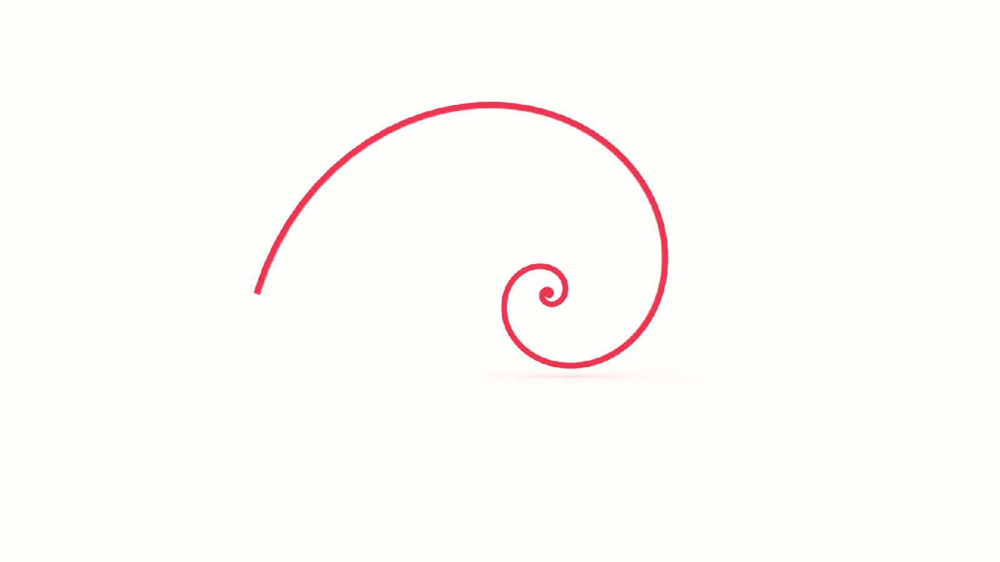
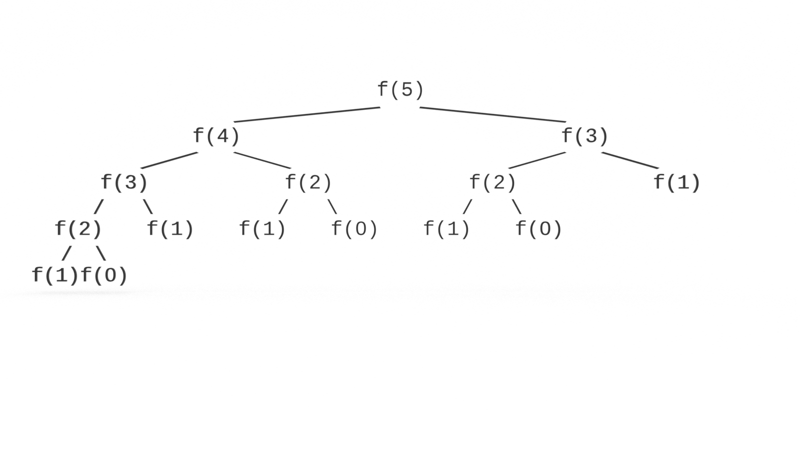

If you want to learn how to code, you need to learn algorithms. Learning algorithms improves your problem solving skills by revealing design patterns in programming. In this tutorial, you will learn how to code the recursive Fibonacci sequence in JavaScript _and_ Python.


---


Give yourself an A. Grab your copy of [A is for Algorithms](https://gum.co/algorithms)

---


## Retrieval Practice

Retrieval practice is the surest way to solidify any new learning. Attempt to answer the following questions before proceeding:

* What is a Fibonacci Sequence? 

* What is Recursion?

* What's the definition of 'naive'? 


### What is a Fibonacci Sequence? 

[Fibonacci](https://en.wikipedia.org/wiki/Fibonacci_number) is a sequence of numbers where each number is the sum of the preceding two.

It starts like this…
```
0 1 1 2 3 5 8 13 21 34 55 89 144…
```

We can map it out in a table, like so: 

| Preceding numbers | Sum   |
| ---               | ---   |
| 0 + 1             | 1     |
| 1 + 1             | 2     |
| 1 + 2             | 3     |
| 2 + 3             | 5     |
| 3 + 5             | 8     |
| 5 + 8             | 13     |
| 8 + 13             | 21    |
| 13 + 21             | 34    |
| 21 + 34             | 55    |
| 34 + 55             | 89    |
| 55 + 89             | 144    |


And so on...

Before we get to recursion, let’s look at an iterative solution to the problem in JavaScript.

```js
const fiberative = n => {
   let arr = [0, 1];
   for (let i = 2; i < n + 1; i++){
     arr.push(arr[i - 2] + arr[i -1])
   }
  return arr[n];
};
```

### What is Recursion? 

In computer science, recursion occurs when a function calls itself within its declaration.

We use recursion to solve a large problem by breaking it down into smaller instances of the same problem.

To do that, we need to tell our function what the smallest instance looks like.

If you recall, with proof by induction we need to establish two things:

* base

* induction

Recursion is similar. We also need to establish a base case but rather than induction, we establish the recursive case.

We use the recursive case to break the problem down into smaller instances.

We use the base case to return when there are no more problems to be solved.


### What's the Definition of 'naive'? 

According to dictionary.com, the definition of _naive_ is: 

> having or showing a lack of experience, judgment, or information


## Let's Get Meta

Ask yourself the following questions and keep them back of mind as you proceed:

* Why do I need to know this?

* What problem(s) does recursion solve? 

* What problem(s) does recursion create? 


## How to Code the Recursive Fibonacci Algorithm 

[Programming is problem solving](https://jarednielsen.com/programming-problem-solving/). There are four steps we need to take to solve any programming problem: 

1. Understand the problem

2. Make a plan

3. Execute the plan

4. Evaluate the plan


### Understand the Problem

To understand our problem, we first need to define it. Let’s reframe the problem as acceptance criteria:

```md
GIVEN a number, _n_
WHEN I call a recursive Fibonacci function
THEN I am returned the _nth_ member of the Fibonaccis sequence
```

That’s our general outline. We know our input conditions, an integer _n_, and our output requirements, the _nth_ member of the Fibonacci sequence, and our goal is to calculate this recursively.

Let’s make a plan!


### Make a Plan

Let’s revisit our computational thinking heuristics as they will aid and guide is in making a plan. They are: 

* Decomposition

* Pattern recognition

* Abstraction

* Algorithm design

The first step is decomposition, or breaking our problem down into smaller problems. What's the smallest problem we can solve? 

_0_

If _n_ is equal to 0, what is the equivalent Fibonacci number? 

_0_

Let's map out the first 10 numbers so we're clear on the goal. 

| n     | nth   |
| ---   | ---   |
| 0     | 0     |
| 1     | 1     |
| 2     | 1     |
| 3     | 2     |
| 4     | 3     |
| 5     | 5     |
| 6     | 8     |
| 7     | 13    |
| 8     | 21    |
| 9     | 34    |
| 10    | 55    |


Let's pseudo/hardcode 0: 

```
FUNCTION fibonacci
    INPUT n

    IF n IS EQUAL TO 0 
        RETURN n
```

What's the next smallest problem? 

_1_

If we refer to our table above, we see that the result of _n = 1_ will return _1_. We can simply add this to our conditional: 
```
FUNCTION fibonacci
    INPUT n

    IF n IS EQUAL TO 0 OR n IS EQUAL TO 1
        RETURN n
```

Hey! Look at that. We just establisehd our base case. Now we need to define our recursive case. 

Let's look at the next smallest problem, _2_.

If our input is _2_, what do we expect the return value to be? 

`1`

How do we arrive at _1_ in the Fibonacci sequence? It's the sum of the two preceding numbers, 0 and 1. 

If our input is _3_, what do we expect the return value to be? 

`2`

How do we arrive at 2 in the Fibonacci sequence? It's the sum of the two preceding numbers, 1 and 1.

If our input is 4, what do we expect the return value to be? 

`3`

In order to return a value of 3 when _n_ is equal to 4, we know we need to add 1 and 2, the numbers that precede 3 in the Fibonacci sequence. 

Do you see a pattern? 

You might be tempated to say that it's simply `n - 1`, but what if our input is 5? What do we expect the return value to be? 

Not 4. 

It's 5!

In order to return a value of 5 when _n_ is equal to 5, we know we need to add 2 and 3, the numbers that precede 5 in the Fibonacci sequence. 

If we call our Fibonacci function _f()_ for short, we know that: 
```
f(5) = 3 + 2
```
And...
```
f(4) = 2 + 1
```
And...
```
f(3) = 1 + 1
```
And...
```
f(2) = 1 + 0
```

And `f(1)` is our base case because there aren't two preceding numbers to add to arrive at this value. 

Do you see the pattern? 
```
f(5) = f(4) + f(3)
```
And...
```
f(4) = f(3) + f(2)
```
And...
```
f(3) = f(2) + f(1)
```
_In other words_...
```
f(5) = (f(3) + f(2)) + (f(2) + f(1))
```
And so on...

Now we can make the leap to abstraction: the recursive Fibonacci, or _f()_ of _n_ can be expressed as _f(n - 1) + f(n - 2)_. We can translate this to pseudocode: 
```
FUNCTION fibonacci
    INPUT n

    IF n IS EQUAL TO 0 OR n IS EQUAL TO 1
        RETURN n
    
    RETURN fibonacci(n - 1) + fibonacci(n - 2)
```


### Execute the Plan

Now it's simply a matter of translating our pseudocode into the syntax of our programming language. 


#### How to Code the Recursive Fibonacci Algorithm in JavaScript

Let's start with JavaScript...
```js
const fibonaive = n => {
 if (n == 0 || n == 1) {
   return n;
 }
 
 return fibonaive(n - 1) + fibonaive(n - 2);
};
```


#### How to Code the Recursive Fibonacci Algorithm in Python

Now let's see it in Python...
```py
def fibonaive(n):
    if (n ==0) or (n == 1):
        return n
    
    return fibonaive(n - 1) + fibonaive(n - 2)
```

### Evaluate the Plan

Can we do better? 

We sure can! 

Our solution above is referred to as a "naive" implementation of Fibonacci. 

Why is it naive? Because the runtime is really bad.


#### What is the Big O Of Recursive Fibonacci Sequence?

It’s O(2^n).

(Actually, it’s O(1.6^n), but who’s counting?)

If you want to learn how to calculate time and space complexity, pick up your copy of [The Little Book of Big O](https://gum.co/big-o)

Take a look at this diagram of our recursive call branches.



Why is this algorithm inefficient?

Overlapping subproblems! We solve the same problems repeatedly in our branches.

How many times do we solve f(0)?

How many times do we solve f(1)?

How many times do we solve f(2)?

How many times do we solve f(3)?

The answer to all of the above is: too many!

What's the solution? 

Dynamic programming! 

If you want to learn more, check out my article [What is Dynamic Programming? Memoization and Tabulation](https://jarednielsen.com/dynamic-programming-memoization-tabulation/)


## Reflection

Remember those _meta_ questions we asked at the outset? Let’s make it stick and answer them now!

* Why do I need to know this?

* What problem(s) does recursion solve? 

* What problem(s) does recursion create?


### Why Do I Need to Know This? 

Fibonacci algorithms are standard challenges for beginners and technical interviews. There are many ways to solve a Fibonacci algorithm and each reveals the depth of your knowledge.

The Fibonacci sequence is a pattern that can be found in nature, particularly fractals. 


### What Problem(s) Does Recursion Solve? 

Recursion allows us to write functions that are compact and elegant.


### What Problem(s) Does Recursion Create?

Recursion can easily exceed the maximum size of the call stack.

Recursion can make the program harder to understand not only for your collaborators, but for your future self.


## A is for Algorithms


Give yourself an A. Grab your copy of [A is for Algorithms](https://gum.co/algorithms)


