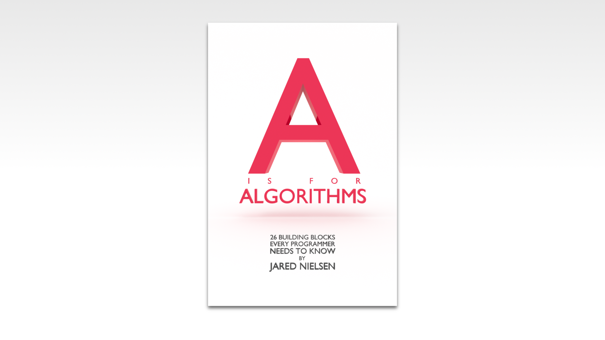

If you want to learn how to code, you need to learn algorithms. Learning algorithms improves your problem solving skills by revealing design patterns in programming. In this tutorial, you will learn how to code the recursive Greatest Common Divisor in JavaScript _and_ Python.


---


Give yourself an A. Grab your copy of [A is for Algorithms](https://gum.co/algorithms)

---


## Retrieval Practice

Retrieval practice is the surest way to solidify any new learning. Attempt to answer the following questions before proceeding:

* What is a Greatest Common Divisor?

* What is the iterative Greatest Common Divisor?

* What is recursion? 


### What is a Greatest Common Divisor?

TODO


### How Does the Iterative Greatest Common Divisor Algorithm Work?

TODO
```
INPUT n
INPUT m

WHILE m IS GREATER THAN 0
    SET r TO m
    SET m TO THE REMAINDER of n DIVIDED BY m
    SET n EQUAL TO r

RETURN n
```


### What is Recursion? 

TODO


## Let's Get Meta

Ask yourself the following questions and keep them back of mind as you proceed:

* Why do I need to know this?

* What problem(s) does recursion solve? 

* What problem(s) does recursion create? 


## How to Code the Recursive Greatest Common Divisor Algorithm 

[Programming is problem solving](https://jarednielsen.com/programming-problem-solving/). There are four steps we need to take to solve any programming problem: 

1. Understand the problem

2. Make a plan

3. Execute the plan

4. Evaluate the plan


### Understand the Problem

To understand our problem, we first need to define it. Let’s reframe the problem as acceptance criteria:

```md
GIVEN TODO
WHEN TODO
THEN TODO
```

That’s our general outline. We know our input conditions, TODO, and our output requirements, TODO, and our goal is to TODO.

Let’s make a plan!


### Make a Plan

Let’s revisit our computational thinking heuristics as they will aid and guide is in making a plan. They are: 

* Decomposition

* Pattern recognition

* Abstraction

* Algorithm design

The first step is decomposition, or breaking our problem down into smaller problems. What's the smallest problem we can solve? 

Recursion! 

When writing a recursive algorithm, we need to pull ourselves up by our bootstraps and write a recursive algorithm. 

We know that a recursive function is a function that calls itself, so let's start pseudocoding our recursive GCD: 
```
FUNCTION gcd(n, m)

    RETURN gcd(n, m)
```

Do we see a pattern? 

Without something to stop it, our function will make infinite calls to itself. 

What a crock! 

Let's take another look at our iterative GCD: 
```
INPUT n
INPUT m

WHILE m IS GREATER THAN 0
    SET r TO m
    SET m TO THE REMAINDER of n DIVIDED BY m
    SET n EQUAL TO r

RETURN n
```

The kernel of this algorithm occurs inside the `while` loop where we perform a swap while calculating the modulo of our two input values.

What do we know about `while` loops? 

They iterate _until_ a condition is met. In our iterative GCD, our `while` loop runs until `m` is no longer greater than 0. In other words, until `m` is equal to 0. 

Let's translate this to pseudocode in our recursive GCD: 
```
FUNCTION gcd(n, m)
    IF m IS EQUAL TO 0
        RETURN n

    RETURN gcd(n, m)
```

Now there's a way to break out of our loop. 

AKA the base case. 

Now we need to implement the recursive case. There are two problems remaining to be solved: 

1. The swap

2. The remainder 

We _could_ simply copy/paste our swap/modulo from our iterative GCD: 
```
FUNCTION gcd(n, m)
    IF m IS EQUAL TO 0
        RETURN n
    
    SET r TO m
    SET m TO THE REMAINDER of n DIVIDED BY m
    SET n EQUAL TO r

    RETURN gcd(n, m)
```

But we can definitely get more abstract. Do you see a pattern?

With each recursive call, we pass the previous value of `m` which is reassigned to `n`, and the new value of `m`, which is the remainder of `n` divided by `m`, to our function. 

Rather than hardcode it, we can perform the swap _within_ the recursive call:
```
FUNCTION gcd(n, m)
    IF m IS EQUAL TO 0
        RETURN n
    
    SET r TO THE REMAINDER of n DIVIDED BY m

    RETURN gcd(m, r)
```

But we can definitely get more abstract! Do you see a pattern? 

Rather than declare an `r` variable, we can perform the modulo operation _within_ the recursive call:
```
FUNCTION gcd(n, m)

    IF m IS EQUAL TO 0
        RETURN n
    
    RETURN gcd(m, n % m)
```


### Execute the Plan

Now it's simply a matter of translating our pseudocode into the syntax of our programming language. 


#### How to Code the Recursive Greatest Common Divisor Algorithm in JavaScript

Let's start with JavaScript...
```js
const gcd = (n, m) => {
    if (m === 0) {
        return n;
    }

    return gcd(m, n % m);
};
```


#### How to Code the Recursive Greatest Common Divisor Algorithm in Python

Now let's see it in Python...
```py
def gcd(n, m):
    if (m == 0):
        return n
    
    return gcd(m, n % m)
```

### Evaluate the Plan

Can we do better? 

TODO


#### What is the Big O Of Recursive Greatest Common Divisor?

If you want to learn how to calculate time and space complexity, pick up your copy of [The Little Book of Big O](https://gum.co/big-o)


## Reflection

Remember those _meta_ questions we asked at the outset? Let’s make it stick and answer them now!

* Why do I need to know this?

* What problem(s) does TODO solve? 

* TODO


### Why Do I Need to Know This? 

For the same reaons we discussed in the iterative solution, with the addition that you will _also_ want to know how to execute this with recursion. 


### What Problem(s) Does TODO Solve? 

TODO


### TODO

TODO


## A is for Algorithms


Give yourself an A. Grab your copy of [A is for Algorithms](https://gum.co/algorithms)


