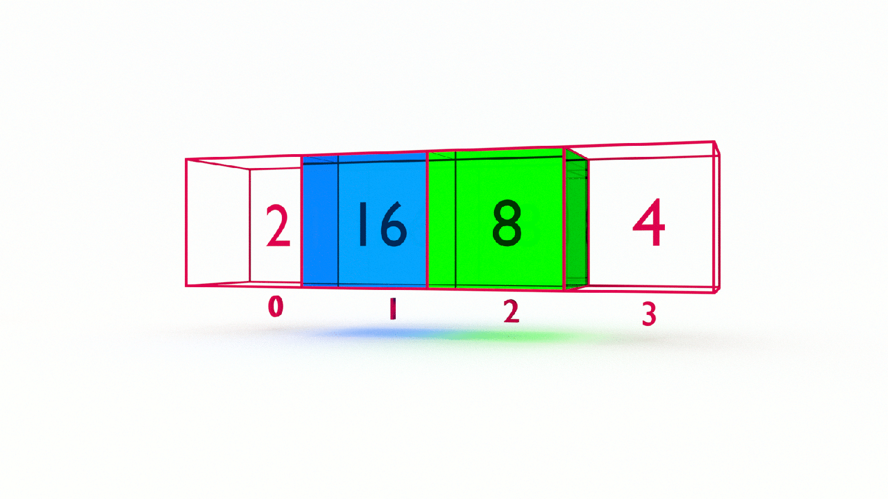

If you want to learn how to code, you need to learn algorithms. Learning algorithms improves your problem solving skills by revealing design patterns in programming. In this tutorial, you will learn how to code the selection sort algorithm in JavaScript _and_ Python.


---


Give yourself an A. Grab your copy of [A is for Algorithms](https://gum.co/algorithms)

---


## Retrieval Practice

Retrieval practice is the surest way to solidify any new learning. Attempt to answer the following questions before proceeding:

* How do we swap values in an array? 


### How Do We Swap Values in an Array? 

There are several approaches for swapping values in an array, but in general, we create a temporary variable to hold one of the values we want to swap while we reassign the existing variables. In pseudocode:
```
SET temp TO x
SET x TO y
SET y TO temp
```

If you're just joining us, you might want to start with [Learn How to Code the Swap Algorith in JavaScript and Python](https://jarednielsen.com/algorithm-swap/).


## Let's Get Meta

Ask yourself the following questions and keep them back of mind as you proceed:

* Why do I need to know this?

* Why is it called "Selection Sort"?

* What's _next_?


## How to Code the Selection Sort Algorithm 

[Programming is problem solving](https://jarednielsen.com/programming-problem-solving/). There are four steps we need to take to solve any programming problem: 

1. Understand the problem

2. Make a plan

3. Execute the plan

4. Evaluate the plan


### Understand the Problem

To understand our problem, we first need to define it. Let’s reframe the problem as acceptance criteria:

```md
GIVEN an unsorted array of integers
WHEN we find the lowest unsorted value
THEN we move that value to its proper ordinal position and repeat until all values are in sequence

```

That’s our general outline. We know our input conditions, an unsorted array, and our output requirements, a sorted array, and our goal is to organize the elements in the array in ascending, or non-descending, order, starting with the smallest elements first.


Let’s make a plan!


### Make a Plan

Let’s revisit our computational thinking heuristics as they will aid and guide is in making a plan. They are: 

* Decomposition

* Pattern recognition

* Abstraction

* Algorithm design

We need something to sort, so let's use this "unsorted" array:
```
[10, 1, 9, 2, 8, 3, 7, 4, 6, 5]
```

The first step in our process is decomposition, or breaking our problem down into smaller problems. What's the smallest problem we can solve? 
```
[10, 1]
```

We see that we simply need to swap the positions of these two values. Let's pseudocode a solution to this very small problem: 
```
INPUT array
SET first EQUAL TO THE VALUE STORED IN array[0]
SET next EQUAL TO THE VALUE STORED IN array[1]
IF next IS LESS THAN first 
    SWAP first AND next 
```

So far so good! Let's expand our array and add another value:
```
[10, 1, 9]
```

We _could_ hardcode another conditional to check the value stored in the third index, but we're programmers. We immediately recognize a pattern emerging where we will need to _select_ the first value and not only compare it to the second value, but to the third value as well. And then _select_ the second value, and compare it to the third value, all while swapping the location of values when necessary. We need to iterate. 

Let's update our pseudocode: 
```
INPUT array
FOR EACH index IN array:
    SET first EQUAL TO THE VALUE STORED IN array[0]
    SET next EQUAL TO THE VALUE STORED IN array[1]
    IF next IS LESS THAN first
        SWAP first AND next
```

Let's step through this...

On the first iteration, we select the first element, `10`, and compare it to the next element, `1`, which is less than `10`, so we swap their positions. Our array now looks like this:
```
[1, 10, 9]
```

But! What happens in the next iteration? We again select the first element and compare it to the next element, which is now `9`. `9` is greater than `1`, so we leave it where it is. 

What's the solution? 

Abstraction!

We need a means of tracking and updating the index of the "known minimum value". 

In this scenario, `1` is our first "known minimum value", but we can see that `9` is less than `10`, so after we move `1`, the _current_ "known minimum value" to the 0 index, we need to find the _next_ "known minimum value" and compare that to the `next` value and swap accordingly. 

Let's refer to the "known minimum value" as `min`. 
```
INPUT array
FOR EACH index IN array:
    SET min EQUAL TO index 
    SET next EQUAL TO index + 1
    IF THE VALUE STORED IN array[next] IS LESS THAN THE VALUE STORED IN array[min]:
        SET min EQUAL TO next
        SWAP THE VALUE STORED IN array[index] WITH THE VALUE STORED IN array[min]
```

Let's iterate over our array again:
```
[10, 1, 9]
```

On the first iteration, we _select_ `10` because it's the first element, and the value stored in`array[min]`. If the value stored in `next`, in this case `1`, is less than the value stored in `min`, which it is, we reassign `min` the value of `next`. So `min` is now equal to `1`. Now we need to swap the value currently stored in `array[index]`, `10`, with the value stored in `array[min]`, `1`. After the first iteration, our array looks like this: 
```
[1, 10, 9]
```

On the next iteration, `index` is equal to `1`, so we reassign the value of `min` with `1`. We then reassign the value of `next` with `index + 1`, or `2`. We compare the value stored in `array[next]`, which is `9`, with the value stored in `array[min]`, which is `10`. Our conditional evalutes as `true`, so we reassign the value of `min` with the value of `next` and then swap the value stored in `array[index]` with the value stored in `array[min]`. Our array now looks like this: 
```
[1, 9, 10]
```

So far so good. Let's add another value to our array: 
```
[10, 1, 9, 2]
```

Let's fast forward to the fourth iteration, where our array looks like this:
```
[1, 9, 10, 2]
```

What's going to happen here? We're only going to swap the locations of `2` and `10`. Our array will look like this:
```
[1, 9, 2, 10]
```

What's wrong with our design? 

We are only comparing the iterator, `index`, to the _next_ value. 

What's the solution? 

Nested iteration. We need to compare every index to all of the following values in the array. Let's update our pseudocode: 
```
INPUT array
FOR EACH index IN array
    SET min EQUAL TO index
    SET next TO index + 1
    FOR EACH next IN array
        IF THE VALUE STORED IN array[next] IS LESS THAN THE VALUE STORED IN array[min]
        SET min EQUAL TO next
    SWAP THE VALUES STORED IN array[index] WITH THE VALUE STORED IN array[min]
```

Let's step through our pseudocode, using this array:
```
[10, 1, 9, 2]
```

On the first iteration of our outer loop, we set `min` to `index`, or `0`. We then enter our nested loop to iterate over the remaining, or _next_ elements. The next element is equal to `index + 1`. which in this iteration is `1`. Our conditional checks if the value stored in our array at index `1` is less than the value stored in our array at index `0`. If this evaluates as `true`, we set the value of `min` equal to `next`. In this iteration, `array[next]` is equal to `1` and `array[index]` is equal to `10`, so we set `min` equal to the value stored in `next`, which is `1`. We are still in our nested loop, so we continue comparing the remaining values to `min` and discover that `1` is the lowest value in our array. We exit our nested loop and _swap_ the value in the `0` index, which is `10`, with the vale in the `min` index, which is `1`. Our array now looks like this: 
```md
[1, 10, 9, 2]
```

We are now iterating at the level of our outer loop again, and we select the value in the `1` index, which is now `10`. We assign it to `min` and enter our nested loop. The next value is `9`, which is less than `10`, so we assign the index of `next`, which is `2` to `min`. We continue iterating over the remaining values in our array and find that the next value, `2`, is less than `9`, so we assign the index of `next`, which is `3`, to `min`. We exit our nested loop and swap the value stored at `array[index]` with the value stored in `array[next]`. Our array now looks like this: 
```md
[1, 2, 9, 10]
```

Looks like a solid plan! 


### Execute the Plan

Now it's simply a matter of translating our pseudocode into the syntax of our programming language. Let's start with JavaScript...


#### How to Code the Selection Sort Algorithm in JavaScript

Let's translate our pseudocode to JavaScript: 

```js
const selectionSort = (arr) => {
    for (let i = 0; i < arr.length; i++) {
        let min = i;
        for (let j = i + 1; j < arr.length; j++) {
            if (arr[j] < arr[min]) {
                min = j;
            }
        }
        
        let tmp = arr[i];
        arr[i] = arr[min];
        arr[min] = tmp;
    }
    return arr;
};
```


#### How to Code the Selection Sort Algorithm in Python

Now let's see it in Python...
```py
unsorted = [10, 1, 9, 2, 8, 3, 7, 4, 6, 5]

def selection_sort(arr):
    for i in range(len(arr)):
        min = i

        for j in range(i + 1, len(arr)):
            if arr[j] < arr[min]:
                min = j

        tmp = arr[i]
        arr[i] = arr[min]
        arr[min] = tmp
    
    return arr
```

### Evaluate the Plan

Can we do better? Do we need to go the end of the array? If our nested loop is comparing the value of the _next_ index to the _current_ index, our outer loop doesn't need to include the last index. We can shave off one operation by setting the condition of our `for` loop to the length of our array _minus_ 1. 

Here it is in JavaScript...

```js
const selectionSort = (arr) => {
    for (let i = 0; i < arr.length - 1; i++) {
        let min = i;

        for (let j = i + 1; j < arr.length; j++) {
            if (arr[j] < arr[min]) {
                min = j;
            }
        }
        
        let tmp = arr[i];
        arr[i] = arr[min];
        arr[min] = tmp;
    }
    return arr;
};
```

Note that we update the second line with the following:
```js
    for (let i = 0; i < arr.length - 1; i++) {
```

Here it is in Python...
```py
def selection_sort(arr):
    for i in range(len(arr) - 1):
        min = i

        for j in range(i + 1, len(arr)):
            if arr[j] < arr[min]:
                min = j

        tmp = arr[i]
        arr[i] = arr[min]
        arr[min] = tmp
    
    return arr
```

As above, note that we simply update the second line with the following:
```py
    for i in range(len(arr) - 1):
```

Note that we don't `- 1` in the condition of the nested loop. If we did, we would never _select_ the final value. 


#### What is the Big O Of Selection Sort?

If you want to learn how to calculate time and space complexity, pick up your copy of [The Little Book of Big O](https://gum.co/big-o)


## Reflection

Remember those _meta_ questions we asked at the outset? Let’s make it stick and answer them now!

* Why do I need to know this?

* Why is it called "Selection Sort"? 

* What's _next_?


### Why Do I Need to Know This? 

There are several reasons you need to know this: 

* Selection Sort is a "classic" and, God forbid, some interviewer might ask you to whiteboard it

* Selection Sort belongs to a class of _selection_ algorithms, in which a _k_ value is selected. Selection Sort shares the fundamental building blocks with others in this class.


### Why Is It Called Selecction Sort? 

We use selection sort to sort an array from left to right by repeatedly "selecting" the minimum values in an unsorted array and placing them in their proper ordinal position. 


### What's _Next_?

This is a _very_ meta question! In the context of this algorithm, `next` is the index following the current index. In the context of algorithms, _next_ is more efficient approaces to sorting. 


## A is for Algorithms


Give yourself an A. Grab your copy of [A is for Algorithms](https://gum.co/algorithms)


