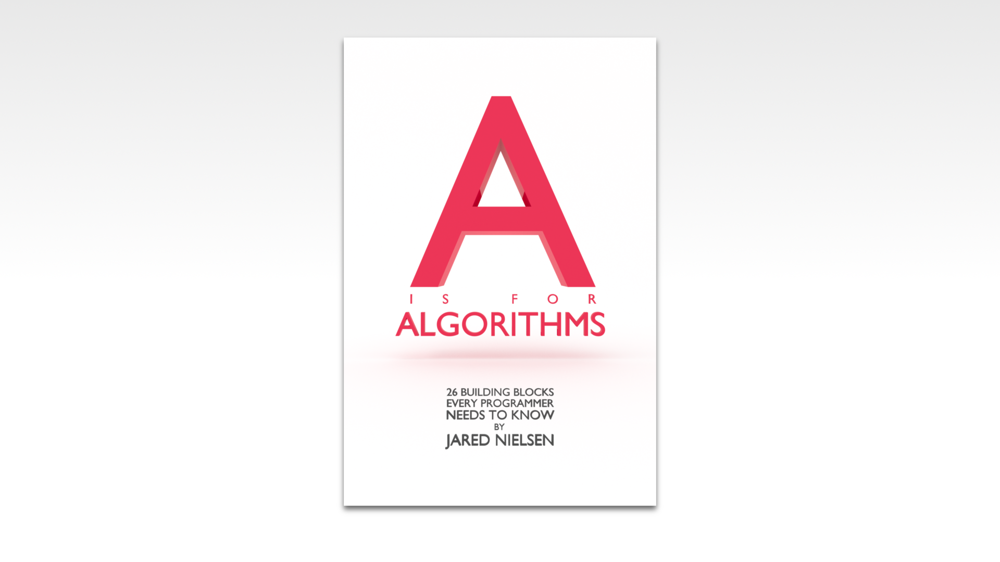

If you want to learn how to code, you need to learn algorithms. Learning algorithms improves your problem solving skills by revealing design patterns in programming. In this tutorial, you will learn how to code a swap algorithm in JavaScript. 

---


💯 Give yourself an A. Grab your copy of [A is for Algorithms](https://gum.co/algorithms)

---


## Retrieval Practice

* What is programming?

* What is pseudocode?

* What is Big O?


### What is Programming?

[Programming is problem solving](https://jarednielsen.com/programming-problem-solving/). There are four steps we need to take to solve any programming problem: 

1. Understand the problem

2. Make a plan

3. Execute the plan

4. Evaluate the plan


### What is Pseudocode?

Pseudocode is an approach to designing and solving algorithms using plain language rather than the syntax of a specific programming language. Writing pseudocode allows us to focus on the solution to the problem rather than the details of its implementation. If you're just joining us, you may want to start with [Learn How to Write Pseudocode by Solving the Classic Fizz Buzz Algorithm](https://jarednielsen.com/algorithm-pseudocode-fizzbuzz/).


### What is Big O? 

Big O is a notation for measuring the complexity of an algorithm. Big O notation mathematically describes the complexity of an algorithm in terms of time and space. We don’t measure the speed of an algorithm in seconds (or minutes!). We measure the rate of growth of an algorithm in the number of operations it takes to complete. If you're new to Big O, check out [The Superlative Guide to Big O](https://jarednielsen.com/big-o/).


## Let's Get Meta 

Programming and problem solving are both metacognitive activities. To excel, we want to improve our thinking about thinking. Ask yourself the following questions and keep them back of mind as you proceed:

* What is computational thinking?

* What problem(s) does a swap algorithm solve? 

* What is the Big O of swap?


## How to Code a Swap Algorithm in JavaScript 

How do you think like a programmer? 

If programming is problem solving, we need one or more heuristics specific to this domain. 

We’re in luck! 

There’s a set of methods used for defining and solving a problem in terms that a computer could also perform. It’s called, you’ll never guess… computational thinking. 
 
Computational thinking is a set of methods used for defining and solving a problem in terms that a computer could also perform.

There are four stages to computational thinking: 

* Decomposition

* Pattern recognition

* Abstraction

* Algorithm design

We'll look at each of these in depth as we proceed with our problem solving. The first step is to understand the problem. Our workflow will follow with outline: 

1. Understand the problem

2. Make a plan

    * Decompose the problem

    * Recognize patterns

    * Form abstractions

    * Design the algorithm

3. Execute the plan

4. Evaluate the plan


### Understand the Problem

To understand our problem, we first need to define it. Let’s reframe the problem as acceptance criteria:

> GIVEN two variables

> WHEN I perform a swap

> THEN the values are exchanged

That’s our general outline. We know our input conditions (two variables) and our output requirements (exchanged values between the variables), and our goal is to swap them.

Let’s make a plan!


### Make a Plan

As outlined above, this is where we implement our computational thinking heuristics, the first being decomposition.


#### Decomposition

If composing a function is the process of assembling the various components, such as variables, control flow, and conditions, then decomposition is the opposite: it’s breaking a problem down into smaller parts.

This is both the easiest and the hardest step in the process because sometimes the component parts of a problem are obvious, but other times the component parts are emergent, or intertwined, and it’s difficult to cleanly separate them.


Let's break this problem down and start by declaring two variables, `x`, and `y`. Each of these variables stores a value. We need values to swap, so let's just say...
```md
x = 123
y = 456
```

Our goal is to swap the value stored in `x`, 123, with the value stored in `y`, 456. When we are decomposing a problem, we want to break the problem down into the the smallest problem we can solve. So let's just focus on `x`. How do we move the value stored in `y` to the variable `x`?

Easy. 
```md
x = y
```

How would we pseudocde this? 
```md
SET x TO y
```

How do we move the value stored in `x` to `y`? Your initial thought might be to do something like this
```md
x = y
y = x
```

Our pseudocode would look like this...
```md
SET x TO y
SET y TO x
```

If we 'run' this algorithm, what's the result? 
```md
x = 456
y = 456
```

What's happening? 

Following our control flow, we are  _overwriting_ the value of `x` with the value stored in `y`, which is 456. When we then assign the value of `x` to `y`, we are simply reassigning the value of 456. 


#### Pattern Recognition

When we break a problem down into smaller pieces, we will often recognize patterns. Another way of saying this is that we generalize. We make a broad statement by inferring from specific cases. 


Let's take a look at our pseudocode again...
```md
SET x TO y
SET y TO x
```

What's the pattern? 

Variable assignment.

If only we could set the value of `x` aside, _temporarily_, while we performed our swap...


#### Abstraction

Once we recognize patterns, we can remove the details, or form abstractions, in order to focus on the relationships between concepts.


We're already working with abstractions using variables such as `x` and `y`, but we were thinking in terms of the specific value stored in those variables. In the _abstraction_ step of computational thinking, the value isn't important. Why doesn't the value matter? In this algorithm, we're more interested in _where_ the value is stored then _what_ the value is. 

Knowing that, we need to declare another variable that allows us to temporarily store one of the values we want to swap. Let's call it `temp`:

```md
SET temp TO x
SET x TO y
SET y TO temp
```


### Execute the Plan

Finally, we simply need to implement the design of our algorithm. Here, we translate our pseudode to JavaScript:
```js
let x = 123;
let y = 456;
let temp = x;
x = y;
y = temp;
```

If we run this algorithm and log the values stored in `x` and `y`, the results are: 
```sh
456
123
```


### Evaluate the Plan

If `temp` was a value you were planning to update again, you may want to declare it without value assignment or assign a value of 0 to initialize it as a number.

```js
let x = 123;
let y = 456;
let temp; //or let temp = 0
temp = x;
x = y;
y = temp;
```

You can omit the `temp` variable and get mathemagical: 
```js
x = 123;
y = 456;
x = x + y;
y = x - y;
x = x - y;
```

You can accomplish the same feat as above with multiplication and division: 
```js
x = 123;
y = 456;
x = x * y;
y = x / y;
x = x / y;
```

The downside to both of the approaches above is that they can only be used for numeric values. 

In Python, you can do a one-liner using parallel assignment: 
```py
x, y = y, x
```


## Reflection

* What is computational thinking? 

* What problem(s) does swap solve? 

* What is the Big O of swap?


### What is Computational Thinking? 

Computational thinking is a set of methods used for defining and solving a problem in terms that a computer could also perform.

There are four stages to computational thinking: 

* Decomposition

* Pattern recognition

* Abstraction

* Algorithm design


### What Problem(s) Does a Swap Algorithm Solve?

Beyond swapping the values stored in two variables, swap algorithms are used in sorting algorithms. 


### What is the Big O of Swap? 

O(1), or constant. 

Regardless of the size of the input, `n`, the swap algorithm only performs one operation.

If you want to learn more about linear time complexity, check out my article [Big O Linear Time Complexity](https://jarednielsen.com/big-o-linear-time-complexity/).


## How to Code the Decimal to Binary Algorithm in JavaScript

In this tutorial you learned how to swap variables. In the next tutorial, you'll learn how to convert decimals to binary. 


