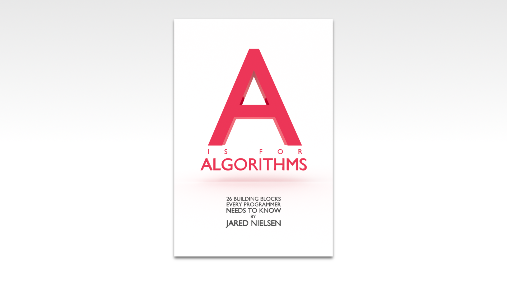

If you want to learn how to code, you need to learn algorithms. Learning algorithms improves your problem solving skills by revealing design patterns in programming. In this tutorial, you will learn how to code the Towers of Hanoi algorithm in JavaScript and Python. 

---


Give yourself an A. Grab your copy of [A is for Algorithms](https://gum.co/algorithms)

---


## Retrieval Practice

* How does the swap algorithm work?

* What is recursion?


### How Does the Swap Algorithm Work?

The classic swap algorithm uses a temporary variable to _stage_ one of the two values to be swapped while it makes a reassignment.

If you're just joining us, you will want to check out [How to Code the Swap Algorithm](https://jarednielsen.com/algorithm-swap/)


### What is Recursion?

To understand recursion, you must first understand recursion. 


## Let's Get Meta

* Why do I need to know this? 

* Why is it called the Towers of Hanoi? 


## How to Code the Towers of Hanoi Algorithm 

[Programming is problem solving](https://jarednielsen.com/programming-problem-solving/). There are four steps we need to take to solve any programming problem: 

1. Understand the problem

2. Make a plan

3. Execute the plan

4. Evaluate the plan


### Understand the Problem

To understand our problem, we first need to define it. Let’s reframe the problem as acceptance criteria:
```
GIVEN a stack of discs in increasing "size" and three towers
WHEN moving the discs from tower one to tower three, larger discs are never stacked on smaller discs
THEN I am returned all discs stacked in order on the third tower
```

That’s our general outline. We know our input conditions (three 'towers' and a range of 'discs') and our output requirements (the discs stacked largest to smallest on the third tower), and our goal is to move the discs from Tower 1 to Tower 3 without stacking larger discs on smaller discs at any step in the process.

Let’s make a plan!


### Make a Plan

Let’s revisit our computational thinking heuristics as they will aid and guide is in making a plan. They are: 

* Decomposition

* Pattern recognition

* Abstraction

* Algorithm design


#### Decomposition

Let's break the problem down. What's the smallest problem we can solve? One disc. We need to move it from Tower 1 to Tower 3. Easy peasy. In a table, this would look like:


| Move #| Tower 1   | Tower 2 | Tower 3  |
| ---   | ---       | ---     | ---      |
| 0     | 1         |         |          |
| 1     |           |         | 1        |


And in pseudocode, this would look like:
```
INPUT disc count

INIT tower 1 WITH discs EQUAL TO disc count
INTI tower 2
INIT tower 3

IF disc count IS EQUAL TO 1
    MOVE 1 disc FROM tower 1 TO tower 3
    RETURN tower 3
```

What if `disc count` is equal to 2?

We now need to use our second tower to _stage_ the first disc so we can move the second disc to the third tower. If we map this out in a table...

| Move #    | Tower 1 | Tower 2 | Tower 3  |
| ---       | ---     | ---     | ---      |
| 0         | 1, 2    |         |          |
| 1         | 2       | 1       |          |
| 2         |         | 1       | 2        |
| 3         |         |         | 1, 2     |


What if `disc count` is equal to 3?

| Move #    | Tower 1 | Tower 2 | Tower 3   |
| ---       | ---     | ---     | ---       |
| 0         | 1, 2, 3 |         |           |
| 1         | 2, 3    |         | 1         |
| 2         | 3       | 2       | 1         |
| 3         | 3       | 1, 2    |           |
| 4         |         | 1, 2    | 3         |
| 5         | 1       | 2       | 3         |
| 6         | 1       |         | 2, 3      |
| 7         |         |         | 1, 2, 3   |


We can see that as `disc count` increases, the moves required become more complex. Do we see a pattern emerging? 

Let's do one more...

What if `disc count` is equal to 4?

| Move #    | Tower 1       | Tower 2 | Tower 3      |
| ---       | ---           | ---     | ---          |
| 0         | 1, 2, 3, 4    |         |              |
| 1         | 2, 3, 4       | 1       |              |
| 2         | 3, 4          | 1       | 2            |
| 3         | 3, 4          |         | 1, 2         |
| 4         | 4             | 3       | 1, 2         |
| 5         | 1, 4          | 3       | 2            |
| 6         | 1, 4          | 2, 3    |              |
| 7         | 4             | 1, 2, 3 |              |
| 8         |               | 1, 2, 3 | 4            |
| 9         |               | 2, 3    | 1, 4         |
| 10        | 2             | 3       | 1, 4         |
| 11        | 1, 2          | 3       | 4            |
| 12        | 1, 2          |         | 3, 4         |
| 13        | 2             | 1       | 3, 4         |
| 14        |               | 1       | 2, 3, 4      |
| 15        |               |         | 1, 2, 3, 4   |


What's the pattern, or _patterns_ we see? 

Let's look at The Big Picture first: regardless of the size of `disc count`, the positions of discs required to move from Tower 1 to Tower 3 are mirrored and reversed, with Tower 2 being the pivot at the halfway point. Also note that the number of moves required doubles (approximately) as `disc count` increases. 

Second, if `disc count` is odd, 1 or 3 in the examples above, our first move is from Tower 1 to Tower 3. But, if `disc count` is even, 2 or 4 above, then our first move is from Tower 1 to Tower 2.  

Third, note that the _origin_ of the disc changes move-to-move, but not with _every_ move. For example, as we saw above, where `disc count` is equal to 4, the _origin_ is naturally Tower 1 and we move `1` and `2` to Towers 1 and 2, respectively. On the _next_ move, the _origin_ is Tower 2 as we move `1` to Tower 3. But, on the following move, the _origin_ is again Tower 1. And following that, it's Tower 3 for two moves! 

Where have we seen this or something like it before? 

Recursion!

We continually move discs off Tower 1 until we reach our base case, where `disc count` is less than or equal to 1 and then we return those discs to Tower 3. Now we just need to figure out all the steps in between ;). 

Let's start sketching this out in pseudocode...
```
INPUT disc count

INIT tower 1 WITH discs EQUAL TO disc count
INTI tower 2
INIT tower 3

FUNCTION move discs WITH disc count, tower 1, tower 2, tower 3 
    IF disc count IS EQUAL TO 1
        MOVE 1 disc FROM tower 1 TO tower 3
        RETURN tower 3

    CALL move discs WITH disc count MINUS 1, tower 1, tower 2, tower 3

    RETURN tower 3

CALL move discs WITH disc count, tower 1, tower 2, tower 3
```

Will this work? 

We want our recursive calls to find their way to our base case, so we subtract 1 from `disc count`. 

But what happens if we recursively call our `move discs` function? 

We'll move all discs from the first tower to the third tower, stacking them in reverse order. 

How do we make recursive calls to our `move discs` function _and_ move the discs to the third tower in order? 

We need to _stage_ discs on our second tower. 

How do we _stage_ discs on our second tower _and_ move them off it?

Is it a matter of moving the disc to the correct tower? Or moving the tower to the correct disc? 

This is starting to get abstract! So let's call if what it is...


#### Abstraction

With each move, there is an `origin` and a `goal`, and, by necessity, a `stage`. But, with each move, each of these "roles" is performed by a different tower. It might be useful to map this out in a table:

| Move #    | Tower 1 | Tower 2 | Tower 3  | `origin`     | `stage`     | `goal`      |
| ---       | ---     | ---     | ---      | ---          | ---         | ---         |
| 0         | 1, 2    |         |          |              |             |             |            
| 1         | 2       | 1       |          | Tower 1      |             | Tower 2     |
| 2         |         | 1       | 2        | Tower 1      | Tower 2     | Tower 3     |
| 3         |         |         | 1, 2     | Tower 2      |             | Tower 3     |


Our _origin_ is whichever tower we are moving from and our _goal_ is whichever tower we are moving to. These aren't necessarily towers one and three, respectively. With each move, nothing happens with the `stage` tower, it's simply holding the disc(s) from a previous move. 

Let's see what it looks like when `disc count` is equal to 3: 

| Move #    | Tower 1 | Tower 2 | Tower 3   | `origin`      | `stage`       | `goal`        |
| ---       | ---     | ---     | ---       | ---           | ---           | ---           |
| 0         | 1, 2, 3 |         |           |               |               |               |
| 1         | 2, 3    |         | 1         | Tower 1       |               | Tower 3       |
| 2         | 3       | 2       | 1         | Tower 1       | Tower 3       | Tower 2       |
| 3         | 3       | 1, 2    |           | Tower 3       | Tower 1       | Tower 2       |
| 4         |         | 1, 2    | 3         | Tower 1       | Tower 2       | Tower 3       |
| 5         | 1       | 2       | 3         | Tower 2       | Tower 3       | Tower 1       |
| 6         | 1       |         | 2, 3      | Tower 2       | Tower 1       | Tower 3       |
| 7         |         |         | 1, 2, 3   | Tower 1       |               | Tower 3       |


How do we translate this to pseudocode? 
```
INPUT disc count

INIT tower 1 WITH discs EQUAL TO disc count
INTI tower 2
INIT tower 3

FUNCTION move discs WITH disc count, origin, stage, goal PARAMETERS
    IF disc count IS EQUAL TO 1
        MOVE 1 disc FROM origin TO goal
        RETURN goal

    CALL move discs WITH disc count MINUS 1, origin, goal, stage

    MOVE 1 disc FROM origin TO goal

    CALL move discs WITH disc count MINUS 1, stage, origin, goal

    RETURN goal

CALL move discs WITH disc count, tower 1, tower 2, tower 3
```

What's happening here? 

We declare a `move discs` function with `disc count`, `origin`, `stage`, and `goal` parameters. When we calal `move discs`, we pass it `disc count`, `tower 1`, `tower 2`, and `tower 3` arguments. Within the `move discs` function is a conditional statement, which returns `goal` when `disc count` is equal to 1. Our `move discs` function then calls itself, but note two things: 

1. We subtract 1 from `disc count`

2. We _swap_ the position of the `goal` and `stage` paremeters.

This call to `move discs` will continue to call itself until the conditional is met, where it will return `goal`. On the next line, we move 1 disc from `origin` to `goal`. Our `move discs` function then calls itself _again_, and again note two thigns:

1. We subtract 1 from `disc count`. Standard practice with recursion.

2. This time, we _swap_ the position of `origin` and `stage`. 

This call to `move discs` will also continue to call itself untile the condition is met, at which point it will return `goal`. When our two recursive calls to `move discs` return and the condition is no longer met, then we return `goal` and exit our initial call to `move discs`. 


### Execute the Plan

Now it's simply a matter of translating our pseudocode into syntax.

#### How to Code the Towers of Hanoi Algorithm in JavaScript

Let's start with JavaScript:

```js
const towers = (discCount) => {

    const towerOne = [...Array(discCount + 1).keys()].slice(1)
    const towerTwo = [], towerThree = [];

    const moveDiscs = (discCount, origin, stage, goal) => {
        if (discCount === 1) {
            let disc = origin.shift();
            goal.unshift(disc);

            return goal;
        }

        moveDiscs(discCount - 1, origin, goal, stage);
        
        let disc = origin.shift();
        goal.unshift(disc);

        moveDiscs(discCount - 1, stage, origin, goal);

        return goal;
    }

    return moveDiscs(discCount, towerOne, towerTwo, towerThree);
}
```

TODO explain the JS


#### How to Code the Towers of Hanoi Algorithm in Python

Let's see it in Python:

```py
def towers(disc_count):
    tower_one = [i for i in range(1, disc_count + 1)]
    tower_two = []
    tower_three = []

    def move_discs(disc_count, origin, stage, goal):
        if (disc_count == 1):
            disc = origin.pop(0)
            goal.insert(0, disc)

            return goal

        move_discs(disc_count - 1, origin, goal, stage)

        disc = origin.pop(0)
        goal.insert(0, disc)

        move_discs(disc_count - 1, stage, origin, goal)

        return goal

    return move_discs(disc_count, tower_one, tower_two, tower_three)
```

TODO explain the Py


### Evaluate the Plan

TODO


#### What is the Big O of the Towers of Hanoi Algorithm? 

If you want to learn how to calculate time and space complexity, pick up your copy of [The Little Book of Big O](https://gum.co/big-o)


## Reflection

* Why do I need to know this? 

* Why is it called "The Towers of Hanoi"? 


### Why Do I Need to Know This? 

You don't! There's no practical application for this algorithm. It _is_ useful to know for two reasons: 

1. **Street Cred**: You can impress your friends with your knowledge of obscure algorithms _and_ there's always the (slim) chance you'll get asked to whiteboard it in an interview. 

2. **Practice Makes Practice**: While you will probably never write this algorithm again, it's an excellent exercise in computational thinking, highlighting each of the four stages: decomposition, pattern recognition, abstraction, and design Additionally, it demonstrates what a powerful tool recursion is. 


### Why is It Called "The Towers of Hanoi"?

The algorithm takes its name from its resemblance to a [pagoda](https://en.wikipedia.org/wiki/Pagoda). According to Wikipedia, the problem was first introduced to the West by [Edouard Lucas](https://en.wikipedia.org/wiki/%C3%89douard_Lucas), a French mathematician. He likely used "Hanoi" as the name due to France's colonization of Vietnam during his lifetime. 


## A is for Algorithms


Give yourself an A. Grab your copy of [A is for Algorithms](https://gum.co/algorithms)


