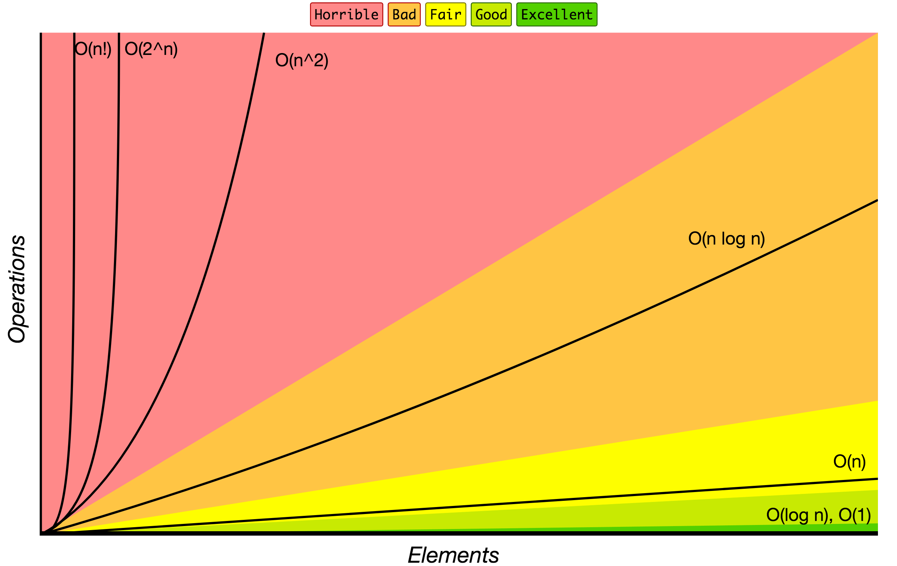

Is there a computer science topic more terrifying than Big O notation? Don’t let the name scare you, Big O notation is not a big deal. It’s very easy to understand and you don’t need to be a math whiz to do so. In this tutorial, you’ll learn the fundamentals of Big O factorial time complexity.

--- 


Be O(#1). Grab your copy of [The Little Book of Big O](https://gum.co/big-o).

---


## What Problem(s) Does Big O Notation Solve?

* Big O notation helps us answer the question, “Will it scale?”

* Big O notation equips us with a shared language for discussing performance with other developers (and mathematicians!).


## Quick Refresher

This is the last article in a series on Big O notation. If you’re just joining us, you may want to start at the beginning with [What is Big O Notation?](https://jarednielsen.com/big-o-notation/).


### What is Big O Notation? 

Big O notation is a system for measuring the rate of growth of an algorithm. Big O notation mathematically describes the complexity of an algorithm in terms of time and space. We don’t measure the _speed_ of an algorithm in seconds (or minutes!). Instead, we measure the number of operations it takes to complete. 

The O is short for “Order of”. So, if we’re discussing an algorithm with _O(n)_, we say its _order of_, or rate of growth, is _n_, or linear complexity. 


### How Does Big O Notation Work? 

Big O notation measures the _worst-case runtime_. 

Why?

Because we don’t know what we don’t know.

We need to know just how poorly our algorithm will perform so we can compare it to other solutions. 

The worst-case scenario is also known as the “upper bound”. 

Remember this table? 

| O             | Complexity        | Rate of growth      |
|---            |---                |---    |
| O(1)          | constant          | fast  |
| O(log n)      | logarithmic       |       |
| O(n)          | linear            |       |
| O(n * log n)  | log linear        |       |   
| O(n^2)        | quadratic         |       |
| O(n^3)        | cubic             |       |
| O(2^n)        | exponential       |       |
| O(n!)         | factorial         | slow  |

It lists common orders from fastest to slowest. 


## Big O Factorial Time Complexity

Here we are, at the end of our journey. 

And we saved the worst for last.

O(n!)

AKA factorial time complexity.

If Big O helps us identify the worst-case scenario for our algorithms, O(n!) is the worst of the worst. 

Why? 

Recall that a factorial is the product of the sequence of _n_ integers. 

For example, the factorial of 5, or _5!_, is:
```
5 * 4 * 3 * 2 * 1 = 120
```

We will find ourselves writing algorithms with factorial time complexity when calculating permutations and combinations.

If we look at our chart, we see that our rate of growth is nearly vertical. 



That’s great if we’re going to the Moon, but not if we are writing algorithms. 

🚀🌌🌙

Why would anyone ever write an algorithm with factorial time complexity? 

It’s not that we _want_ to write terrible algorithms. 

The problem is the problems. 

There are some problems for which there is no easy solution. 


## NP-Complete Problems

These are what are known as _NP-complete_ problems. 

NP-complete is a concept in complexity theory used to describe a category of problems for which there is no known correct _and_ fast solution.

In other words, the solution to an NP-complete problem can be quickly verified, but there is no known way to quickly find a solution. 

It’s important to distinguish between two types of _solution_. 

There’s the solution as _algorithm_, i.e: the function that we can apply to any input to solve this problem. 

And there’s the solution as _output_, i.e: the specific value we want our function to return.

With NP-complete problems, we can prove our solution, as algorithm, will work on a small input, but the time to find a specific solution, as output, grows rapidly as the input size increases.

Complexity theory is a big topic and deserves a series of its own, so we’ll leave it at that.

Let’s look at a few ‘real-world’ examples that may help illustrate this concept. 


### The Traveling Salesman

A classic example of NP-complete is the [Traveling Salesman Problem](https://en.wikipedia.org/wiki/Travelling_salesman_problem).

AKA TSP.

Say you’re a traveling salesperson and you need to visit _n_ cities. What is the shortest route that visits each and returns you to your start? 

To solve this, we need to calculate every possible route. 

Let’s start with 3 cities: Austin, Boston and Chicago

How many permutations are there? 
```
Austin > Boston > Chicago
Austin > Chicago > Boston
Boston > Austin > Chicago
Boston > Chicago > Austin
Chicago > Austin > Boston
Chicago > Boston > Austin
```

This is _3!_, which is six permutations.

Why? 

If we have three possible starting points, then for each starting point we have two possible routes to the final destination.

What if we need to visit 4 cities? Austin, Boston, Chicago, and Detroit.

How many permutations? 

That would be _4!_, which is 24 permutations.

Why? 

If we have four possible starting points, then for each starting point we have three possible routes, and for each of those points, we have two possible routes, and the final stop. So:
```
4 * 3 * 2 * 1
```

And five?

As we saw above, that's 120. 

What about 10? 

Uh oh.

(Or should I say, `Uh O`?)

That’s 3628800. 

That’s a big increase and a lot of computational processing.

We could easily write an algorithm to brute force a solution for small inputs, but it doesn’t take long before we cross a threshold requiring us to make millions (and more!) calculations. 


### The Knapsack Problem

The [Knapsack Problem](https://en.wikipedia.org/wiki/Knapsack_problem
) is another classic NP-complete problem. 

It’s a resource allocation problem in which we are trying to find an optimized combination under a set of constraints. 

Say you’ve got an inventory of flat panel TVs from multiple manufacturers and you need to fill a shipping container with them. Larger TVs are worth more, but they also take up more space. You want to pack as many TVs into the container as possible to maximize your profit. 

How do we solve this problem? 

The brute force approach is to calculate all possible combinations and select the “best” which takes us into the realm of factorial time complexity.

Lucky for us, there are several solutions using [dynamic programming](https://jarednielsen.com/dynamic-programming-memoization-tabulation/) that are more elegant and (slightly more) efficient.


### The Clique Problem

The [Clique Problem](https://en.wikipedia.org/wiki/Clique_problem) asks us to find all subsets of vertices in a graph. 

It might be easier to think of this as the “Social Network Problem” or “The One Degree of Kevin Bacon Problem”: given a network of individuals, how do you find the closest friends for each of them?


## How Do We Solve NP-Complete Problems? 

We know we can solve NP-complete problems. 

The problem is we don’t have time.

The solution is _heuristics_. 

In computer science, a [heuristic algorithm](https://en.wikipedia.org/wiki/Heuristic_(computer_science)) is an approach for finding an approximate, or ‘good enough’ solution. 

You are reading this book because you are a practitioner, not an academic. 

Academics get paid to create problems. 

We get paid to solve them. 

A parting quote, generally attributed to Sheryl Sandberg:

> Done is better than perfect. 

Just like this article. 


## Big O Factorial Time Complexity 

Big O notation is not a big deal. It’s very easy to understand and you don’t need to be a math whiz to do so. In this tutorial, you learned the fundamentals of Big O factorial time complexity. Now go solve problems! Just don't waste your time on the hard ones. 

