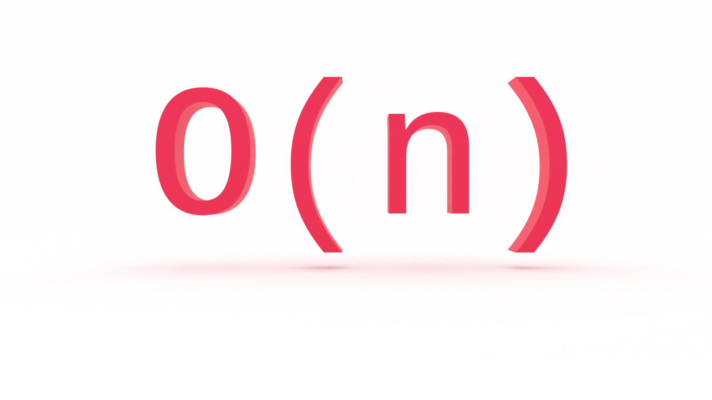
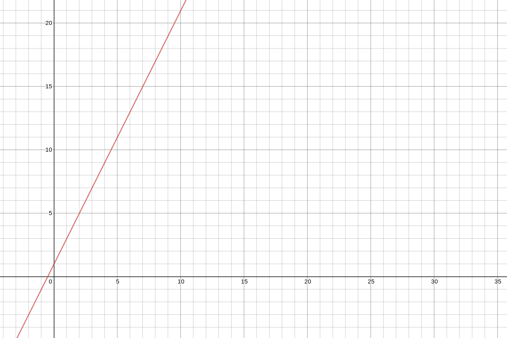
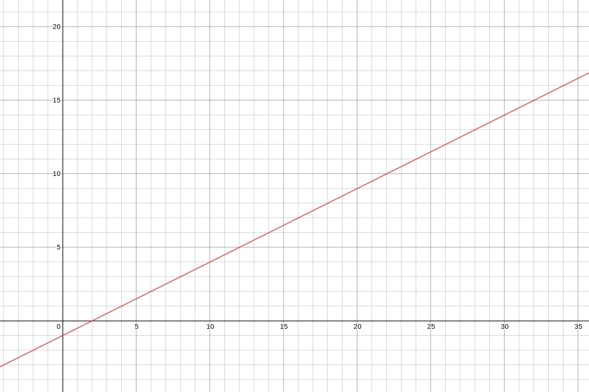
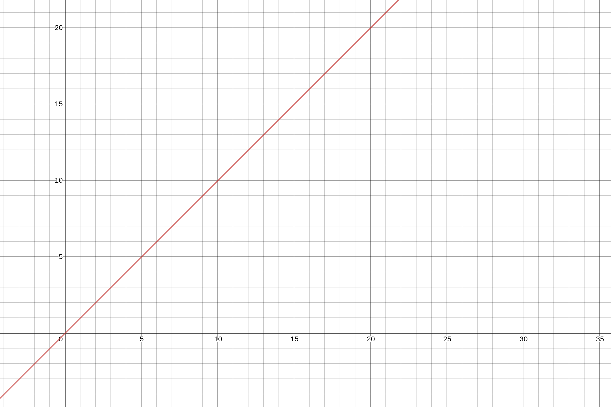
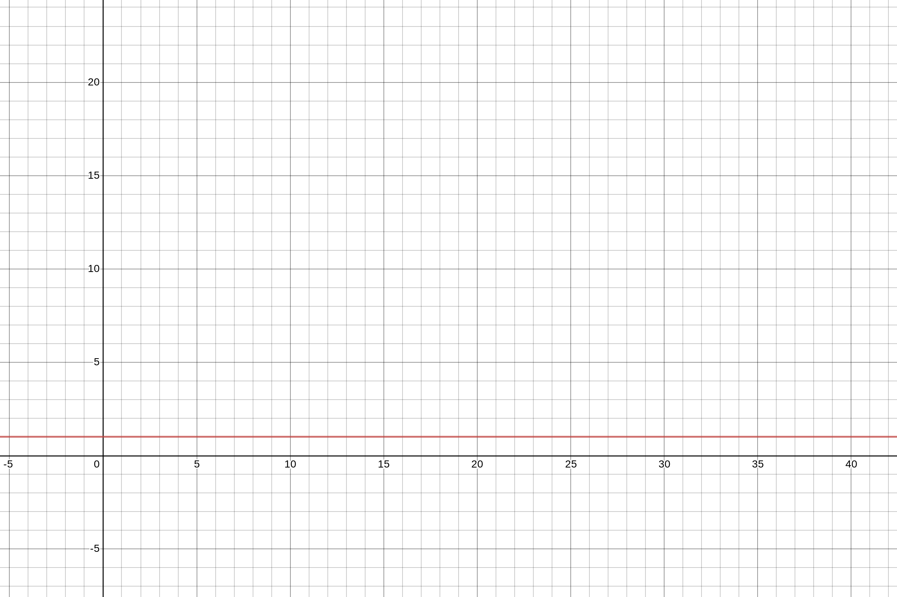

Is there a computer science topic more terrifying than Big O notation? Don’t let the name scare you, Big O notation is not a big deal. It’s very easy to understand and you don’t need to be a math whiz to do so. In this tutorial, you'll learn the fundamentals of Big O notation linear time complexity with examples in JavaScript.

---
This is the first in a series on Big O notation. If you want to stay in the loop, [sign up for my weekly newsletter, The Solution](http://eepurl.com/cP8CMn).

---

## What Problem(s) Does Big O Notation Solve?

* Big O notation helps us answer the question, “Will it scale?” 

* Big O notation equips us with a shared language for discussing performance with other developers (and mathematicians!).


## Quick Refreshers

If you're just joining us, you will want to start with the first article in this series, [What is Big O Notation?](https://jarednielsen.com/big-o-notation/)

### What is Big O Notation? 

Big O notation is a system for measuring the rate of growth of an algorithm. Big O notation mathematically describes the complexity of an algorithm in terms of time and space. We don’t measure the _speed_ of an algorithm in seconds (or minutes!). Instead, we measure the number of operations it takes to complete. 

The O is short for “Order of”. So, if we’re discussing an algorithm with _O(n)_, we say its _order of_, or rate of growth, is _n_, or linear complexity. 


### How Does Big O Notation Work? 

Big O notation measures the _worst-case runtime_. 

Why?

Because we don’t know what we don’t know.

So we need to know just how poorly our algorithm will perform so we can plan accordingly. 

The worst-case scenario is also known as the “upper bound”. 

Remember this table? 

| O             | Rate of growth    |       |
|---            |---                |---    |
| O(1)          | constant          | fast  |
| O(log n)      | logarithmic       |       |
| O(n)          | linear            |       |
| O(n * log n)  | log linear        |       |   
| O(n^2)        | quadratic         |       |
| O(n^3)        | cubic             |       |
| O(2^n)        | exponential       |       |
| O(n!)         | factorial         | slow  |

It lists common orders, or rates of growth, from fastest to slowest. 

We learned O(1), or constant time complexity, in [What is Big O Notation?](https://jarednielsen.com/big-o-notation/). We're going to skip O(log n) for the time being. It will be easier to understand after learning O(n), linear time complexity, and O(n^2), quadratic time complexity. 

Before getting into O(n), let’s begin with a quick refreshser on O(1), constant time complexity.

### O(1): Constant Time Complexity 

Constant time compelxity, or O(1), is just that: constant. Regardless of the size of the input, the algorithm will always perform the same number of operations to return an output.

Here’s an example we used in the previous tutorial: 

```js
const isEven = num => num % 2 === 0;
```

Our algorithm checks whether or not a number is even or odd and will return true or false accordingly. It only needs to perform one operation regardless of the size of the number. 

Say you’re working with an API that returns a users full name in an array, like so: 

```js
[“Jared”, “Nielsen”];
```

Your task is to get the users first name. Easy, in JavaScript:

```js
const getFirstName = data => data[0];
```

No matter how many times you run your ‘algorithm’, it only needs to perform one operation to return the desired value. That’s O(1), or constant time.

One more example: 

```js
const grader = score => {
   if (score < 60) {
       return "Fail!";
   } else if (num > 60) {
       return "Pass!";
   } else {
       return "Living on the edge?";
   };
}
```

What is our _best-case scenario_ for this algorithm? 

If `score` is less than 60, we will only perform one operation and return. 

That would be O(1). 

What if `score` is greater than or equal to 60? 

It's still O(1).

Why? 

Even though we check multiple conditions before returning, the rate of growth is _constant_. We know the _upper bound_, or worst-case scenario, in advance, and we know it will not change. 


## O(n): Linear Time Complexity

If O(1) performs the same number of computations regardless of the size of the input, what is O(n)?

The heading above gives it away. 

This is linear time complexity. 

Why? 

For _n_ inputs, our algorithm _might_ perform _n_ operations.

It might also perform _fewer_ than _n_ operations, but we don't know what we don't know so we calculate its upper bound, or worst-case scenario.

How does O(1) differ from O(n)? 


### Math O'Clock 🧮 🕝 

Remember [linear equations](https://en.wikipedia.org/wiki/Linear_equation) from algebra? 

```
y = mx + b
```

This is the slope intercept form, where _m_ is the [slope](https://en.wikipedia.org/wiki/Slope), or direction and steepness of the line, and _b_ is the [y-intercept](https://en.wikipedia.org/wiki/Y-intercept), or the point at which the line crosses the vertical axis. In this example, _x_ is the variable, unknown value that we want to 'solve for' (the 'solution' being _y_) and _m_ and _b_ are [coefficients](https://en.wikipedia.org/wiki/Coefficient), or parameters, that will influence _x_.

Let's plug in some values.

```
y = 2x + 1
```

If we chart this, the result will be: 


If we change our coefficients: 

```
y = 1/2x - 1
```

And chart the equation:  



What if we drop our coefficients entirely and simply chart _x_?



Still a straight line. 

What if we charted `1`?



Also a straight line.

But!

Because the value is _constant_, not variable, our line does not represent a rate of change, or growth, over time. It's horizontal. It would be constant whether we charted 1, 10 or 1,000,000.

Speaking of time, math o'clock is over. Back to Big O.

_Charts made with [Desmos](https://www.desmos.com/calculator)_


## Drop the Constant Terms

Now forget everything you just saw. The only chart you need to think about is this [ubiquitous cheatsheet](https://www.bigocheatsheet.com) that you are going to see everywhere: 


We want to think about our algorithms in the abstract, which means we need to drop the constant terms. They don’t provide any meaningful additional information. As we saw above, whether we chart `2n + 1` or just `n`, we still get a straight line. That’s what we really want to know. Multiplying by a constant value, in this example, `2`, influences the rate of growth of our algorithm by a constant amount. With or without it, the function is still a linear equation. 

We're not interested in the details. 

We're interested in the rate of growth so we can determine whether or not our algorithm is a sufficient solution for our problem or if we need to find a more efficient alternative.


## Big O & Worst-Case Scenario

What if our algorithm, say a search function, returns its parameter after one operation? Would that be O(1)?

No. It’s still O(n). 

Why? 

Remember, with Big O, we measure the _worst case scenario_. Because we don’t know what we don’t know, our default assumption for any algorithm is its upper bound. In a worst case scenario, an O(n) algorithm needs to perform its specified operation on every value in the input. When making our Big O calculation, we want to know just how poorly an algorithm is going to perform. 

Say, for example, we have an array of animals: 

```js
const animals = [“ocelot”, “octopus”, “opossum”, “orangutan”, “orca”, “oriole”, “oryx”, “osprey”];
```

And let’s say our task is to find the location of a specific animal in the array based on user input:

```js
for (let i = 0; i < animals.length; i++) {
    if (animals[i] === userInput) {
        return `Found ${userInput} at ${i}`;
    };
};
```

If our user searches for “ocelot”, how many operations are performed? 

One. It’s the first item in our array, so our program will return after one operation. 

That _specific_ operation would be O(1).

But, if our user searches for “osprey”, how many operations are performed? 

Eight. That’s our upper bound and worst case scenario. For eight inputs, our algorithm will perform eight operations.

What if our array contained 100 animals? 

The worst-case scenario would be 100 operations. 

What about 1,000?

10,000?

100,000?

1,000,000?

All O(n).

You can see how linear complexity is fine for small datasets, but becomes a consideration when the size of the input increases. 


## Trick Questions

### Big O & Conditional Statements 

What's the order of this function? 

```js
const lowerList = arr => {
    if (arr.length === 0) {
        return "Nothing to be done";
    } else {
        return arr.map(i => i.toLowerCase());
    }
}
```

If our condition is met, it will perform one operation, so it's constant, or O(1).

If our condition is not met, then we map our array and return it. The length of that array is unknown, but for every element in the array, we perform an operation, so it's linear, or O(n).

That means our function is either O(1) or O(n). 

Which of these is the worst-case scenario, or upper bound? 

_n_


### Big O & Successive Iterations

What if our algorithm performed multiple, successive iterations? 

```js
const forwardBack = (num) => {

  for(let i = 0; i <= num; i+= 1){
      console.log(i);
  }

  for(let i = num; i >= 0; i-= 1){
      console.log(i);
  }
}
```

What is the order of this?

It's still O(n).

Were you tempted to calculate it as O(2n)? Because O(n) + O(n) = O(2n)?

📝 Remember: drop the constants. We only want to know the _order of_ our function, which in this case is linear.

But what if our algorithm uses nested iterations?

We'll find out in the next tutorial.


## Big O Linear Time Complexity in JavaScript

Does O(n) scale? 

We can do better _and_ worse. 

In this tutorial, you learned the fundamentals of Big O linear time complexity with examples in JavaScript. Stay tuned for part three of this series on Big O notation where we'll look at O(n^2), or quadratic time complexity.

 _Big O thanks to [Rob Conery](https://twitter.com/robconery)_
