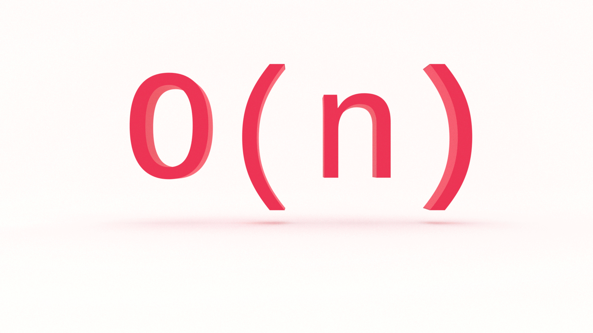

Is there a computer science topic more terrifying than Big O notation? Don’t let the name scare you, Big O notation is not a big deal. It’s very easy to understand and you don’t need to be a math whiz to do so. In this tutorial, you'll learn the fundamentals of Big O notation linear time complexity with examples in JavaScript.


---

--- 


Be O(#1). Grab your copy of [The Little Book of Big O](https://gum.co/big-o).

---

---

## Retrieval Practice

Retrieval practice is the surest way to solidify any new learning. Attempt to answer the following questions before proceeding: 

* What is Big O notation?

* How does Big O notation work? 

* What is O(1), or constant time complexity? 

This is the second in a series on Big O notation. If you're just joining us, you will want to start with the first article in this series, [What is Big O Notation?](https://jarednielsen.com/big-o-notation/)


### What is Big O Notation? 

Big O notation is a system for measuring the rate of growth of an algorithm. Big O notation equips us with a shared language for discussing performance with other developers (and mathematicians!). Big O notation mathematically describes the complexity of an algorithm in terms of time and space. 

The O is short for “Order of”. So, if we’re discussing an algorithm with _O(n)_, we say its _order of_, or rate of growth, is _n_, or linear complexity.


### What Problem(s) Does Big O Notation Solve?

Big O notation helps us answer the question, "Can we do better?” 

How?

Big O notation measures the _upper bound_, or _worst-case scenario_. 

Why?

Because we don’t know what we don’t know.

We want to know just how poorly our algorithm will perform so we can compare it to other solutions. 

Remember this table? 

| O             | Complexity        | Rate of growth      |
|---            |---                |---    |
| O(1)          | constant          | fast  |
| O(log n)      | logarithmic       |       |
| O(n)          | linear            |       |
| O(n * log n)  | log linear        |       |   
| O(n^2)        | quadratic         |       |
| O(n^3)        | cubic             |       |
| O(2^n)        | exponential       |       |
| O(n!)         | factorial         | slow  |

It lists common orders from fastest to slowest. 

As you can see, we are not proceeding in _linear_ fashion. We learned O(1), or constant time complexity, in [What is Big O Notation?](https://jarednielsen.com/big-o-notation/). We're going to skip O(log n) for the time being. It will be easier to understand after learning O(n), linear time complexity, and O(n^2), quadratic time complexity. 

Before getting into O(n), let’s begin with a quick refreshser on O(1), constant time complexity.


### O(1): Constant Time Complexity 

Constant time compelxity, or O(1), is just that: constant. Regardless of the size of the input, the algorithm will always perform the same number of operations to return an output.

Here’s an example we used in the previous tutorial: 

```js
const isEven = num => num % 2 === 0;
```

Our algorithm checks whether or not a number is even or odd and will return true or false accordingly. It only needs to perform one operation regardless of the size of the number. 

Say you’re working with an API that returns a users full name in an array, like so: 

```js
[“Jared”, “Nielsen”];
```

Your task is to get the users first name. Easy, in JavaScript:

```js
const getFirstName = data => data[0];
```

No matter how many times you run your ‘algorithm’, it only needs to perform one operation to return the desired value. That’s O(1), or constant time.

One more example: 

```js
const grader = score => {
   if (score < 60) {
       return "Fail!";
   } else if (score > 60) {
       return "Pass!";
   } else {
       return "Living on the edge!";
   };
}
```

What is our _best-case scenario_ for this algorithm? 

If `score` is less than 60, we will only perform one operation and return. 

That would be O(1). 

What if `score` is greater than or equal to 60? 

It's still O(1).

Why? 

Even though we check multiple conditions before returning, the rate of growth is _constant_. We know the _upper bound_, or worst-case scenario, in advance, and we know it will not change. 


## Let's Get Meta 🧠

* What do we mean by _linear time complexity_?

* What is a _constant term_ and why do we drop it?

* What is amortized analysis?


## O(n): Linear Time Complexity

If O(1) performs the same number of operations regardless of the size of the input, what is O(n)?

The heading above gives it away. 

Why linear time complexity? 

The rate of growth scales in direct proportion to the input.

For _n_ inputs, our algorithm _might_ perform _n_ operations.

It might also perform _fewer_ than _n_ operations, but we don't know what we don't know so we calculate its upper bound, or worst-case scenario.

How does O(1) differ from O(n)? 


### Math O'Clock 🧮 🕝 

Remember [linear equations](https://en.wikipedia.org/wiki/Linear_equation) from algebra? 

```
y = mx + b
```

This is the slope intercept form, where _m_ is the [slope](https://en.wikipedia.org/wiki/Slope), or direction and steepness of the line, and _b_ is the [y-intercept](https://en.wikipedia.org/wiki/Y-intercept), or the point at which the line crosses the vertical axis. In this example, _x_ is the variable, unknown value that we want to 'solve for' (the 'solution' being _y_) and _m_ and _b_ are [coefficients](https://en.wikipedia.org/wiki/Coefficient), or parameters, that will influence _x_.

Let's plug in some values.

```
y = 2x + 1
```

If we chart this, the result will be: 


If we change our coefficients: 

```
y = 1/2x - 1
```

And chart the equation:  


What if we drop our coefficients entirely and simply chart _x_?


Still a straight line. 

What if we charted `1`?


Also a straight line.

But!

Because the value is _constant_, not variable, our line does not represent a rate of change, or growth, over time. It's horizontal. It would be constant whether we charted 1, 10 or 1,000,000.

Speaking of time, math o'clock is over. Back to Big O.


## Big O & Constant Terms

Now forget everything you just saw. 

The only chart you need to think about is this one: 


We want to think about our algorithms in the abstract, not in terms of a specific implementation. 

Why? 

We want to know the _order of_ a function so we can determine whether or not our algorithm is a sufficient solution for our problem or if we need to find a more efficient alternative.

We're not interested in the details. So we drop the constant terms. They don’t provide any meaningful additional information. As we saw above, whether we chart `2n + 1` or just `n`, we still get a linear rate of growth. 


## Big O & Upper Bound

What if our algorithm, say a search function, returns its parameter after one operation? Would that be O(1)?

No. It’s still O(n). 

Why? 

Remember, with Big O, we measure the _worst case scenario_. Because we don’t know what we don’t know, our assumption for any algorithm is its upper bound. In a worst case scenario, an O(n) algorithm needs to perform its specified operations on every value in the input. When making our time complexity calculation, we want to know just how poorly an algorithm is going to perform. 

Say, for example, we have an array of animals: 

```js
const animals = [“ocelot”, “octopus”, “opossum”, “orangutan”, “orca”, “oriole”, “oryx”, “osprey”];
```

And let’s say our task is to find the location of a specific animal in the array based on user input:

```js
for (let i = 0; i < animals.length; i++) {
    if (animals[i] === userInput) {
        return `Found ${userInput} at ${i}`;
    };
};
```

If our user searches for “ocelot”, how many operations are performed? 

One. It’s the first item in our array, so our program will return after one operation. 

That _specific_ operation would be O(1).

But, if our user searches for “osprey”, how many operations are performed? 

Eight. That’s our upper bound and worst case scenario. For eight inputs, our algorithm will perform eight operations.

What if our array contained 100 animals? 

The worst-case scenario would be 100 operations. 

What about 1,000?

10,000?

100,000?

1,000,000?

All O(n).

You can see how linear complexity is fine for small inputs, but becomes a consideration when the size of the input increases. 

If we want to know the _lower bound_, or the _tight bound_, we use two different notations: Big Omega, or Ω, and Big Theta, or Θ. We'll look at them later, in [What's the Difference Between Big O, Big Omega, and Big Theta?](https://jarednielsen.com/big-o-omega-theta/).


## `pop()` Quiz

Here are two 'trick questions' to test your knowledge of linear time complexity.

### Big O & Conditional Statements 

What's the order of this function? 

```js
const lowerList = arr => {
    if (arr.length === 0) {
        return 'Nothing to be done';
    } else {
        return arr.map(i => i.toLowerCase());
    }
}
```

If our condition is met, it will perform one operation, so it's constant, or O(1).

If our condition is not met, then we map our array and return it. The length of that array is unknown, but for every element in the array, we perform an operation, so it's linear, or O(n).

That means our function is either O(1) or O(n). 

Which of these is the worst-case scenario, or upper bound? 

_n_

We _could_ calculate it as O(1) + O(n).

But what is 1? 

A constant. So we drop it.


### Big O & Successive Iterations

What if our algorithm performed multiple, successive iterations? 

```js
const forwardBack = (num) => {

  for(let i = 0; i <= num; i+= 1){
      console.log(i);
  }

  for(let i = num; i >= 0; i-= 1){
      console.log(i);
  }
}
```

What is the order of this?

It's still O(n).

Were you tempted to calculate it as O(2n)? Because O(n) + O(n) = O(2n)?

What is 2? 

A constant. So we drop it.

We only want to know the _order of_ our function.

But what if our algorithm uses nested iterations?

We'll find out in the next tutorial.


## Big O Linear Time Complexity in JavaScript

Does O(n) scale? 

We can do better _and_ worse. 

In this tutorial, you learned the fundamentals of Big O linear time complexity with examples in JavaScript. Stay tuned for part three of this series where we'll look at O(n^2), [Big O Quadratic Time Complexity](https://jarednielsen.com/big-o-quadratic-time-complexity/).

If you want to increase _your_ rate of growth, get a copy of [The Little Book of Big O](https://gum.co/big-o).


 _Big O thanks to [Rob Conery](https://twitter.com/robconery)_
