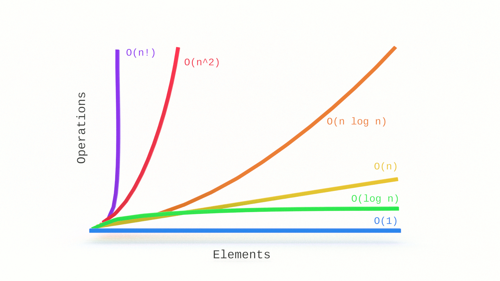

@TODO introduction

In this tutorial, you'll learn the fundamentals of Big O notation linear time complexity with examples in JavaScript.

If you're just joining us, you will want to start with the first article in this series, [What is Big O Notation?](https://jarednielsen.com/big-o-notation/)

_Note: Amazon links are affiliate._

---
This is the first in a series on Big O notation. If you want to stay in the loop, [sign up for my weekly newsletter, The Solution](http://eepurl.com/cP8CMn).

---

## What Problem(s) Does Big O Notation Solve?

* Big O notation helps us answer the question, “Will it scale?” 

* Big O notation equips us with a shared language for discussing performance with other developers (and mathematicians!).


## Quick Refreshers


### What is Big O Notation? 

Big O is a notation for measuring the performance of an algorithm. Big O notation mathematically describes the complexity of an algorithm in terms of time and space. We don’t measure the _speed_ of an algorithm in seconds (or minutes!). We measure the _rate of growth_ of an algorithm in the number of operations it takes to complete. 

The O is short for “Order of magnitude”. So, if we’re discussing an algorithm with _O(n)_, we say its order of magnitude, or rate of growth, is _n_, or linear complexity. 


### How Does Big O Notation Work? 

Big O notation measures the _worst-case runtime_. 

Why?

Because we don’t know what we don’t know.

If we’re writing a search algorithm, we won’t always know the query ahead of time. If we’re writing a sorting algorithm, we won’t always know the dataset ahead of time. We want to know just how poorly our algorithm will perform.

The worst-case scenario is also known as the “upper bound”. 

Remember this table? 

| O             | Run time          |       |
|---            |---                |---    |
| O(1)          | constant          | fast  |
| O(log n)      | logarithmic       |       |
| O(n)          | linear            |       |
| O(n * log n)  | log linear        |       |   
| O(n^2)        | quadratic         |       |
| O(n^3)        | cubic             |       |
| O(2^n)        | exponential       |       |
| O(n!)         | factorial         | slow  |

It lists common runtimes from fastest to slowest. 

We learned O(1) in [What is Big O Notation?](https://jarednielsen.com/big-o-notation/). We're going to skip O(log n) for the time being. It will be easier to understand after learning O(n), linear time complexity, and O(n^2), quadratic time complexity. 

Before getting into O(n), let’s begin with a quick refreshser on O(1), constant time complexity.

## O(1): Constant Time Complexity 


## O(n): Linear Time Complexity

If O(1) performs only one computation regardless of the size of the input, what is O(n)?

For _n_ inputs, our algorithm will perform _n_ outputs. This is linear time complexity. 

Why? 

If we were to chart this on a graph, what would it look like? 

It would be a straight line.

Remember this chart?


Notice that O(n) is a straight line. 

What if we calculated our operations for this algorithm and it was actually something like: 

```
2n + 5
```

That’s still just O(n). 

With Big O, we drop the constants and the non-dominant terms. They don’t provide any meaningful additional information. O(n) and O(2n +5) are both linear. If you charted `2n + 5`, it would still be a straight line. That’s what we really want to know. 

But what if our algorithm, say a search function, returns its parameter after one operation? Would that be O(1)? 

No. It’s still O(n). 

Why? 

Remember, with Big O, we measure the _worst case scenario_. Because we don’t know what we don’t know, our default assumption for any algorithm is its worst-case scenario. In a worst case scenario, an O(n) algorithm needs to perform its specified operation on every value in the input. When making our Big O calculation, we want to know just how poorly an algorithm is going to perform. 

Say, for example, we have an array of animals: 

```js
const animals = [“ocelot”, “octopus”, “opossum”, “orangutan”, “orca”, “oriole”, “oryx”, “osprey”];
```

And let’s say our task is to find the location of a specific animal in the array based on user input:

```js
for (let i = 0; i < animals.length; i++) {
    if (animals[i] === userInput) {
        return `Found ${userInput} at ${i}`;
    };
};
```

If our user searches for “ocelot”, how many computations are performed? 

One. It’s the first item in our array, so our program will return. 

But, if our user searches for “osprey”, how many computations are performed? 

Eight. That’s our worst case scenario. For eight inputs, our algorithm will perform eight operations.

What if our array contained 100 animals? 

The worst-case scenario would be 100 operations. 

What about 1,000?

10,000?

100,000?

1,000,000?

All O(n).

You can see how linear complexity is fine for small datasets, but becomes a concern when the size of the input increases. 

Does O(n) scale? 

We can do better _and_ worse. 


## What is Big O Notation? Linear & Constant Time Complexity in JavaScript

Big O notation is not a big deal. It’s very easy to understand and you don’t need to be a math whiz to do so. In this tutorial, you learned the fundamentals of Big O linear time complexity with examples in JavaScript.

Stay tuned for part three of this series on Big O notation where we'll look at O(n^2), or quadratic time complexity.
