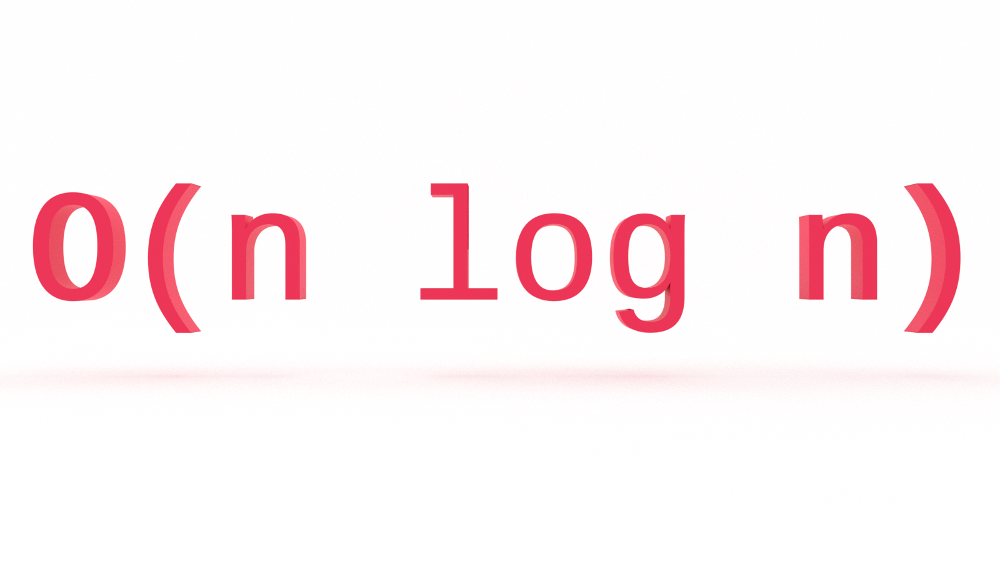

Is there a computer science topic more terrifying than Big O notation? Don’t let the name scare you, Big O notation is not a big deal. It’s very easy to understand and you don’t need to be a math whiz to do so. In this tutorial, you’ll learn the fundamentals of Big O notation log-linear, or quasilinear, time complexity with examples in JavaScript.

---
This is the fifth in a series on Big O notation. If you want to stay in the loop, [sign up for my weekly newsletter, The Solution](http://eepurl.com/cP8CMn).

---


## What Problem(s) Does Big O Solve?

* Big O notation helps us answer the question, “Will it scale?”
* Big O notation equips us with a shared language for discussing performance with other developers (and mathematicians!).


## Quick Refresher

If you’re just joining us, you will want to start with that article, [What is Big O Notation?](https://jarednielsen.com/big-o-notation/)

### What is Big O? 

Big O notation is a system for measuring the rate of growth of an algorithm. Big O notation mathematically describes the complexity of an algorithm in terms of time and space. We don’t measure the speed of an algorithm in seconds (or minutes!). Instead, we measure the number of operations it takes to complete.

The O is short for “Order of”. So, if we’re discussing an algorithm with O(n^2), we say its order of, or rate of growth, is n^2, or quadratic complexity.

### How Does Big O Work? 

Big O notation measures the _worst-case scenario_.

Why?

Because we don’t know what we don’t know.

We need to know just how poorly our algorithm will perform so we can evaluate other solutions.

The worst-case scenario is also known as the “upper bound”. When we say "upper bound", we mean the maximum number of operations performed by an algorithm.

Remember this table?

| O             | Complexity    | Rate of growth    |
|---            | ---           | ---   |
| O(1)          | constant      | fast  |
| O(log n)      | logarithmic   |       |
| O(n)          | linear time   |       |
| O(n * log n)  | log linear    |       |
| O(n^2)        | quadratic     |       |
| O(n^3)        | cubic         |       |
| O(2^n)        | exponential   |       |
| O(n!)         | factorial     | slow  |

It lists common orders by rate of growth, from fastest to slowest.

Before getting into O(n log n), let’s begin with a review of O(n), O(n^2) and O(log n).


### O(n)

An example of linear time complexity is a simple search in which every element in an array is checked against the query.

```js
const animals = [“ocelot”, “octopus”, “opossum”, “orangutan”, “orca”, “oriole”, “oryx”, “osprey”];

for (let i = 0; i < animals.length; i++) {
    if (animals[i] === userInput) {
        return `Found ${userInput} at ${i}`;
    };
};
```

If you want to go deeper, check out [Big O Linear Time Complexity](https://jarednielsen.com/big-o-linear-time-complexity/).


### O(n^2)

A classic example of O(n^2) is [Bubble Sort](https://en.wikipedia.org/wiki/Bubble_sort).

```js
const bubbleSort = (arr) => {
    for (let i = 0; i < arr.length; i++) {
        for (let j = 0; j < arr.length; j++) {
            if (arr[j] > arr[j + 1]) {
                let tmp = arr[j];
                arr[j] = arr[j + 1];
                arr[j + 1] = tmp;
            }
        }
    }
    return arr;
};
```

Why is the order of `bubbleSort()` O(n^2)?

🔑 Nested loops iterating the same input.

We could also write this with a `while` loop:

```js
const bubbleSort = arr => {
  
  let swapped = true;
  
  while (swapped) {
    swapped = false;
    
    for (let i = 0; i < arr.length; i++) {
      if (arr[i] > arr[i + 1]) {
        let temp = arr[i];
        arr[i] = arr[i + 1];
        arr[i + 1] = temp;
        swapped = true;
      }
    }
  }
  return arr;
}
```

Either way, it still uses nested iteration, so it's O(n^2).

If you want to go deeer, check out [Big O Quadratic Time Complexity](https://jarednielsen.com/big-o-quadratic-time-complexity/).


### O(log n)

Binary Search is a classic example of logarithmic time complexity. 

```js
const binarySearch = (arr, num) => {
 
   let startIndex = 0;
   let endIndex = (arr.length)-1;
  
   while (startIndex <= endIndex){
      
       let pivot = Math.floor((startIndex + endIndex)/2);
 
       if (arr[pivot] === num){
            return `Found ${num} at ${pivot}`;
       } else if (arr[pivot] < num){
           startIndex = pivot + 1;
       } else {
           endIndex = pivot - 1;
       }
   }
   return false;
}
```

🔑 With each iteration, our function is dividing the input, thus performing the inverse operation of exponentiation. 

If you want to go deeper, check out [Big O Logarithmic Time Complexity](https://jarednielsen.com/big-o-logarithmic-time-complexity/), we learned... 


## O(n log n): Log-Linear Time Complexity

So what is O(n log n)? 

Well, it's just that. It's _n_, a linear time complexity, multiplied by _log n_, a logarithmic time complexity. 

☝️ 

"Hold up there, mister", I hear you say.

"You said we drop the non-dominant terms, so what's with this _n * log n_ business?"

While it _is_ true that we drop the non-dominant terms in Big O, which would you say is the dominant term? _n_ or _log n_?  

Remember this trick question?

```js
const matcher = (arr1, arr2) => {
   for (let i = 0; i < arr1.length; i++){
       for (let j = 0; j < arr2.length; j++){
           if (arr1[i] === arr2[j]){
               return `Match found at arr1[${i}] and arr2[${j}]`;
           }
       }
   }
   return 'No matches found 😞'; 
}
```

What's the order of `matcher()`?

If the arrays were the same length, it _would be_ O(n^2).

Because we don't know what we don't know, it's O(n * m).

O(n log n) gives us a means of notating the rate of growth of an algorithm that performs better than O(n^2) but not as well as O(n). 


## Calculating O(n log n): Merge Sort 

Let's look at an example. O(n log n) is common (and desireable) in sorting algorithms. As we saw with Bubble Sort above, we can easily brute force a sort using nested iteration, but that approach doesn't scale. 

Here's an implementation of [Merge Sort](https://en.wikipedia.org/wiki/Merge_sort). 

```js
const nums = [128, 0, 64, 16, 4, 8, 2];

const merge = (left, right) => {
  
    let result = [];
  
    while(left.length || right.length) {

        if(left.length && right.length) {
            if(left[0] < right[0]) {
                result.push(left.shift())
            } else {
                result.push(right.shift())
            }
        } else if(left.length) {
            result.push(left.shift())
        } else {
            result.push(right.shift())
        }
    }
    return result;
};

const mergeSort = (arr) =>{
    if(arr.length <= 1) {
        return arr;
    }

    const pivot = arr.length / 2 ;
    const left = arr.slice(0, pivot);
    const right = arr.slice(pivot, arr.length);

  return merge(mergeSort(left), mergeSort(right));
};

console.log(mergeSort(nums));
```

Have we see this problem, or something like it before?

🤔 

Our `merge()` function is following a pattern similar to what we say in Bubble Sort above. It accepts two arrays, and, through a series of conditional statements, _shifts_ values out of the arrays and _pushes_ them into a new array, `result`. 

How many operations will `merge()` perform? 

_n_

To sort an array, we need at least one iteration over each element, so we're already at O(n).

What's happening in `mergeSort()`? 

Our `mergeSort()` function is following a similar pattern to our `binarySearch()` above.  We create a _pivot_ and divide our input into two arrays. 

What does this tell us? 

O(log n).

If we _merge_ our two functions, the order of `mergeSort()` is O(n log n).

This is a **divide and conquer** approach. We _divide_ the array into subarrays each containing one element, then we _conquer_ by recombining them in order.


Like Bubble Sort, Merge Sort is a _stable_ algorithm. 


## Big O Log-Linear Time Complexity

In this tutorial, you learned the fundamentals of Big O log-linear time complexity with examples in JavaScript. 

Does O(n log n) scale? 

Yes.

Can we do better?

Well... 

It depends. 

Log-linear time complexity is the order of many common sorting algorithms. But not all sorting algorithms are created equal. We'll look into this in a future article. 

Stay tuned. 
