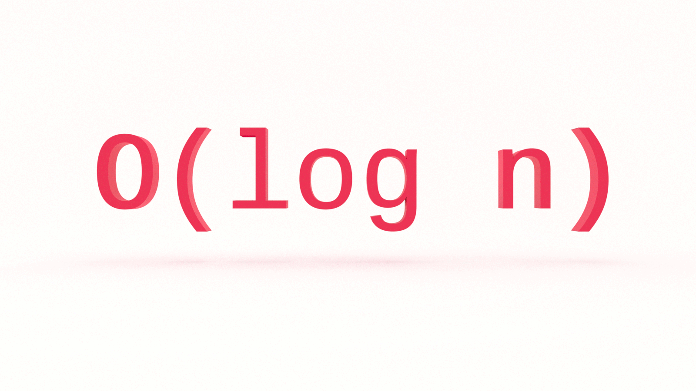

Is there a computer science topic more terrifying than Big O notation? Don’t let the name scare you, Big O notation is not a big deal. It’s very easy to understand and you don’t need to be a math whiz to do so. In this tutorial, you’ll learn the fundamentals of Big O logarithmic time complexity with examples in JavaScript.

---
This is the fourth in a series on Big O notation. If you want to stay in the loop, [sign up for my weekly newsletter, The Solution](http://eepurl.com/cP8CMn).

---

## What Problem(s) Does Big O Solve?

* Big O notation helps us answer the question, “Will it scale?”

* Big O notation equips us with a shared language for discussing performance with other developers (and mathematicians!).


## Quick Refresher

If you’re just joining us, you will want to start with that article, [What is Big O Notation?](https://jarednielsen.com/big-o-notation/)

### What is Big O?

Big O notation is a system for measuring the rate of growth of an algorithm. Big O notation mathematically describes the complexity of an algorithm in terms of time and space. We don’t measure the speed of an algorithm in seconds (or minutes!). Instead, we measure the number of operations it takes to complete.
The O is short for “Order of”. So, if we’re discussing an algorithm with O(log N), we say its order of, or rate of growth, is “log n”, or logarithmic complexity.

### How Does Big O Work?

Big O notation measures the _worst-case scenario_.

Why?

Because we don’t know what we don’t know.

We need to know just how poorly our algorithm will perform so we can evaluate other solutions.

The worst-case scenario is also known as the **upper bound**. When we say upper bound, we mean the maximum number of operations performed by an algorithm.

Remember this table?

| O             | Complexity    | Rate of growth    |
|---            | ---           | ---               |
| O(1)          | constant      | fast              |
| O(log n)      | logarithmic   |                   |
| O(n)          | linear time   |                   |
| O(n * log n)  | log linear    |                   |
| O(n^2)        | quadratic     |                   |
| O(n^3)        | cubic         |                   |
| O(2^n)        | exponential   |                   |
| O(n!)         | factorial     | slow              |

It lists common orders by rate of growth, from fastest to slowest.

We learned O(1), or constant time complexity, in [What is Big O?](https://jarednielsen.com/big-o-notation/), O(n) in [Big O Linear Time Complexity](https://jarednielsen.com/big-o-linear-time-complexity/), and O(n^2) in [Big O Quadratic Time Complexity](https://jarednielsen.com/big-o-quadratic-time-complexity/). 

We previously skipped O(log n), logarithmic complexity, because it's be easier to understand after learning O(n^2), quadratic time complexity.

Now it's time!


### Math O’Clock 🧮 🕝

What is a logarithm?

[Logarithms](https://en.wikipedia.org/wiki/Logarithm) allow us to _reverse engineer_ a power. (Like Kryptonite!)  They are the inverse operation of exponentiation.

 We can think of logarithms as the opposite operation of exponentiation. Remember this analogy format from standardized tests? 

> A is to B as X is to Y. 

We can say, “Addition is to subtraction as exponentiation is to logarithm.”

We can also say, “Multiplication is to division as exponentiation is to logarithm.”

With quadratic time complexity, we learned that _n_ * _n_ is _n^2_.

If the value of _n_ is to 2, then _n^2_ is equal to 4.

It then follows that 2 to the third power, _2^3_, is equal to 8.

In “long” form, that looks like: 

```
2 * 2 * 2  = 8
```

What if we were given this problem? 

```
2^y = 8
``` 

How would you describe this problem? 

We could say, “To what power do we raise 2 for a product of 8?”

🧐

We could also say, “How many 2’s do we need to multiply together to get 8?”

The notation for the equation is:

```
log2(8) = y
```

Where `2` is the _base_, `8` is the argument and `y` is the exponent, or power. 

Why is `8` the argument? (See what I did there?)

Because log2() is a function! 

🤯

We could describe the product as, “The base 2 logarithm of 8 is 3.”

What do we mean by _base_?

[“In exponentiation, the base is the number b in an expression of the form b^n.”](https://en.wikipedia.org/wiki/Base_(exponentiation))

The three most common bases in regards to logarithms are:

* 2
* 10
* e

In digital electronics and computer science, we (almost always) use **base-2**, or [binary numeral system](https://en.wikipedia.org/wiki/Binary_number).

In base-2, we count with two symbols: 0 and 1. 

Look familiar? 

It’s Boolean! 👻

Unless [you were born with six fingers on each hand](https://www.youtube.com/watch?v=_uJsoZheTR4), you count in **base-10**, or the [decimal numeral system](https://en.wikipedia.org/wiki/Decimal).

```
10^2 = 100
10^3 = 1000
etc.
```

If you really want to nerd out, you can read up on **_e_**, or [Euler’s constant](https://en.wikipedia.org/wiki/E_(mathematical_constant)): the unique number whose natural logarithm is equal to one.

☝️ Logarithms are not square roots.

The square root of 8 is 2.82842712475.

The log2 of 8 is 3.

Minor difference here, but what if our argument increased? 

The square root of 2048 is 45.2548339959.

The log2 of 2048 is 11.

What if we chart a logarithm? 


Aerodynamic! 

If we compare logarithmic time complexity to other time complexities on the [ubiquitous Big O cheat sheet](https://www.bigocheatsheet.com/), what do we see? 


As we can see, logarithmic time complexity is very good!

What if the problem was, “How many 3s, multiplied, does it take to get 8?”

The answer is 1.8927892607

If you imagined calculating that number by hand is a tedious process, you’d be right. 

That’s why we invented [slide rulers](https://en.wikipedia.org/wiki/Slide_rule) and fancy calculators.

Lucky for us, we don’t need to calculate the exact log of a function.

With Big O, we abstract away the details. 

We’re not concerned with the specific implementation of our algorithm.

We’re interested in the _order of_ our algorithm so we can make comparisons and evaluate alternative solutions.

We consider the base of our log a constant, so we drop it, and simply use the following notation:

```
O(log n)
```


## O(log n): Binary Search

The classic example used to illustrate O(log n) is binary search. Binary search is an algorithm that finds the location of an argument in a sorted series by dividing the input in half with each iteration. 

Let’s say we are given the following array and asked to find the position of the number `512`:

```js
const powers = [1, 2, 4, 8 ,16, 32, 64, 128, 256, 512];
```

First, let’s review the brute force solution to this problem.

```js 
const bruteSearch = (arr, num) => {
  
   for (let i = 0; i < arr.length; i++) {
       if (arr[i] === num) {
           return `Found ${num} at ${i}`;
       }
   }
}
```

Let's map the values of `i` and `arr[i]` in an array, J4F:

| i    | arr[i]    |
| ---    | ---    |
| 0    | 1    |
| 1    | 2    |    
| 2    | 4    |    
| 3    | 8    |    
| 4    | 16    |    
| 5    | 32    |    
| 6    | 64    |    
| 7    | 128    |    
| 8    | 256    |    
| 9    | 512    |    


What’s the Big O of `bruteSearch()`? 

O(n)

To find `num`, we need to check every item in our array, so the time complexity is linear.

Can we do better? 

Definitely. 

What’s happening in this function?

```js
const powers = [1, 2, 4, 8 ,16, 32, 64, 128, 256, 512];
 
const binarySearch = (arr, num) => {
 
   let startIndex = 0;
   let endIndex = (arr.length)-1;
  
   while (startIndex <= endIndex){
      
       let pivot = Math.floor((startIndex + endIndex)/2);
 
       if (arr[pivot] === num){
            return `Found ${num} at ${pivot}`;
       } else if (arr[pivot] < num){
           startIndex = pivot + 1;
       } else {
           endIndex = pivot - 1;
       }
   }
   return false;
}
```

In the first iteration of our `while` loop, we create a _pivot_ at the median of our array. We then check `num` against the value at the array indexed by `pivot`. 

If `pivot` is equal to `num`, we return.

If `pivot` is less than `num`, we change the value of our `startIndex` to the value of our `pivot` plus one.

Why? 

If the value of `arr[pivot]` is less than `num`, we don’t need to check any of the elements below our `pivot` in the next iteration.

We just halved our input! 

_n / 2_

If `pivot` is greater than `num`, we change the value of our `endIndex` to the value of our `pivot` minus one.

If the value of `array[pivot]` is greater than `num`, we don’t need to check any of the elements above our `pivot` in the next iteration.

In the next iteration, we create a new `pivot` at the median between our adjusted `startIndex` and `endIndex`, and again check the value of `arr[pivot]` against the value of `num`. 

In the example above, we again halve our input. 

What’s half of half?

A quarter.

_n / 4_

In the third iteration, we halve the input again: _n / 8_

In the final iteration, we find our number. There’s also nothing left to halve at that point. 

What’s the pattern? 

Let’s make a table! 

| startIndex     | endIndex     | pivot    | # elements    | n    |
| ---        | ---        | ---    | ---        | ---    |
| 0        | 9        | 4    | 10        | n    |
| 5        | 9        | 7    | 5        | n / 2    |
| 8        | 9        | 8    | 2        | n / 4    |
| 9        | 9        | 9    | 1        | n / 8    |

What do you notice about the sequence in the _# elements_ column? 

We divide it, more or less, by two, until we reach zero.

What do you notice about the sequence in the _n_ column?

2

4

8

Powers of two! 

By dividing our input with each iteration, we are _inversing_ an exponent. 

📝 When you see this pattern where the input is divided with each iteration, it’s O(log n).


## Big O Logarithmic Time Complexity

Does O(log n) scale?

Definitely.

In this tutorial, you learned the fundamentals of Big O logarithmic time complexity with examples in JavaScript. Stay tuned for part five of this series on Big O notation where we’ll look at O(n log n), or log linear time complexity.


