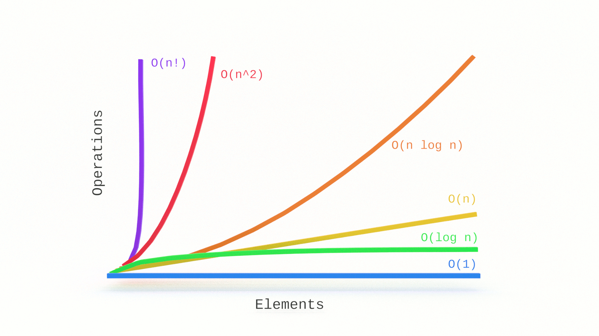
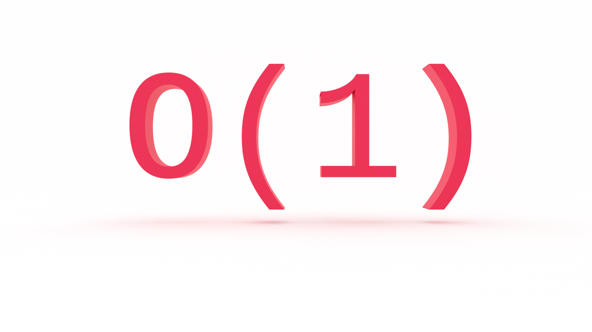

Is there a computer science topic more terrifying than Big O notation? Don’t let the name scare you, Big O notation is not a big deal. It’s very easy to understand and you don’t need to be a math whiz to do so. In this tutorial, you'll learn the fundamentals of Big O notation, beginning with constant time complexity with examples in JavaScript. 

Come with us now on a journey through time and space complexity...

---


This article is an excerpt from _The Little Book of Big O_. [Pre-order it today!](https://gum.co/big-o)

---

## What Problem(s) Does Big O Notation Solve?

* Big O notation helps us answer the question, “Can we do better?” 

* Big O notation equips us with a shared language for discussing the complexity of algorithms with other developers (and mathematicians!).


## Let's Get Meta

* Why do you need to know this? (The answer is not: "Because technical interviews are intimidating!")

* What does it mean to 'do better' in software development?

* What is the connection between mathematics and computer science? 


## What is Big O Notation? 

Big O is a notation for measuring the complexity of an algorithm. Big O notation mathematically describes the complexity of an algorithm in terms of time and space. We don’t measure the _speed_ of an algorithm in seconds (or minutes!). We measure the _rate of growth_ of an algorithm in the number of operations it takes to complete. 

What do we mean by notation? According to Wikipedia, in linguistics and semiotics, a notation is:

> a system of graphics or symbols, characters and abbreviated expressions, used (for example) in artistic and scientific disciplines to represent technical facts and quantities by convention. Therefore, a notation is a collection of related symbols that are each given an arbitrary meaning, created to facilitate structured communication within a domain knowledge or field of study. 

The O is actually the Greek character _Omicron_ and is shorthand for “Order of”. So, if we’re discussing an algorithm with _O(n)_, we say its _order of_, or rate of growth, is _n_, or linear complexity. 

Why _order_? 

In biology, an order is a taxonomic classification. We are in the order of primates. 🐒🦍

In computer science, an order is a mathematical classification for algorithms. We use Big O to measure the rate of growth, or complexity, of algorithms, so algorithms with equivalent complexity are in the same order. We will see below that we can also _order_ algorithms as they increase in complexity. 

You will see Big O referred to as asymptotic runtime, or [asymptotic computational complexity](https://en.wikipedia.org/wiki/Asymptotic_computational_complexity). This is a fancy way of describing the limits of a function. 


### Math O’Clock 🧮 🕐 

You don’t need to be a math whiz to grok Big O, but there are a few basic concepts we need to cover to set you up for success.

If you recall from algebra, you worked with functions such as _f(x)_ and _g(x)_, and even did things like _f(g(x))_, where _f()_ and _g()_ were equations and _x_ was a numerical value (or another equation!) passed to the functions. 

When we’re programming, we give our “equations” descriptive names (at least I hope you are), such as `isAuthenticated` and `calcuateMedian`, but we could also name them `f` and `g` (please don’t). 

Let’s say _f(x)_ is equal to _3x^2 + 12x - 6_.

We could say that the order of, or rate of growth, of _f(x)_ is _O(n^2)_. We’ll see why later. 

It’s more common to simply say “_f(x)_ is order of n^2”, or “_f(x)_ is Big O of n^2”.

Math time over.

For now. 😀 


## How Does Big O Notation Work? 

Big O notation is used to define the _worst-case scenario_ for a given algorithm. 

Why?

Because we don’t know what we don’t know.

If we’re writing a search algorithm, we won’t always know the query ahead of time. If we’re writing a sorting algorithm, we won’t always know the dataset ahead of time. What if the query is the very last element or what if the dataset is a real mess. We want to know just how poorly our algorithm will perform.

The worst-case scenario is also known as the _upper bound_.

You’re going to encounter a lot of tables like this: 

| O             | Complexity        |       |
|---            |---                |---    |
| O(1)          | constant          | fast  |
| O(log n)      | logarithmic       |       |
| O(n)          | linear            |       |
| O(n * log n)  | log linear        |       |   
| O(n^2)        | quadratic         |       |
| O(n^3)        | cubic             |       |
| O(2^n)        | exponential       |       |
| O(n!)         | factorial         | slow  |

This lists common runtimes from fastest to slowest. 

And you’re definitely going to see charts like this:


We’ll return to both as we proceed. 

Before we get into any code, let’s get hands-on to get a feel for Big O. We’ll use an example from [Grokking Algorithms](https://amzn.to/376TGy9) _(Note: Amazon links are affiliate)_. 

Let's say I give you a square piece of paper and ask you to divide it into sixteen squares. How would you approach this problem? 

You could take the brute force approach and draw sixteen individual squares. If you take this approach, how many steps, or computations, will you perform? 

Sixteen. 

One for each square that you draw.

Is there an approach that requires fewer steps? 

Of course!

Fold the paper in half. Then in half again. 

How man squares did you just create? 

Four! 

Now fold it in half two more times. 

When you unfold it, the paper will be divided into sixteen squares. 

How many steps, or computations, were required?

Four. 

In Big O notation, our first approach, brute force, is O(n), or linear time. Creating sixteen squares requires sixteen operations. But our second, refactored and optimized, approach is O(log n), or logarithmic time (the inverse of exponentiation). Creating sixteen squares requires only four steps. 

We’ll look at O(log n) later. Let’s begin with O(1), which will help us understand O(n).


## O(1): Constant Time Complexity



Say you’re working with an API that returns a users full name in an array, like so: 

```js
[“Jared”, “Nielsen”];
```

Your task is to get the users first name. Easy, in JavaScript:

```js
const getFirstName = data => data[0];

```

No matter how many times you run your ‘algorithm’, it only needs to perform one operation to return the desired value. That’s O(1), or constant time.

Here’s another JavaScript example: 

```js
const isEven = num => num % 2 === 0;
```

Our algorithm checks whether or not a number is even or odd and will return true or false accordingly. No matter the size of the value passed to `isEven`, it only needs to perform one operation. Again, O(1). 

One more example: Say you are checking your application state to determine whether or not you need to style an alert element with a specific color. You could do so with a series of conditional statements:

```js
const  = state => {
   if (state === 'danger') {
       return 'crimson';
   } else if (state === 'warning') {
       return 'orange';
   } else if (state === 'success') {
       return 'chartreuse';
   } else {
       return 'cornflowerblue';
   };
}
```

What is our _best-case scenario_ for this algorithm? 

If `state` is equal to `danger`, we will only perform one operation and return. 

That would be O(1). 

What if `state` is not equal to `danger`? What if `state` does not match any of our conditions? What is our worst-case scenario?

It's still O(1).

Why? 

Even though we check multiple conditions before returning `cornflowerblue`, the order of, or rate of growth, is _constant_. The size of the input does not affect the number of operations performed. We know the upper bound, or worst-case scenario, in advance, and we know it will not change. 

What if our function performs an operation in one of the conditions?

```js
const alertColor = state => {
   if (state === 'danger') {
       return 'crimson';
   } else {
       return pukeRainbows(state);
   };
}
```

Is it still O(1)? 

It depends on what happens when we call `pukeRainbows()`.

Why? We’ll see in the next article. 


## Metacognition

Ask yourself the following questions again. What are your answers? 

* Why do you need to know this? 

* What does it mean to 'do better' in software development?

* What is the connection between mathematics and computer science? 


## What is Big O Notation? 

Big O notation is not a big deal. It’s very easy to understand and you don’t need to be a math whiz to do so. In this tutorial, you learned the fundamentals of Big O notation, as well as constant time complexity with examples in JavaScript. Join us for part two of this series [Big O & Linear Time Complexity](https://jarednielsen.com/big-o-linear-time-complexity).
