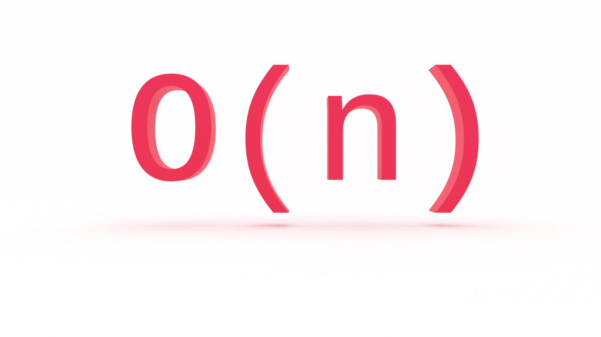

Is there a computer science topic more terrifying than Big O notation? Don’t let the name scare you, Big O notation is not a big deal. It’s very easy to understand and you don’t need to be a math whiz to do so. In this tutorial, you'll learn the fundamentals of Big O notation, as well as constant and linear time complexity with examples in JavaScript.

_Note: Amazon links are affiliate._

---
This is the first in a series on Big O notation. If you want to stay in the loop, [sign up for my weekly newsletter, The Solution](http://eepurl.com/cP8CMn).

---

## What Problem(s) Does Big O Notation Solve?

* Big O notation helps us answer the question, “Will it scale?” 

* Big O notation equips us with a shared language for discussing performance with other developers (and mathematicians!).

## What is Big O Notation? 

Big O is a notation for measuring the performance of an algorithm. Big O notation mathematically describes the complexity of an algorithm in terms of time and space. We don’t measure the _speed_ of an algorithm in seconds (or minutes!). We measure the _rate of growth_ of an algorithm in the number of operations it takes to complete. 

The O is short for “Order of magnitude”. So, if we’re discussing an algorithm with _O(n)_, we say its order of magnitude, or rate of growth, is _n_, or linear complexity. 

You will probably read or hear Big O referred to as asymptotic runtime, or [asymptotic computational complexity](https://en.wikipedia.org/wiki/Asymptotic_computational_complexity). This is a fancy way of describing the limits of a function. There is a branch of mathematics, [order theory](https://en.wikipedia.org/wiki/Order_theory), devoted to this topic. For our intents and purposes, _order_: 

> … provides a formal framework for describing statements such as "this is less than that" or "this precedes that".

We use _order_ to evaluate the complexity of our algorithms.


### 🧮 Math O’Clock

You don’t need to be a math whiz to grok Big O, but there are a few basic concepts we need to cover to set you up for success.

If you recall from algebra, you worked with functions such as _f(x)_ and _g(x)_, and even did things like _f(g(x))_, where _f()_ and _g()_ were equations and _x_ was a numerical value (or another equation!) passed to the functions. 

When we’re programming, we give our “equations” descriptive names (at least I hope you are), such as `isAuthenticated` and `calcuateMedian`, but we could also name them `f` and `g` (please don’t). 

Let’s say _f(x)_ is equal to _3x^2 + 12x - 6_.

We could say that the order of magnitude (rate of growth) of _f(x)_ is _O(n^2)_. (We’ll see why later.) 

It’s more common to simply say “_f(x)_ is order of n^2”, or “_f(x)_ is Big O of n^2”.

That’s it! 

Math time over.

For now.


## How Does Big O Notation Work? 

Big O notation measures the _worst-case runtime_. 

Why?

Because we don’t know what we don’t know.

If we’re writing a search algorithm, we won’t always know the query ahead of time. If we’re writing a sorting algorithm, we won’t always know the dataset ahead of time. What if the query is the very last element or what if the dataset is a real mess. We want to know just how poorly our algorithm will perform.

The worst-case scenario is also known as the “upper bound”. Limits again!

You’re going to encounter a lot of tables like this: 

| O             | Run time          |       |
|---            |---                |---    |
| O(1)          | constant          | fast  |
| O(log n)      | logarithmic       |       |
| O(n)          | linear            |       |
| O(n * log n)  | log linear        |       |   
| O(n^2)        | quadratic         |       |
| O(n^3)        | cubic             |       |
| O(2^n)        | exponential       |       |
| O(n!)         | factorial         | slow  |

This lists common runtimes from fastest to slowest. 

And you’re definitely going to see this chart:


We’ll return to both as we proceed. 

Before we get into any code, let’s get hands-on to get a feel (pun intended) for Big O. We’ll use an example from [Grokking Algorithms](https://amzn.to/376TGy9). 

Let's say I give you a square piece of paper and ask you to divide it into sixteen squares. How would you approach this problem? 

You could take the brute force approach and draw sixteen individual squares. If you take this approach, how many steps, or computations, will you perform? 

Sixteen.

Is there an approach that requires fewer steps? Of course!

Fold the paper in half. Then in half again. Four squares! 

Now fold it in half two more times. 

When you unfold it, the paper will be divided into sixteen squares. 

How many steps, or computations, were required?

Four. 

In Big O notation, our first approach, brute force, is O(n), or linear time. Creating sixteen squares requires sixteen operations. But our second, refactored and optimized, approach is O(log n), or logarithmic time (the inverse of exponentiation). Creating sixteen squares requires only four steps. 

We’ll look at O(log n) later. Let’s begin with O(1), which will help us understand O(n).


### O(1): Constant Time


Say you’re working with an API that returns a users full name in an array, like so: 

```js
[“Jared”, “Nielsen”];
```

Your task is to get the users first name. Easy, in JavaScript:

```js
const getFirstName = data => {
    return data[0];
}

```

No matter how many times you run your ‘algorithm’, it only needs to perform one operation to return the desired value. That’s O(1), or constant time.

Here’s another JavaScript example: 

```js
const isEven = num => num % 2 === 0;
```

Our algorithm checks whether or not a number is even or odd and will return true or false accordingly. It only needs to perform one operation. Again, O(1). 

Another example. Say you are checking your application state to determine whether or not you need to style an alert element with a specific color. You could do so with a series of conditional statements:

```js
const alertColor = state => {
   if (state === 'danger') {
       return 'crimson';
   } else if (state === 'warning') {
       return 'orange';
   } else if (state === 'success') {
       return 'chartreuse';
   } else {
       return 'cornflowerblue';
   };
}

```
What is our best-case scenario for this algorithm? If `state` is equal to `danger`, we will only perform one operation and return. That would be O(1). What if `state` is not equal to `danger`? Then we perform multiple operations and the order of `alertColor()` is _n_. 

Why? We’ll see in a moment. 

If you find yourself writing a lot of conditional statements, you may want to consider implementing a lookup table (LUT) using a JavaScript object. 

```js
const alertTable = {
   danger: 'crimson',
   warning: 'orange',
   success: 'chartreuse',
};
 
const alertColor = state => alertTable[state] || 'cornflowerblue';
```

Our LUT is O(1). It only performs one operation, so its time complexity is constant regardless of the size of the lookup table. 


### O(n): Linear Time




If O(1) performs only one computation regardless of the size of the input, what is O(n)?

For _n_ inputs, our algorithm will perform _n_ outputs. This is linear time complexity. 

Why? 

If we were to chart this on a graph, it would be a straight line.

What if we calculated our operations for this algorithm and it was actually something like: 

```
2n + 5
```

That’s still just O(n). 

With Big O, we drop the constants and the non-dominant terms. They don’t provide any meaningful additional information. O(n) and O(2n +5) are both linear. If you charted `2n + 5`, it would still be a straight line. That’s what we really want to know. 

But what if our algorithm, say a search function, returns its parameter after one operation? Would that be O(1)? 

No. It’s still O(n). 

Why? 

Remember, with Big O, we measure the _worst case scenario_. Because we don’t know what we don’t know, our default assumption for any algorithm is its worst-case scenario. In a worst case scenario, an O(n) algorithm needs to perform its specified operation on every value in the input. When making our Big O calculation, we want to know just how poorly an algorithm is going to perform. 

Say, for example, we have an array of animals: 

```js
const animals = [“ocelot”, “octopus”, “opossum”, “orangutan”, “orca”, “oriole”, “oryx”, “osprey”];
```

And let’s say our task is to find the location of a specific animal in the array based on user input:

```js
for (let i = 0; i < animals.length; i++) {
    if (animals[i] === userInput) {
        return `Found ${userInput} at ${i}`;
    };
};
```

If our user searches for “ocelot”, how many computations are performed? 

One. It’s the first item in our array, so our program will return. 

But, if our user searches for “osprey”, how many computations are performed? 

Eight. That’s our worst case scenario. For eight inputs, our algorithm will perform eight operations.

What if our array contained 100 animals? 

The worst-case scenario would be 100 operations. 

What about 1,000?

10,000?

100,000?

1,000,000?

All O(n).

You can see how linear complexity is fine for small datasets, but becomes a concern when the size of the input increases. 

Does O(n) scale? 

We can do better _and_ worse. 


## What is Big O Notation? Linear & Constant Time Complexity in JavaScript

Big O notation is not a big deal. It’s very easy to understand and you don’t need to be a math whiz to do so. In this tutorial, you learned the fundamentals of Big O notation, as well as constant and linear time complexity with examples in JavaScript.

Stay tuned for part two of this series on Big O notation where we'll look at O(n^2), or quadratic time complexity.
