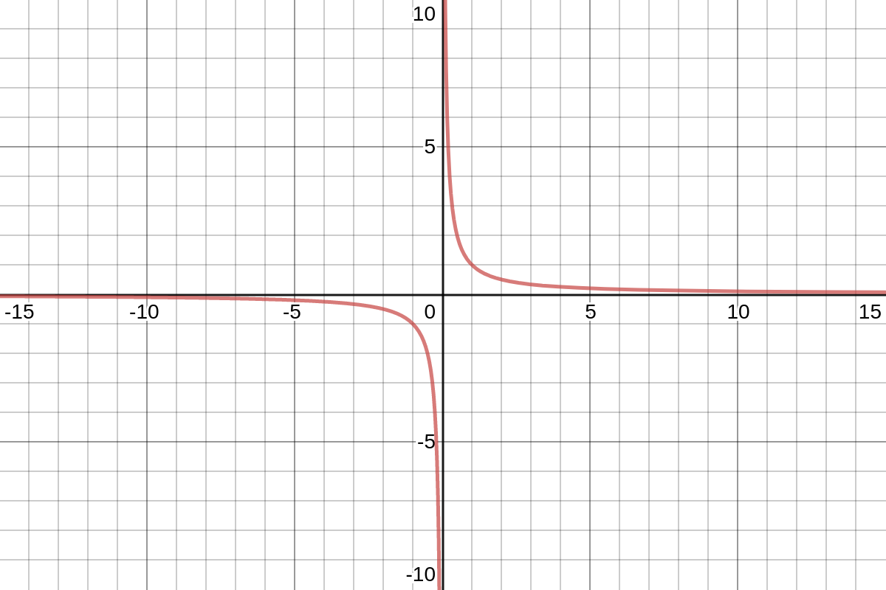

Is there a computer science topic more terrifying than Big O notation? Don’t let the name scare you, Big O notation is not a big deal. It’s very easy to understand and you don’t need to be a math whiz to do so. Big O, Big Omega, or Ω, and Big Theta, or Θ, are notations used to express the computational complexity of an algorithm. In this tutorial, you’ll learn the difference between Big O, Big Omega, and Big Theta notations.

If you're just joining us, you may want to start at the beginning with [What is Big O Notation?](https://jarednielsen.com/big-o-notation/).


## What is Asymptotic Computational Complexity? 

Here’s the [Wikipedia definition of asymptotic computational complexity](https://en.wikipedia.org/wiki/Asymptotic_computational_complexity): 

> In computational complexity theory, asymptotic computational complexity is the usage of asymptotic analysis for the estimation of computational complexity of algorithms and computational problems, commonly associated with the usage of the big O notation. 

😪

Right? 

No wonder this stuff is hard to learn. 

Let’s break this jargon down. 


### What is an Asymptote?

Here’s Wikipedia again, telling us that an asymptote of a curve is: 

> a line such that the distance between the curve and the line approaches zero as one or both of the x or y coordinates tends to infinity. 

😕

Yeah.

These definitions make an easy concept harder to understand. 

We’re all visual learners, so let’s chart the following equation:
```
y = 1 / x
```



No matter how large (or small) the value of _x_, our curve will never touch the _x_ or _y_ axes.

Even if that number is _Infinity_. 

🐢🏃‍♀️

Especially if that number is _zero_. 

Why? 

It’s mathematically impossible to divide by 0.

Division is another way to think about this. How many times can we divide one in half in before we reach zero? 

There are infinite divisions!

Half of 1 is `½`.

Half of `½` is `¼`.

Half of `¼` is `⅛`.

Half of `⅛` is `1/16`. 

Half of `1/16` is… you see where this is going. 

With each division, our denominator increases by a power of 2.

We will never be able to halve something into nothing. 

Unless it’s cake. 

🍰

In the chart above, the _x_ and _y_ axes are the asymptotes of the equation `y = 1 / x`. But any line can be an asymptote. We’re not limited to horizontal and vertical lines.


### What is Asymptotic Analysis? 

Let’s continue to digest these chewy definitions. 

According to [Wikipedia](https://en.wikipedia.org/wiki/Asymptotic_analysis), asymptotic analysis is: 

> a method of describing limiting behavior.

What’s a limit? 

In mathematics, a limit is the value that a function approaches as the input increases (or decreases). 

Sounds a lot like an asymptote. So how do we analyze a function _asymptotically_? 

If our function, _f(x)_ is equal to `x^2 + 2x`, as `x` increases in value (and approaches infinity), `2x` becomes insignificant compared to `x^2`. 

We then simply say that _f(x)_ is asymptotically equivalent to x^2. 


## What’s the Difference Between Big O, Big Omega, and Big Theta?

In [Introduction to Algorithms](https://amzn.to/2KdvlNi), Cormen et al use Insertion Sort as an example to explain the difference between Big O, Big Omega, and Big Theta. We’ll do the same here. Here’s an implementation of Insertion Sort in JavaScript:

```js
const insertionSort = arr => {
 for (let i = 1; i < arr.length; i++) {
   let index = i;
   while (index > 0 && arr[index - 1] > arr[index]) {
     let temp = arr[index];
     arr[index] = arr[index - 1];
     arr[index - 1] = temp;
     index = index - 1;
   }
 }
 return arr;
}

```

And here's a quick refresher (or explainer) on Insertion Sort:

* We iterate over the entire array.

* For each element in the array, we check:

    * If the value of the index is greater than 1

    * If the element preceding the index is greater than the index itself

* If both conditions are met, we swap them 


### What is Big O?

Big O describes the upper bound of an algorithm. 

Using our Insertion Sort example, the rate of growth of our algorithm is _at most_ quadratic, or O(n^2). 

This is why, for us, as developers and practitioners, we are primarily concerned with Big O.

We want to know just how poorly an algorithm might perform. 

To say that the Big O of Insertion Sort is O(n^2) doesn’t mean that Insertion Sort will _always_ be O(n^2). The actual runtime will vary based on the input. What we are saying is that, in a worst case scenario, this is the upper bound of the performance of Insertion Sort. 

Knowing this, we then need to ask ourselves the following questions:

* Are we okay with this?

* Can we do better?


### What is Big Omega?

Big Omega describes the lower bound of an algorithm. 

Using our Insertion Sort example, if the input is already sorted, then the rate of growth of our algorithm is _at least_ linear, or Ω(n). 

If only life always handed us sorted arrays. 🌼

We can also think of this as our best-case scenario. 


### What is Big Theta?

Big Theta describes the tight bound of an algorithm, it’s limit from above _and_ below.

Using our Insertion Sort example, we know that the rate of growth is _at most_ O(n^2) and _at least_ Ω(n). 

But Big Theta will change with our inputs. Returning to our Insertion Sort example, in a best case scenario, Big Theta is _n_, but in a worst case scenario, Big Theta is _n^2_. To say that Insertion Sort _is_ Θ(n) or Θ(n^2) is incorrect as both of these imply that Insertion Sort will _always_ run at either _n_ or _n^2_. 

So what use is Big Theta? 

Big Theta is often used to describe the average, or expected, case for an algorithm. This isn’t _exactly_ true, but it’s a useful shorthand.

So for Insertion Sort, the average case for Big Theta is _n^2_.


### So What’s the Difference Between Big O, Big Omega, and Big Theta?

We can think of Big O, Big Omega, and Big Theta like conditional operators:

* Big O is like `<=`, meaning the rate of growth of an algorithm is less than or equal to a specific value, e.g: _f(x)_ <= _O(n^2)_

* Big Omega is like `>=`, meaning the rate of growth is greater than or equal to a specified value, e.g: _f(x)_ >= _Ω(n)_.

* Big Theta is like `==`, meaning the rate of growth is equal to a specified value, e.g: _f(x)_ = _Θ(n^2)_.

But if we needed to make a blanket statement for all cases, we would use Big O, and, for example, say that Insertion Sort is O(n^2).


## Best Case, Worst Case, and Expected Case

What is the relationship between best case/worst case/expected case and Big O/Big Omega/Big Theta? 

There isn’t one. 

Equivalencies are often made between Big O and worst case, Big Omega and best case, and Big Theta and average case, but we can speak of best, worst, and average for each of these notations. 

For example, each of the following statements are true: 

* Insertion Sort's worst case rate of growth is _at most_ O(n^2)

* Insertion Sort's worst case rate of growth is _at least_ Ω(n)

* Insertion Sort's worst case rate of growth is _exactly_ Θ(n^2)  


## Big O, Big Omega, Big Theta, Big Sigh! 

In this tutorial, you learned the difference between Big O, Big Omega, and Big Theta notations.


