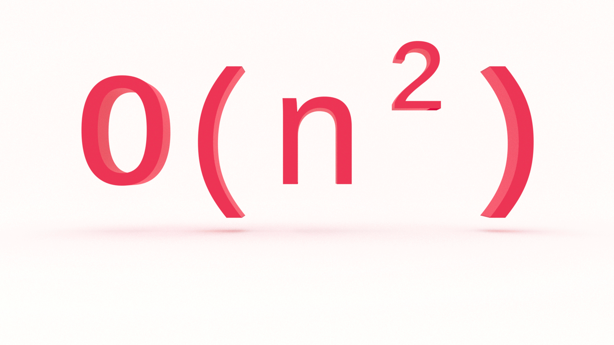
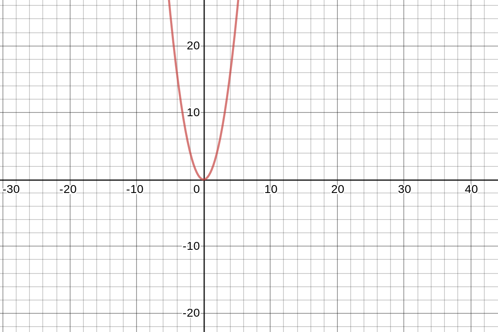

Is there a computer science topic more terrifying than Big O notation? Don’t let the name scare you, Big O notation is not a big deal. It’s very easy to understand and you don’t need to be a math whiz to do so. In this tutorial, you’ll learn the fundamentals of Big O notation quadratic time complexity with examples in JavaScript.

---
This is the third in a series on Big O notation. If you want to stay in the loop, [sign up for my weekly newsletter, The Solution](http://eepurl.com/cP8CMn).

---

## What Problem(s) Does Big O Solve?

* Big O notation helps us answer the question, “Will it scale?”
* Big O notation equips us with a shared language for discussing performance with other developers (and mathematicians!).

## Quick Refresher

In the first part of this series, we looked at constant and linear time complexity, or O(1) and O(n). If you’re just joining us, you will want to start with that article, [What is Big O Notation?](https://jarednielsen.com/big-o-notation/)


### What is Big O? 

Big O notation is a system for measuring the rate of growth of an algorithm. Big O notation mathematically describes the complexity of an algorithm in terms of time and space. We don’t measure the speed of an algorithm in seconds (or minutes!). Instead, we measure the number of operations it takes to complete.
The O is short for “Order of”. So, if we’re discussing an algorithm with O(n^2), we say its order of, or rate of growth, is n^2, or quadratic complexity.

### How Does Big O Work? 

Big O notation measures the worst-case scenario.

Why?

Because we don’t know what we don’t know.

We need to know just how poorly our algorithm will perform so we can compare it to other solutions.

The worst-case scenario is also known as the “upper bound”.

Remember this table?

| O             | Complexity    | Rate of growth    |
|---            | ---           | ---   |
| O(1)          | constant      | fast  |
| O(log n)      | logarithmic   |       |
| O(n)          | linear time   |       |
| O(n * log n)  | log linear    |       |
| O(n^2)        | quadratic     |       |
| O(n^3)        | cubic         |       |
| O(2^n)        | exponential   |       |
| O(n!)         | factorial     | slow  |

It lists common orders from fastest to slowest.

We learned O(n), or linear time complexity, in [Big O Linear Time Complexity](https://jarednielsen.com/big-o-linear-time-complexity/). We’re going to skip O(log n), logarithmic complexity, for the time being. It will be easier to understand after learning O(n^2), quadratic time complexity.

Before getting into O(n^2), let’s begin with a review of O(1) and O(n), constant and linear time complexities.


### O(1) vs. O(n): Constant and Linear Time Complexities

The following function finds the sum of an array of numbers.

```js
const nums = [1,2,3,4,5,6,7,8,9,10];
 
const sumHarder = arr => {
   let sum = 0;
   for (let i = 0; i < arr.length; i++) {
       sum += arr[i];
   }
   return sum;
}
 
const result = sumHarder(nums);
```

What’s the Big O? 

O(n).

Why? 

It’s rate of growth scales in direct proportion to the input. As the input grows, so do the number of operations, linearly. Our function needs to perform the same number of operations for every input, so it is linear time complexity, or O(n). 

Can we do better?

We learned in [How to Sum Integers 1 to n](https://jarednielsen.com/sum-consecutive-integers/) a party trick discovered by Little Carl Friedrich Gauss. 

```
n ( n + 1 ) / 2
```

If we translate this equation to JavaScript:

```js
const sumSmarter = arr => arr.length * (arr.length + 1) / 2;
```

What’s the order of our function now? 

O(1), or constant time.

Why? 

Regardless of the size of the input, our algorithm will perform the same, or a _constant_, number of operations. 


### Math O’Clock 🧮 🕝

Quadratic is the fancy adjective used to describe _squaring_, or raising to the power of 2. 

It’s from the Latin _quadrus_, which means, you guessed it, square.

What’s a square in math? 

The square of a number is the result of the number multiplied by itself. 

Two to the power of two, or `2^2`, is the same as `2 * 2`, which is equal to 4.

Three to the power of 2, or `3^2`, is the same as `3 * 3`, which is equal to 9.

You know this already.

If we chart quadratic equations, we get a parabola: 



We’re only concerned with the right-side, or positive, values of our parabola because we can’t go back in time. 

Yet.

Speaking of time, Math O'Clock is over.

Back to Big O.


## O(n^2): Quadratic Time Complexity

If an algorithm is in the order of O(n), or linear time complexity, the number of operations it performs scales in _direct_ proportion to the input. 

What if an algorithm is O(n^2)?

🔑 The number of operations it performs scales in proportion to the _square_ of the input.

What’s happening in this example? 

```js
const fruit = ["🍓", "🍐", "🍊", "🍌", "🍍", "🍑", "🍎", "🍈", "🍊", "🍇"];
 
const matcher = array => {
   for (let i = 0; i < array.length; i++){
       for (let j = 0; j < array.length; j++){
           if (i !==j && array[i] === array[j]){
               return `Match found at ${i} and ${j}`;
           }
       }
   }
   return 'No matches found 😞'; 
}
```

We declare an array of fruit and pass it to our `matcher()` function. Our `matcher()` function then iterates over our array. For each element in the array, we then iterate over the array again. If the array indices _are not_ the same and the elements at the indices _are_ the same, then we return the locations of the matched fruit. If no matches are found, we return disappointment. 

How many operations are performed? 

Our outer loop is performing _n_ iterations. Our inner loop _also_ performs _n_ iterations. But it performs _n_ iterations for _every iteration_ of the outer loop. 

When `i` is 0, we iterate `j` 10 times. 

When `i` is 1, we iterate `j` 10 times.

Etc.

Rather than O(n) or O(n + n), this is O(n * n), or O(n^2).

At this point, we are familiar with the following: O(1), O(n), and O(n^2). For comparison, this table outlines their growth by number of inputs:

| Big O          | # operations for 10 elements | # operations for 100 elements | # operations for 1000 elements  |
| -------------- | ---------------------------- | ----------------------------- | ------------------------------- |
| **O(1)**       | 1                            | 1                             | 1                               |
| **O(N)**       | 10                           | 100                           | 1000                            |
| **O(N^2)**     | 100                          | 10000                         | 1000000                         |

As we can see, O(n^2) isn’t great to begin with and only gets worse as the size of the input increases.

Remember this chart?


As we can see, O(n^2) is horrible.

But it’s not the worst! 


## Calculating Complexity

The following are common pitfalls and gotchas when calculating Big O quadratic time complexity. 


### Drop Non-Dominant Terms

What’s happening in this contrived example?

```js
const summer = (num, t = false) => {
   let sum = 0;
 
   if (t === 'quadratic'){
       for (i = 0; i <= num; i++){
           for (j = 0; j < num; j++){
               sum += j;
           }
       }
   } else if (t === 'linear') {
       for (i = 0; i <= num; i++){
           sum += i;
       }
   } else {
       return num * (num + 1) / 2;
   }
   return sum;
}
```

If our first condition is met, we run the nested iterations and the order of our function is O(n^2).

If our second condition is met, we run one iteration and the order of our function is O(n).

If neither of the conditions are met, our function is O(1). 

What is the _actual_ order of our function? 

We _could_ calculate this as O(n^2 + n + 1). 

Why would we _not_ do this? 

When using Big O to measure the rate of growth of our algorithms, what do we _really_ want to know? 

The worst-case scenario.

Here, it’s `n^2`.

This is the dominant term.

We learned above that we drop constant terms. 

We also drop `n`, the non-dominant term, because it doesn’t provide any meaningful additional information. Whether or not `n` influences the rate of growth of our algorithm is irrelevant. It's still quadratic.  

What we _really_ want to know is the _order of_ our function, not the details of its specific implementation. So the example above is O(n^2)


### Iteration with Offset

What happens if we make a small optimization to our `matcher()` algorithm?
 
```js
const fruit = ["🍓", "🍐", "🍊", "🍌", "🍍", "🍑", "🍎", "🍈", "🍊", "🍇"];
 
const matcher = array => {
   for (let i = 0; i < array.length; i++){
       for (let j = i + 1; j < array.length; j++){
           if (array[i] === array[j]){
               return `Match found at ${i} and ${j}`;
           }
       }
   }
   return 'No matches found 😞'; 
}

```
If we’re checking for a match, we know that it will never be in the same index in the array. 

We can initialize the inner loop with `let j = i + 1`, so the iterator of the inner loop will always be one element ahead of the outer loop. 

This allows us to remove the `i !== j` operation in the `if` statement. 

Here's the catch: how many times will the inner loop, _j_, run? 

Let’s make a table!

| i         | j            | number of iterations of _j_|    
| ---       | ---          | ---                        | 
| 0         | 0 + 1        | 5 - 1 = 4                  |    
| 1         | 1 + 1        | 5 - 2 = 3                  |    
| 2         | 2 + 1        | 5 - 3 = 2                  |    
| 3         | 3 + 1        | 5 - 4 = 1                  |    
| 4         | 4 + 1        | 5 - 5 = 0                  |    
|           |              | Total: 10                  |

Let’s say we have an array with five elements. When the value of the iterator in our outer loop, _i_, is 0, the value of the iterator in our inner loop, _j_, is the value of _i_ plus 1. As the value of _i_ increases, the number of iterations performed by _j_ decreases correspondingly. 

What if our array length is variable, or, unknown? How would we calculate the number of iterations of our inner loop? 

| i         | j         | number of iterations of _j_   |    
| ---       | ---       | ---                           | 
| 0         | 0 + 1     | n - 1                         |    
| 1         | 1 + 1     | n - 2                         |    
| 2         | 2 + 1     | n - 3                         |    
| ...       | ...       | ...                           |    
| n - 3     | n - 3 + 1 | 2                             |    
| n - 2     | n - 2 + 1 | 1                             |    
| n - 1     | n - 1 + 1 | 0                             |    

The first time our outer loop runs, our inner loop runs `n - 1`.

The second time our outer loop runs, our inner loop runs `n - 2`.

The third time, `n - 3`.

Hey! This is starting to look familiar. Where have we seen this pattern before?

It's very similar to [summing consecutive integers from 1 to n](https://jarednielsen.com/sum-consecutive-integers/). 

We can calculate this with the following equation:

```
n * ( n - 1 ) / 2
```

We can simplify this. While it’s not exactly _square_, recall that in Big O, we’re not interested in the details. So we drop the constants and multiply the terms with a result of _n^2_.

Let’s visualize this. Imagine a function that logs the pairs of _i_ and _j_, with an output of the following: 

```
[
      [ [ 0, 1 ], [ 0, 2 ], [ 0, 3 ], [ 0, 4 ] ],
                [ [ 1, 2 ], [ 1, 3 ], [ 1, 4 ] ],
                          [ [ 2, 3 ], [ 2, 4 ] ],
                                    [ [ 3, 4 ] ]
]
```

See a pattern?

It's half a square matrix.

We could write that as:

```
( n * n ) / 2
```

If we drop the constant, the divisor, it’s just _n^2_.

In [Cracking the Coding Interview](https://amzn.to/2OtWpdv), Gayle Laakmann McDowell directs us to think about what the code _means_. 

What does _that_ mean?

Our function is comparing pairs, _i_ and _j_. 

The total number of paris to compare is _i_ * _j_, or, because we are using the same input, _n_ * _n_, or _n^2_.

But! We are only comparing pairs where _j_ is greater than _i_, roughly half of the total number of pairs. 

We will never compare pairs where _j_ is less than _i_. 

Again, we can write this as: 

```
( n * n ) / 2
```

If we abstract away the details, it’s O(n^2).


### Two Inputs

What if our function accepts two inputs of varying, indeterminate length? 
```js
const matcher = (arr1, arr2) => {
   for (let i = 0; i < arr1.length; i++){
       for (let j = 0; j < arr2.length; j++){
           if (arr1[i] === arr2[j]){
               return `Match found at arr1[${i}] and arr2[${j}]`;
           }
       }
   }
   return 'No matches found 😞'; 
}
```

Is this O(n^2)? 

Only if both arrays are equal in length, or _n_. 

Because we don’t know what we don’t know, we need to treat each value separately. 

So this is _O(n * m)_.

In mathematics, this is known as a _multilinear_ function. Bust that out in your next technical interview! 


## Big O Quadratic Time Complexity

Does O(n^2) scale? 

We can do worse.

We can definitely do better.

We’ll see how in the next tutorial.

In this tutorial, you learned the fundamentals of Big O quadratic time complexity with examples in JavaScript. Stay tuned for part four of this series on Big O notation where we’ll look at O(log n), or logarithmic time complexity.
