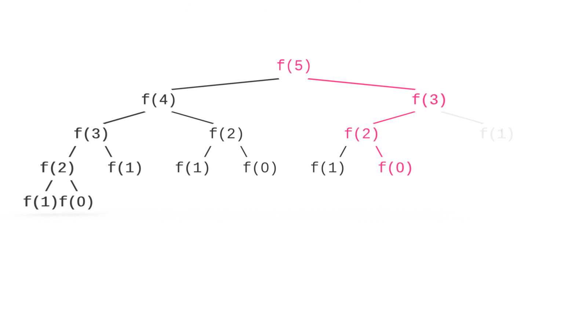

Next to Big O, the second most terrifying computer science topic might be recursion. Don’t let the memes scare you, recursion is just recursion. It’s very easy to understand and you don’t need to be a 10X developer to do so. In this tutorial, you’ll learn the fundamentals of calculating Big O recursive space complexity by calculating the sum of a Fibonacci sequence. 

If you’re just joining us, you may want to first read [Big O Recursive Time Complexity](https://jarednielsen.com/big-o-recursive-time-complexity/) or start at the beginning with [What is Big O Notation?](https://jarednielsen.com/big-o-notation/).

--- 


Be O(#1). Grab your copy of [The Little Book of Big O](https://gum.co/big-o).

---


## What Problem(s) Does Recursion Solve?

* Recursion allows us to write functions that are compact and elegant.


### What Problem(s) Does Recursion Create? 

* Recursion can easily exceed the maximum size of the call stack. 

* Recursion can make the program harder to understand not only for your collaborators, but for your future self


## What is Recursion?

In computer science, recursion occurs when a function calls itself within its declaration. 

We use recursion to solve a large problem by breaking it down into smaller instances of the same problem.

To do that, we need to tell our function what the smallest instance looks like. 

If you recall, with [proof by induction](https://jarednielsen.com/proof-induction/) we need to establish two things:

1. base
2. induction

Recursion is similar. We also need to establish a base case but rather than induction, we establish the _recursive case_. 

We use the recursive case to break the problem down into smaller instances. 

We use the base case to return when there are no more problems to be solved. 


## Time vs. Space Complexity 

We were primarily concerned with time complexity up to this point. 

When working with recursion we also want to be mindful of space complexity. 

Time complexity is how long our algorithms will take to complete their operations.

We’re not concerned with exact or specific times.

We only want to know how one time complexity compares to another time complexity. 

Why? 

We don’t know what we don’t know. 

Our algorithms are not always going to run under the same conditions.

Getting a benchmark on my desktop will be different than getting one on your laptop even if we use the same data set. 

Space complexity is how much memory our algorithms will use to complete their operations.

What are we talking about when we talk about _memory_? 

The call stack. 

Remember this? 

```js
const loop = () => loop();
```

If you run `loop()` from your browser console or Node, you’ll get an error. 

Why? 

Too much recursion! 

We _constantly_ add `loop()` to the call stack until we use up all of the allocated memory. 

Then our process yells at us!

That’s called a stack overflow. 

The classic metaphors for stacks are cafeteria trays or dishes. 

In a cafeteria, clean trays are set out in a stack. 

When you line up to get lunch, you take the tray off the top of the stack. 

When dirty trays are washed and dried, they are added to the top of the stack.

Same with function calls.

When a function is called, it is added to the stack. When it returns it is taken off the stack. 

In the application of _life_, we need to make a living. 

Let’s say I’m a part-time dishwasher. 

I go to work, so my `work()` function is pushed to the stack.

| The Stack    |
| ---        |
| work()    |


My `work()` function calls three functions. 

```
punchIn()
doDishes(tray)
punchOut()
```

When I punch in, `punchIn()` is pushed to the stack. 

| The Stack    |
| ---        |
| punchIn()    |
| work()    |

`punchIn()` immediately returns and is popped off the stack. 

Then `doDishes()` is pushed to the stack.

| The Stack    |
| ---        |
| doDishes()    |
| work()    |

My `doDishes()` function also calls three functions:
```
wash()
rinse()
dry()
```

My `doDishes()` function also accepts an argument, `tray`. 

For every dish in `tray`, I push, then pop `wash()`, `rinse()` and `dry()` on and off the stack. 

When `wash()` is called, it is pushed to the stack. 

| The Stack    |
| ---        |
| wash()    |
| doDishes()    |
| work()    |

When `wash()` returns, it is popped off the stack and then `rinse()` is called and pushed to the stack.

| The Stack    |
| ---        |
| rinse()    |
| doDishes()    |
| work()    |

When `rinse()` returns, it is popped off the stack and then `dry()` is called and pushed to the stack.

| The Stack    |
| ---        |
| dry()        |
| doDishes()    |
| work()    |

When `dry()` returns, it is popped off the stack and then `washed()` is called again and pushed to the stack.

Wash. Rinse. Dry. Repeat.

When there are no more dishes to do, `doDishes()` returns, and I punch out and push `punchOut()` to the stack.

| The Stack    |
| ---        |
| punchOut()    |
| work()    |

It returns immediately and because work is done, `work()` is popped off the stack. 

| The Stack    |
| ---        |
| work()    |


## Calculating Recursive Space Complexity

In [the previous tutorial](https://jarednielsen.com/big-o-recursive-time-complexity/), we calculated the time complexity of a naive implementation of the sum of the Fibonacci sequence. 

```js
const fibonaive = n => {
   if (n <= 0) {
       return 0;
   } else if (n === 1) {
       return 1;
   };
 
   return fibonaive(n - 1) + fibonaive(n - 2);
};
```

If the time complexity of our recursive Fibonacci is O(2^n), what’s the space complexity?

Tempted to say the same? 

We drew a tree to map out the function calls to help us understand time complexity. 


The branching diagram may not be helpful here because your intuition may be to count the function calls themselves.

Don’t count the leaves. 

How deep is the tree?

📝 Space complexity is the amount of memory used by the algorithm. 

When a function is called, it is added to the stack.

When a function returns, it is popped off the stack.

We’re not adding _all_ of the function calls to the stack at once. 

We are only making `n` calls at any given time as we move up and down branches.

We proceed branch by branch, making our function calls until our base case is met, then we return and make our calls down the next branch. 

For brevity and clarity in the graphics, I'll refer to our `fibonaive()` as `f()`. 

Let's say we call `f()` and pass it a value of `5`. 


`f(5)` is now on the call stack. 

For`f(5)` to return, it must call itself twice.

But each of those returns must return. 

All the way down.

`f(5)` first calls `f(n - 1)`, which is `f(4)`. So `f(4)` is pushed to the stack.


And `f(4)` first calls `f(n - 1)`, which is `f(3)`. So `f(3)` is pushed to the stack.


And `f(3)` first calls `f(n - 1)`, which is `f(2)`. So `f(2)` is pushed to the stack.


And `f(2)` first calls `f(n - 1)`, which is `f(1)`. So `f(1)` is pushed to the stack. 

What's our space complexity? 

O(n).

Why? 

At this point, we are only using _n_ amount of memory.


We just reached our base case. Our condition is met, so rather than making recursive calls, `f(1)` returns 1 and is popped off the stack. 


Now `f(2)` makes its second recursive call, `f(n - 2)`, which is `f(0)`. So `f(0)` is pushed to the stack. 


Our base condition is met, so rather than making recursive calls, `f(0)` returns 1 and is popped off the stack. 


Both of the recursive calls made by `f(2)` returned, so `f(2)` returns and is popped off the stack.


Now `f(3)` makes its second recursive call, which is `f(n -2)` or `f(1)`. So `f(1)` is pushed to the stack. 


We just reached our base case. Our condition is met, so rather than making recursive calls, `f(1)` returns 1 and is popped off the stack. 


Both of the recursive calls made by `f(3)` returned, so `f(3)` returns and is popped off the stack.


Now `f(4)` makes its second recursive call, which is `f(n -2)` or `f(2)`. So `f(2)` is pushed to the stack. 


And `f(2)` first calls `f(n - 1)`, which is `f(1)`. So `f(1)` is pushed to the stack. 


We just reached our base case. Our condition is met, so rather than making recursive calls, `f(1)` returns 1 and is popped off the stack. 


Now `f(2)` makes its second recursive call, `f(n - 2)`, which is `f(0)`. So `f(0)` is pushed to the stack. 


Our base condition is met, so rather than making recursive calls, `f(0)` returns 1 and is popped off the stack. 


Both of the recursive calls made by `f(2)` returned, so `f(2)` returns and is popped off the stack.


Both of the recursive calls made by `f(4)` returned, so `f(4)` returns and is popped off the stack.


Now `f(5)` makes its second recursive call, `f(n - 2)`, which is `f(3)`. So `f(3)` is pushed to the stack. 


And `f(3)` first calls `f(n - 1)`, which is `f(2)`. So `f(2)` is pushed to the stack.


And `f(2)` first calls `f(n - 1)`, which is `f(1)`. So `f(1)` is pushed to the stack. 


We just reached our base case. Our condition is met, so rather than making recursive calls, `f(1)` returns 1 and is popped off the stack. 


Now `f(2)` makes its second recursive call, `f(n - 2)`, which is `f(0)`. So `f(0)` is pushed to the stack. 




Our base condition is met, so rather than making recursive calls, `f(0)` returns 1 and is popped off the stack. 


Both of the recursive calls made by `f(2)` returned, so `f(2)` returns and is popped off the stack.


Now `f(3)` makes its second recursive call, which is `f(n -2)` or `f(1)`. So `f(1)` is pushed to the stack. 


We just reached our base case. Our condition is met, so rather than making recursive calls, `f(1)` returns 1 and is popped off the stack. 


Both of the recursive calls made by `f(3)` returned, so `f(3)` returns and is popped off the stack.


Both of the recursive calls made by `f(5)` returned, so `f(5)` returns and is popped off the stack.


How many calls to `f()` were on the stack at any given time? 

_n_.

So the space complexity is O(n).


## Big O Recursive Space Complexity

In this tutorial, you learned the fundamentals of calculating Big O recursive space complexity. In the next tutorial, we'll look at how to improve our recursive algorithms with dynamic programming. Stay tuned!