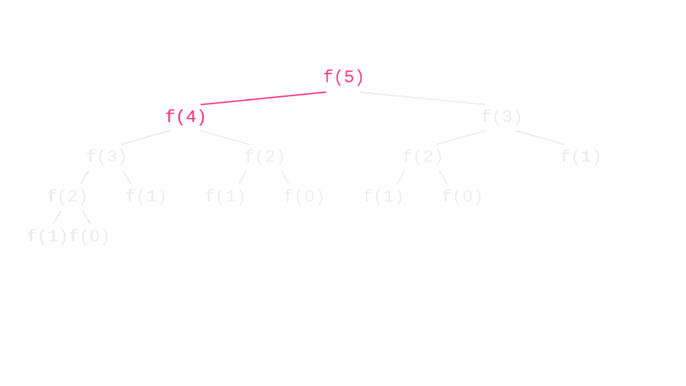
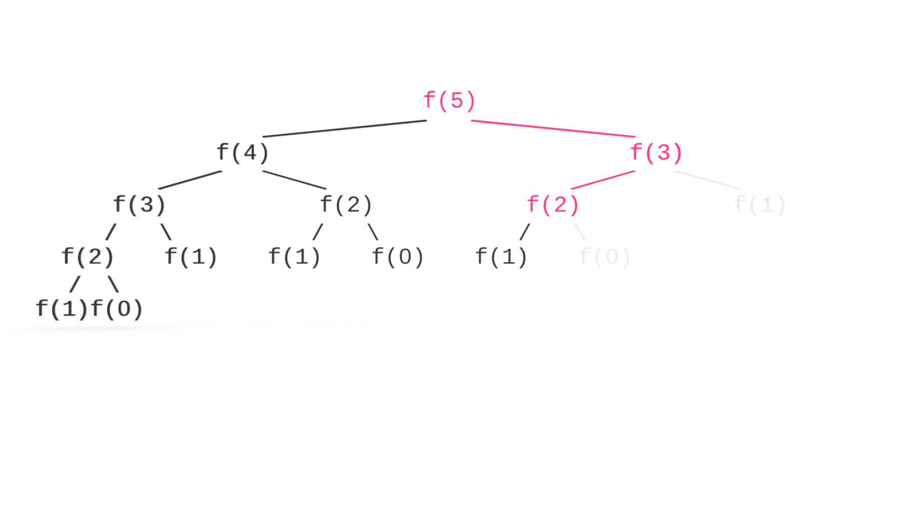

Next to Big O, the second most terrifying computer science topic might be recursion. Don’t let the memes scare you, recursion is just recursion. It’s very easy to understand and you don’t need to be a 10X developer to do so. In this tutorial, you’ll learn the fundamentals of calculating Big O recursive space complexity by calculating the sum of a Fibonacci sequence. If you’re just joining us, you may want to first read [Big O Recursive Time Complexity](https://jarednielsen.com/big-o-recursive-time-complexity/) or start at the beginning with [What is Big O Notation?](https://jarednielsen.com/big-o-notation/).


## What Problem(s) Does Recursion Solve?

* Recursion allows us to write functions that are compact and elegant.


### What Problem(s) Does Recursion Create? 

* Recursion can easily exceed the maximum size of the call stack. 

* Recursion can make the program harder to understand not only for your collaborators, but for your future self


## What is Recursion?

In computer science, recursion occurs when a function calls itself within its declaration. 

We use recursion to solve a large problem by breaking it down into smaller instances of the same problem.

To do that, we need to tell our function what the smallest instance looks like. 

If you recall, with [proof by induction](https://jarednielsen.com/proof-induction/) we need to establish two things:

1. base
2. induction

Recursion is similar. We also need to establish a base case but rather than induction, we establish the _recursive case_. 

We use the recursive case to break the problem down into smaller instances. 

We use the base case to return when there are no more problems to be solved. 


## Time vs. Space Complexity 

@TODO 


## Calculating Recursive Space Complexity

In [the previous tutorial](https://jarednielsen.com/big-o-recursive-time-complexity/), we calculated the time complexity of a naive implementation of the sum of the Fibonacci sequence. 

```js
const fibonaive = n => {
   if (n <= 0) {
       return 0;
   } else if (n === 1) {
       return 1;
   };
 
   return fibonaive(n - 1) + fibonaive(n - 2);
};
```

If the time complexity of our recursive Fibonacci is O(2^n), what’s the space complexity?

Tempted to say the same? 

We drew a tree to map out the function calls to help us understand time complexity. 


The branching diagram may not be helpful here because your intuition may be to count the function calls themselves.

Don’t count the leaves. 

How deep is the tree?

📝 Space complexity is the amount of memory used by the algorithm. 

When a function is called, it is added to the stack.

When a function returns, it is popped off the stack.

We’re not adding _all_ of the function calls to the stack at once. 

We are only making `n` calls at any given time as we move up and down branches.

We proceed branch by branch, making our function calls until our base case is met, then we return and make our calls down the next branch. 

For brevity, I'll refer to our `fibonaive()` as `f()`. 


@TODO



@TODO


@TODO


@TODO


@TODO


@TODO


@TODO


@TODO


@TODO


@TODO


@TODO


@TODO


@TODO


@TODO


@TODO


@TODO


@TODO


@TODO


@TODO


@TODO


@TODO


@TODO




@TODO


@TODO


@TODO


@TODO


@TODO


@TODO


@TODO


@TODO


So the space complexity is O(n).


## Big O Recursive Space Complexity

In this tutorial, you learned the fundamentals of calculating Big O recursive space complexity. 

@TODO
