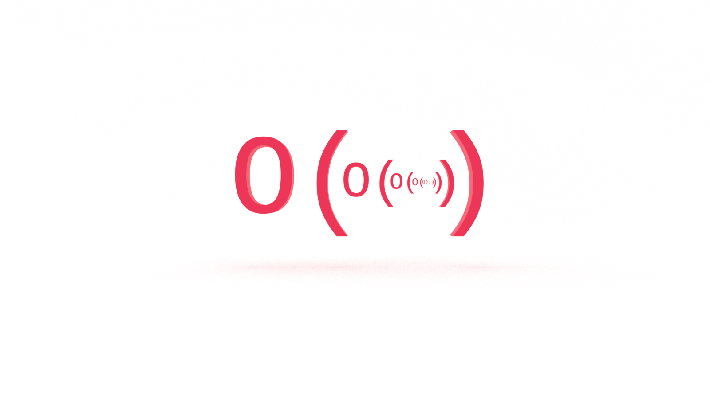
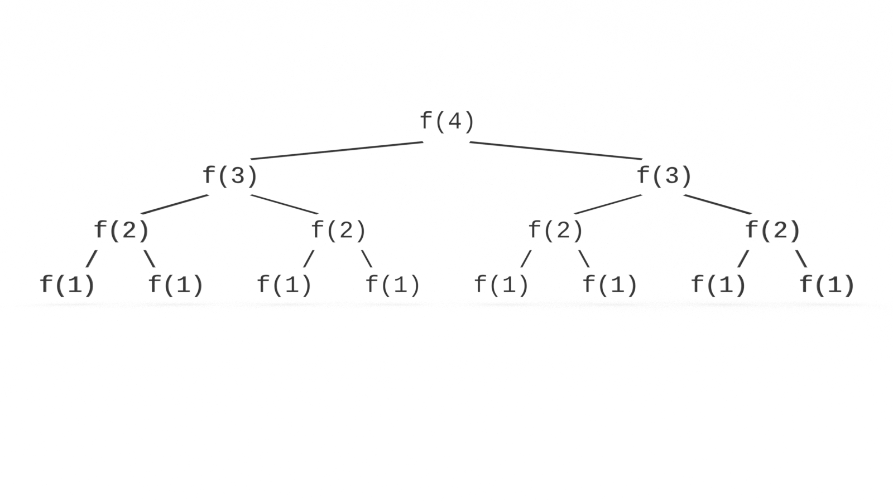
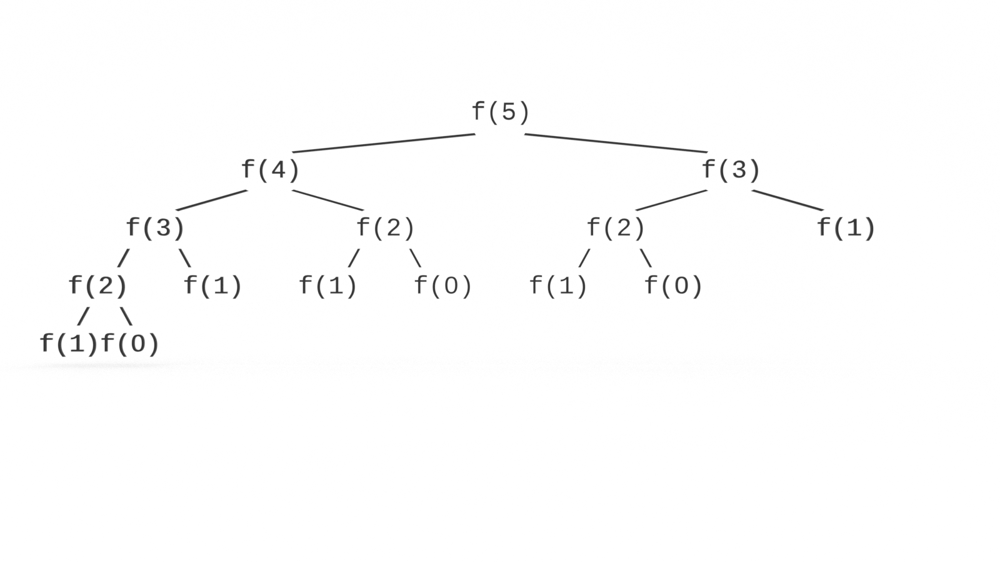
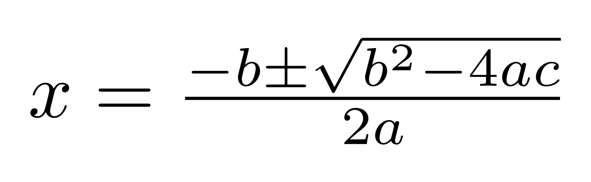

After Big O, the second most terrifying computer science topic might be recursion. Don’t let the memes scare you, recursion is just recursion. It’s very easy to understand and you don’t need to be a 10X developer to do so. In this tutorial, you’ll learn the fundamentals of calculating Big O recursive time complexity.


## What Problem(s) Does Recursion Solve?

* Recursion allows us to write functions that are compact and elegant.


### What Problem(s) Does Recursion Create? 

* Recursion can easily exceed the maximum size of the call stack. 

* Recursion can make the program harder to understand not only for your collaborators, but for your future self


## What is Recursion?

In computer science, recursion occurs when a function calls itself within its declaration. 

For example: 
```js
const loop = () => loop();
```

If you run this in your browser console or using Node, you’ll get an error. 

Why? 


Too much recursion!

`const loop()` is just that, a _constant_ loop.

🔁

We use recursion to solve a large problem by breaking it down into smaller instances of the same problem.

To do that, we need to tell our function what the smallest instance looks like. 

If you recall, with [proof by induction](https://jarednielsen.com/proof-induction/) we need to establish two things:

1. base
2. induction

Recursion is similar. We also need to establish a base case but rather than induction, we establish the _recursive case_. 

We use the recursive case to break the problem down into smaller instances. 

We use the base case to return when there are no more problems to be solved. 

For example. a family on vacation:

```js
const fighting = patience => {
 if (patience <= 0) {
   return "If you don’t stop fighting, I will turn this car around!"
 }
 return fighting(patience - 1);
};
```

The kids are fighting in the backseat. 

Dad is driving and quickly losing his patience. 

Our recursive case is the constant fighting. 

Our base case is dad’s patience when it runs out.

🚗 


### Recursion: Factorial

The classic example of recursion is computing the factorial of a given number.

What’s a [factorial](https://en.wikipedia.org/wiki/Factorial)? 

A factorial is the product of all positive integers less than or equal to _n_. 

We write that as _n!_. 

For example, 5!:
```
5 * 4 * 3 * 2 * 1 = 120
```

Here’s an iterative factorial in JavaScript:
```js
const factorial = num => {
   if (num === 0 || num === 1) {
       return 1;
   }
 
   for (let i = num - 1; i >= 1; i--) {
     num *= i;
   }
   return num;
};
```

And here it is refactored with recursion:
```js
const factorial = num => {
   if (num == 0 || num === 1) {
       return 1;
   } else {
       return (num * factorial(num - 1));
   }
};
```

Every call to `factorial()` again calls `factorial()`, but decreases the value of `num` by 1, until the base case is met and 1 is returned. 


## Fibonacci

[Fibonacci](https://en.wikipedia.org/wiki/Fibonacci_number) is a sequence of numbers where each number is the sum of the preceding two. 

It starts like this...
```
0 1 1 2 3 5 8 13 21 34 55 89 144…
```

Fibonacci algorithms are standard challenges for beginners and technical interviews. There are many ways to solve a Fibonacci algorithm and each reveals the depth of your knowledge.

Let’s dive in!


### Iterative Fibonacci 

Before we get to recursion, let’s look at an iterative solution to the problem.

Given an integer, `n`, calculate the sum of a Fibonacci sequence.
```js
const fiberative = n => {
   let arr = [0, 1];
   for (let i = 2; i < n + 1; i++){
     arr.push(arr[i - 2] + arr[i -1])
   }
  return arr[n];
};
```

What is the order of `fiberative()`?

O(n).

Why? 

Our solution is _iterative_. We perform `n` operations. 

If you want to go deeper, check out [Big O Linear Time Complexity](https://jarednielsen.com/big-o-linear-time-complexity/)


### Recursive Fibonacci

Now let’s implement our algorithm using recursion. 

```js
const fibonaive = n => {
   if (n <= 0) {
       return 0;
   } else if (n === 1) {
       return 1;
   };
 
   return fibonaive(n - 1) + fibonaive(n - 2);
};
```

What’s the order of `fibonaive()`?

Spoiler: it’s not good. 

That’s why this approach is referred to as the _naive_ implementation. 

Let’s get informed.


## Calculating Recursive Time Complexity

Let’s make a small adjustment to `fibonaive()` for the purpose of illustration:

```js
const fibonot = n => {
   if (n <= 0) {
       return 0;
   } else if (n === 1) {
       return 1;
   };
 
   return fibonot(n - 1) + fibonot(n - 1);
};
```

☝️ We only modified the last line so that `fibonot()` is now balanced. 

What’s happening in our function?

Every time we call `fibonot()`, we call `fibonot()` twice.

In each of those calls, we subtract 1 from `n`.

How many times does this happen?

`n` 

We call `fibonot()` until the value of `n`  is less than or equal to 0, or equal to 1, then we return without a call.

Have we seen this, or something like it, before?

🤔

Every invocation of `fibonot()` creates two _branches_ by calling itself twice. 

Our branches are creating a _tree_.

With each iteration, the value of `n` becomes smaller until one of our _base_ conditions is met. 

So the _depth_  of our tree is `n`. 

Let’s map out the calls:



Do you see a pattern? 

Where have we seen this, or something like it, before? 

🤔

[Powers of 2!](https://jarednielsen.com/sum-consecutive-powers-2/)

| Exponent   | Power    |
| ---        | ---      |
| 2^3        | 8        |
| 2^2        | 4        |
| 2^1        | 2        |
| 2^0        | 1        |

So what’s the order of `fibonot()`? 

O(2^n)

Exponential! 

Ew!

As a rule of thumb, when calculating recursive runtimes, use the following formula:

> _branches^depth_

Where branches are the number of recursive calls made in the function definition and depth is the value passed to the first call.

In the illustration above, there are two branches with a depth of 4. 

Let’s return to `fibonaive()`.

What’s its Big O? 

For our purposes, it’s O(2^n).

Technically, it’s O(1.6^n). 

Why? 

Let’s plant a tree! 🌲



What do you see? 

Unlike `fibonot()` above, our tree is not balanced. 

How many leaves are there on the tree? 

We _could_ count them by hand, but we’re problem solvers. 


### Math O’Clock 🧮🕒

Fibonacci is also expressed using the following formula:
```
F(n) = F(n -1) + F(n - 2)
```

Let’s use this formula to solve for `x`
```
x^n = x^(n -1) + x^(n - 2)
```

We first divide both sides by x^(n - 2)
```
x^2 = x + 1
```

Subtract 1 from both sides
```
x^2 - 1 = x
```

Subtract x from both sides 
```
x^2 - 1 - x = 0 
```

Where have we seen this, or something like it, before? 

🤔

It’s a quadratic equation! 

Quadratic equations follow the form:
```
ax^2 + bx + c = 0
```

We can use the quadratic formula to solve for x. 



Let’s plug in our values:
```
- (-1) + sqrt((-1)^2 - 4 * 1 * (-1)) / 2 * 1
```

First, let’s simplify the numerator.

A negative negative is positive, so:
```
1 + sqrt((-1)^2 + 4 * 1 * 1)
```

A negative integer raised to a power is positive, so:
```
(-1)^2 = 1
```

Leaving us with the following:
```
1 + sqrt(1 + 4 * 1 * 1)
```

If we simplify the terms of the numerator:
```
1 + sqrt(5)
```

And simplify the terms of the denominator:
```
x = (1 + sqrt(5)) / 2
```

Which is equal to ~1.6.

AKA φ

AKA [Phi](https://en.wikipedia.org/wiki/Phi)

AKA [Binet’s formula](https://en.wikipedia.org/wiki/Fibonacci_number#Binet's_formula).

AKA [the Golden Ratio](https://en.wikipedia.org/wiki/Golden_ratio). 

☝️

“Hold up there, mister”, I hear you say. 

“What about the other half of the quadratic formula?”

Good eye! 🕵️

You noticed that the quadratic formula results in two solutions, signified by the [plus-minus sign](https://en.wikipedia.org/wiki/Plus%E2%80%93minus_sign).

Each solution charts the x-intercept of a parabola. 

But we’re not interested in negative values, so we can stop with one solution.


## Space Complexity: The Final Frontier 🚀

If the time complexity of our recursive Fibonacci is O(2^n), what’s the space complexity?

Tempted to say the same? 

The branching diagram may not be helpful here because your intuition may be to count the function calls themselves.

Don’t count the leaves. 

How deep is the tree?

📝 Space complexity is the amount of memory used by the algorithm. 

When a function is called, it is added to the stack.

When a function returns, it is popped off the stack.

We’re not adding _all_ of the function calls to the stack at once. 

We are only making `n` calls at any given time as we move up and down branches.
We proceed branch by branch, making our function calls until our base case is met, then we return and make our calls down the next branch. 

So the space complexity is O(n).


## Big O Recursive Time Complexity

In this tutorial, you’ll learn the fundamentals of calculating Big O recursive time complexity. If recursive runtimes are so bad, why is everyone so hot for recursion? We’ll answer that in a future article. Stay tuned.
