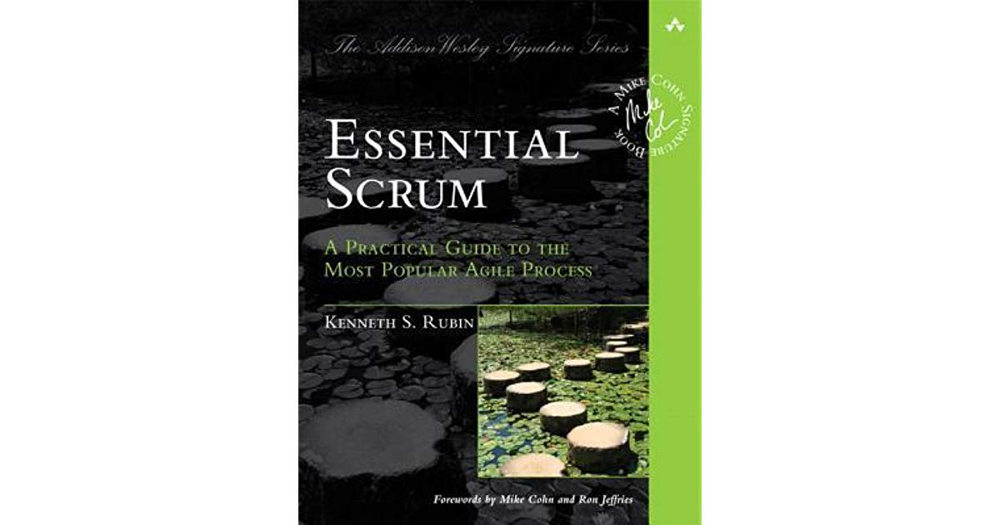

@TODO introduction; what problem(s) does scrum solve?

[Essential Scrum by Kenneth S. Rubin](https://amzn.to/39cryel) 

## What Problems are Solved by Scrum?

* 

* 

_Note: Amazon links are affiliate._

## Book Summary of _Essential Scrum_ by Kenneth S. Rubin

> Scrum is an agile approach for developing innovative products and services.

> With an agile approach, you begin by creating a **product backlog** -- a prioritized list of the features and other capabilities needed to develop a successful product. Guided by the product backlog, you always work on the most important or highest-priority items first. When you run out of resources (such as time), any work that didn’t get completed will be of lower priority than the completed work. 

> The work itself is performed in short, timeboxed **iterations**, which usually range from a week to a calendar month in length. During each iteration, a self-organizing, **cross-functional team** does all of he work -- such as designing, building, and testing -- required to produce complete, working features that could be put into production.

> Typically the amount of work in the product backlog is much greater than can be completed by a team in one short-duration iteration. So, at the start of each iteration, the team plans which high-priority subset of the product backlog to create in the upcoming iteration.

> At the end of the iteration, the team reviews the complete features with the stakeholders to get their feedback. Based on the feedback, the product owner and team can alter both they plan to work on next and how the team plans to do the work.

> At the end of each iteration, the team should have a potentially shippable product (or increment of the product), one that can be released if appropriate. 
    

### Can Scrum Help You?

> Scrum’s focus on delivering working, integrated, tested, business-valuable features each iteration leads to results being delivered fast. Scrum is also well suited to help organizations succeed in a complex world where they must quickly adapt based on the interconnected actions of competitors, customers, users, regulatory bodies, and other stakeholders. And Scrum provides more joy for all participants. Not only are customers delighted, but also the people doing the work actually enjoy it! They enjoy frequent and meaningful collaboration, leading to improved interpersonal relationships and greature mutual trust among team members.

> Though Scrum is an excellent solution for many situations, it is not the proper solution in all circumstances. The **Cynefin framework** (Snowden and Boone 2007) is a sense-making framework that helps us understand the situation in which we have to operate and decide on a situation-appropriate approach. 

#### Cynefin Framework

* Complex domain:
    * “This is the domain of emergence. We need to explore to learn about the problem, then inspect and adapt based on our learning.”
    * “If there is a right answer, we will know it only with hindsight.”
    * “Scrum is particularly well suited for operating in a complex domain. In such situations our ability to prove (explore), sense (inspect), and respond (adapt) is critical.”

* Complicated domain:
    * “Complicated problems are the domain of good practices dominated by experts. There might be multiple right answers, but expert diagnosis is required to figure them out.”
    * Because of this, Scrum is not the best solution for these types of problems.

* Simple domain
    * “When dealing with simple problems, everyone can see cause and effect. Often the right answer is obvious and undisputed. This is the domain of legitimate best practices. There are known solutions.”
    * Scrum is not the most efficient tool for this type of problem.
    * “Using a process with a well-defined, repeatable set of steps that are known to solve the problem would be a better fit.”

* Chaotic domain
    * “Chaotic problems require a rapid response. We are in a crisis and need to act immediately to prevent further harm and reestablish at least som order”
    * Scrum is not the best solution here. 
        * “With chaotic problems, someone needs to take charge of the situation and act.” 

* Disorder
    * “You are in the disorder domain when you don’t know which of the other domains you are in.”
    * When you are in the disorder domain, they way out is to break down the situation into constituent parts and assign each to one of the other four domains You are not trying to apply Scrum in the disorder domain; you are trying to get out of this domain.”

> Scrum is not a silver bullet or a magic cure. Scrum can, however, enable you to embrace the changes that accompany all complex **product development efforts**.

> Although the Scrum framework is simple, it would be a mistake to assume that Scrum is easy and painless to apply. Scrum doesn’t prescriptively answer your process questions; instead, it empowers teams to ask and answer their own great questions. Scrum doesn’t give individuals a cookbook solution to all of their organizational maladies; instead, Scrum makes visible the dysfunctions and waste that prevent organizations from reaching their true potential.

### Scrum Framework

#### Scrum Roles

* Product Owner
    * The empowered central point of product leadership.
    * The product owner maintains and communicates to all other participants a clear vision of what the Scrum team is trying to achieve.

* ScrumMaster
    * Helps everyone involved understand and embrace the Scrum values, principles, and practices. 
    * Acts as a coach, providing process leadership and helping the Scrum team and the rest of the organization develop their own high-performance, organization-specific Scrum approach.
    * Helps the team resolve issues and make improvements to its use of Scrum.
    * Responsible for protecting the team from outside interference and takes a leadership role in removing impediments that inhibit team productivity.
* Development Team
    * A diverse, cross-functional collection of architects, programmers, testers, database administrators, UI designers, and so on, who are responsible for designing, building and testing the desired product. 

#### Scrum Activities and Artifacts
* Product backlog
* Sprints
* Sprint Planning
* Sprint Execution
* Daily Scrum
* Done
* Defined as a potentially shippable product increment
* Sprint Review
* Sprint Retrospective

### Agile Principles

#### Scrum vs. Plan-driven Development

> Plan-driven processes (waterfall, tradiational, sequential, anticipatory, predictive or prescriptive development processes )are so named because they attempt to plan for and anticipate up front all of the features a user might want in the end product, and to determine how best to build those features. The idea here is that the better the planning, the better the understanding, and therefore the better the execution. 

> Plan-driven development works well if you are applying it to problems that are well defined, predictable, and unlikely to undergo any significant change. The problem is that most product development efforts are anything but predictable, especially at the beginning. So, while a plan-driven process gives the impression of an orderly, accountable, and measurable approach, that impression can lead to a false sens of security. After all, developing a product rarely goes as planned. [P]lan-driven development approaches are based on a set of beliefs that do not match the uncertainty inherent in most product development efforts.

> Scrum, on the other hand, is based on a different set of beliefs -- ones that do map well to problems with enough uncertainty to make high levels or predictability difficult. 

* Variability and uncertainty
    * Embrace helpful variability
        * In product development… the goal is to create the unique _single instance_ of the product, not to _manufacture_ the product. This single instance is analogous to a unique recipe. We don’t want to create the same recipe twice; if we do, we have wasted our money. 
    * Employ iterative and incremental development
        * **Iterative development** acknowledges that we will probably get hings wrong before we get them right and that we weill do things poorly before we do them well. As such, iterative development is a planned rework strategy.
        * The biggest downside to iterative development is that in the presence of uncertainty it can be difficult up front to determine (plan) how many improvement passes will be necessary.
        * **Incremental development** is based on the age-old principle of “Build some of it before you build all of it”. We avoid having one large, big-bang-style event at the end of development where all the pieces come together and the entire product is delivered. Instead, we break the product into smaller pices so that we can build some of it, learn how each piece is to survive in the environment in which it must exist, adapt based on what we learn, and then build more of it. 
        * The biggest drawback to incremental development is that by building in pieces, we risk missing the big picture (wee see the trees but not the forest).
        * In Scrum, we don’t work on a phase at a time; we work on a feature at a time.
        * We receive feedback… which allows us to adapt. Scrum does not require that we predetermine a set number of iterations. The continuous stream of feedback will guide us to do the appropriate and economically sensible number of iteration while developing the product incrementally.
    * Leverage Variability through Inspection, Adaptation and Transparency
        * Scrum embraces the fact that in product development, some level of variability is required in order to build something new. Scrum also assumes that the process necessary to create the product is complex and therefore would defy a complete up-front definition. Furthermore, it generates early and frequent feedback to ensure that the right product is built and that the product is built right.
        * To do this well, we rely on transparency: all of the information that is important to producing a product must be available to the people involved in creating the product. 
    * Reduce All Forms of Uncertainty Simultaneously
        * End uncertainty (what)
        * Means uncertainty (how)
        * In Scrum, we do not constrain ourselves by fully addressing one type of uncertainty before we address the next type. Instead, we take a more holistic approach and focus on simultaneously reducing all uncertainties.

* Prediction and adaptation
    * We are constantly balancing the desire for prediction with the need for adaptation. How?
        * Keep options open
        * Last responsible moment
            * We delay commitment and do not make important and irreversible decisions until the last responsible moment
            * And when is that? When the cost of not making a decision becomes greater than the cost of making a decision
        * Accept that you can’t get it right up front
            * In Scrum, we acknowledge that we can’t get all of the requirements or the plans right up front. In fact, we believe that trying to do so could be dangerous because we are likely missing important knowledge
        * Favor an adaptive, exploratory approach
            * When faced with uncertainty, we buy information by exploring
        * Embrace change in an economically sensible way
            * In Scrum, we assume that change is the norm
            * Manage the amount of work in process and the flow of that work so that the cost of change is less affected by time that it is with sequential projects
        * Balance predictive up-front work with adaptive just-in-time work
            * Up-front work should be helpful without being excessive

* Validated learning
    * Validate important assumptions fast
        * Assumptions represent a significant development risk
    * Leverage multiple concurrent learning loops
        * Constant learning is a key to our success
    * Organize workflow for fast feedback
        * We ensure that feedback generating activities occur in close time proximity to the original work
        * Fast feedback closes the learning loop quickly, allowing us to truncate bad development paths before they can cause serious economic damage.

* Work-in-progress (WIP)
    * Use economically small batches
        * Single piece flow over all-before-any
    * Recognize inventory and manage it for good flow
        * Although we need some requirements if we are going to start development, we don’t need to have _all_ of the requirements. If we have too many requirements, we will likely experience inventory waste when requirements changes. On the other hand, if we don’t have enough requirements inventory, we will disrupt the fast flow of work, which is also a form of waste.
    * Focus on Idle work, not idle workers
        * Idle work is something we want to do but can’t do because something is preventing us
        * “Watch the baton, not the runners”
        * You don’t win the race (deliver products) when the baton is on the ground.
    * Consider cost of delay

* Progress
    * Adapt to real-time information and replan
        * Our goal is to rapidly replan and adapt to the stream of economically important information that is continuously arriving during the development effort
    * Measure progress by validating working assets
        * Can we really claim success if we finish on time and on budget and yet fail to meet customer expectations?
        * With Scrum, we measure progress by building working, validated assets that deliver value and that can be used to validate important assumptions.
    * Focus on value-centric delivery
        * A customer-value-centric form of development… is based on a prioritized, incremental model of delivery in which the highest-value features are continuously build and delivered in the next iteration.

* Performance
    * Go fast but never hurry
        * In Scrum, one core goal is to be nimble, adaptable, and speedy. By going fast, we deliver fast, we get feedback fast, and we get value into the hands of our customers sooner. Learning and reacting quickly allow us to generate revenue and/or reduce costs sooner.
        * In Scrum, time is of the essence but we don’t rush to get things done. 
    * Sustainable pace
        * People should be able to work at a pace that they can continue for an extended period of time
    * Build in quality
        * Each increment of value that is created is completed to a high level of confidence and has the potential to be put into production or shipped to customers
    * Employ minimally sufficient ceremony
        * In Scrum, our goal is to eliminate unnecessary formality. Therefore, we set the ceremonial bar at a low level, one that is minimally sufficient or good enough.
    * Scrum isn’t anti-documentation:
        * We adopt an economic perspective and carefully review which documents we create. 

That’s the high-level conceptual framework of scrum. The remainder of the book discusses it’s implementation.

[Essential Scrum by Kenneth S. Rubin](https://amzn.to/39cryel) 
