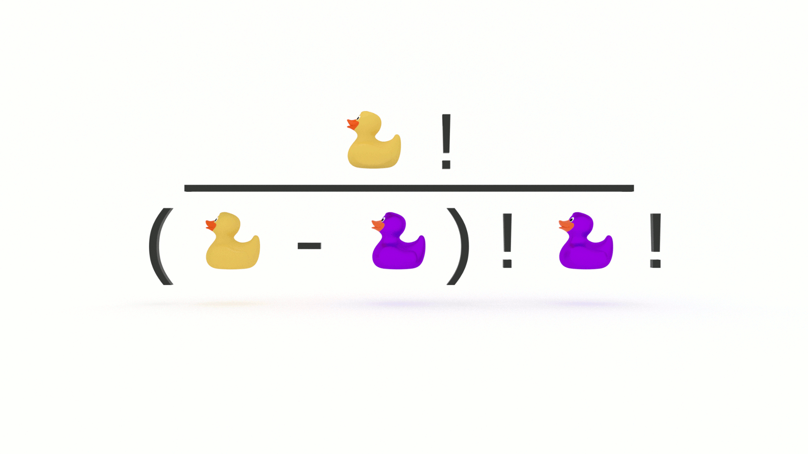

You don’t need to be a math whiz to be a good programmer, but there are a handful of tricks you will want to add to your problem solving bag to improve the performance of your algorithms and make an impression in technical interviews. In this tutorial, you will learn how to calculate permutations and combinations of a series of n integers with simple and easy to remember equations.


## What is the Difference Between Permutations and Combinations? 

* Permutations, sequence is important

We are interested in the order of placement of items.
 
* Combinations, sequence is not important

We are interested in the number of groups we can create.

Let’s look at an example.

How many three letter permutations are there for the letters A, B & C?
```
ABC
ACB
BCA
BAC
CAB
CBA
```

There are six permutations. 

What about combinations? 

Well, there’s only one.

Why?

No matter the order, our group always contains the same three letters, A, B & C.

When we calculated the permutations for three letters, did you notice a pattern? 

Let’s try four letters:
```
ABCD
ABDC
ACBD
ACDB
ADBC
ADCB
BACD 
BADC
BCAD
BCDA
BDAC
BDCA
CABD 
CADB
CBAD 
CBDA
CDAB
CDBA
DABC
DACB
DBAC 
DBCA
DCAB 
DCBA 
```

We just made a big jump in the number of permutations we need to calculate! 

Where have we seen this, or something like it, before? 

🤔

Factorial!

In the first example using three letters, our permutations were _3!_, or:
```
3 * 2 * 1 = 6
```

In the second example using four letters, our permutations were _4!_, or:
```
4 * 3 * 2 * 1 = 24
```

What about calculating subsets of permutations?


## How to Calculate Permutations

Say you’re the judge of a baking competition and you need to award gold, silver and bronze cake stands to the top three of 12 contestants, but all of the bakers are deserving of an award.

How many options do you need to calculate? 

This is a permutations problem.

Why?

The order is important. 

We are ranking, or ordering, the three best bakers. 

We award the gold to Noel. 

Now there are only eleven contestants to choose from.

We award the silver to Sandy.

Now there are only ten contestants to choose from.

We award the bronze to Prue. 

Those three are the obvious winners. 

(Sorry, Paul.)

But if it weren’t so obvious, how many possible permutations would we need to calculate?

Each time we select a winner, that individual is removed from the group and we calculate the possible permutations of the remaining individuals. 

What’s 12!?
```
12 * 11 * 10 * 9 * 8 * 7 * 6 * 5 * 4 * 3 * 2 * 1 = 479001600
```

That’s a lot of processing!

Luckily, we don’t need to calculate that many permutations. 

We only need to calculate the permutations for three winners.

How do we do this? 

We simply stop after the three largest values in our sequence:
```
12 * 11 * 10 = 1320
```

Why?


There’s no need to calculate _all_ of the permutations, only those for the three largest values. 

This is still a lot of permutations, but a much more manageable number. 

What if we didn’t know the size of our input at the outset? 

Let’s convert this to an equation!

What’s another way of describing the numbers we did not factor?
```
9 * 8 * 7 * 6 * 5 * 4 * 3 * 2 * 1
```

9!

Because factorial is the _product_ of a sequence, we can’t simply subtract 9! from 12!. 

We need to divide it:
```
12! / 9!
```

We could also write this as:
```
12! / (12 - 3)!
```

Now it’s simply a matter of substituting values with variables. 
```
n! / (n - k)!
```


## How to Calculate Combinations

Let’s say we’re ordering pizzas to feed the participants of a hackathon. 

Because these are programmers, they want to know how many possible combinations are available to choose from. 

The local pizza shop gives us 12 options for toppings, but we can only choose three per pizza. 

How many different pizzas are possible? 

This is a combinations problem.

Why? 

Because order doesn’t matter.

A pizza with pepperoni, peppers, and pineapple is the same as a pizza with pineapple, peppers, and pepperoni.

But because order doesn’t matter, redundancy does. 

When we calculate permutations, there are no redundancies in the _order_ of the elements, but there are a lot of redundancies in the _grouping_ of elements. 

How do we remove the redundant combinations? 

We simply divide by the number of permutations of _k_, or _k!_
```
( n! / (n - k)! ) / k!
```

Which is also: 
```
( n! / (n! - k!) ) * 1 / k!
```

When simplified is:
```
n! / (n - k)! * k!
```

This is often written as:


And read as “_n_ choose _k_”, because there are _n_ ways to choose an unordered subset of _k_ elements from a fixed set of _n_ elements.

AKA the [binomial coefficient](https://en.wikipedia.org/wiki/Binomial_coefficient)


## How to Calculate Permutations and Combinations

You don’t need to be a math whiz to be a good programmer, but there are a handful of equations you will want to add to your problem solving toolbox. In this tutorial, you learned how to calculate permutations and combinations of a series of n integers with simple and easy to remember equations. They’re like party tricks for technical interviews. 
