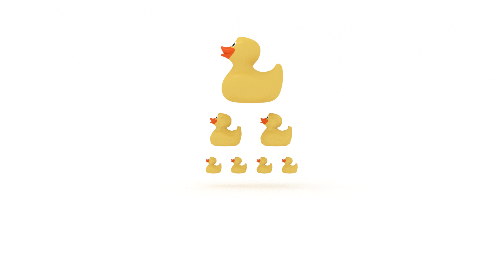

When learning something new, we want to create chunks. With chunking, we learn a concept then combine that concept with other concepts to solve problems. If we encounter a concept that is too big to understand, we need to break it into smaller chunks, then recombine the chunks. 

_This article originally published in my newsletter, [The Solution](http://eepurl.com/cP8CMn)_

## Learning by Chunking

How do you eat an elephant? 

You don’t. 

You first become a vegan.

Then you donate to the WWF. 

Lastly, you get online and start a flamewar with anyone who uses this archaic idiom.

You can find me on Twitter [@jarednielsen](https://twitter.com/jarednielsen).

See what I did there? 

If you want to master a new skill or solve a mammoth problem, break it into bite-, or byte-, sized pieces. These pieces are chunks. According to Barbara Oakley in [A Mind for Numbers](https://amzn.to/2UWpClG): 

> One of the first steps toward gaining expertise in math and science is to create conceptual chunks--mental leaps that unite separate bits of information through meaning.

Oakley outlines three steps for learning by chunking:

1. Focus

2. Understand

3. Contextualize

### Focus

You can’t truly learn something if you are distracted, trying to learn too many things at once, or trying to eat an elephant. Continually break the problem down until the pieces are digestible and proceed one-at-a-time.

We divide & conquer! Or should we say, we _chunk_ & conquer?

This is also a common pattern in algorithm design. 

Divide & conquer recursively breaks a problem down into smaller and smaller pieces. 

These smaller pieces are then recombined into a solution to the problem. 

What’s the pattern?

* Divide

* Conquer

* Combine

What are the chunks you need to know to implement a divide and conquer algorithm?

* Basic maths (division and inequality)

* Conditional statements and operators

* Iteration

* Recursion

We could break it down even further.

* Variables

* Data types

* Array methods

* Indexes

* Functions

* Control flow

* Etc.

These are a few of the programming fundamentals, or chunks, in our library that enable us to create more complex chunks, such as recursion.

### Understand

Chunks are useless if you don’t know what they mean. 

How does this chunk work? Why?

In understanding our chunks, we begin to build a library. According to Oakley:

> In building a chunked library, you are training your brain to recognize not only a specific problem, but different types and classes of problems so that you can automatically know how to quickly solve whatever you encounter. You’ll start to see patterns that simplify problem solving for you and will soon find that different solution techniques are lurking at the edge of your memory. 

### Contextualize

Lastly, put the pieces back together. How does what you are chunking fit into the big picture? 

How does it relate to other chunks? 

> Chunking may involve your learning how to use a certain problem-solving technique. Context means learning when to use that technique instead of some other technique.

## How to Use Chunking for Learning and Problem Solving

When learning something new, we want to create chunks. Chunks are separate bits of information united through meaning. With chunking, we learn a concept then combine that concept with other concepts to solve problems. If we encounter a concept that is too big to understand, we need to break it into smaller chunks, then recombine the chunks. 

 

