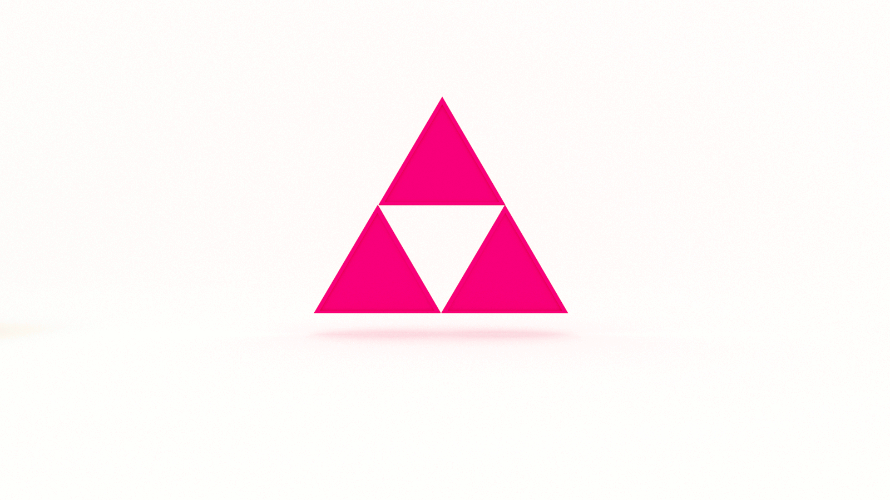

[The Triforce of computer science!](https://jarednielsen.gumroad.com/l/computerscience) 

It grants godlike power to whoever holds all three pieces: Algorithms, Data Structures, and Big O!

If you’re not familiar with it, the Triforce is an artifact of the Legend of Zelda video game franchise, with much of the game play centered on gathering and recombining its three pieces. According to Ye Olde Wikipedia:

When the three pieces of the Triforce are combined, they create a divine artifact that has the power to grant any wish. For this reason, the combined Triforce has been the main source of struggle for control within the series, due to its limitless power.

The pieces of the Triforce represent Power, Courage, and Wisdom.

According to Merriam-Webster, these are the definitions for each of these attributes: 

* Power: ability to act or produce an effect

* Courage: mental or moral strength to venture, persevere, and withstand danger, fear, or difficulty

* Wisdom: ability to discern inner qualities and relationships

Like the Triforce, possessing knowledge of Algorithms, Big O, and Data Structures can grant (almost) any wish. Combined, they establish the foundation for solving any programming problem. 

Algorithms are powerful. We can think of them as items in Link’s inventory, equipping our hero to crawl dungeon after dungeon. But, as we’ve seen over the last few years, algorithms can cause massive societal change, both positive and negative. “With great power comes great responsibility.” Oh, wait. That’s Spider-Man. But still applicable. 

As the Hero’s Shade says in Twilight Princess, “A sword wields no strength unless the hand that holds it has courage.” And an algorithm is only as strong as the data structure that supports it. You can only do so much without an array. Even then, at some point, an array becomes limiting and you need an object or dictionary. Or a tree. Or a graph. Or a Link-ed list ;)

In The Ocarina of Time, Zelda tells Link, “The flow of time is always cruel…”  So is the flow of space! With Big O, we demonstrate wisdom by analyzing the performance of our algorithms and asking the question: “Can we do better?” 

Learning is an adventure. 

"It's dangerous to go alone! Take this."

[The Triforce of computer science!](https://jarednielsen.gumroad.com/l/computerscience) 

To aid you on your journey, this bundle contains the following books:

* A is for Algorithms

* The Seven Data Structures of Highly Effective Developers

* The Little Book of Big O

May you be powerful, courageous, and wise this year. 

