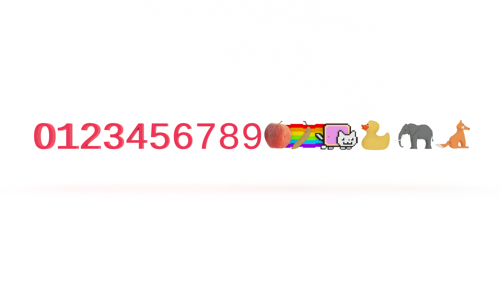

You don't need to be a math whiz to be a good programmer, but there are a handful of mathematical concepts to learn to help you understand how computers work and set yourself up for success in interviews. In this tutorial, you will learn how to convert a decimal to any base between binary and hexadecimal using a Stack data structure with examples in JavaScript. 


## Retrieval Practice

* What's a stack? 

* What's a base? 

* How do you convert a decimal to binary?


### What's a Stack? 

A stack is a data structure that follows the Last In First Out principle (LIFO). We can only add or remove elements from the top of the stack .

If you want to go deeper, check out [JavaScript Stack Data Structure](https://jarednielsen.com/data-structure-stack-javascript/).


### What's a Base? 

A base is the number of different digits used to count in a numerical system. We count in base 10 most likely due to us evolving ten fingers. When we count in base 10, we use ten distinct _whole_ numbers.  


### How to Convert a Decimal to Binary

To understand how to convert a decimal to base, it's useful to first understand how to convert a decimal to binary. Binary is base 2. We have two different digits to count with, `0` and `1`. (Or `true` and `false`). 

To calculate a binary value, we need to divide the decimal by `2` until the quotient is zero. We store the remainder of each division operation and use that to create a string representing the base. 

If you want to go deeper, check out [How to Convert a Decimal to Binary in JavaScript](https://jarednielsen.com/convert-decimal-binary/)


## Let's Get Meta 🧠

Ask yourself the following questions and keep them back of mind as you proceed: 

* How do you build something out of nothing? 

* How do we count using a base greater than 10? 

* Why do I need to know this?


## How to Convert Decimal to Base 

If converting a decimal to binary is simply a process of repeatedly dividing the decimal by `2` and using the remainder to build a string, how do you think we convert a decimal to _any_ base? 

What's the pattern? 

We divide the decimal by the base!

Let's convert `2048` to base-16, hexadecimal. To do that, though, we need to answer the question posed above: how do we count using a base greater than 10? 

What is a number? 

It's a symbol representing a value. 

What is `1`? 

A symbol representing the value _one_.

What is 'one'? 

A symbol representing the value `1`. (And round and round we go...)

What is `10`? 

In the decimal, or base-10, numeral system, it's a value represented by _two_ symbols. Because it's two symbols, we can't use it in base-16. What's the solution? More symbols!

Hexadecimal, or base-16, uses the first six characters of the Roman alphabet to represent the values of 10 through 15. 

| Decimal   | Hexadecimal   |
| ---       | ---           |
| 10        | A             |
| 11        | B             |
| 12        | C             |
| 13        | D             |
| 14        | E             |
| 15        | F             |

If we wanted to create our own base, say, _Emojidecimal_, we could use whatever symbols we want: 

| Decimal   | Hexadecimal   |
| ---       | ---           |
| 10        | 🍎            |
| 11        | 🍌             |
| 12        | 🐈             |
| 13        | 🐕             |
| 14        | 🐘             |
| 15        | 🦊             |

The symbol doesn't matter, as long as we all agree on the value that it represents. Do you think Emojidecimal will gain traction? 🤔

Let's convert `2047` to hexadecimal. The first step is to get the remainder of our dividend and divisor.

```
2048 % 16 = 15
```

Our remainder is `15`, but we are no longer using base-10, so we can't add this value to our hexadecimal string. If we use the table we created above, we can see that `15` maps to `F`, so we start building our hexadecimal string with it, giving us:
```
F
```

The next step is to divide: 
```
2048 / 16 = 127
```

Our quotient is `127`, so we repeat the operations above:
```
127 % 16 = 15
```

Our remainder is again `15`, so we add `F` to our hexadecimal string, giving us:
```
FF
```

We then divide `127 / 16`. Our quotient is `7`, so we calculate the remainder and divide `7` by `16`:
```
7 % 16 = 7
7 / 16 < 0
```

Our remainder is `7`, so we add it to our hexadecimal string, giving us: 
```
7FF
```

## How to Convert Decimal to Hexadecimal and any Base In-Between Using a Stack in JavaScript

Let's refactor the algorithm we created in [How to Convert a Decimal to Binary in JavaScript](https://jarednielsen.com/convert-decimal-binary/) to convert any base between binary and hexadecimal using a stack. If you're unfamiliar with stacks, you may want to first read [JavaScript Stack Data Structure](https://jarednielsen.com/data-structure-stack-javascript/).

To calculate a base, we need to divide the decimal by the desired base until the quotient is zero. We store the remainder of each division operation and use that to create a string representing the base. 

```js
const decimalToBase = (num, base) => {
  const stack = new Stack();

  const digits = '0123456789ABCDEF';

  let result = '';
  
  while (num > 0) {
    stack.push(num % base);
    num = Math.floor(num / base);
  }
  
  while (stack.top > 0) {
    result += digits[stack.pop()];
  }

  return result;
}
```

What's happening here? 

We first use our `Stack` class to declare a new `stack`.

We then declare a string, `digits`, representing the 16 symbols in our hexadecimal series. 

We next declare an empty string, `result`, which we will use to build our return value. 

We next declare two `while` loops. 

The first `while` loop iterates over the value of our algorithm parameter, `num`. In each iteration, we use the modulo operator, `%`, to get the remainder of `num` divided by `base` and `push()` it to the `stack`. We then reassign the value of `num` to the current value of `num` divided by `base`. But! We use `floor()` to round it down. Why? We want to work with whole numbers and we are most interested in our remainder. 

🔑 When the value of `num` is less than zero, we move on to the second `while` loop, which iterates over the stack. We use the `pop()` method to remove each value from the top of the stack and build our `result` string by looking up its associated value in `digits`.

If we don't want to use a Stack, we could simply concatenate a string, then reverse it: 

```js 
const decimalToBase = (num, base) => {

  const digits = '0123456789ABCDEF';

  let result = '';
  
  while (num > 0) {
    result += digits[num % base];
    num = Math.floor(num / base);
  }

  return result.split('').reverse().join('');
}
```

But the `split()` converts the string to an array, so we could just start with an array instead and use `unshift()` rather than `reverse()` (J4F): 

```js
const decimalToBase = (num, base) => {

  const digits = '0123456789ABCDEF';

  let result = [];
  
  while (num > 0) {
    result.unshift(digits[num % base]);
    num = Math.floor(num / base);
  }

  return result.join('');
}
```

Or we could just cheat and use the built-in `toString()` method and pass it our base as an argument, meaning we want to convert our string to the given parameter. For example:  

```js 
const decimalToBase = (num, base) => num.toString(base);
```

But what fun is that? 


## Reflection 

* How do you build something out of nothing? 

* How do we count using a base greater than 10? 

* Why do I need to know this?


### How Do You Build Something Out of Nothing? 

Form patterns! If you want to go deeper, check out my article [Pattern Forming and Problem Solving](https://jarednielsen.com/pattern-forming/).


### How Do We Count Using a Base Greater Than 10? 

Hexadecimal, or base-16, uses the first six characters of the Roman alphabet to represent the values of 10 through 15.  

### Why Do I Need to Know This? 

You don't need to be a math whiz to be a good programmer. But there are a handful of mathematical concepts to learn to help you understand how computers work and set yourself up for success in interviews. 

In this tutorial, you learned how to convert a decimal to hexadecimal and any base in-between binary and  using a Stack data structure with examples in JavaScript. 
