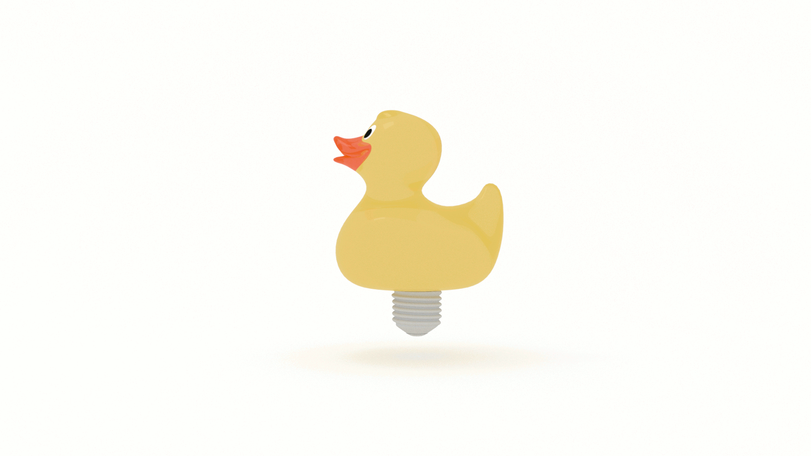

Whether you are a programmer, a poet, or a painter, your creative flow will probably get blocked at some point. This article will equip you with alternate thinking languages and blockbusting strategies to unblock your creativity.

Ever found yourself in this situation?

You’re troubleshooting a bug.

You go down the rabbit hole.

🐇🕳️

You open so many browser tabs you can’t read the titles anymore.

You find yourself on the second page of Google search results.

You start cross-referencing comments on Stack Overflow.

You talk to the duck.

It only quacks back at you.

So you step away.

And take a walk.

Or a nap.

Maybe you play a game.

Or chat with a friend.

And 💥!

Eureka!

There’s the solution.

All you needed to do was switch your mode of thinking.

In _A Mind for Numbers_, Barbara Oakley outlines two modes of thinking: focused and diffuse.

Focused-mode thinking “involves a direct approach to solving problems using rational, sequential, analytical approaches. The focused mode is used to concentrate on something that's already tightly connected in your mind, often because you are familiar and comfortable with the underlying concepts.”

Diffuse mode thinking “is what happens when you relax your attention and just let your mind wander. It allows us to suddenly gain a new insight on a problem we’ve been struggling with and is associated with ‘big-picture’ perspectives.”

Both modes are essential to problem solving.

“Evidence suggests that to grapple with a difficult problem, we must first put hard, focused-mode effort into it. Here’s the interesting part: The diffuse mode is also often an important part of problem solving, especially when the problem is difficult. But as long as we are consciously focusing on a problem, we are blocking the diffuse mode.”

Sometimes trying too hard is part of the problem.

We become our own blocker.

This is called the Einstellung effect.

According to Oakley: 

> In this phenomenon, an idea you already have in mind, or your simple initial thought, prevents a better idea or solution from being found.

Why do we do this to ourselves?

Ego.

It's Freudian.

“The ego and superego suppress ideas by judging them to be somehow out of order as they try to work their way up to the conscious level," writes James L. Adams in _Conceptual Blockbusting_. He continues:

> Judgment is clearly necessary in life, but it is often automatic. It’s not hard to see why: life becomes simpler if one makes rapid judgments, and a person is rewarded if those judgments are later seen to be right. But premature judgment can be the enemy of creativity. You are undoubtedly familiar with that by the common phenomenon of a better idea that emerges just as soon as you commit to another one.

Programming is problem solving.

Both programming and problem solving are metacognitive activities.

The key to lifelong success is in a two-fold process of reflection and remodeling, or, learning how to think about thinking.

We will have intuitions about how our programs should work but we may be surprised and frustrated by evidence that it does not work.

Bugs! 🐛

According to Oakley: 

> This kind of wrong approach is especially easy to do in science because sometimes your initial intuition about what’s happening is misleading. You have to unlearn your erroneous older ideas even while you’re learning new ones.

Ultimately, what each of us needs is a better understanding of ourselves.

Why did you think this approach would or would not work?

Why do you think it does or doesn’t?

What does this situation reveal to you about your assumptions and intuitions?

Your judgments?

Bugs are “an intrinsic part of the learning process”, not something to be avoided.

It is through debugging that we learn the most about ourselves.

We want the runtimes of our programs to be efficient.

We also need to be concerned with our own runtimes.

Brute force will work, but there’s not always enough time (in the day) or space (in your head) to do it!

Lucky for us, our brains are hard-wired to solve problems without us even trying.

According to Oakley:

> If you are trying to understand or figure out something new, your best bet is to turn off your precision-focused thinking and turn on your 'big picture' diffuse mode long enough to be able to latch on to a new, more fruitful approach.

But we first need to establish patterns using focused-mode thinking.

Oakley continues: 

> If you are grappling with a new concept or trying to solve a new problem, you don’t have preexisting neural patterns to help guide your thoughts--there’s no fuzzy underlying pathway to help guide you.

## How to unblock your creativity

In _The Owner's Manual for the Brain_, Pierce J. Howard in recommends we take the following actions: 

1. Identify the obstacles to creativity in your life. 

2. Develop a plan to eliminate or minimize these obstacles in areas where you wish to be more creative.

In _Conceptual Blockbusting_, James L. Adams recommends two approaches to use to develop that plan:

1. Develop alternate thinking languages

2. Implement different kinds of blockbusters

### Alternate thinking languages

Most of us find an approach to problem solving that works and we stick with it. This becomes our dominant thinking language. If you're like most people, that's probably visual thinking. If we need to unblock our creativity, our primary thinking language isn't working for us anymore and we will need to try something new. 

According to Adams: 

> The well-armed problem solver is fluent in many mental languages and is able to use them interchangeably to record information, communiate with the unconscious, and consciously manipulate.

He outlines six alternate thinking languages: 

* Visual Thinking

* Other Sensory Languages

* Cognitive Diversity & the Problems of Specialization

* Analysis-Synthesis

* Convergence-Divergence

* Deduction-Induction

#### Visual Thinking

Visual thinking is just that, an approach to conceptualization and problem solving that involves the formation of shapes and patterns. 

According to Richard Hamming: 

> When stuck I often ask myself, “If I had a solution, what would it look like?” This tends to sharpen up the approach, and may reveal new ways of looking at the problem you had subconsciously ignore but you now see sould not be excluded. What must hte solution involve? Are there conservation laws which must apply? Is there som symmetry? How does each assumption enter in to the solution, and is each on really necessary? Have you recognied all the relevant factors? Out of it all, sometimes, comes the solution.

In _Experiences in Visual Thinking_, Bob McKim outlines three categories of visual thinking: 

1. Perceptual: observed sensory experience 

2. Mental: imagined, but drawn from sensory experience 

3. Graphic: physical creation of imagery 

These categories build on each other. It's easy to get started: just look around! 

Over time, as your observation ability improves, you will find yourself building objects in your mind. 

At some point, you will want to make the leap and translate what is in your head to paper. 

#### Other Sensory Languages

Obviously, visual thinking is not the only sensory language available to us. But our habits and routines lock us into a set of thinking languages that prevent us from using alternatives such as smell, sound, taste and touch. 

In _Conceptual Blockbusting_, Adams outlines three reasons to expand our use of sensory languages beyond the predominant visual and verbal realms: 

1. Since they are low on teh prestige list in our culture, other senses can lead you to innovative and overlooked solutions. 

2. They are necessary for the solution of problems in which smell, sound, taste, and touch are involved. 

3. They augment visual imagery and each other to vastly increase the clarity of one's total imagery. 

How do we get locked into sensory langagues? 

Daily life.

What's the solution? 

Use synesthesia.

🙄

We want to use our other senses and that often means stepping away from the problem we're solving. Or ingesting a mind-altering substance. 

In _The Owner's Manual for the Brain_, Howard recommends we do the following to break up routine: 

* Walk

* Caffeinate

* Music

* Read

* Posture and position: work standing up, lying down, naked, in the tub. Switch it up!

#### Cognitive Diversity & the Problems of Specialization

Each of us thinks differently and each of us specializes in different subjects in different ways. 

According to Adams, "intellectual specialization is valuable to us" because:

> Specialties are psycholgoically healthy. If you are extraordinarily good at something, you are likely to have a much healthier ego. Specialties are also socially invaluable. It is simply not possible to maintain the complex social institutions we have without specialization. 

But! 

There's a downside to specialization. As Adams states: 

> Intellectual specialities are sometimes described as grooves in the mind, caused by repetition and reward. Unfortunatley, a groove is not too far from a rut. 

We can correct this by working with individuals who _don't_ think like we do. 

If that's not possible, ask (yourself) open-ended questions. Open-ended questions encourage creativity, where yes-or-no questions inhibit it.  

According to Adams: 

> Broadening one's vocabulary of problem-solving methods is a good way to increase creativity. So is working with people of other problem-solving styles. Diversity in cognitive approaches leads to greater creativity. 

#### Problem-solving styles

Adams outlines three problem-solving styles that can be divided into sets:

* analysis & synthesis

* convergence & divergence

* deduction & induction 

We can easily map these to a table: 

|               |               |
| ---           | ---           |
| analysis      | synthesis     |
| convergence   | divergence    |
| deduction     | induction     |

##### Analysis-Synthesis

Analysis and synthesis are two sides of the same coin. When we use the first, analysis, we are breaking a whole into parts to better undertand the relationships of the parts to each other and to the whole itself. When we use the second, synthesis, we combine parts to create a whole. 

According to Adams, "the overall purpose of analysis is to allow better synthesis."

That doesn't mean prioritize one over the other. We want to avoid becoming antagonists by identifying too closely with either analysis or synthesis. Take the old science vs. humantiies debate. The former is often associated with analysis, the latter with synthesis. But the indiviuals who excel in either domain are adept at both analysis _and_ synthesis. 

##### Convergence-Divergence

Similar to analysis and synthesis is convergence and divergence. Convergent thinking focuses on solutions, where divergent thinking focuses on idea generation. Same as above, it's important to balance both styles, but you are most likely familiar with convergent thinking due in large part to our educational system which prioritizes "answers" over solutions. 

We can improve our ability to balance convergent and divergent thinking by taking on, what Robert Epstein calls, "impossible problems". These are thought experiments in which we consciously and actively choose a problem to which there is no, at least no easy, solution, and attempt to generate as many solutions as possible. 

##### Deduction-Induction

If you're a Sherlock Holmes fan, I'm sorry to break it to you, but our fictional detective does not, as he claims, use deductive reasoning. He uses the opposite, inductive. What's the difference? 

Deductive reasoning works from the general to the specific. 

Inductive reasoning works from the specific to the general. 

Fictional characters can be lopsided and loveable, but, as above, we want a balance between these two approaches. 

### Kinds of Blockbusters

We are now equipped with alternate thinking languages. How do we put them to use? Here are eight approaches to unblock creativity: 

* A Questioning Attitude

* Working on the Right Problem

* Time and Effort Focusers and Set Breakers

* Using Other People’s Ideas

* Crossing Disciplines

* Crossing Cultures and Changing Environments

* Relaxing Judgment

* Incubation and Sleeping On It

Let's look at each of these. 

#### A Questioning Attitude

We're all born curious, but as we grow older we stop asking 'why?' and instead ask 'how do I accomplish X?'

Curiosity, or a questioning attitude, is the primary key to unblocking creativity. 

According to Adams: 

> If you accept the status quo unquestioningly, you will have no reason to innovate. You will not be able to see needs and problems, and sensitivity to problems is one of the most important qualities of the creative person.

In _Creativity_, John Cleese warns us of the dangers of overconfidence: 

> As a general rule, when people become absolutely certain that they know what they’re doing, their creativity plummets. This is because they think they have nothing more to learn. Once they believe this, they naturally stop learning and fall back on established patterns. And that means they don’t grow.

#### Working on the Right Problem

Ever found yourself working on the wrong problem? Only to discover hours, days, weeks, months, and, God forbid, years later that you were going in the wrong direction? 

It happens to the best of us. 

But we want to get ourselves on track as quickly as possible. 

According to Adams: 

> The skilled problem solver knows how to look for that core problem that causes all of the other, lesser problems. 

If you're familiar with the Paretto Principle, you probably just applied it to this section and immediately saw that working on the right problem is synonymous with finding the 20% input that produces 80% of your output. 

Sometimes it's the right problem, but the wrong size. If we take on something that is too big, we won't be able to see it through. In _The Owner's Manual for the Brain_, Pierce J. Howard recommends we work in increments rather than leaps, reminding us that “...technology develops cumulatively, rather than in isolated heroic acts, and that it finds most of its uses after it has been invented, rather than being invented to meet a foreseen need.”

Sometimes we're too attached to the problem and, deep down, we might know it's wrong. John Cleese advises us to kill our darlings. 

This might be the one and only place where it's okay to be murderous. 

#### Time and Effort Focusers and Set Breakers

Noise, in all senses of the word, blocks our creativity. Fortunately, there are countless productivity gurus out there providing us with an endless selection of life hacks. One of the most useful is the humble list. 

According to Adams: 

> List making is surprisingly powerful, as it utilizes the compulsive side of most of us in a way that makes us extremely productive conceptualizers. 

If you're struggling to make a list, you can always fall back on checklists. The classic problem solving checklist was designed by George Polya in _How to Solve It_: 

1. Understand the problem

2. Develop a solution

3. Execute the solution

4. Evalute the results 

But if the problem is getting started, the best thing you can do is get started. This might induce a sense of panic. John Cleese recommends getting your panic in early: 

> My experience is that whenever I’m faced with a difficult problem, I sense a pang of fear. It’s straightforward terror that I may not be able to solve whatever it is that I’m wrestling with. So, if, like me, you feel a little bit rattled as you face your challenge, here’s my advice: get your panic in early! The good thing about panic is that it gives you energy. You never think , “I’m panicking, so I’ll have a nice snooze.” Instead, the panic will help you get down to the job.

He continues: 
> The key thing is to start, even if it feels as though you’re forcing yourself through an emotional roadblock.

#### Using Other People’s Ideas

You're probably familiar with this Isaac Newton quote:

> If I have seen further it is by standing on the shoulders of Giants.

If you're not sure who those giants are, John Cleese recommends that we go looking for inspiration: 

> When you start something creative for the first time, you have no idea what you are doing! But, whether you’re writing or painting or composing a song, you need to start with an idea. As a beginner it’s not very likely that you’ll come up with a very good one. So ‘borrow’ an idea from someone you admire--an idea that really appeals to you personally. If you start working on that, you’ll make it your own as you play with it. You’re learning, and learning from something or someone you admire is not stealing. It’s called ‘being influenced by’.

If you want to test an idea, you can always seek a second opinion. Ask a friend or family member, or, if you're feeling bold, share it on social media and see what the trolls say. 

According to Cleese: 

> ...you should [seek a second opinion] when you have reached a point of sufficient clarity for someone else's judgment to be of practical help.

#### Crossing Disciplines

As we saw above, specialization is an important thinking language. But, it can also become a blocker. In order to prevent our skillset from becoming an obstacle, it's important to cross disciplines. Robert Epstein recommends learning a new subject or skill. This will accomplish (at least) two things: 

1. Introduce you to the modes of thinking required to be successful in another domain

2. Force you to use your beginner's mind 

Win win! 

#### Crossing Cultures and Changing Environments

There are a lot of strategies for breaking routine, and sometimes the key to getting unblocked is to get far away from the problem. 

Mihaly Csiszenthihalyi, author of _Flow_ and _Creativity_, recommends we seek out inspiring environments:

> ...when persons with prepared minds find themselves in beautiful settings, they are more likely to find new connections among ideas, new perspectives on issues they are dealing with. 

Note the point about having a _prepared mind_. He continues: 

> What this means is that unless one enters the situation with some deeply felt question and the symbolic skills necessary to answer it, nothing much is likely to happen.

If you can't pick up and move to another city or go jetsetting to exotic locales, [take the advice of Robert Epstein](https://www.psychologytoday.com/us/articles/199607/capturing-creativity), and make changes to your current environment to modify your daily perspective. 

Yes, you can rearrange your mind by rearranging your furniture! 

If you can't do that, simply take a leisurely walk. 

This will get you close to Greece. 

Ancient Greece, that is! 

This is known as the [peripatetic method](https://en.wikipedia.org/wiki/Peripatetic_school).

#### Relaxing Judgment

According to James L. Adams, "premature judgment can be the enemey of creativity." He offers this example: 

> You are undoubtedly familiar with that by the common phenomenon of a better idea that emerges just as soon as you commit to another one.

Why do we do this to ourselves? Because we are _conscious_. 

Our conscious mind tends to _override_ our subsconscious. But sometimes we need to let our subconsccious do its thing to arrive at better solutions to problems. 

Adams asks this provocative question: 

> What can we do to free the unconscious from its overzealous warden?

Adams offers two strategies to aid us in relaxing our judgment: 

* Read. Engage in the sport of thinking about thinking. 

* Build a habit of being creative. 

##### Read

Not just anything. Read books, magazines, and blog posts about creativity itself. 

According to Adams: 

> Knowledge about psychological processes and problem-solving, and especially about one's self, can loosen the control of one's ego. The principle involved is a simple one: things are not as threatening when they are understood.

This will help you understand how your mind works. But, perhaps more importantly, how other's minds work as well.

##### Build a habit of being creative 

Practice makes practice. Adams makes the comparison between creativity and sports: 

> Understanding the workings of your mind perhaps is somewhat like understanding a golf swing. It allows you to work on changing your present actions in a detailed and conscious way. However, in the case of creative thinking, a side benefit is achieved in gaining a greater understanding of the workings of other people's minds as well.

According to Adams: 

> If you use your brain more, your consciousness gets the message that such activities are alright... The more creative thinking is done, the more natural and rewarding it becomes and the more the ego relaxes.

##### Relax

Another way to relax judgment is just to relax. In _Creativity_, John Cleese gives us some advice on how to cope with setbacks: 

> When the juices are not flowing, don’t beat yourself up and wonder if you should retrain as a priest. Just sit around and play, until your unconscious is ready to cough up some stuff. Getting discouraged is a total waste of your time.

Which leads us to our next and final point...

#### Incubation and Sleeping On It

Sometimes the best thing we can do is take a break. Continually applying ourselves to the problem is not going to get us closer to the solution. According to Barabara Oakley in _A Mind for Numbers_: 

> When you are trying hard to come up with a new idea and are feeling frustrated by it, try letting go of your control by walking or dozing, or by relaxing in other ways.

Piere J. Howard makes the case for a nap in _The Owner's Manual for the Brain_,

> On the continuum from tight mental self-control to the loss of control we experience in sleep, creativity occurs toward the sleep end of the continuum.

According to Richard Hamming in _The Art of Doing Science and Engineering_: 

> If the solution does come from the subconscious, what can we do to manage our subconscious? My method… is to saturate the subconscious with the problem, try to not think seriously about anything else for hours, days, or even weeks, and thus the subconscious--which, so far as we know, depends heavily upon live experiences to for its dreams, etc.--is then left with only the problem to mull over. We simply deprive it of all else as best we can! Hence one day we have the solution, either as we awake, or it pops into our mind without any preparation on our part, or as we pick up the problem again there the solution is! In a way, I am repeating Pasteur, “Luck favors the prepared mind.” You prepare your nind for success “by thinking on it constantly” (Newton), and occasionally you are lucky.

## Prepare to Be Lucky

Finally, the most important thing you can do to unblock your creativity is to prepare to be lucky.

You never know when inspiration will strike, so, like a Scout "Be prepared." Practice alternate thinking languages and exercise blockbusting strategies when you need to unblock your creativity. Find those places that set you up for success and keep a notebook and pen on close by to capture inspirations. 

As Richard Hamming states about creativity:

> So far as anyone understands the process it arises from the subconscious, it is suddenly there!