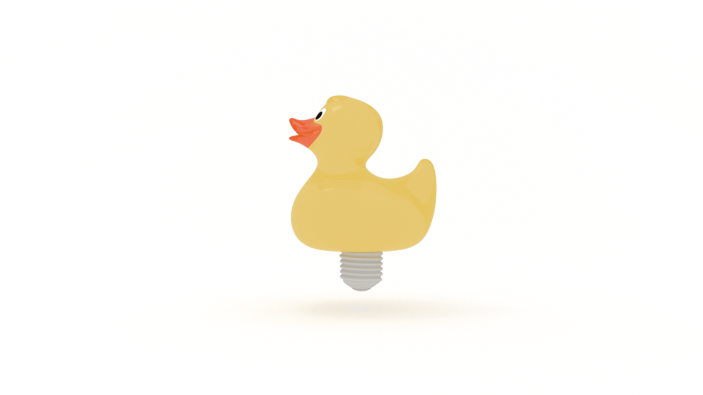

What type of programmer do you want to be? 

There are two types of problems we solve as developers: 

* algorithmic

* heuristic.

We can map these to the two types of problems outlined by Csikszentmihalyi in [Creativity](TODO):

* presented

* discovered

For algorithmic problems, it’s simply a matter of recognizing a pattern and implementing a tried and true solution. The list is long, but a few examples are: 

* dynamic programming

* divide and conquer

* swap

* TODO 

I say simply, but it takes practice to build a library of patterns and the ability to recognize them.

Heuristic problems, on the other hand, are a matter of {{ TODO }}.

If you’re content pushing pixels, all you really need is Google. It will do the thinking for you.

But if you want to level up, you need to play the metagame.

You want to identify problems and implement solutions. 

You want to be proactive, rather than reactive. 

If you’re content cleaning up legacy code bases, again, all you need is Google Fu. 

If you’re content to be told what to do, you can stop reading now. 

You can unsubscribe here. 

If you want to excel, if you want to design or discover something new, you need to improve your ability to be creative. 

Still with me? 

Alright, then. 

## How do We Become or Improve Our Ability to Be Creative?

The real question is, 'Can creativity be taught?'

The answer depends on who you ask. 

According to Richard Hamming in [The Art of ... : ](TODO), when it comes to learning creativity, we must be our own teachers:

> It cannot be done with simple tricks and easy methods; what must be done is _you must change yourself_ to be more creative.

How do we change ourselves? 

In [Creativity], Csziksenmihalyi divides this problem into two categories: 

* the acquisition of creative energy

* the application of creative energy

How do you get more creative energy? And once you get it, what do you do with it? 

I like to think of these two categories in terms of luck. There are two things we need to do: 

* prepare to be lucky

* get lucky

According to Twyla Tharp in [The Creative Habit](TODO): 

> You don’t get lucky without preparation, and there’s no sense in being prepared if you’re not open to the possibility of a glorious accident… Some people resent the idea of luck. Accepting the role of chance in our lives suggests that our creations and triumphs are not entirely our own, and that in some way we’re undeserving of our success. I say, 'Get over it.' This is how the world works. In creative endeavors luck is a skill.

### Prepare to Be Lucky: The Acquisition of Creative Energy

Csziksenmihalyi outlines four approaches to aid us in the acquisition of creative energy, because, as he states, “...insights tend to come to prepared minds, that is, to those who have thought long and hard about a given set of problematic issues.”

* Overcoming limits

* Cultivating curiosity and interest

* Cultivating flow in everyday Life

* Building habits of strength

#### Overcoming Limts of Creative Energy

According to Csziksenmihalyi, there are two limits that prevent us from reaching our full creative potential: 

* external

* internal 

##### External Limitations to Being Creative

External limitations to our creativity are all the things(!) we must do to survive each day: commute and report to work; attend to the needs of our family; purchase, prepare, and eat food; basic hygiene; advanced hygiene (whatever that is); house cleaning; bill paying; and, oh yeah, sleeping...

Somehow we are suppoed to find time to build X, learn Y, and {{ TODO }} Z.

There aren't enough hours in the day! 

According to Csziksenmihalyi, “...the fact is that there are real limits to how many things a person can attend to at the same time, and when survival needs require all of one's attention, none is left over for being creative.” He continues...

> ...the most fundamental difference between people consists in how much uncommitted attention they have left over to deal with novelty. 

This is why 'productivity gurus' tell us to do our most important work first thing in the morning. Our attention, not to mention our will power, dissipates over the course of the day. 

For some of us, the obligations of work and family are too demanding to allow attention to be devoted to novelty. The rest of us need to get over ourselves. 

TODO
“...a great deal of our limited supply of attention is committed to the tasks of surviving from one day to the next.”

“To achieve creativity in an existing domain, there must be surplus attention available.”

##### Internal Limitations to Being Creative

Csziksenmihalyi identifies two primary pitfalls that prevent us from achieving our creative potential: 

* paranoia

* selfishness 

The paranoiac "usually cannot afford to become interested in the world from an objective, impartial viewpoint, and therefore is unable to learn much that is new,", whereas "when everything a person sees, thinks, or dresses must serve self-interest, there is not attention left over to learn about anything else."

But there's a paradox here. In order to overcome external limitations (and keep the internal limitations in check), we need to be protective of our attention. According to Csziksenmihalyi, "it is practically impossible to learn a domain deeploy enough to make a change in it without dedicating all of one’s attention to it and thereby appearing to be arrogant, selfish, and ruthless to those who believe they have a right to the creative person’s attention.”

###### Traits for Overcoming Internal Limitations

So you're selfish and paranoid? TODO

* Develop what you lack

* Shift often from openness to closure

* Aim for complexity

TODO 

#### Cultivating Curiosity and Interest

Once we overcome our internal and external limitations, we can focus on "the allocation of attention to things for their own sake" or, in other words, curiosity and interest. 

How can interest and curiosity be cultivated?

Practice spontaneity. 

Sound paradoxical? 

Csziksenmihalyi offers four suggestions for being spontaneous: 

* try to be surprised by something every day

* try to surprise at least one person every day

* write down each day what surprised you and how you surprised others

* when somethihng strikes a spark of interest, follow it.

In [Creativity](TODO), John Cleese counsels us on "keeping going". To do so we need to nurture and trust our unconscious. 

How do we do that? 

Play. 

According to Cleese, "Playing… keeps you 'fresh'."

TODO
#### Cultivating Flow in Everyday Life

How can we relearn to enjoy curiosity so that the pursuit of new experiences and new knowledge becomes self-sustaining?

Wake up in the morning with a specific goal to look forward to

If you do anything well, it becomes enjoyable.

To keep enjoying something, you need to increase its complexity.

Flow (Chapter 5)

What drives creative people?

The opportunity to do the work that they enjoy doing. 

and “...designing or discovering something new.”

Creativity vs. entropy

“We are generally torn between two opposite sets of instructions programmed into the brain: the least-effort imperative on one side, and the claims of creativity on the other.” 

“In most individuals entropy seems to be stronger, and they enjoy comfort more than the challenge of discovery. 

A few… are more responsive to the rewards of discovery. But we all respond to both of these rewards; the tendencies toward conserving energy as well as using it constructively are simultaneously part of our inheritance.”

What is enjoyment? 

Nine elements
…
The Conditions for Flow

* Clarity of goals

* Feedback

* Balancing challenges and skill

* The Merging of action and awareness

* Avoiding distractions

* Forgetting self, time, and surroundings

* Autotelic

* Do it for its own sake!

Flow and Happiness

p. 123

Flow and the Evolution of Consciousness
p. 124

#### Building Habits of Strength

Hamming

“We are, in a very real sense, the sum total of our habits, and nothing more; hency by changing our habits, once we understand which ones we should change and in what directions, and understand our limitations in changing ourselves, then we are on the path along which we want to go.” 

In thermodynamics, [entropy](https://en.wikipedia.org/wiki/Entropy) is "the state of disorder, randomness, or uncertainty" in a system. 

To acquire creative energy, we need to fight entropy. According to Csziksenmihalyi, “what is important is not to relinquish control over creative energy so that it dissipates without direction.” He continues:

> We must erect barriers agains distractions, dig channels so that energy can flow more freely, find ways to escape outside temptations and interruprtions.

How do we fight entropy? 

We build strength.

How do we do that?

😬

You're not going to like this answer...

Hard work. 

In addition to hard work, there are specific actions we can take to erect barriers and dig channels to protect our creative attention:

* Take charge of your schedule.

* Make time for reflection and relaxation.

* Shape your space

* Find out what you like and what you hate about life.

* Start doing more of what you love, less of what you hate. 

The last two points are subjective and up to you. Let's look at some strategies for the first three.

##### Take Charge Of Your Schedule

Patterning Activities
TODO James Clear? 

Keep in mind that timing is everything. 

Are you an introvert? You are also likely a morning person. Aim to do your creative work then. 

Are you an extrovert? You are also likely an evening person, maybe even a night owl, so burn that midnight oil!

We know that preparation and incubation are essential for insight, so allow time for those processes. In [The Owner's Manual for the Brain](TODO), Pierce J. Howard counsels us to "always take a break between preparing for your creative act and executing it" to allow insight to incubate and to approach the work with fresh eyes. 

Don't forget your "feeding schedule". When you eat is as important as what you eat. Don't sabotage your creative attention with a gut bomb. According to Howard in [The Owner's Manual for the Brain](TODO), "...consumption of high-glycemic carbohydrates and fats tends to interfere with creativity by reducing arousal, whereas consumption of proteins and low-glycemic carbohydrates, unless it is excessive, has no apparent negative impact on arousal."

##### Make Time for Reflection and Relaxation

In [The Owner's Manual for the Brain](TODO), Pierce J. Howard recommends making time for reflection and relaxation, suggesting two opposite activities to do so: 

* Meditation

* Exercise

Maybe neither of these are your jam, so find something in the middle. Keep in mind that "creative episodes are most productive when they are preceded by some form of meditation or aerobic exertion." 

The goal is to create _attentional_ mental space. Let your brain stretch its legs. 

🧠
🦵🦵

##### Shape Your Space 

It is not what the environment is like that matters, but the extent to which you are in harmony with it.

TODO Ben Franklin: 

“A place for everything, everything in its place.”

We can divide our space into two categories:

* macroenvironment

* microenvironment

The macroenvironment is the social, cultural, and institutional contexts we live in. The microenvironment is immediate setting.

“Most of us cannot do a great deal about the macroenvironment. There is not that much we can do about the wealth of the society we live in, or even about the institutions in which we work. We can, however, gain control over the immediate environment and transform it so that it enhances personal creativity.”

“The important thing is to have a special place tailor-made to one’s own needs, where one feels comfortable and in control.”

“reflect a personal sense of how the universe ought to be.”

“What helps to preserve and develop individuality, and hence enhance creativity, is an environment that we have built to reflect ourselves, where it is easy to forget the outside world and concentrate completely on the task at hand.”

What sets creative individuals apart? 

“...whether the conditions in which they find themselves are luxurious or miserable, they manage to give their surroundings a personal pattern that echoes the rhythm of their thoughts and habits of action. Within this environment of their own making, they can forget the rest of the world and concentrate on pursuing the Muse.”

Make sure that where you work and live reflets your needs and your tastes. There should be room for immersion in concentrated activity and for stimulating novelty. The objects around you should help you become what you intend to be. Think about how you use time and consider whether your schedule reflects the rhythms that work best for you. If in doubt, experiment until you discover the best timing for work and rest, for thought and action, for being alone and for being with people.

All this said, sometimes we need the outside world. Richard W. Hamming offers a counterpoint in [The Art of ](TODO): 

> ... I often suspect… that what the individual regards as ideal conditions for creativity is not what is needed, but rather the constant impinging of reality is often a great help. In the past I have deliberately managed myself in this matter by promising a result by a given date, and then, like a cornered rat, having at the last minute to find something!

When it comes to building habits of strenght, Richard W. Hamming offers some final advice:

> ...do not try heroic reformations which are almost certain to fail. Practice on small ones until you gradually build up your ability to change yourself in the larger things. You must learn to walk before you run in this matter of being creative, but I believe it can be done. Furthermore, if you are to succeed (to the extent you secretly wish to), you must become creative in the face of the rapidly changing technology which will dominate your career. Society will not stand still for you; it will evolve more and more rapidly as technology plays an increasing role at all levels of the organization.

### Get Lucky: The Application of Creative Energy

Creative energy acquired. Now what? We need to find (or create) problems in which to apply it. 

#### Problem Finding

TODO

* Find a way to express what moves you

* Look at problems from as many viewpoints as possible

* Figure out the implications of the problem.

* Implement the solution

##### Find a Way to Express What Moves You

In [Creativity](TODO), John Cleese counsels us to "write about what you know," because: 

> ... you are most likely to be creative in an area that you already know and care about.

##### Look at Problems From As Many Viewpoints as Possible

In [The Art of ...: Learning ...](TODO), Hamming recommends the use of analogy, stating that it is probably "the most important tool in creativity". TODO: 

“Something seems like something else which we knew in the past.”

How do we develop our ability to _analogize_? 

According to Hamming: 

> Wide acquaintance with various fields of konlwedge is thus a help--_provided_ you have the knowledge filed away so it is available when needed, rather than to be found only when led directly to it. This flexible access to pieces of knowledge seems to come from looking at knowledge _while you are acquiring it_ from many different angles, turning over any new idea to see its many sides before filing it away. This implies efort on your part not to take the easy, immediately useful “memorizing the material” path, but to prepare your mind for the future.

“...get down to the fundamentals of a field, since it implies you must examine things many ways before you can decide what i fundamental and what is frills.”

##### Figure Out the Implications of the Problem.

Hamming

“...when you learn something new, think of other applications of it, ones which have not arisen in your past but which might in your future.”

##### Implement the Solution

This one's all you.

#### Divergent thinking

TODO WHAT IS DIVERGENT THINKING?

* Produce as many ideas as possible

* Have as many different ideas as possible

* Try to produce unlikely ideas

Cleese
Make an imaginative leap
“...the bigger the leap, the longer the creative period is likely to be.”

Hamming
“The false starts and false solutions often sharpen the next approach you try. YOu now know how not to do it! You have a smaller number of approaches left to explore. You have a better idea of what will not work and possibly why it will not work.”

Know When to Fold ‘Em
“If you cannot drop a wrong problem, then the first time you meet one you will be stuk with it for the rest of your career.”

#### Choosing a Special Domain

Find your domain and make a singular committment to it.

Csziksenmihalyi
TODO 
“As culture evolves, it becomes increasingly difficult to master more than one domain of knowledge. Therefore, it follows, as culture evolves, specialized knowledge will be favored over generalized knowledge.”

Being in the Right Place

“The right milieu is important in more ways than one. It can affect the production of novelty as well as its acceptance; therefore, it is not surprising that creative individuals tend to gravitate toward centers of vital activity, where their work has the chance of succeeding.”

The place where one lives is important for three reasons

* “...one must be in a position to acss the domain in which one plans to work.”

* “novel stimulation is not evenly distributed”

* “access to the field is not evenly distributed in space” 

So where is the right place to be? 

According to Csziksenmihalyi, there is no single answer. 

> Creativity is not determined by outside factors but by the person’s hard resolution to do what must be done. Which place is best depends on the total configuration of a person’s characteristics and those of the task he or she is involved in.

## How to Be Creative

If we want to become, or improve our ability to be, creative, we need to first acquire creative energy and then apply it. 

Hamming
“If you want to do significant things, now is the time to start thinking (if you have not already done so) and not wait until it is the proper moment--which may never arrive!”

