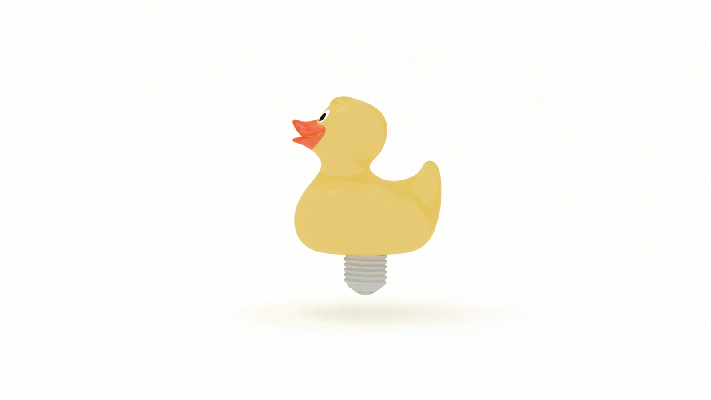

## What is Creativity? 

## Why is Creativity Important? 

## How do We Become or Improve Our Ability to Be Creative?

Can we teach creativity?

TODO 
Hamming: 
“It cannot be done with simple tricks and easy methods; what must be done is _you must change yourself_ to be more creative.” 

In [Creativity], Csziksenmihalyi outlines {{ X }}: 

* the acquisition of creative energy

* the application of creative energy

How do you get more creative energy? Then, once you get it, what do you do with it? 

I like to think of these two categories in terms of luck. 

* prepare to be lucky

* get lucky

Before we look at these, Pierce J. Howard stresses 

Stress the necessity of all three elements of creativity 
Novelty
Relevance
Spontaneity

Prepare to be lucky.

Twyla Tharp
You don’t get lucky without preparation, and there’s no sense in being prepared if you’re not open to the possibility of a glorious accident… Some people resent the idea of luck. Accepting the role of chance in our lives suggests that our creations and triumphs are not entirely our own, and that in some way we’re undeserving of our success. I say, Get over it. This is how the world works. In creative endeavors luck is a skill.

“...insights tend to come to prepared minds, that is, to those who have thought long and hard about a given set of problematic issues.”

Hamming
“If you want to do significant things, now is the time to start thinking (if you have not already done so) and not wait until it is the proper moment--which may never arrive!”

### Prepare to Be Lucky: The Acquisition of Creative Energy

* Overcoming limits

* Curiosity and interest

* Cultivating Flow in Everyday Life

* Habits of Strength

#### Overcoming Limts

“...the most fundamental difference between people consists in how much uncommitted attention they have left over to deal with novelty. 

“...the fact is that there are real limits to how many things a person can attend to at the  same time, and when survival needs require all of one's attention, none is left over for being creative.”

Internal limitation

paranoia

The person who suffers from it usually cannot afford to become interested in the world from an objective, impartial viewpoint, and therefore is unable to learn much that is new.

selfishness

...for some people the concept of “need” is inflated to the point that it becomes an obsession that devours every waking moment. When everything a person sees, thinks, or dresses must serve self-interest, there is not attention left over to learn about anything else. 

“...a great deal of our limited supply of attention is committed to the tasks of surviving from one day to the next.”
“To achieve creativity in an existing domain, there must be surplus attention available.”
“...it is practically impossible to learn a domain deeploy enough to make a change in it without dedicating all of one’s attention to it and thereby appearing to be arrogant, selfish, and ruthless to those who believe they have a right to the creative person’s attention.”
“In fact, creative people are neither single-minded, specialized, nor selfish. Indeed, they seem to be the opposite: They love to make connections with adjacent areas of knowledge. They tend to be -- in principle--caring and sensitive. Yet the demands of their role inevitably push them toward specialization and selfishness. Of the many paradoxes of creativity, this is perhaps the most difficult to avoid.”

#### Curiosity and Interest

the allocation if attention to things for their own sake

How can interest and curiosity be cultivated?

/try to be surprised by something every day

Try to surprise at least one person every day

/write down each day what surprised you and how you surprised others

When somethihng strikes a spark of interest, follow it.

Cleese
Keeping going
* nurture and trust your unconscious

* Playing… keeps you “fresh”.

#### Cultivating Flow in Everyday Life

How can we relearn to enjoy curiosity so tha the pursuit of new experiences and new knowledge becomes self-sustaining?

Wake up in the morning with a specifi c goal to look forward to

If yuou do anything well, it becomes enjoyable.

To keep enjoying something, you need to increase its complexity.

Flow (Chapter 5)
What drives creative people?
The opportunity to do the work that they enjoy doing. 
and “...designing or discovering something new.”
Creativity vs. entropy
“We are generally torn between two opposite sets of instructions programmed into the brain: the least-effort imperative on one side, and the claims of creativity on the other.” 
“In most individuals entropy seems to be stronger, and they enjoy comfort more than the challenge of discovery. A few… are more responsive to the rewards of discovery. But we all respond to both of these rewards; the tendencies toward conserving energy as well as using it constructively are simultaneously part of our inheritance.”
What is enjoyment? 
Nine elements
…
The Conditions for Flow

* Clarity of goals

* Feedback

* Balancing challenges and skill

* The Merging of action and awareness

* Avoiding distractions

* Forgetting self, time, and surroundings

* Autotelic

* Do it for its own sake!

Flow and Happiness
p. 123
Flow and the Evolution of Consciousness
p. 124

#### Habits of Strength

How do you develop strength? 

Hard work. 

Fight entropy
See also: War of Art , resistance

Csz:
“We must erect barriers agains distracvtions, dig channels so that energy can flowe more freely, find ways to escape outside temptations and interruprtions.”

“...what is important is not to relinquish control over creative energy so that it dissipates without direction.”

What can you do to build up habits that will make it possible to control attention so that it can be open and receptive, or focus and directed, depending on what your overall goals require?

* Take charge of your schedule.

* Make time for reflection and relaxation.

* Shape your space

It is not what the enbironment is like that matters, but the extent to which you are in harmony with it.
“A place for everything, and everything in its place.”

* Find out what you like and what you hate about life.

* Start doing more of what you love, less of what you hate. 

##### Take Charge Of Your Schedule

Patterning Activities
“what counts is to be master of one’s own time”
“Being in tune with place and time, we experience the reality of our unique existence and its relationship to the cosmos.”

Timing is everything
More introverted people will probably bet art their creative best in the morning, more extraverted people in the evening
Allow time for incubation and preparation. Aks, “What information or material is needed before action can be taken?”
Always take a break between preparing for your creative act and executing it. 

...consumption of high-glycemic carbohydrates and fats tends to interfere with creativity by reducing arousal, whereas consumption of proteins and low-glycemic carbohydrates, unless it is excessive, has no apparent negative impact on arousal.

##### Make time for reflection and relaxation.

Meditate
Exercise
Create _attentional_ mental space
Creative episodes are most productive when they are preceded by some form of meditation or aerobic exertion. 

##### Shape Your Space 

macroenvironment vs. microenvironment

macro

the social, cultural, and institutional context in which a person lives

micro

the immediate setting in which a person works

“Most of us cannot do a great deal about the macroenvironment. There is not that much we can do about the wealth of the society we live in, or evenabout the institutions in which we work. We can, however, gain control over the immediate environment and transform it so that it enhances personal creativity.”

“The important thing is to have a special place tailor-made to one’s own needs, where one feels comfortable and in control.”

“reflect a personal sense of how the universe ought to be.”

“What helps to preserve and develop individuality, and hence enhance creativity, is an environment that we have built to reflect ourselves, where it is easy to forget the outside world and concentrate completely on the task at hand.”

What sets creative individuals apart? 
“...whether the conditions in which they find themselves are luxurious or miserable, they manage to give their surroundings a personal pattern that echoes the rhythm of their thoughts and habits of action. Within this environment of their own making, they can forget the rest of the world and concentrate on pursuing the Muse.”

Make sure that where you work and live reflets your needs and your tastes. There should be room for immersion in concentrated activity and for stimulating novelty. The objects around you should help you become what you intend to be. Think about how you use time and consider whether your schedule reflects the rhythms that work best for you. If in doubt, experiment until you discover the best timing for work and rest, for thought and action, for being alone and for being with people.

Hamming [counterpoint]
“... I often suspect… that what the individual regards as ideal conditions for creativity is not what is needed, but rather the constant impinging of reality is often a great help.”
“In the past I have deliberately managed myself in this matter by promising a result by a given date, and then, like a cornered rate, having at the last minute to find something!” 

Hamming

“We are, in a very real sense, the sum total of our habits, and nothing more; hency by changing our habits, once we understand which ones we should change and in what directions, and understand our limitations in changing ourselves, then we are on the path along which we want to go.” 

“And do not try heroic reformations which are almost certain to fail. Practice on small ones until you gradually build up your ability to change yourself in the larger things. You must learn to walk before you run in this matter of being creative, but I believe it can be done. Furthermore, if you are to succeed (to the extent you secretly wish to), you must become creative in the face of the rapidly changing technology which will dominate your career. Society will not stand still for you; it will evolve more and more rapidly as technology plays an increasing role at all levels of the organization.” 

##### Internal Traits

* Develop what you lack

* Shift often from openness to closure

* Aim for complexity

### Get Lucky: The Application of Creative Energy

#### Problem Finding

* Find a way to express what moves you

Cleese
Write about what you know
“... you are most likely to be creative in an area that you already know and care about.”

* Look at problems from as many viewpoints as possible

Hamming
Analogy
“Probably the most important tool in creativity…
“Something seems like something else which we knew in the past.”
“Wide acquaintance with various fields of konlwedge is thus a help--_provided_ you have the knowledge filed away so it is available when needed, rather than to be found only when led directly to it. This flexible access to pieces of knowledg seems to come from looking at knowledge _while you are acquiring it_ from many different angles, turning over any new idea to see its many sides before filing it away. This implies efort on your part not to take the easy, immediately useful “memorizing the material” path, but to prepare your mind for the future.”
“...get down to the fundamentals of a field, since it implies you must examine things many ways before you can decide what i fundamental and what is frills.”

* Figure out the implications of the problem.

Hamming
“...when you learn something new, think of other applications of it, onew which have not arisen in your past but which might in your future.”

* Implement the solution

#### Divergent thinking

* Produce as many ideas as possible

* Have as many different ideas as possible

* Try to produce unlikely ideas

Cleese
Make an imaginative leap
“...the bigger the leap, the longer the creative period is likely to be.”

Hamming
“The false starts and false solutions often sharpen the next approach you try. YOu now know how not to do it! You have a smaller number of approaches left to explore. You have a better idea of what will not work and possibly why it will not work.”

Know When to Fold ‘Em
“If you cannot drop a wrong problem, then the first time you meet one you will be stuk with it for the rest of your career.”

#### Choosing a special Domain

Find your domain and make a singular commitment to it

TODO 
“As culture evolves, it becomes increasingly difficult to master more than one domain of knowledge. Therefore, it follows, as culture evolves, specialized knowledge will be favored over generalized knowledge.”

“The right milieu is important in more ways than one. It can affect the production of novelty as well as its acceptance; therefore, it is not surprising that creative individuals tend to gravitate toward centers of vital activity, where their work has the chance of succeeding.”

I don't know if I completely agree with this statement. That's the topic for future investigation. 

Being in the Right Place
The place where one lives is important for three reasons
“...one must be in a position to acss the domain in which one plans to work.”
“novel stimulation is not evenly distributed”
“access to the field is not evenly distributed in space” 
Where is the right place to be? 
“Unfortunately, there is no single answer. Creativity is not determined by outside factors but by the person’s hard resolution to do what must be done. Which place is best depends on the total configuration of a person’s characteristics and those of the task he or she is involved in.”

