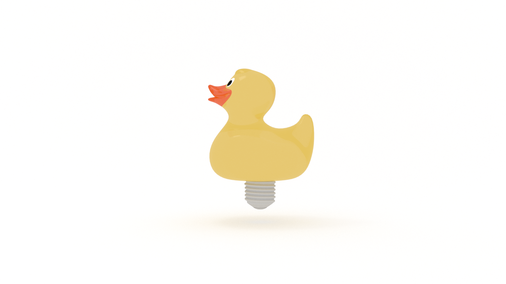

Ever found yourself in this situation? 

You’re troubleshooting a bug.

You go down the rabbit hole.

🐇🕳️

You open so many browser tabs you can’t read the titles anymore.

You find yourself on the second page of Google search results. 

You start cross-referencing comments on Stack Overflow.

You talk to the duck. 

It only quacks back at you.

So you step away.

And take a walk.

Or a nap.

Maybe you play a game. 

Or chat with a friend.

And 💥!

Eureka!

There’s the solution. 

All you needed to do was get out of your own way.

In A Mind for Numbers, Barbara Oakley outlines two modes of thinking: focused and diffuse.

Focused-mode thinking “involves a direct approach to solving problems using rational, sequential, analytical approaches. The focused mode is used to concentrate on something that's already tightly connected in your mind, often because you are familiar and comfortable with the underlying concepts.”

Diffuse mode thinking “is what happens when you relax your attention and just let your mind wander. It allows us to suddenly gain a new insight on a problem we’ve been struggling with and is associated with ‘big-picture’ perspectives.”

Both modes are essential to problem solving.

“Evidence suggests that to grapple with a difficult problem, we must first put hard, focused-mode effort into it. Here’s the interesting part: The diffuse mode is also often an important part of problem solving, especially when the problem is difficult. But as long as we are consciously focusing on a problem, we are blocking the diffuse mode.”

Sometimes trying too hard is part of the problem.

We become our own blocker. 

This is called the Einstellung effect.

“In this phenomenon, an idea you already have in mind, or your simple initial thought, prevents a better idea or solution from being found.”

Why do we do this to ourselves? 

Ego.

It's Freudian.

“The ego and superego suppress ideas by judging them to be somehow out of order as they try to work their way up to the conscious level.” 

In Conceptual Blockbusting, James L. Adams continues:

“Judgment is clearly necessary in life, but it is often automatic. It’s not hard to see why: life becomes simpler if one makes rapid judgments, and a person is rewarded if those judgments are later seen to be right. But premature judgment can be the enemy of creativity. You are undoubtedly familiar with that by the common phenomenon of a better idea that emerges just as soon as you commit to another one.”

Programming is problem solving. 

Both programming and problem solving are metacognitive activities. 

The key to lifelong success is in a two-fold process of reflection and remodeling, or, learning how to think about thinking.

We will have intuitions about how our programs should work but we may be surprised and frustrated by evidence that it does not work.

Bugs! 🐛

“This kind of wrong approach is especially easy to do in science because sometimes your initial intuition about what’s happening is misleading. You have to unlearn your erroneous older ideas even while you’re learning new ones.” 

Ultimately, what each of us needs is a better understanding of ourselves. 

Why did you think this approach would or would not work? 

Why do you think it does or doesn’t? 

What does this situation reveal to you about your assumptions and intuitions? 

Your judgments? 

Bugs are “an intrinsic part of the learning process”, not something to be avoided. 

It is through debugging that we learn the most about ourselves.

We want the runtimes of our programs to be efficient. 

We also need to be concerned with our own runtimes. 

Brute force will work, but there’s not always enough time (in the day) or space (in your head) to do it!

Lucky for us, our brains are hard-wired to solve problems without us even trying.

"If you are trying to understand or figure out something new, your best bet is to turn off your precision-focused thinking and turn on your 'big picture' diffuse mode long enough to be able to latch on to a new, more fruitful approach."

But we first need to establish patterns using focused-mode thinking.

"If you are grappling with a new concept or trying to solve a new problem, you don’t have preexisting neural patterns to help guide your thoughts--there’s no fuzzy underlying pathway to help guide you."
