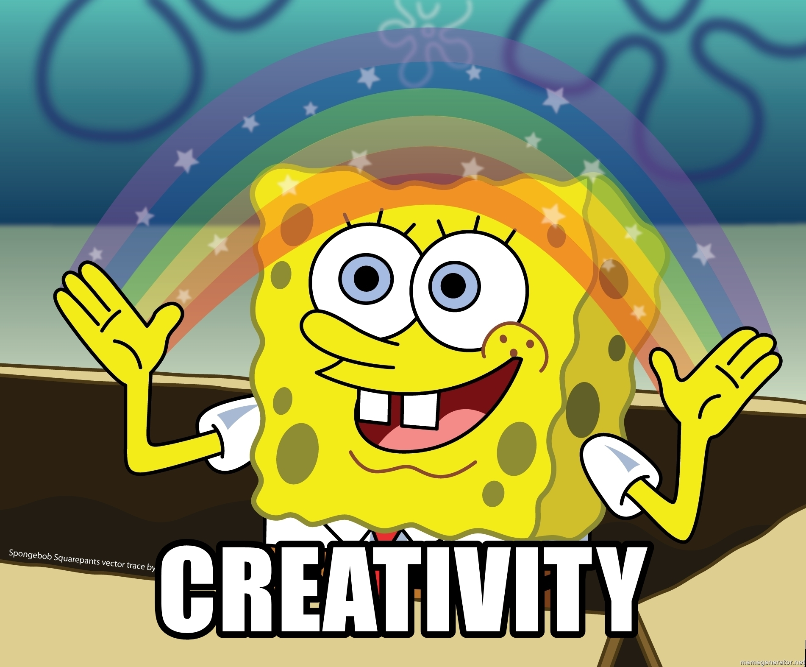

TODO 
Painting with John? 

TODO 
Creativity is 
misunderstood? Mis

Why do we want to be creative? 

What is creativity? 

What is the problem that creativity solves? 

Just that. Creativity is problem solving!

Creativity not only helps us solve problems, it helps us identify them, too.

Beyond solving problems, why is it important to develop or improve our ability to be creative? 

According to Miahly Csikszentmihalyi in the aptly titled book, [Creativity](https://amzn.to/3tCdEwv), “...most of the things that are interesting, important, and _human_ are the results of creativity.” He outlines two main reasons we want to introduce or cultivate creativity in our lives: 

* “...when we are involved in it, we feel that we are living more fully than during the rest of life.”

* “Because for better or worse, our future is now closely tied to human creativity. The result will be determined in large part by our dreams and by the struggle to make them real.”

The first point is related to the subject that made Csikszentmihalyi a household name: _flow_. 

TODO flow summary
When we are in flow, we are able to “... find purpose and enjoyment in the chaos of existence.”

It’s important to distinguish flow from creativity. Creativity generally occurs during a flow state, but unlike some flow activities, such as sex, sports, and religion, “...creativity also leaves an outcome that adds to the richness and complexity of the future.” Kids don't count. 

The second point is related to the survival of our species. 

TODO GRAB A QUOTE

How does creativity work? 

Before we answer that, let’s define creativity. 

What exactly _is_ creativity? 

If you search for the term, you'll find definitions like the following: 

> the use of the imagination or original ideas, especially in the production of an artistic work.

And...

> a phenomenon whereby something somehow new and somehow valuable is formed.

You'll also find a lot of images of lightbulbs and rainbow colored confetti bursting from human heads. 

🤯 + 🌈 != creativity

## What is Creativity? 

For many people the word creativity invokes images of art, design, or fashion, but not science, mathematics, or engineering. 

Let's start with a few quotes from [Richard W. Hamming](https://en.wikipedia.org/wiki/Richard_Hamming), a pioneer of computer engineering and telecommunications, who worked on the Manhattan Project and later at Bell Laboratories. In his book, [The Art of Doing Science and Engineering: Learning to Learn](https://amzn.to/3pRfkzV), he writes: 

> Creativity, originality, novelty, and other such words are regarded as ‘good things’, and we often fail to distinguish between them--indeed, we find them hard to define. Surely we do not need three words with exactly the same meaning!

Exactly. 

Hamming continues: 

> Evidently we want the word ‘creative’ to include the concept of _value_--but value to whom? 

Csikszentmihalyi answers this question in [Creativity](https://amzn.to/3tCdEwv) with his definition of the phenomena as: 

> a process by which a symbolic domain in the culture is changed.

How is that symbolic domain changed? 

Memes!

Yes, those kinds of memes. But also meme in the sense that Richard Dawkins defined in [The Selfish Gene](https://amzn.to/2Lpg1kU), as “a unit of cultural transmission”, which includes, but is not limited to genetics. 

According to Csikszentmihalyi, memes are “units of information that we must learn if culture is to continue”. _He_ continues: 

> Creativity is the cultural equivalent of the process of genetic changes that result in biological evolution, where random variations take place in the chemistry of our chromosomes, below the threshold of consciousness.

Just like genetics, the contributions of creative individuals are ‘only a link in a chain, a phase in a process.’

How do we know if something is _creative_? 

Researcher and Harvard professor [Teresa Amabile](https://en.wikipedia.org/wiki/Teresa_Amabile) states that: 

> “A product or response will be judged as creative to the extent that (a) it is both a novel and appropriate, useful, correct or valuable response to the task at hand, and (b) the task is heuristic rather than algorithmic.”

She outlines three criteria for distinguishing creative contributions from others:

* novelty

* spontaneity

* relevance

Novelty and spontaneity make sense. But what do we mean by ‘relevance’? 

According to Csikszentmihalyi, “...creativity does not happen inside people’s heads, but in the interactions between a person’s thoughts and a sociocultural context.” He outlines three elements for what he refers to as The Systems Model of creativity:

* a culture that contains symbolic rules

* a person who brings novelty into that symbolic domain

* a field of experts who recognize and validate the innovation

Let’s look closer at each of the above elements. 

### Domain

What is a domain? Csikszentmihalyi defines it as "a set of symbolic rules and procedures" and "an isolated little world in which a person can think and act with clarity and concentration.”

If you are a programmer, your domain is computer science. But that's a large domain, so perhaps you work in a subdomain, such as web development, which is a subdomain of software development. If you're a web developer, your symbolic rules and procedures consist of the langauge or languages you use and their syntax and control constructs, the client-server model, communication protocols, etc.

How do we know if the product of creativity is relevant to the domain? 

[Margaret Boden](https://en.wikipedia.org/wiki/Margaret_Boden) distinguishes between two forms or relevance: psychological and historical. Pierce J. Howard, author of [The Owner's Manual for the Brain](https://amzn.to/2YMlK7h), succinctly defines these two forms: 

* Psychological relevance is “merely something new for the individual doing the creating…”

* Historical relevance is “something new for humanity.”

TODO HAMMING
He offers a definition…

> Creativity seems, among other things, to be “usefully” putting together things which were not perceived to be related before, and it may be the _initial psychological_ distance between the things which counts the most.

Howard, in reference to the work of [Robert Sternberg](https://en.wikipedia.org/wiki/Robert_Sternberg), outlines seven different ways that a creative act can relate to the tradition of a domain: 

* Conceptual replication, “in which one attempts to repeat an earlier study to determine whether its results were a fluke or are here to stay.”

* Redefinition: “in which one finds a new meaning or application for an established entity.”

* Forward incrementation, “in which one takes an established paradigm to a higher level.”

* Advance forward incrementation, “in which one takes an established paradigm to a level higher than its advocates are willing to take it.”

* Redirection, “in which one builds on previous work, but in a different direction.”

* Reconstruction, “in which one takes a defunct entity, resurrects it, modernizes it, and claims that it still has value.”

* Re-initiation, “in which one approaches something in a radically different way and direction from current practice.”

TODO
As you can see, the list above progresses from 

Teresa Amabile: 

> A product or response is creative to the extent that appropriate observers independently agree it is creative. Appropriate observers are those familiar with the domain in which the product was created or the reponse articulated.

Who are these appropriate observers? 

### Field

TODO
The appropriate observers that Amabile is referring to are the individuals who act as gatekeepers to the domain. These gatekeepers are the established experts

how fields affect the rate of creativity

* being either reactive or proactive

* by choosing either a narrow or broad filter in the selection of novelty

* encourage novelty if they are well connected to the rest of the social system and are able to channel support into their own domain

> Creativity is any act, idea, or product that changes an existing domain, or that transforms an existing domain into a new one. And the definition of a creative person is: someone whose thoughts or actions change a domain, or establish a new domain. It is important to remember, however, that a domain cannot be changed without ht explicit or implicit consent of a field responsible for it.”

### Person

Who is this creative person? 

It's you. Me. Anyone, really. 

There are factors that may set luminaries apart from you and I, though, and we'll look at those next. But there is one key factor that determines the success of a creative person within their domain and field:

* luck

The domain and the field preexist the creative person, so it's a matter of being in the right place at the right time. 

TODO Czisk on luck
> Perhaps the most important implication of the systems model is that the level of creativity in a given place at a given time does not depend only on the amount of individual creativity. It depends just as much on how well suited the respective domains and fields are to the recognition and diffusion of novel ideas.

“Because we are used to thinking that creativity begins and ends with the person, it is easy to miss the fact that the greatest spur to it may come from changes outside the individual.”

TODO MOVE TO HOW ARTICLE?
“Luck favors the prepared mind.” 

## What Makes a Person Creative?

According to Csikszentmihalyi, there are three phenomena that distinguish a creative person from the rest of the pack. These are people who...

1. “...express unusual thoughts, who are interesting and stimulating.” But only if “...they also contribute something of permanent significance.” Otherwise, they are merely “brilliant”

2. “...experience the world in novel or original ways.”

3. “...changed our culture in some important respect.”

It’s important here to distinguish between talent, genius, and creativity: 

* Talent vs. creativity: “Talent differs from creativity in that it focuses on an innate ability to do something very well.”

* Genius vs. creativity: “...a person who is both brilliant and creative at the same time.”

Talent is not a prerequisite for creativity. But it doesn't hurt. Creativity, however, is a prerequisite for genius. 

### The 10 Antithetical Traits of Creative People

In [Creativity](https://amzn.to/3tCdEwv), Csikszentmihalyi outlines 10 pairs of antithetical traits, or dialectical tensions, that he observed in his studies of creative people. They consist of the following dyads: 

* energy vs. rest: “...creative individuals have a great deal of energy, but they are also often quiet and at rest.”

* smart vs. naive: "...a certain immaturity, both emotional and mental, can go hand in hand with with the deepest insights."

* disciplined vs. playful: "There is no question that a playfully light attitude is typical of creative individuals. But this playfulness doesn't go far without its antithesis, a quality of doggedness, endurance, perserverance."

* fantasy vs. realism: "Both are needed to break away from the present without losing touch with the past."

* extraversion vs. introversion: "Only those who can tolerate being alone are able to master the symbolic content of a domain. Yet over and over again, the importance of seeing people, hearing people, exchanging ideas, and getting to know another person's work and mind are stressed by creative individuals."

* humble vs. proud: The creative individual's "respect for the domain in which they work makes them aware of the long line of previous contributions to it, which puts their own into perspective. [They] are also aware of the role that luck played in their own achievements. And... they are usually so focused on future projects and current challenges that their past accomplishment, not matter how outstanding, are no longer very interesting to them."

* masculine vs. feminine: "A psychologically androgynous person in effect doubles his or her repertoire of resopnses and can interact with the world in terms of a much richer and varied spectrum of opportunities."

* traditional vs. rebellious: "Being only traditional leaves the domain unchanged; constantly taking chances without regard to what has been valued in the past rarely leads to novelty that is accepted as an improvement."

* passionate vs. objective: "Without the passion, we soon lose interest in a difficult task. Yet without being objective about it, our work is not very good and lacks credibility."

* enjoyment vs. suffering: 

According to Csikszentmihalyi: 
> ...the novelty that survives to change a domain is usually the work of someone who can operate at both ends of these polarities--and that is the kind of person we call ‘creative’.

### What is the Psychology of the Creative Person?

According to Teresa Amabile, there are three components that make up the psychology of a creative person:

* domain-relevant skills

* creativity-relevant skills

* task motivation

Domain-relevant skills are more or less self-explanatory. They are ““the knowledge, technical skills, and special talents peculiar to the domain in which he [or she] wishes to be creative.” And task motivation is also equally clear: You must want to do it! Let’s look closer at creativity-relevant skills. 

#### Creativity-Relevant Skills

Amabile identifies three areas of creativity-relevant skills:

* cognitive style

* knowledge of heuristics

* work style

Each of these areas is determined by prerequisites. Let's look at those first. They are _experience_ and _personality traits_. 

##### Prerequisites to Creativity

The first is experience: You can’t do it unless you’ve done it! This seems like a paradox, but like recursion, you can’t call the function until you write it. Experience is iterative. You gain experience by gaining experience. 

The second prerequisite is personality. The common personality traits of a creative person are: 

* Self-discipline

* Delay of gratification

* Perseverance

* Independent judgment

* Tolerance for ambiguity

* Autonomy

* Absence of sex-role stereotyping

* Internal locus of control (seeing self as responsible for one’s own fate)

* Willingness to take risks

* Ability to be a self-starter

* Absence of conformity to social pressure

* Task motivation

##### Cognitive Style

In [The Owner's Manual for the Brain](https://amzn.to/2YMlK7h), Pierce J. Howard describes the creativity-relevant skill as:

“...the ability and willingness to break perceptual sets (as opposed to functional fixedness), be comfortable with complexity, hold options open and not push for closure, suspend judgment rather than reacting to things as good or bad, be comfortable with wider categories, develop an accurate memory, abandon or suspend performance scripts, and see things differently from others.”

##### Knowledge of Heuristics

Heuristics are approaches to solving problems. They are also sometimes referred to as _mental models_. Every domain consists of heuristics, but there are countless heuristics that cross domains, as well. 

And example that Howard uses is the following: 

>If you always do what you've always done, you'll always get what you've always gotten.

##### Work Style

According to Howard, a positive work style... "consists of the ability to sustain long periods of concentration, the ability to abandon non-productive approaches, persistence during difficulty, a high energy level, and a willingness to work hard."

## What are the Stages of the Creative Process? 

In [The Art of Doing Science and Engineering: Learning to Learn](https://amzn.to/3pRfkzV), Richard W. Hamming outlines what he see as the pattern of creativity: 

1. recognition of the problem

2. a longer or shorter period of refinement of the problem

3. the moment of ‘insight’

4. a closer examination of the problem shows that the solution is faulty, but might be saved by some suitable revision

He adds this addendum to the last step: 

> But maybe the problem needs to be altered to fit the solution!

In [The Owner's Manual for the Brain](https://amzn.to/2YMlK7h), Pierce J. Howard discusses the four steps outlined by researcher [Graham Wallas](https://en.wikipedia.org/wiki/Graham_Wallas): 

1. Preparation: Doing research, gathering factors, assembling people or materials--whatever is needed to have all domain specific information at our disposal before the creative act.

2. Incubation: Allowing the collected materials to gestate, to be assimilated into our preexisting schemas, and to interplay6 unconsciously or consciously in our minds without the stress of having to produce. 

3. Inspiration: The actual “Aha! “ or “Eureka!” moment when preparation and incubation produce inspiration.

4. Evaluation: The attempt to verify that the proposed solution is domain-relevant and logically fits the requirements of the original need or stimulus.

In [Creativity](https://amzn.to/3tCdEwv), Csikszentmihalyi takes this one step further, adding a step he refers to as 'elaboration': 

1. preparation

2. incubation

3. insight

4. evaluation

5. elaboration

TODO 
“...this classical analytic framework leading from preparation to elaboration givbes a severely distorted picture of the creative process if it is taken too literally. A person who makes a creative contribution never just slogs through the long last stage of elaboration. This part of the process is constantly interrupted by periods of incubation and is punctuated by small epiphanies. Many fresh insights emerge as one is presumably just putting finishing touches on the initial insight. “

“Thus the creative process is less linear than recursive. How many iterations it goes through, how many loops are involved, how many insights are needed, depends on the depth and breadth of the issues dealt with. Sometimes incubation lasts for years; sometimes it takes a few hours. Sometimes the creative idea includes one deep insight and innumerable small ones.”

“...insights tend to come to prepared minds, that is, to those who have thought long and hard about a given set of problematic issues.”

Let's look at each of these stages individually, beginning with preparation. 

### Preparation
...
#### Where do Problems Arise? 

##### personal experiences

* life

* past knowledge

“just as personal experiences produce tensions that cannot be resolved in terms of ordinary solutions, so does working within a symbolic system. Over and over, both in the arts and the sciences, the inspiration for a creative solution comes from a conflict suggested by the ‘state of the art’”. Every domain has its own internal logic, its pattern of development, and those who work within it must respond to this logic. “

##### requirements of the domain
“...a person cannot be inspired by a domain unless he or she learns its ulres. 

“...the importance of basic knowledge, of thorough familiarity with the symbolic information and the basic procedures of the discipline.”

“You cannot transform a domain unless you first thoroughly understand how it works.”

##### social pressures

All through life, a creative person is exposed to the influence of teachers, mentors, fellow students, and coworkers, and later in life to the ideas of one’s own students and followers. Moreover, the institutions one works for and the events of the wider society in which one lives provide powerful influence that can redirect one's career and channel a person's thinking in new directions. 

“The creative prowess starts with a sense that there is a puzzle somewhere, or a task to be accomplished. Perhaps something is not right, somewhere there is a conflict, a tension, a need to be satisfied. The problematic issue can be triggered by a personal experience, by a lack of fit in the symbolic system, by the stimulation of colleagues, or by public needs. In any case, without such a felt tension that attracts the psychic energy of the person, there is no need for a new response. Therefore, without a stimulus of this sort, the creative process is unlikely to start.”

#### What Types of Problems Does Creativity Solve? 

* presented problems
“Problems are not all alike in the way they come to a person’s attention. Most problems are already formed; everybody knows what is to be done and only the solution is missing.”
“..usually take a much shorter time to prepare for and to solve than discovered problems. Although it may require little time and effort a novel solution to a presented problem could change the domain in significant way stand there be judged creative.” 
“...when approached with a desire to come up with the best solution, even the most rigidly predefined problems can result in creative outcomes.”

* discovered problems
“...situations in which nobody asked the question yet, nobody even knows that there is_is_ a problem.
“... have a chance to make a larger difference in the way we see the world.”
“Most great changes in a domain share this feature: They tend to fall toward the discovered rather than the presented end on the continuum of problematic situations.”

### Incubation: The Mysterious Time

“After a creative person senses that on the horizon of his or her expertise there is something that does not fit, some problem that might be worth tackling, the process of creativity usually goes underground for a while. The evidence for incubation comes from reports of discoveries in which the creator becomes puzzled by an issue and remembers coming to a sudden insight into the nature of the problem, but does not remember any intermediated conscious mental steps. Because of this empty space in between sensing a problem and intuiting its solution, it has been assumed that na indispensable stage of incubation must take place in na interval of the conscious process.” 

“... it is important to let problems simmer below the threshold of consciousness for a time.”

How long is this time? 

“In general, it seems that the more through the revolution brought about by the novelty, the longer it was working its way underground.” 

#### The Functions of Idle Time

* Freudian theory: 

“The creative person is one who succeeds in displacing the quest for the forbidden knowledge into a permissible curiosity.” 

* Cognitive theory

“...some kind of information processing keeps going on in the mind even when we are not aware of it, even when we are asleep. The difference is that cognitive theories do not posit any direction to subconscious thought. There is no trauma at the center of the unconscious, seeking resolution through disguised curiosity. Cognitive theorists believe that ideas, when deprived of conscious direction, follow simple laws of association. They combine more or less randomly, although seemingly irrelevant associations between ideas may occur as a result of a prior connection...”

serial and parallel processing

“When we think consciously about an issue, our previous training and the effort to arrive at a solution push our ideas in a linear direction, usually along predictable or familiarly lines. But intentionality does not work in the subconscious. Free from rational direction, ideas can combine and pursue each other every which way. Because of this freedom, original connections that would be at first rejected by the rational mind have a chance to become established.”

#### The Field, The Domain, and The Unconscious
“...even in the unconscious the symbol system and the social environment play important roles

it is obvious that incubation cannot work for a person who has not mastered a domain or been involved in a field

“Even though subconscious thinking may not follow rational lines, it still follows patterns that were established during conscious learning. We internalize the knowledge of the domain, the concerns of the field, and they become part of the way our minds are organized”

“...just as one must take the concerns of the discipline seriously, one must also be willing to take a stand against received wisdom, if the conditions warrant it.”

“Creative thoughts evolve in this gap filled with tension--holding on to what is known and accepted while tending toward a still ill-defined truth that is barely glimpsed on the other side of the chasm.”

### Insight: The “Aha!” Experience
“The insight presumably occurs when a subconscious connection between ideas fits so well that it is forced to pop out into awareness like a cork held underwater breaking out into the air after it is released.”

### Evaluation
Hamming

> There is often a lot of further work to be done on the idea, the logical cleaning up, the organizing so others can see it, the public presentation to others, which may require new ways of looking at the problem and our solution, not just your idiosyncratic way which gave you the first solution. This revision of the solution often brings clarity to you in the long run!

### The 99 Percent Perspiration
four conditions
* the person must pay attention to the developing work, to notice when new ideas, new problems, and new insights arise out of the interaction with the medium. Keeping the mind open and flexible is an important aspect of the way creative persons carry on their work.

* one must pay attention to one's goals and feelings, to know whether the work is indeed proceeding as intended. 

* keep in touch with domain knowledge, to use the most effective techniques, the fullest information, and the best theories oas one proceeds

* listen to colleagues in the field: “by interacting with others involved with similar problems, it is possible to correct a line of solution that is going in the wrong direction, to refine and focus one's ideas. and to find the most convincing mode of presenting them, the one that has the best chance of being acdp ted.”

“One thing about creative work is that it’s never done.”

## How To Improve Your Creativity? 

Hamming: 
> “Creativity” is just another name for the great successes which make a difference in history.

Now that we know {{ X, Y, Z }}, how do we become, or improve our ability to be, creative? 

We’ll look at that problem in the next issue of The Solution.

In the meantime, dive deep into my latest article, [Data Structures in JavaScript: Depth-First Search Graph Traversal](TODO)
