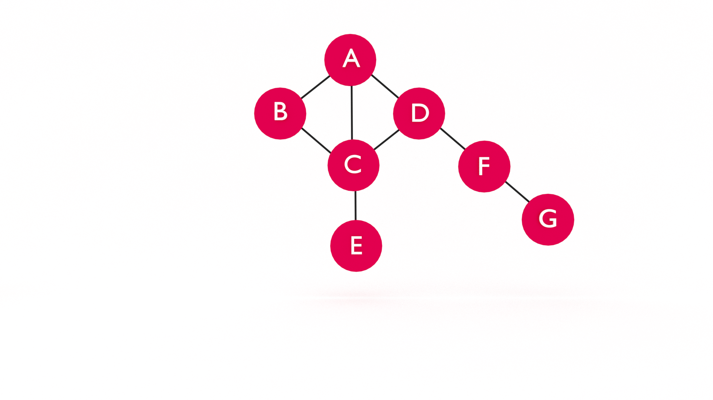
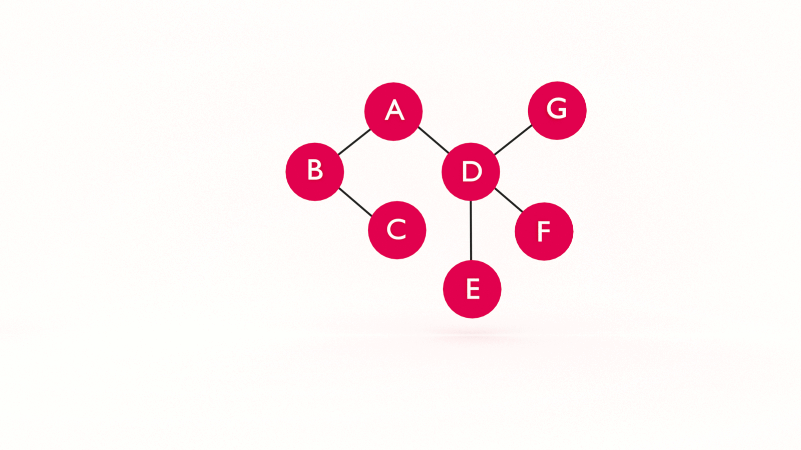
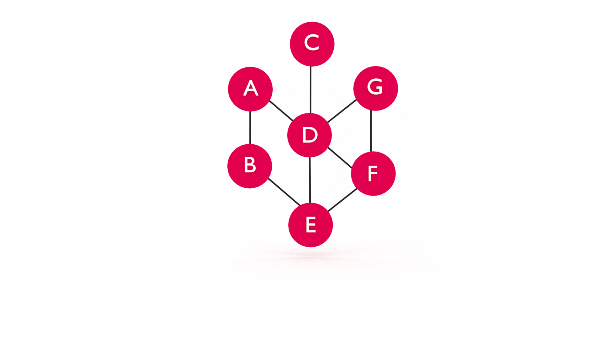

At some point in your career (today?!) you will want to learn data structures. It's not _just_ to ace the technical interview and land your dream job. Learning data structures will help you understand how software works and improve your problem-solving skills.  In this tutorial, you will learn the breadth-first search (BFS) algorithm with graph data structures in JavaScript. If you're just joining us, you may want to start with [Learn JavaScript Graph Data Structure](https://jarednielsen.com/data-structure-graph-javascript/).
 


## Retrieval Practice

Retrieval practice is the surest way to solidify any new learning. Attempt to answer the following questions before proceeding:

* What is a Graph?

* What problem(s) does a Graph solve? 

* What problem(s) do data structures solve? 

### What is a Graph? 

A graph consists of a set of nodes, or _vertices_, connected by _edges_.  An edge consists of a pair of vertices. For example, if we establish a pair between two vertices, `A` and `B`, we refer t0 this related pairing as an edge. Because they are connected by an edge, `A` and `B` are _adjacent_.


### What Problem(s) Does a Graph Solve?

* Optimization: We can use the graph data structure in conjunction with an optimization algorithm for determining an optimal path, such as GPS

* Network topology: We can use the graph data structure when modeling network topology, such as the internet or your friends on Facebook!

### What Problem(s) Do Data Structures Solve?

According to [Wikipedia](https://en.wikipedia.org/wiki/Data_structure):

> Different types of data structures are suited to different kinds of applications, and some are highly specialized to specific tasks. Data structures provide a means to manage large amounts of data efficiently for uses such as large databases and internet indexing services. Usually, efficient data structures are key to designing efficient algorithms. 


## Let's Get Meta
 
* What is Breadth-First Search? 

* What is the difference between Breadth-First Search and Depth-First Search? 

* What problem(s) does Breadth-First Search solve?


## Graph Traversal: BFS vs. DFS

There are two algorithms for graph traversal: 

* breadth-first search (BFS) 

* depth-first search (DFS)

How do we search a graph? 

Unlike a binary tree, we don't necessarily have a root and we definitely don't have a predetermined structure of branches. What _do_ we have? 

* vertices

* edges 

What do we know about these things? 

* vertices are connected to each other with edges

* vertices can be connected to any number of adjacent vertices (including zero!)

Let's draw a simple graph so we can visualize this: 



If we can't start at a root, where do we begin? 

Anywhere! 

We just pick a vertex and start searching. 

For the sake of simplicity, let's choose vertex `A` as our starting point, or `root`, and `G` as our `goal`.

As we can see, `A` is connected to vertices `B`, `C`, and `D`. 

Now we need to make a decision. 

Do we first search the vertices connected to `A`? Or do we choose _one_ of the vertices connected to `A` and then search the vertices connected to it? 

🤔

This is the difference between BFS and DFS. 

With Breadth-First Search, we search all of the edges connected to a vertex before moving on to search the edges of the connected vertices. 

With Depth-First Search, we follow the paths of the edges connected to our starting vertex, or _search key_, one at a time, until we reach the end, then we backtrack and search the alternate paths, until we find the vertex we are looking for or we arrive back where we started. 
 

### Breadth-First Search (BFS) in JavaScript

Let's declare our Graph data structure. 
```js
class Graph {
  constructor() {
      this.vertices = [];
      this.adjacent = {};
      this.edges = 0;
  }

  addVertex(v) {
      this.vertices.push(v);
      this.adjacent[v] = [];
  }

  addEdge(v, w) {
      this.adjacent[v].push(w);
      this.adjacent[w].push(v);
      this.edges++;
  }
}
```

Next, let's initialize a new Graph and add vertices and edges. 

```js
const g = new Graph();

g.addVertex("A");
g.addVertex("B");
g.addVertex("C");
g.addVertex("D");
g.addVertex("E");
g.addVertex("F");
g.addVertex("G");

g.addEdge("A","B");
g.addEdge("A","C");
g.addEdge("A","D");
g.addEdge("B","C");
g.addEdge("B","D");
g.addEdge("C","D");
g.addEdge("C","E");
g.addEdge("D","F");
g.addEdge("F","G");
```

To our Graph class, let's add a `bfs` method. We need to declare two parameters, `goal` and `root`, and if `goal` and `root` are equal, we return `true`, else we return `false`:
```js
    bfs(goal, root) {
        if (root === goal) {
            return true;
        }

        return false;
    }
```

We can take our declaration one step further using JavaScript's [default parameters](https://developer.mozilla.org/en-US/docs/Web/JavaScript/Reference/Functions/Default_parameters).
```js
    bfs(goal, root = this.vertices[0]) {
        if (root === goal) {
            return true;
        }

        return false;
    }
```

📝 You will see many different implementations of BFS. Some do not specify a root while others do not specify a goal. The goal here (no pun intended) is to demonstrate an approach that covers the breadth (pun intended) of BFS variations. 

Let's verify that our `bfs()` method works by logging the return value with an argument of `G`:

```js
console.log(g.bfs("G", "G"));
```

The above will return `true`. 

And the following will return `false`: 
```js
console.log(g.bfs("G"));
```

Now what? 

Let's outline a rough approach in pseudocode: 

* Check the root. 

* If the root is equal to the goal, return true. 

* If the root is not equal to our goal, check the vertices adjacent to our root. 

* If an adjacent value is equal to our goal, return `true`.

* If none of the adjacent vertices are equal to our goal, return `false`. 

If we translate this to JavaScript: 
```js
    bfs(goal, root = this.vertices[0]) {
        let adj = this.adjacent;

        if (root === goal) {
            return true;
        }

        for (let i = 0; i < adj[root].length; i++) {
            if (adj[root][i] === goal) {
                return true;
            }
        }

        return false;
    }
```

This will work if our query is `B`, `C`, or `D`. How do we get to `G`? 

How do we "move down" a level? 

Here's the point where we need to make a jump, literally _and_ figuratively. 

But things are about to get messy! Why? 

We know our graph looks likes this:


What if we don't know what our graph looks like? 

What if our graph looked like this? 



Or this? 



There are a couple problems we need to solve. 

If we jump back to where we started, how do we avoid checking `B` twice? 

_And..._

If we checked `B`, but not its adjacent vertices, how do we "move down a level" and check the vertices connected to `B`? 

Once we check `B`, how do we move on to `C` and check its adjacent vertices? 

We need a way to track which vertices we already visited. 

But!

We also need a way to track which vertices we need to visit.

What's the problem we need to solve? 

There's no predetermined structure. 

How do we bring order to this chaos?

🤔

Let's restate our goal: 

> Given a graph, a root, and a goal, start at the root and search the adjacent vertices until we find the goal

There's a keyword here...

It starts with 'u' and ends with 'ntil'....

What is the control flow statement that functions like a repeating `if` statement? 

I'll just wait here _while_ you think about it 😛

Let's edit our pseudocode: 

* While there are vertices to check, start with the root. 

* If the root is equal to the goal, return true. 

* If the root is not equal to our goal, check the vertices adjacent to our root. 

* If an adjacent value is equal to our goal, return `true`.

* If none of the adjacent vertices are equal to our goal, return `false`. 

The next question is, `while` _what_? How do we know there are vertices to check? 

It's like we need a list...

Let's use an analogy. 

Graphs are often used to represent social networks. Imagine you and your friends are going to see a movie. You can't all rush into the theater at once. What do you need to do? Form a line, or, as they say across the pond, a queue! 

🤯 

Let's refactor our `bfs` method to use a queue. We'll first use an array and treat it like a Queue data structure and then later refactor to use a proper Queue class.

```js
    bfs(goal, root = this.vertices[0]) {
        let adj = this.adjacent;

        const queue = [];
        queue.push(root);

        while(queue.length) {
            let v = queue.shift();

            if (v === goal) {
                return true;
            }

            for (let i = 0; i < adj[v].length; i++) {
                queue.push(adj[v][i]);
            }
        }

        return false;
    }
```

We declare an array, `queue`, and `push`, or _enqueue_ our `root` to it. While there are vertices in the queue, we _dequeue_ the first vertex and assign it to the variable, `v`. If `v` is equal to our `goal`, we return `true`. If `v` is not equal to our `goal`, we push the adjacent vertices adjacent to our `queue` and then check them. 

This works great if we are only searching `D`. 

What happens if we search for `G`? 

Let's log `v` to see what's happening inside our `while` loop. 
```js
    bfs(goal, root = this.vertices[0]) {
        let adj = this.adjacent;

        const queue = [];
        queue.push(root);

        while(queue.length) {
            let v = queue.shift();
            console.log(v);

            if (v === goal) {
                return true;
            }

            for (let i = 0; i < adj[v].length; i++) {
                queue.push(adj[v][i]);
            }
        }

        return false;
    }
```

When we search for `D`:
```js
console.log(g.bfs("D"));
```

We log the following: 
```sh
A
B
C
D
true
```

But if we search for `G`:
```js
console.log(g.bfs("G"));
```

We log the following: 
```sh
A
B
C
D
A
C
D
A
B
D
E
A
B
C
F
B
C
D
A
B
D
E
A
B
C
F
B
C
D
A
C
D
A
B
C
F
C
B
C
D
A
C
D
A
B
D
E
D
G
true
```

This is not very efficient.

It gets worse. What happens if we search for `H`?

Yep...

What's the problem? 

♾️

The condition of our `while` loop is always true because we never stop pushing vertices to our queue. 

What's the solution? 

🛑

We need an exit strategy... or a way to track which vertices we already checked so we don't check them again.

We _could_ use another Queue, but we don't need FIFO, so we can just use an array to track which vertices we "discovered".

```js
    bfs(goal, root = this.vertices[0]) {
        let adj = this.adjacent;

        const queue = [];
        queue.push(root);

        const discovered = [];
        discovered[root] = true;

        while(queue.length) {
            let v = queue.shift();
            console.log(v);

            if (v === goal) {
                return true;
            }

            for (let i = 0; i < adj[v].length; i++) {
                if (!discovered[adj[v][i]]) {
                    discovered[adj[v][i]] = true;
                    queue.push(adj[v][i]);
                }
            }
        }

        return false;
    }
```

We declare an array, `discovered`, and create an index, `root` assigned a value of `true`. Within the `for` loop in our `while` loop, we add a condition to check whether or not the vertex was "discovered". If we did not previously discover the vertex, we now mark it as discovered, or `true`, and push it to our `queue` to later check if it is equal to our `goal`. 

That's it!

That's Breadth-First Search!`

You're like, "BFD. 

"Why would we need this if we can simply _look up_ our query in the `adjacent` 'dictionary'?" 

I'm glad you asked. 

For the sake of brevity and example, the method above is contrived. A "real-world" application of a breadth-first search algorithm would check for a value stored in a graph and return the unique identifier, or key, of the vertex where that value was found. Another "real-world" scenario is finding the shortest path between two vertices. In the next tutorial, we'll modify our `bfs` method to do just that!


## Reflection

* What is Breadth-First Search? 

* What is the difference between Breadth-First Search and Depth-First Search? 

* What problem(s) does Breadth-First Search solve?


### What is Breadth-First Search? 

Breadth-First Search is an algorithm that searches a graph for a specific goal by checking all of the edges connected to a vertex before moving on to check the edges of the connected vertices. 


### What is the Difference Between Breadth-First Search and Depth-First Search? 

Breadth-First Search checks all of the vertices adjacent to a given vertex before checking the vertices adjacent to those vertices. Depth-First Search, on the other hand, checks all of the vertices on a path and then backtracks.


### What Problem(s) Does Breadth-First Search Solve? 

There are a number of specific use cases, such as the Ford-Fulkerson or Cheney's algorithm, for breadth-first search algorithms, but a general application is to find the shortest, or most efficient, path between two vertices.

