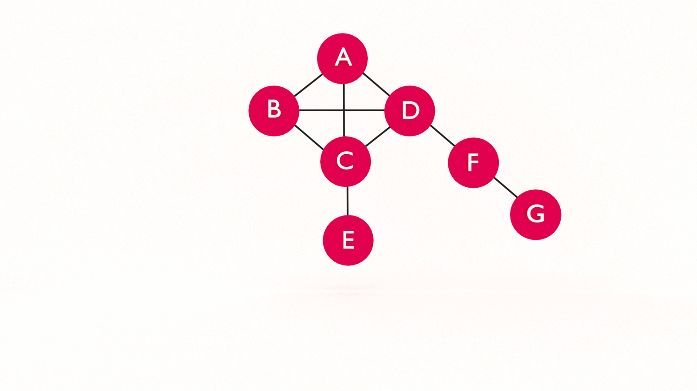

At some point in your career (today?!) you will want to learn data structures. It's not _just_ to ace the technical interview and land your dream job. Learning data structures will help you understand how software works and improve your problem-solving skills.  In this tutorial, you will learn depth-first search graph traversal in JavaScript. 

If you're just joining us, you may want to start with [Learn JavaScript Graph Data Structure](https://jarednielsen.com/data-structure-graph-javascript/).
 


## Retrieval Practice

Retrieval practice is the surest way to solidify any new learning. Attempt to answer the following questions before proceeding:

* What is a Graph?

* What problem(s) does a Graph solve? 

* What problem(s) do data structures solve? 

### What is a Graph? 

A graph consists of a set of nodes, or _vertices_, connected by _edges_.  An edge consists of a pair of vertices. For example, if we establish a pair between two vertices, `A` and `B`, we refer t0 this related pairing as an edge. Because they are connected by an edge, `A` and `B` are _adjacent_.


### What Problem(s) Does a Graph Solve?

* Optimization: We can use the graph data structure in conjunction with an optimization algorithm for determining an optimal path, such as GPS

* Network topology: We can use the graph data structure when modeling network topology, such as the internet or your friends on Facebook!

### What Problem(s) Do Data Structures Solve?

According to [Wikipedia](https://en.wikipedia.org/wiki/Data_structure):

> Different types of data structures are suited to different kinds of applications, and some are highly specialized to specific tasks. Data structures provide a means to manage large amounts of data efficiently for uses such as large databases and internet indexing services. Usually, efficient data structures are key to designing efficient algorithms. 


## Let's Get Meta
 
* What is Depth-First Search? 

* What is the difference between Breadth-First Search and Depth-First Search? 

* What problem(s) does Depth-First Search solve?


## Graph Traversal: BFS vs. DFS

There are two algorithms for graph traversal: 

* breadth-first search (BFS) 

* depth-first search (DFS)

How do we search a graph? 

Unlike a binary tree, we don't necessarily have a root and we definitely don't have a predetermined structure of branches. What _do_ we have? 

* vertices

* edges 

What do we know about these things? 

* vertices are connected to each other with edges

* vertices can be connected to any number of adjacent vertices (including zero!)

Let's draw a simple graph so we can visualize this: 



If we can't start at a root, where do we begin? 

Anywhere! 

We just pick a vertex and start searching. 

For the sake of simplicity, let's choose vertex `A` as our starting point, or `root`, and `G` as our `goal`.

As we can see, `A` is connected to vertices `B`, `C`, and `D`. 

Now we need to make a decision. 

Do we first search the vertices connected to `A`? Or do we choose _one_ of the vertices connected to `A` and then search the vertices connected to it? 

🤔

This is the difference between BFS and DFS. 

With Breadth-First Search, we search all of the edges connected to a vertex before moving on to search the edges of the connected vertices. 

With Depth-First Search, we follow the paths of the edges connected to our starting vertex, or _search key_, one at a time, until we reach the end, then we backtrack and search the alternate paths, until we find the vertex we are looking for or we arrive back where we started. 
 

### Depth-First Search (BFS) in JavaScript

Let's declare our Graph data structure. 
```js
class Graph {
  constructor() {
      this.vertices = [];
      this.adjacent = {};
      this.edges = 0;
  }

  addVertex(v) {
      this.vertices.push(v);
      this.adjacent[v] = [];
  }

  addEdge(v, w) {
      this.adjacent[v].push(w);
      this.adjacent[w].push(v);
      this.edges++;
  }
}
```

Next, let's initialize a new Graph and add vertices and edges. 

```js
const g = new Graph();

g.addVertex("A");
g.addVertex("B");
g.addVertex("C");
g.addVertex("D");
g.addVertex("E");
g.addVertex("F");
g.addVertex("G");

g.addEdge("A","B");
g.addEdge("A","C");
g.addEdge("A","D");
g.addEdge("B","C");
g.addEdge("B","D");
g.addEdge("C","D");
g.addEdge("C","E");
g.addEdge("D","F");
g.addEdge("F","G");
```

Let's restate the goal of our `dfs` method: 

> Given a graph, a starting vertex, and a goal, start at the root and search path by path

To our Graph class, let's add a `dfs` method. We need to declare two parameters, `goal` and `v`. 
```js
    dfs(goal, v) {

        return false;
    }
```

📝 We will `return false` for the time being because we haven't yet found our goal. 

We can take our declaration one step further using JavaScript's [default parameters](https://developer.mozilla.org/en-US/docs/Web/JavaScript/Reference/Functions/Default_parameters).
```js
    dfs(goal, v = this.vertices[0]) {

        return false;
    }
```

📝 You will see many different implementations of DFS. Some do not specify a root while others do not specify a goal. The goal here (no pun intended) is to demonstrate an approach that covers DFS variations in-depth (pun intended). 

Now what? 

Let's outline a rough approach in pseudocode: 

* Check the root. 

* If the root is equal to the goal, return true. 

* If the root is not equal to our goal, check the first vertex adjacent to our root. 

* If it is equal to our goal, return true. 

* If the first adjacent vertex is not equal to our goal, check the first adjacent vertex to our first adjacent vertex...

✋ Hey! 

What is this starting to look like? 

🤔

Recursion! 

What do we know about recursion? 

Like [proof by induction](https://jarednielsen.com/proof-induction), we need to establish two things: 

* base case 

* recursive, or iterative, case

So what is our base case? 

TODO 
If we discovered our goal or not. 

```js
    dfs(goal, v = this.vertices[0]) {
        const discovered = [];
        discovered[v] = true;

        return discovered[goal] || false;
    }
```

We declare an array, `discovered` and create a key with the value of `v`. We short circuit the return, if `goal` is in `discovered`, we return `true`, otherwise we return `false`.

If we call our `dfs` with an argument of "G", `g.dfs("G")`, it will return `false`. 

And if we call our `dfs` with an argument of "A", `g.dfs("A")`, it will return `true`. 

Base case established. Now what? 

We need to establish the recursive, or iterative, case. 

Let's make things easier on ourselves, and _let_ `this.adjacent` equal `adj`.
```js
    dfs(goal, v = this.vertices[0]) {
        let adj = this.adjacent;

        const discovered = [];
        discovered[v] = true;

        return discovered[goal] || false;
    }
```

Now we need to iterate over `adj`, our array of vertices. For each vertex adjacent to `v`, we want to check if it discovered. If it's not discovered, we make our recursive call. 
```js
    dfs(goal, v = this.vertices[0]) {
        let adj = this.adjacent;

        const discovered = [];
        discovered[v] = true;

        for (let i = 0; i < adj[v].length; i++){
            let w = adj[v][i];

            if (!discovered[w]) {
                this.dfs(goal, w);
            }

        }

        return discovered[goal] || false;
    }
```

What happens when we run our `dfs`? 
```sh
RangeError: Maximum call stack size exceeded
```

🤔

WTF? 

Where's the problem? 

Every time we call `dfs`, we are declaring a new `discovered` array. Each time we enter our for loop and check if `w` is or is not "discovered", we make the call.

What's the solution?

[It's dynamic!](https://jarednielsen.com/dynamic-programming-memoization-tabulation/) 

We need to pass our `discovered` array as an argument to our recursive `dfs` calls. 
```js
    dfs(goal, v = this.vertices[0]) {
        let adj = this.adjacent;

        const discovered = [];
        discovered[v] = true;

        for (let i = 0; i < adj[v].length; i++){
            let w = adj[v][i];

            if (!discovered[w]) {
                this.dfs(goal, w, discovered);
            }
        }

        return discovered[goal] || false;
    }
```

But this won't work. Why? 

Because `discovered` is not a parameter of our `dfs` declaration. Let's fix that. 
```js
    dfs(goal, v = this.vertices[0], discovered = []) {
        let adj = this.adjacent;

        discovered[v] = true;

        for (let i = 0; i < adj[v].length; i++){
            let w = adj[v][i];

            if (!discovered[w]) {
                this.dfs(goal, w, discovered);
            }
        }

        return discovered[goal] || false;
    }
```

📝 We removed the `const` declaration of `discovered`. 

Now, if we call our `dfs` with an argument of "G", `g.dfs("G")`, it will return `true`. 

And if we call our `dfs` with an argument of "H", `g.dfs("H")`, it will return `false`. 

Here's our complete Graph class: 
```js
class Graph {
    constructor() {
        this.vertices = [];
        this.adjacent = {};
        this.edges = 0;
    }

    addVertex(v) {
        this.vertices.push(v);
        this.adjacent[v] = [];
    }

    addEdge(v, w) {
        this.adjacent[v].push(w);
        this.adjacent[w].push(v);
        this.edges++;
    }


    bfs(goal, root = this.vertices[0]) {
        let adj = this.adjacent;

        const queue = [];
        queue.push(root);

        const discovered = [];
        discovered[root] = true;

        const edges = [];
        edges[root] = 0;

        const predecessors = [];
        predecessors[root] = null;

        const buildPath = (goal, root, predecessors) => {
            const stack = [];
            stack.push(goal);

            let u = predecessors[goal];

            while(u != root) {
                stack.push(u);
                u = predecessors[u];
            }

            stack.push(root);

            let path = stack.reverse().join('-');

            return path;
        }
    

        while(queue.length) {
            let v = queue.shift();

            if (v === goal) {
                return { 
                    distance: edges[goal],
                    path: buildPath(goal, root, predecessors)
                };
            }

            for (let i = 0; i < adj[v].length; i++) {
                if (!discovered[adj[v][i]]) {
                    discovered[adj[v][i]] = true;
                    queue.push(adj[v][i]);
                    edges[adj[v][i]] = edges[v] + 1;
                    predecessors[adj[v][i]] = v;
                }
            }
        }

        return false;
    }

    dfs(goal, v = this.vertices[0], discovered = []) {
        let adj = this.adjacent;

        discovered[v] = true;

        for (let i = 0; i < adj[v].length; i++){
            let w = adj[v][i];

            if (!discovered[w]) {
                this.dfs(goal, w, discovered);
            }
        }

        return discovered[goal] || false;
    }
}
```

That's it!

That's Depth-First Search!`

What good is this inefficient algorithm? 

I'm glad you asked. 

In the next tutorial, we'll modify our `dfs` method to perform topological sorting! Stay tuned!


## Reflection

* What is Depth-First Search? 

* What is the difference between Breadth-First Search and Depth-First Search? 

* What problem(s) does Depth-First Search solve?


### What is Depth-First Search? 

Breadth-First Search is an algorithm that searches a graph for a specific goal by checking all of the vertices connected on a path before moving on to check the adjacent vertices. 


### What is the Difference Between Breadth-First Search and Depth-First Search? 

Breadth-First Search checks all of the vertices adjacent to a given vertex before checking the vertices adjacent to those vertices. Depth-First Search, on the other hand, checks all of the vertices on a path and then backtracks.


### What Problem(s) Does Depth-First Search Solve? 

There are a number of specific use cases, such as finding the bridges in a graph, finding the solution to a maze, or defining the topology of a graph. 

