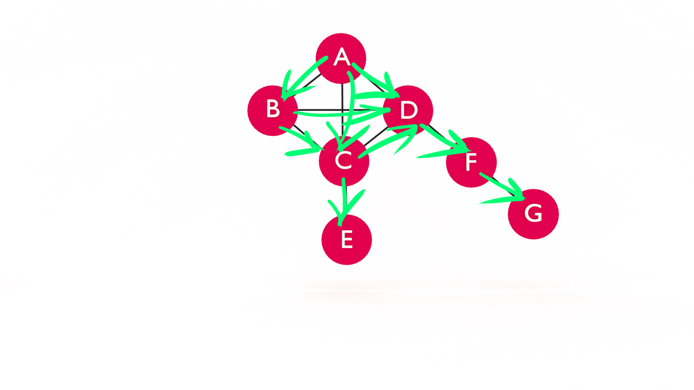

At some point in your career (today?!) you will want to learn data structures. It's not _just_ to ace the technical interview and land your dream job. Learning data structures will help you understand how software works and improve your problem-solving skills. In this tutorial, you will learn topological sort using a depth-first search graph traversal in JavaScript. 

If you're just joining us, you may want to start with [Learn JavaScript Graph Data Structure](https://jarednielsen.com/data-structure-graph-javascript/).
 

## Retrieval Practice

Retrieval practice is the surest way to solidify any new learning. Attempt to answer the following questions before proceeding:

* What is a Graph?

* What problem(s) does a Graph solve? 

* What is Depth-First Search? 

### What is a Graph? 

A graph consists of a set of nodes, or _vertices_, connected by _edges_.  An edge consists of a pair of vertices. For example, if we establish a pair between two vertices, `A` and `B`, we refer t0 this related pairing as an edge. Because they are connected by an edge, `A` and `B` are _adjacent_.


### What Problem(s) Does a Graph Solve?

* Optimization: We can use the graph data structure in conjunction with an optimization algorithm for determining an optimal path, such as GPS

* Network topology: We can use the graph data structure when modeling network topology, such as the internet or your friends on Facebook!


### What is Depth-First Search?

Depth-First Search is an algorithm that searches a graph for a specific goal by checking all of the vertices connected on a path before moving on to check the adjacent vertices. 


## Let's Get Meta
 
* What is topology? 

* What is a directed acylclic graph? 

* What is a topological sort?


### What is Topology? 

According to Wikipedia...

> In mathematics, topology is concerned with the properties of a geometric object that are preserved under continuous deformations, such as stretching, twisting, crumpling and bending, but not tearing or gluing. 

🙄

Let's think about this in the context of data structures. What is our geometric object? Our graph! We generally think of graphs in two dimensions, but they can easily be represented in three. What are the continuous deformations? The methods that add and remove vertices and edges. 


### What is a Directed Acylcic Graph? 

According to [Wikipedia](https://en.wikipedia.org/wiki/Directed_acyclic_graph), a directed acyclic graph is a graph that...  

> consists of vertices and edges, with each edge directed from one vertex to another, such that following those directions will never form a closed loop

Let's reverse engineer this term.

We're familiar with the term 'graph'. But what does _acyclic_ mean? What is a cycle? 

> a series of events that are regularly repeated in the same order.

So if something is _cyclic_, it is "occurring in cycles; regularly repeated." And if something is _acyclic_, it's the opposite of that, meaning it does not occur in cycles.

What does it mean if a graph is directed? The edges of a directed graph "point" in a direction from one vertex to another. 



### What is a Topological Sort?

There are a lot of popular analogies to explain topological sort, such as tasks that must be executed in a specific order or a list of skills and their prerequisites. 

My favorite analogy is the one used by Corment et al in [Introduction to Algorithms](https://amzn.to/372MOUz), in which Professor Bumstead is getting dressed for work. After bathing, Prof Bumstead opens his closet to select the following garments:

* undershorts

* pants

* belt

* socks

* shoes

* shirt

* tie

* jacket

If Professor Bumstead's closet is a graph and the garments are vertices, then we can see that there is an order, or direction, in which the professor must suit up. Unless, of course, he is an absent-minded professor. 


## Topological Sort using Depth-First Search (DFS) in JavaScript

Let's review our Graph class: 
```js
class Graph {
    constructor() {
        this.vertices = [];
        this.adjacent = {};
        this.edges = 0;
    }

    addVertex(v) {
        this.vertices.push(v);
        this.adjacent[v] = [];
    }

    addEdge(v, w) {
        this.adjacent[v].push(w);
        this.adjacent[w].push(v);
        this.edges++;
    }


    bfs(goal, root = this.vertices[0]) {
        let adj = this.adjacent;

        const queue = [];
        queue.push(root);

        const discovered = [];
        discovered[root] = true;

        const edges = [];
        edges[root] = 0;

        const predecessors = [];
        predecessors[root] = null;

        const buildPath = (goal, root, predecessors) => {
            const stack = [];
            stack.push(goal);

            let u = predecessors[goal];

            while(u != root) {
                stack.push(u);
                u = predecessors[u];
            }

            stack.push(root);

            let path = stack.reverse().join('-');

            return path;
        }
    

        while(queue.length) {
            let v = queue.shift();

            if (v === goal) {
                return { 
                    distance: edges[goal],
                    path: buildPath(goal, root, predecessors)
                };
            }

            for (let i = 0; i < adj[v].length; i++) {
                if (!discovered[adj[v][i]]) {
                    discovered[adj[v][i]] = true;
                    queue.push(adj[v][i]);
                    edges[adj[v][i]] = edges[v] + 1;
                    predecessors[adj[v][i]] = v;
                }
            }
        }

        return false;
    }

    dfs(goal, v = this.vertices[0], discovered = []) {
        let adj = this.adjacent;

        discovered[v] = true;

        for (let i = 0; i < adj[v].length; i++){
            let w = adj[v][i];

            if (!discovered[w]) {
                this.dfs(goal, w, discovered);
            }
        }

        return discovered[goal] || false;
    }
}
```

Next, let's initialize a new Graph and add vertices and edges. 

```js
const g = new Graph();

g.addVertex("A");
g.addVertex("B");
g.addVertex("C");
g.addVertex("D");
g.addVertex("E");
g.addVertex("F");
g.addVertex("G");

g.addEdge("A","B");
g.addEdge("A","C");
g.addEdge("A","D");
g.addEdge("B","C");
g.addEdge("B","D");
g.addEdge("C","D");
g.addEdge("C","E");
g.addEdge("D","F");
g.addEdge("F","G");
```


Let's restate the goal of topological sort:

> Given a directed acylcic graph, select a vertex with an indegree of zero and return all vertices in the order discovered on each path of the graph.

What do we mean by "indegree"? Indegree and its opposite, outdegree, describe whether or not edges are directed to or from a vertex. So, here, a vertex with an indegree of zero means that there are no vertices directed at it. In our diagram above, the vertex `"A"` has an indegree of zero, but an outdegree of three as its edges at directed at vertices `"B"`, `"C"`, and `"D"`. 


We want to write a method that returns the following: 

```sh
[
  'A', 'B',
  'C', 'E',
  'D', 'F',
  'G'
]
```

📝 Note that "E" follows "C" and precedes "D". 

Why? 

If we are following the control flow of our DFS method, we begin with "A", discover "B", backtrack to "A", then discover "C" and "E", then backtrack to "A" again to discover "D", "F", and finally "G". 

I just described DFS, so let's translate that into pseudocode. 

* Given a graph, a goal, and a starting vertex...

* Mark the starting vertex as discovered. 

* For each adjacent vertex, if the vertex is not discovered, mark the adjacent vertex as discovered.

* For each adjacent vertex... Repeat, recursively.

* Return the discovered vertices. 

If our goal is to return the vertices in the order they were discovered, how do we modify our pseudocode? 

Where have we seen this or something like it before? 

🤔

Breadth-First Search! 

What's the "secret sauce" of BFS? 

A queue. 

Why? 

Because we move _across_ vertices. 

Will a queue work in DFS? 

🙅‍♀️

Why? 

Because we are moving _up_ and _down_ vertices. 

So what data structure _will_ work? 

A stack. 

Let's insert the new steps into our pseudocode:

* Given a graph, a goal, and a starting vertex...

* _Declare a stack._

* Mark the starting vertex as discovered. 

* For each adjacent vertex, if the vertex is not discovered, mark the adjacent vertex as discovered.

* For each adjacent vertex... Repeat, recursively.

* _Push the vertex onto the stack._

* Return the stack. 

Now let's translate our pseudocode to JavaScript. We _could_ write a `topoSort` method from scratch, but because it is so similar to `dfs`, let's copy-pasta and refactor. For reference, here's our `dfs` method: 
```js
    dfs(goal, v = this.vertices[0], discovered = []) {
        let adj = this.adjacent;

        discovered[v] = true;

        for (let i = 0; i < adj[v].length; i++){
            let w = adj[v][i];

            if (!discovered[w]) {
                this.dfs(goal, w, discovered);
            }
        }

        return discovered[goal] || false;
    }
```

We simply need to make a few adjustments: 
```js
    topoSort(v = this.vertices[0], discovered = [], s) {
        const stack = s || [];

        let adj = this.adjacent;

        discovered[v] = true;

        for (let i = 0; i < adj[v].length; i++){
            let w = adj[v][i];

            if (!discovered[w]) {
                this.topoSort(w, discovered, stack);
            }
        }

        stack.unshift(v);
        return stack || false;
    }
```

We remove the `goal` parameter as we are not searching for a specific vertex and we add an `s` parameter so we can use memoization with our `stack` array. We then declare our `stack` by assigning it the value stored in `s` OR we initialize a new, empty array. Before we return our `stack`, we _prepend_ the vertex to the array. 

Can you top that? 

Yes, actually, you can. There are several approaches to implementing a topological sort algorithm. The approach outlined in [Introduction to Algorithms](https://amzn.to/372MOUz) uses a Linked List rather than a Stack, which is very fancy. Another popular approach is using a HashTable. We chose an array because it is straightforward and as long as we remember to treat it as such, works similar to a stack, not to mention it's a bit redundant to implement in JavaScript. There are also implementations that compute the _time_ from when a vertex is discovered to when it is "finished", meaning all adjacent vertices are explored. This time is then used to determine the position of the vertex in the sorted topology. 


## Reflection

* What is topology? 

* What is a directed acylclic graph? 

* What is a topological sort?

### What is Topology?

For our intents and purposes, topology is the study of the _shape_ of a data structure, in this case, a graph. We are specifically interested in the properties of our graph, the edges and vertices, and the relationship between them. 


### What is a Directed Acylcic Graph? 

A DAG is a graph containing at least one vertex with an indegree of zero and consisting of edges that specify an ordering of vertices, such that the edge (u, v) implies that the vertex _u_ precedes _v_. 


### What is Topological Sorting?

Topological sorting is a graph traversal algorithm that returns the vertices of a directed acyclic graph in the order defined by their edges.

