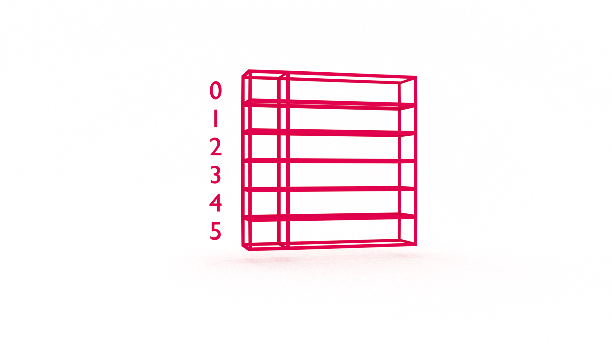

At some point in your career (today?!) you will want to learn data structures. It's not _just_ to ace the technical interview and land your dream job. Learning data structures will help you understand how software works and improve your problem-solving skills. In this tutorial, you will learn how to implement chained hashing to handle collisions in a hash table data structure with JavaScript.


If you're new to data structures, you may want to start with [Data Structures in JavaScript: Array](https://jarednielsen.com/data-structure-array-javascript/)


## Retrieval Practice

Retrieval practice is the surest way to solidify any new learning. Attempt to answer the following questions before proceeding: 

* What is a hash table? 

* What is hashing?

* What is a linked list? 


### TODO


TODO


### TODO 

TODO 


### TODO 

TODO


## Let's Get Meta

Programming is problem solving. Both are metacognitive activities. To excel, we want to improve our thinking _about_ thinking. Ask yourself the following questions and keep them back of mind as you proceed: 
 
* What is a collision? 

* What is chained hashing? 

* What is open address hashing?


## How to Implement Hash Table Separate Chainnig in JavaScript

Let's pick up where we left off in the previous tutorial, [Data Structures in JavaScript: Hash Table](https://jarednielsen.com/data-structure-hash-table-javascript/).

For reference, our complete hash table class looks like this: 
```js
class HashTable {
    constructor() {
        this.table = [];
    }

    modularHash(key) {
        let sum = 0;

        for (let i = 0; i < key.length; ++i) {
            sum += key.charCodeAt(i);
        }

        let hash = sum % 71; 

        return hash;
    }

    put(key, value) {
        let hash = this.modularHash(key);
        return this.table[hash] = value;
    }

    get(key) {
        return this.table[this.modularHash(key)];
    }

    remove(key) {
        return delete this.table[this.modularHash(key)];
    }


}

const hashTable = new HashTable();
```

In our previous tutorial, we were storing Twitter handles in our hash table and looking them up by the users given name. For example: 
```js
hashTable.put("Jared Nielsen", "@jarednielsen");
```

If we log our table, it returns: 
```sh
HashTable { table: [ <29 empty items>, '@jarednielsen' ] }
```


We discovered a problem if we _put_ the following key / value pairs in our table: 
```js
hashTable.put("NASA", "@nasa");
hashTable.put("ASAN", "@asan");
```

What's the problem? 

If we log our table, we see that "ASAN" overwrites "NASA": 
```sh
HashTable {
  table: [ <7 empty items>, '@asan', <21 empty items>, '@jarednielsen' ]
}
```

Now you understand the gravity of the situation 😉

This is referred to as a collision. Our hash function created the same key for two different values. 

What's the solution? 

There are two primary approaches to handling collisions in a hash table: chained hashing (the topic of this tutorial!) and open address hashing. 


TODO HERE'S OUT PUT METHOD

```js
    put(key, value) {
        let hash = this.modularHash(key);

        if (this.table[hash] === undefined) {
            this.table[hash] = [];
        }

        return this.table[hash].push([key, value]);
    }
```

TODO 


```sh
HashTable {
  table: [
    <7 empty items>,
    [ [Array], [Array] ],
    <21 empty items>,
    [ [Array] ]
  ]
}
```

Now we need to _get_ our values. 

```js
    get(key) {
        let hash = this.modularHash(key);
        let index = 0;

        while (this.table[hash][index][0] != key) {
            index++;
        }

        return this.table[hash][index][1] || undefined;
    }
```

TODO 


## Reflection

* What is a collision? 

* What is chained hashing? 

* What is open address hashing? 


### What is a Collision? 


### What is Chained Hashing? 


### What is Open Address Hashing? 

If chained hashing is creating a _chain_ of key / value pairs at a hashed index, what do you think the opposite approach will be? 


## Data Structures in JavaScript: Separate Chaining in Hash Tables

In this tutorial you learned chained hashing. In our next tutorial, we'll look at another solution to collisions in hash tables: open address hashing. 


