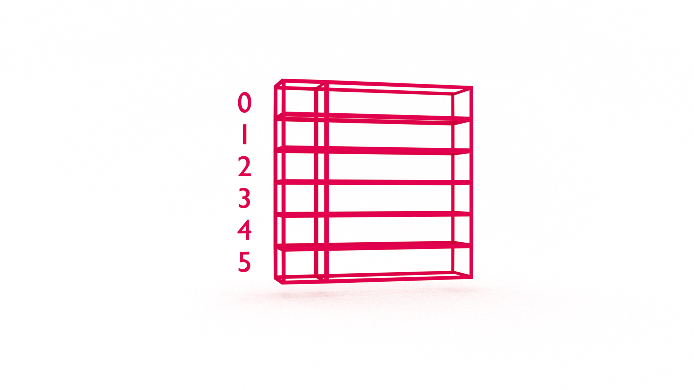

At some point in your career (today?!) you will want to learn data structures. It's not _just_ to ace the technical interview and land your dream job. Learning data structures will help you understand how software works and improve your problem-solving skills. In this tutorial, you will learn how to implement linear probing to handle collisions in a hash table data structure with JavaScript.


If you're new to data structures, you may want to start with [Data Structures in JavaScript: Array](https://jarednielsen.com/data-structure-array-javascript/)


## Retrieval Practice

Retrieval practice is the surest way to solidify any new learning. Attempt to answer the following questions before proceeding: 

* What is a hash table? 

* What is hashing?

* What is separate chaining?


### What is a Hash Table?

A hash table is a data structure that allows us to quickly look up values using a key. 


### What is Hashing?

Hashing is creating a key to use when looking up a value in a hash table.


### What is Separate Chaining?

Separate chaining, or chained hashing, is an approach to collision resolution that stores multiple key / value pairs at the same index in a hash table. 


## Let's Get Meta

Programming is problem solving. Both are metacognitive activities. To excel, we want to improve our thinking _about_ thinking. Ask yourself the following questions and keep them back of mind as you proceed: 
 
* What is a collision? 

* What is open address hashing?

* What is linear probing? 


## How to Implement Hash Table Linear Probing in JavaScript

Let's pick up where we left off in our previous tutorial, [Data Structures in JavaScript: Hash Table](https://jarednielsen.com/data-structure-hash-table-javascript/).

For reference, our complete hash table class looks like this: 
```js
class HashTable {
    constructor() {
        this.table = [];
    }

    modularHash(key) {
        let sum = 0;

        for (let i = 0; i < key.length; ++i) {
            sum += key.charCodeAt(i);
        }

        let hash = sum % 71; 

        return hash;
    }

    put(key, value) {
        let hash = this.modularHash(key);
        return this.table[hash] = value;
    }

    get(key) {
        return this.table[this.modularHash(key)];
    }

    remove(key) {
        return delete this.table[this.modularHash(key)];
    }
}

const hashTable = new HashTable();
```

We were previously using our hash table to store Twitter handles and then looking them up by the users given name. For example, if I _put_ my name and Twitter handle in our hash table: 
```js
hashTable.put("Jared Nielsen", "@jarednielsen");
```

...logging our table returns: 
```sh
HashTable { table: [ <29 empty items>, '@jarednielsen' ] }
```

I can get my handle calling the `get` method with my given name: 
```js
let query = hashTable.get("Jared Nielsen");
```

☝️ We discovered a problem if we _put_ the following key / value pairs in our table: 
```js
hashTable.put("NASA", "@nasa");
hashTable.put("ASAN", "@asan");
```

What's the problem? 

If we log our table, we see that "ASAN" overwrites "NASA": 
```sh
HashTable {
  table: [ <7 empty items>, '@asan', <21 empty items>, '@jarednielsen' ]
}
```

Do you see the gravity of the situation? 😉

It's like two cars trying to park in the same spot. What do we call this IRL? 

A collision. 

Our hash function created the same key for two different values, and, in this implementation, the subsequent value is overwriting the previous. 

What's the solution? 

There are two primary approaches to handling collisions in a hash table: [chained hashing](https://jarednielsen.com/data-structure-hash-table-separate-chaining/) (the topic of a previous tutorial) and open address hashing (the topic of this tutorial!). We _could_ use a [perfect hash function](https://en.wikipedia.org/wiki/Perfect_hash_function), but that's a topic for another day (or book!).

How can we store more than one value at a given index in an array? 

🤔

We don't!

We just park it somewhere else. 

Most people who own and drive cars try to find the parking spot closest to the entrance when they go to the store. What do they do if the closest spot is taken? They park in the next closest spot. 

That's linear probing! 

We create a hash and, if there's already a value stored at that index, we look, or _probe_, for the next available index _in line_. 

Let's translate that to JavaScript: 
```js
    put(key, value) {
        let hash = this.modularHash(key);

        if (this.table[hash] === undefined) {
            return this.table[hash] = [key, value];
        } else {
            while (this.table[hash] !== undefined) {
                hash++;
            }
        }

        return this.table[hash] = [key, value];
    }
```

We first create our hash using our `modularHash` method. Then we check if the index of the hash is `undefined`. If so, we store our value there. If it's not `undefined`, meaning there is already something stored at that index, we look at the next index by incrementing our hash. We continue to probe until we find an index that is `undefined` and, once we do, we store our value. 

📝 Note that we are storing the key / value pairs in an array.

But how do we _get_ our values out of our hash table? 

We simply reverse the process. 
```js
    get(key) {
        let hash = this.modularHash(key);

        while (this.table[hash] !== undefined) {
            if (this.table[hash][0] === key) {
                return this.table[hash][1];
            }
            hash++;
        }

        return undefined;
    }
```

We first generate our hash using `modularHash`, but, unlike our _put_ method, our conditional is nested inside our iterator. While the value stored in an index is not equal to `undefined`, or, in other words, while the value is _defined_, if the first element in the array is equal to our `key`, bingo! Otherwise, we continue iterating until we begin to probe `undefined` indexes. 


## Reflection

* What is a collision? 

* What is open address hashing? 

* What is linear probing? 


### What is a Collision? 

A collision occurs in a hash table when our put method attempts to store multiple values at the same hash index.


### What is Open Address Hashing? 

Open address hashing AKA open addressing AKA closed hashing is a general approach for resolving collisions in a hash table by, you guessed it, finding an open address and storing the value in it. 


### What is Linear Probling?

Linear probing is a specific application of open address hashing in which we search for an available index _linearly_. 


## Data Structures in JavaScript: Linear Probing Hash Tables

In this tutorial you learned linear probing. This is the end of my series on hash tables, but it's also just the beginning! There are many hashing functions to explore, or should I say _probe_...