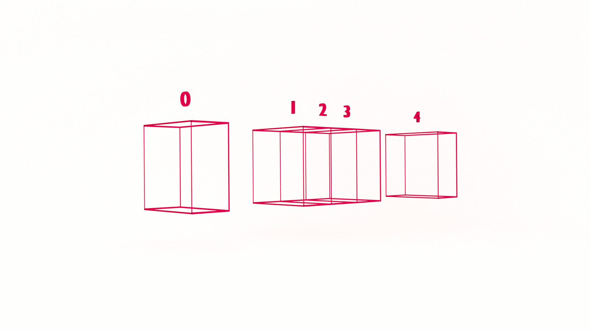

At some point in your career (today?!) you will want to learn data structures. It’s not just to ace the technical interview and land your dream job. Learning data structures will help you understand how software works and improve your problem-solving skills. In this tutorial, you will implement the queue data structure in JavaScript.

## What is a Queue?

A queue is similar to an array with one significant difference: elements are only accessible from one end. This means we can’t randomly access elements. Sounds like a stack, but there’s one significant difference between a queue and a stack: elements are accessed at one end of the queue and added at the other whereas with a stack, elements are added and accessed from the same end, the top. 

An analogy for a queue is, well, a queue. At a department store, for example, customers form a queue to make their purchases. As customers join the line, they must wait their turn to checkout. 

Your printer queue is another example. Say you need to print the complete works of H.G. Wells on Project Gutenberg. If you print them alphabetically, then _The Invisible Man_ will print before _The Time Machine_, even though it’s a time machine. 


### FIFO: First In, First Out

Like people in line to checkout, the dynamic of a queue is also referred to as **First In, First Out**, or **FIFO**. This is in contrast to the dynamic of a stack, which is **LIFO**, or **Last In, First Out**. 


### Queue Operations

There are three primary queue operations, the first two are essential:

* enqueue

* dequeue

* peek

The first method, _enqueue_, adds an element at the end of the queue, like an individual getting in the back of a line. 

The second method, _deqeue_, removes an element from the front of the queue, like an individual getting on a roller coaster. 

What is `peek`?

The `peek` operation allows us to view the value of the element at the front of the queue.

Why do we need a peek operation?

The `dequeue` operation permanently removes an element from the queue. The peek operation lets us peek at the value without removing it.

What else?

Depending on the implementation, there may be the following:

* length

* empty

* front

* back

The length is self explanatory: it returns the length of the queue.

The empty method, or isEmpty, returns a boolean value if the queue is or is not empty. 

The `front` and `back` methods are specific implementations of `peek`, returning the value at the front or back of the queue, respectively. 


## What Problem(s) Do Queues Solve? 

* Queues are useful when we want the constraints of FIFO

* Queues are useful when handling asynchronous data transfers

* Queues are useful for managing shared resources, such as job scheduling in an operating system or network


## Queue Data Structure in JavaScript 

Unless you’ve got a lot of interviews on your calendar, it’s not every day that you’ll consciously implement a queue. But as a JavaScript developer, an understanding of queues will help you understand how JavaScript itself works.

We can simply implement a queue using an Array and its built-in methods:

```js
const queue = [];
queue.push("First In!");
let firstOut = queue.shift();

```
🤨

Not impressed? We can also declare a class:

```js

class Queue {
 constructor() {
   this.store = [];
 }
  enqueue(element) {
   return this.store.push(element);
 }
  dequeue() {
   return this.store.shift();
 }
  peek() {
   return this.store[0];
 }
}
 
const q = new Queue();
 
q.enqueue("First in!");
q.enqueue("Last out!");
 
let firstOut = q.dequeue(); //"First in!"
 
let peekABoo = q.peek(); //"Last out!"
```

If you’re not a fan of sugary syntax, we can also implement our queue using prototype:

```js
const Queue = function() {
 this.store = [];
}
 
Queue.prototype.enqueue = function(element) {
 return this.store.push(element);
}
 
Queue.prototype.dequeue = function(element) {
 return this.store.shift();
}
 
Queue.prototype.peek = function () {
 return this.store[0];
}
```

## Big O & Queue Data Structures

What is the order of a queue? 

Regardless of the size of the queue, the time complexity for the enqueue() and dequeue() methods is constant. We perform one operation when adding or removing an element from the queue. If we need to search the queue or access a buried element, then it’s O(n). The space complexity is straightforward, pun intended: O(n). 


## Learn JavaScript Queue Data Structure

In this tutorial, you learned the queue data structure in JavaScript.

There are several classic and common interview questions using queues, including:

* Implement a queue with two stacks

* Implement a stack with a queue

* Generate binary numbers from 1 to n

In the next tutorial, we’ll learn how to implement a priority queue. Stay tuned!

