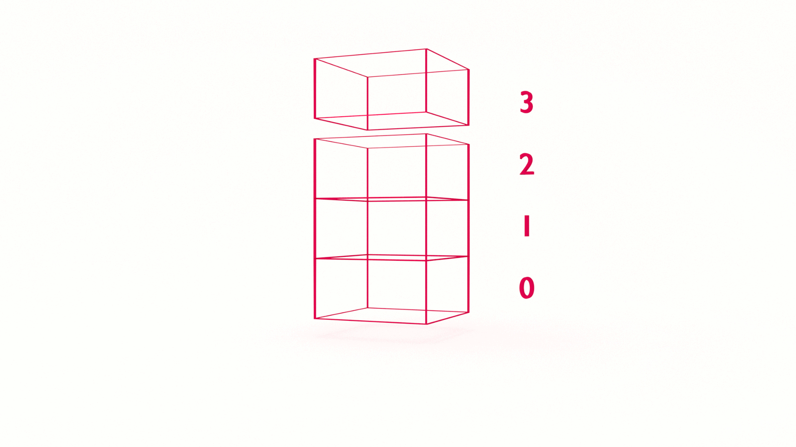

At some point in your career (today?!) you will want to learn data structures. It’s not just to ace the technical interview and land your dream job. Learning data structures will help you understand how software works and improve your problem-solving skills. In this tutorial, you will implement the stack data structure in JavaScript. 


## What is a Stack?

A stack is similar to an array with one significant difference: elements are only accessible from one end, the top. This means we can’t randomly access elements. We can add elements to the stack and we can remove elements from the stack. But if we want to access an element mid-way in the stack, you guessed it, we need to _pop_ the elements above it off the stack. 

The classic analogies for the stack data structure are plates or cafeteria trays. In a cafeteria, when you line up to be served, you take a tray off the top of a stack of trays. You take one tray and only one tray. When dirty trays are washed they are put on top of the stack. 

Your browser history is another analogy. Say you Google ‘stack’ and find yourself at the [Wikipedia disambiguation page](https://en.wikipedia.org/wiki/Stack). You click [Stack (abstract data type)](https://en.wikipedia.org/wiki/Stack_(abstract_data_type)) and read a bit about _stacks_ in the context of computer science, confirming what you just read above. But what’s an [abstract data type](https://en.wikipedia.org/wiki/Abstract_data_type)? 

Down the rabbit hole! 🐇🕳

Several hours later you’re reading [Barbara Liskov’s thesis, _A Program to Play Chess End Games_](https://apps.dtic.mil/dtic/tr/fulltext/u2/673971.pdf), with no recollection of how you got there. Luckily, you can retrace your history with your browser. By clicking the back button, you are popping pages off the stack!


### LIFO: Last In, First Out

LIke people on an elevator, the dynamic of a stack is also referred to as **Last In First Out**, or **LIFO**.


### Stack Operations 


There are three primary operations for a stack, the first two are essential: 

* pop

* push

* peek

Both `pop` and `push` will be familiar to you from working with arrays and intuitive when thinking about stacks, especially using the cafeteria tray analogy. 

What is `peek`? 

The `peek` operation allows us to view the value in the element on the top of the stack. 

Why do we need a `peek` operation? 

The `pop` operation permanently removes an element from the top of the stack. The `peek` operation lets us _peek_ at the value without popping it off. 

What else? 

Depending on the implementation, there may be the following: 

* top

* clear

* length

* empty

The `top` property is a counter variable, letting you know the _height_ of the stack. 

The `clear` method does just that, it _clears_ the stack. 

The `length` is somewhat redundant with the `top` property. It returns the length of the stack. 

The `empty` method, or `isEmpty`, returns a boolean value if the stack is or is not empty. 


## What Problem(s) Does a Stack Data Structure Solve? 

* Stacks are fast because data can only be added and removed from the top

* Stacks are useful when we want the constraints of LIFO, such as backtracking


## Stack Data Structures in JavaScript 

Unless you’ve got a lot of interviews on your calendar, it’s not every day that you’ll _consciously_ implement a stack. But as a JavaScript developer, an understanding of stacks will help you understand how JavaScript itself works. 

Let's implement a stack!

We can simply implement a stack using an Array and its built-in methods: 

```js
const stack = [];
 
stack.push("Last in!");
 
const firstOut = stack.pop();
```

🤨

Not impressed? We can also declare a class:

```js
class Stack {
 constructor() {
   this.store = [];
   this.top = 0;
 }
  push(element) {
   return this.store[this.top++] = element;
 }
  peek() {
   return this.store[this.top - 1];
 }
  pop() {
   return this.store[--this.top];
 }
}
 
const stack = new Stack();
 
stack.push("First in!");
stack.push("Last in!");
 
const firstOut = stack.pop(); // "Last in!"
 
const peekABoo = stack.peek(); // "First in!"
```

If you're not a fan of sugary syntax, we can also implement our stack using prototype:

```js
const Stack = function() {
  this.store = [];
  this.top = 0;
}

Stack.prototype.push = function(element) {
  return this.store[this.top++] = element;
}

Stack.prototype.pop = function(element) {
  return this.store[--this.top];
}

Stack.prototype.peek = function(element) {
   return this.store[this.top - 1];
}
```


## Big O & Stack Data Structures

What is the order of a stack?

Regardless of the size of the stack, the time complexity for the `push()` and `pop()` methods is constant. We perform one operation when adding or removing an element from the stack. If we need to search the stack or access a buried element, then it’s O(n). The space complexity is straightforward, pun intended: O(n). 


## JavaScript Stack Data Structures

In this tutorial, you learned the stack data structure in JavaScript. 

There are several classic and common interview questions using stacks, including:

* Tower of Hanoi

* Check for balanced parentheses

* Evaluation of postfix expressions

In the next tutorial, we'll learn how to [Convert Decimals to Base Using a Stack](#). Stay tuned!

