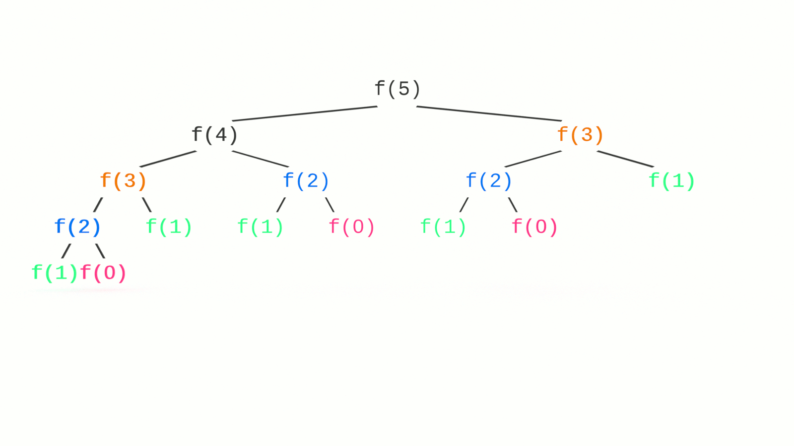

Dynamic programming is a fancy name for something you probably do already: effeciently solving a big problem by breaking it down into smaller problems and reusing the solutions to the smaller problems to avoid solving them more than once. In this tutorial, you will learn the fundamentals of the two approaches to dynamic programming: memoization and tabulation.

This article is part of a series on Big O notation. If you’re just joining us, you may want to read the previous article, [Big O Recursive Space Complexity](https://jarednielsen.com/big-o-recursive-space-complexity/), or start at the beginning with [What is Big O Notation?](https://jarednielsen.com/big-o-notation/).


## What Problem(s) Does Dynamic Programming Solve?

* Dynamic programming helps us optimize solutions to problems by caching values for future use

* Dynamic programming helps us improve the runtimes of recursive algorithms


## Dynamic Programming: Optimal Substructure and Overlapping Subproblems

There are two criteria for a dynamic programming approach to problem solving:

* Optimal substructure

* Overlapping subproblems

What is _optimal substructure_? 

The solution to a larger problem can be found by combining the returned values of its smaller problems. 

Like recursion and [proof by induction](https://jarednielsen.com/proof-induction/), we recognize a pattern and apply the same approach to solving the parts as we would the whole.

What are _overlapping subproblems_?

The solution to a larger problem recognizes redundancy in the smaller problems and _caches_ those solutions for later recall rather than repeatedly solving the same problem, making the algorithm much more efficient. 

Both of these concepts will click when we refactor our naive sum of Fibonacci sequence algorithm.

☝️ This might sound a lot like divide and conquer, but divide and conquer algorithms, such as merge sort and quick sort, don’t solve overlapping subproblems. They continually divide a problem into smaller, yet new, problems, then recombine the smaller solutions into a solution to the larger problem.


### Top-down vs. Bottom-up

There are two approaches for implementing a dynamic programming solution:

* Top-down

* Bottom-up

The top-down approach is generally recursive (but less efficient) and more intuitive to implement as it is often a matter of recognizing the pattern in an algorithm and refactoring it as a dynamic programming solution.

The bottom-up approach is generally iterative (and more efficient), but less intuitive and requires us to solve (and know!) the smaller problems first then use the combined values of the smaller problems for the larger solution. 

We refer to top-down solutions as _memoization_ and bottom-up as _tabulation_.

We’ll look at the reason for these terms below. 

But first, a quick refresher. 


## Fibonacci

We’ll revisit our naive recursive sum of Fibonacci sequence for this tutorial. If you’re just joining us, you may want to first read [Big O Recursive Time Complexity](https://jarednielsen.com/big-o-recursive-time-complexity).

The sum of the Fibonacci sequence is a contrived example, but it is useful (and concise) in illustrating the difference between memoization and tabulation and how to refactor a recursive function for improved time and space complexity. 


### Naive Recursive Fibonacci

Here’s our naive implementation of the sum of the Fibonacci sequence. 

```js
const fibonaive = n => {
 if (n == 0 || n == 1) {
   return n;
 }
 
 return fibonaive(n - 1) + fibonaive(n - 2);
};
```

Why is it _naive_? 

Because the runtime is _really_ bad.

It’s O(2^n).

(Actually, it’s O(1.6^n), but who’s counting?)

Take a look at this diagram of our recursive call branches.


Why is this algorithm inefficient? 

Overlapping subproblems! 

We solve the same problems repeatedly in our branches. 



How many times do we solve `f(0)`?

How many times do we solve `f(1)`?

How many times do we solve `f(2)`?

How many times do we solve `f(3)`?

The answer to all of the above is: too many!


## Dynamic Programming: Memoization

Memoization is the top-down approach to solving a problem with dynamic programming. 

It’s called memoization because we will create a _memo_, or a “note to self”, for the values returned from solving each problem. 

Then, when we encounter the same problem again, we simply check the memo, and, rather than solving the problem a second (or third or fourth) time, we retrieve the solution from our memo. 


### Top-Down Fibonacci

Here’s our Fibonacci sequence, memoized:
```js
const fibDown = (n, memo=[]) => {
if (n == 0 || n == 1) {
           return n;
     }
     if (memo[n] == undefined) {
           memo[n] = fibDown(n - 1, memo) + fibDown(n - 2, memo);
     }
     return memo[n];
}
```

Where have we seen this, or something like it, before? 

🤔

It’s very similar to our naive implementation.

But!

We now pass our function a `memo` argument and initialize it as an array. 

Each time we recursively call `fibDown()`, we pass it the `memo` array. 

If the value of `memo[n]` is undefined, meaning there’s no value stored in that index yet, we assign that value the returned values of `fibDown(n - 1, memo) + fibDown(n - 2, memo)`.

What’s the time complexity? 

O(n).

Why? 

Because we don't solve the _overlapping subproblems_.

This is a big improvement over the naive implementation.

What’s the space complexity? 

Also O(n).


## Dynamic Programming: Tabulation 

With bottom-up, or _tabulation_, we start with the smallest problems and use the returned values to calculate larger values. 

We can think of it as entering values in a table, or spreadsheet, and then applying a formula to those values.


### Bottom-Up Fibonacci

Here’s our Fibonacci sequence, _tabulated_:

```js
const fibottomUp = n => {
if (n === 0) {
           return 0;
     }
     let x = 0;
     let y = 1;
     for (let i = 2; i < n; i++) {
           let tmp = x + y;
           x = y;
           y = tmp;
     }
     return x + y;
}
```

Where have we seen this, or something like it, before? 

🤔

This solution is very similar to a swap algorithm. 

We declare three local variables, `x`, `y` and `tmp` and then juggle the values.

What is the Big O of `fibottomUp()`? 

Like memoization above, the time complexity is also O(n).

Why? 

We are using a `for` loop to iterate over the value of `n`.

But the space complexity is O(1). 

Why? 

No recursion.

We are only pushing one call to the stack.


## Dynamic Programming: Memoization and Tabulation

Which is better? Memoizaiton or tabulation? 

If we don’t need to solve _all_ the problems and are just looking for the optimal solution, memoization is better. 

If we do need to solve all the problems, that means we are going to make a lot of recursive calls, and tabulation is better.

The caveat is that memoization is generally more intuitive to implement especially when we don’t know the solution to subproblems, whereas tabulation requires us to know the solutions, or bottom, in advance, in order to build our way up. 

In this tutorial, you learned the fundamentals of the two approaches to dynamic programming: memoization and tabulation. Stay tuned for the next articles in this series: Big O factorial time complexity and NP-complete problems. 